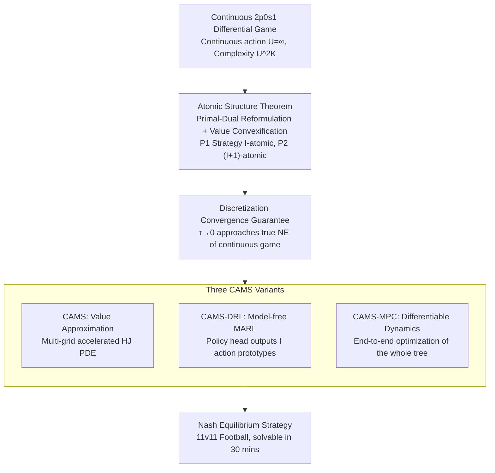

# Solving Football by Exploiting Equilibrium Structure of 2p0s Differential Games with One-Sided Information

**Conference**: ICLR 2026  
**arXiv**: [2502.00560](https://arxiv.org/abs/2502.00560)  
**Code**: To be confirmed  
**Area**: Agent / Game Theory  
**Keywords**: differential game, Nash equilibrium, atomic structure, one-sided information, football  

## TL;DR
The paper proves the atomic structure of Nash equilibrium strategies in two-player zero-sum differential games with one-sided information—where the informed player P1's equilibrium strategy concentrates on at most $I$ action prototypes ($I$ = number of game types). This reduces the game tree complexity from $U^{2K}$ to $I^K$, enabling the solution of 11v11 American football in continuous action space (traditional complexity $10^{440}$) on an M1 MacBook within 30 minutes.

## Background & Motivation
**Background**: Significant progress has been made in solving incomplete information games (e.g., Poker using CFR), but real-time differential games in continuous action spaces (e.g., sports) remain difficult to solve due to the explosion of state-action spaces.

**Limitations of Prior Work**: Traditional solvers (IIEFG + CFR) require enumerating all action combinations, which leads to unacceptable complexity in continuous spaces. The complexity of an 11v11 American football game tree reaches $10^{440}$.

**Key Challenge**: Continuous action spaces make exhaustive search infeasible, while direct Multi-Agent Reinforcement Learning (MARL) methods (e.g., PPO/MMD) struggle to converge to a Nash equilibrium.

**Goal**: To leverage the equilibrium structural properties of a certain class of differential games to significantly reduce solving complexity.

**Key Insight**: In 2p0s1 (two-player zero-sum one-sided information) differential games, Nash equilibrium strategies possess an atomic structure—strategies concentrate on a finite number of action prototypes.

**Core Idea**: Atomic structure + Primal-Dual game reformulation → Discretize continuous games into a combination problem over a finite number of prototypes.

## Method

### Overall Architecture
The work centers on a counter-intuitive fact: in continuous action spaces, the Nash equilibrium strategy of the informed player P1 does not form a continuous distribution over the entire action set, but instead collapses exactly onto at most $I$ discrete action prototypes (where $I$ is the number of game types). The paper first reformulates the continuous differential game $G$ into a discrete-time primal game $G_\tau$ (where P1 moves first and P2 responds optimally) and a dual game $G_\tau^*$ (where roles are swapped and types are chosen by P1) to facilitate dynamic programming. The atomic structure is proven within these two games; subsequently, it is demonstrated that the discrete-time solution converges to the true Nash equilibrium of the continuous game as the time step $\tau \to 0^+$. Finally, a set of CAMS solvers is employed to perform computations over $I$ prototypes rather than the original continuous action space, thereby bypassing dimensionality explosion—reducing game tree complexity from $U^{2K}$ to $I^K$ for P1.

### Key Designs

**1. Atomic Structure Theorem: Collapsing Continuous Strategies into Finite Action Prototypes**

Addressing the core challenge where continuous action spaces preclude the enumeration of equilibria ($10^{440}$ for 11v11 football), the paper reformulates the original game $G$ into a discrete-time primal game $G_\tau$ and a dual game $G_\tau^*$. Theorem 4.1 proves that in deterministic 2p0s1 differential games satisfying the Isaacs condition, P1's equilibrium behavioral strategy is $I$-atomic—taking positive probability on at most $I$ actions—while P2 is $(I+1)$-atomic. Here, $I$ is the number of game types (e.g., $I=2$ when an offense chooses between "Running Back Rush" and "QB Pass"), independent of action density or continuity. The underlying mechanism is value convexification: the informed player P1 manipulates the opponent's belief $p$ regarding their type by mixing between a few prototypes. The non-revealing value $\tilde{V}_\tau$ becomes convex, requiring at most $I$ vertices on the simplex $\Delta(I)$. This property compresses the game tree complexity from $U^{2K}$ to $I^K$ for P1, forming the foundation of the algorithms.

**2. Discretization Convergence Guarantee: Approximating the True NE of the Continuous Game**

As $G_\tau$ is solved on discrete time steps $\tau$, it must be guaranteed that the discrete solution does not deviate from the original continuous game's equilibrium. Theorem 4.2 proves that as $\tau \to 0^+$, the primal-dual solution $(\{\eta_{i,\tau}^\dagger\}, \zeta_\tau^\dagger)$ converges to the Nash equilibrium of the continuous differential game $G$. Convergence analysis is built upon the Hamiltonian of the dual game, where the min-max structure corresponds to adversarial optimization. The Isaacs condition $\min_u \max_v H = \max_v \min_u H$ ensures the exchangeability of min-max and max-min, defining a well-behaved equilibrium. Together, Theorems 4.1 and 4.2 justify that continuous game equilibria are both atomic and approximable via discrete solvers.

**3. CAMS Variants: Mapping Atomic Structure to Computable Solvers**

Given that only $I$ prototypes need to be handled, the remaining task is to compute these prototypes and their weights. The paper provides three complementary implementations under the Continuous-Action Mixed-strategy Solver (CAMS) framework. **CAMS** follows a value-approximation route, approaching the value function on $[0,T]\times\mathcal{X}\times\Delta(I)$ and using multi-grid methods to accelerate the underlying Hamilton-Jacobi (HJ) PDE—where coarse grids eliminate low-frequency errors and fine grids correct high-frequency ones. **CAMS-DRL** utilizes model-free MARL, where P1's policy network takes the information state $(t,x,p)$ and directly outputs $I$ logit vectors and $I$ action prototypes $u^k$. **CAMS-MPC** builds the entire game tree as a computational graph for end-to-end minimax optimization when dynamics are differentiable.

## Key Experimental Results

### Hexner Game (Theoretical Validation)

| Method | 4-Stage Time | Computational Property |
|------|-----------|---------|
| CFR+ | Baseline | Increases linearly with $U$ |
| JPSPG | 24h | Increases slowly with $U$ |
| DeepCFR | 29-34h | High GPU demand |
| **CAMS** | **17h** | **Independent of $U$** |

### Multi-grid Acceleration

| Stages | Base | Accelerated | Speedup |
|--------|------|--------|--------|
| 4 | 9.3h | 2.3h | 4.0x |
| 10 | 27.6h | 10.9h | 2.5x |
| 16 | 46.2h | 17.8h | 2.6x |

### American Football (11v11 Continuous Action Space)
- Traditional IIEFG Complexity: $10^{440}$ (Insoluble)
- Exploiting Atomic Structure: **Solved within 30 minutes on an M1 Pro MacBook**
- Intent Masking Duration: Model predicts approx. 0.5s of deception; actual coaching analysis observes approx. 1.0s.

### Key Findings
- CAMS computational complexity does not scale with the number of discretized actions $U$, highlighting the advantage of atomic structure.
- CAMS-DRL accurately approximates NE in normal-form games where PPO and MMD fail.
- The American football case demonstrates a massive leap from theoretical impossibility to practical solution (30 minutes).

## Highlights & Insights
- **Theoretical Elegance**: Nash equilibrium strategies in continuous space "naturally" concentrate on finite points—this is a precise structural property rather than an approximation.
- **Complexity Reduction**: Reducing complexity from $10^{440}$ to 30 minutes represents one of the most significant computational reductions in game theory history.
- **Algorithm Versatility**: The three CAMS variants demonstrate how theoretical results can be translated into practical algorithms for value-based, model-free, and differentiable scenarios.
- **Real-world Alignment**: The discovery of the "0.5s intent masking" in football matches the empirical experience of professional coaches.

## Limitations & Future Work
- Applicable only to 2p0s1 games with deterministic dynamics and the Isaacs condition—stochastic dynamics under partial observation result in the convex Bellman operator being only a lower bound.
- Complexity still grows exponentially with the number of stages $K$ ($O(K^3 C^{2K} I^2 \varepsilon^{-4})$); multi-grid methods mitigate but do not eliminate this.
- Belief manipulation assumes precise state observability and perfect recall.
- Not yet extended to multi-player games or partially observable scenarios.

## Related Work & Insights
- **vs CFR/DeepCFR**: CFR series require enumeration of the action space, whereas CAMS avoids enumeration by exploiting structure.
- **vs MARL (PPO/MMD)**: Standard MARL struggles to converge to NE in incomplete information games; CAMS-DRL constrains the policy space using the atomic structure.
- **vs R-NaD**: R-NaD performs well but is still outperformed by CAMS-DRL, suggesting that structured constraints are superior to pure learning in this context.

## Technical Details

### Importance of the Isaacs Condition
The Isaacs condition $\min_u \max_v H(x,u,v,\xi) = \max_v \min_u H(x,u,v,\xi)$ implies that the optimal strategies of both players do not depend on the opponent's instantaneous choice, but only on the state. This holds in American football because physical player movements are approximately independent on short time scales.

### Belief Manipulation
The offensive side uses a mixture of different strategies (prototype actions) to prevent the defense from determining the current play type. The convexification of the value function ensures that this mixed strategy is optimal, explaining why the equilibrium is atomic rather than a continuous distribution.

## Rating
- Novelty: ⭐⭐⭐⭐⭐ (The atomic structure theorem is a profound theoretical contribution)
- Experimental Thoroughness: ⭐⭐⭐⭐ (Covers theoretical validation and practical football scenarios across three variants)
- Writing Quality: ⭐⭐⭐⭐ (Rigorous theoretical derivation with a logical progression from simple games to complex ones)
- Value: ⭐⭐⭐⭐⭐ (Transforms an insoluble problem into a solvable one)

<!-- RELATED:START -->

## Related Papers

- [\[ICLR 2026\] Reevaluating Policy Gradient Methods for Imperfect-Information Games](reevaluating_policy_gradient_methods_for_imperfect-information_games.md)
- [\[ICLR 2026\] Nearly-Optimal Bandit Learning in Stackelberg Games with Side Information](nearly-optimal_bandit_learning_in_stackelberg_games_with_side_information.md)
- [\[ICLR 2026\] Look-ahead Reasoning with a Learned Model in Imperfect Information Games](look-ahead_reasoning_with_a_learned_model_in_imperfect_information_games.md)
- [\[ICML 2025\] Solving Zero-Sum Convex Markov Games](../../ICML2025/reinforcement_learning/solving_zero-sum_convex_markov_games.md)
- [\[ICLR 2026\] Solving General-Utility Markov Decision Processes in the Single-Trial Regime with Online Planning](solving_general-utility_markov_decision_processes_in_the_single-trial_regime_wit.md)

<!-- RELATED:END -->
