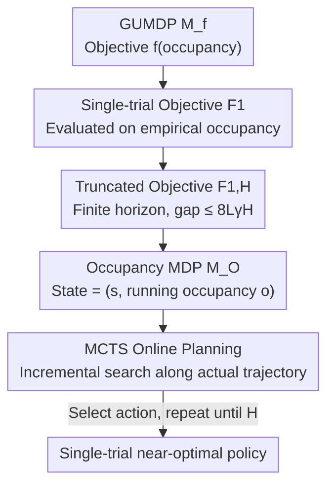

# Solving General-Utility Markov Decision Processes in the Single-Trial Regime with Online Planning

**Conference**: ICLR 2026  
**OpenReview**: [https://openreview.net/forum?id=2XSP20jV0T](https://openreview.net/forum?id=2XSP20jV0T)  
**Area**: Reinforcement Learning / Sequential Decision Theory  
**Keywords**: General-Utility MDP / Single-trial Evaluation / Occupancy MDP / Online Planning / Monte Carlo Tree Search  

## TL;DR
This paper presents the first method for solving infinite-horizon discounted **General-Utility MDPs (GUMDP)** under "single-trial" evaluation. It first proves that history-dependent policies are necessary in this regime and reformulates the problem into a standard MDP that tracks "running occupancy" (occupancy MDP). The problem is then solved incrementally via Monte Carlo Tree Search (MCTS) online planning. The approach significantly outperforms infinite-trial optimal and random policies across three task types: entropy exploration, imitation learning, and adversarial MDPs.

## Background & Motivation
**Background**: Standard MDPs use a linear cumulative cost $J_\gamma(\pi)=c^\top d^\pi$, where $d^\pi$ is the discounted state-action occupancy (visitation frequency) induced by the policy. However, many real-world objectives—maximum entropy exploration, imitation learning, risk aversion, skill discovery, and constrained/adversarial MDPs—cannot be expressed as linear costs. **General-Utility MDPs (GUMDPs)** generalize the objective to an arbitrary (usually convex) non-linear function $f(d^\pi)$ of the occupancy, unifying these scenarios.

**Limitations of Prior Work**: Classical GUMDP solvers (LP/convex optimization for convex objectives) implicitly assume that policy performance is evaluated over **infinitely many trials**, utilizing the expected occupancy $\mathbb{E}[d^\pi]$. Under a non-linear $f$, the **empirical occupancy** $d^\pi_\omega$ induced by a single trial is not equivalent to the expected occupancy, leading to $\mathbb{E}[f(d^\pi)]\neq f(\mathbb{E}[d^\pi])$. Mutti et al. have noted that an "optimal" policy calculated for infinite trials may perform poorly when evaluated on a single trial.

**Key Challenge**: In actual deployment, agents often "live only once," producing a single trajectory (e.g., robot operations, one-time tasks). However, theoretical tools default to statistical averages over infinite repetitions. The optimal policies for single-trial and infinite-trial objectives can be fundamentally different. Previously, Mutti et al. addressed the finite-trial problem only in **finite-horizon, undiscounted** settings using an "Extended MDP" (explicitly recording full history), where the state space explodes combinatorially with horizon length, limiting it to tiny instances and failing to cover the mainstream infinite-horizon discounted setting.

**Goal**: In the infinite-horizon discounted setting, for the single-trial objective $F_1(\pi)=\mathbb{E}[f(d^\pi)]$, this work aims to clarify: (i) which class of policies is optimal, (ii) whether the problem can be reduced to a computable finite-horizon version, (iii) whether it can be rewritten as a standard MDP, (iv) the computational complexity, and (v) provide a practical algorithm.

**Key Insight**: Since the single-trial objective concerns the empirical occupancy accumulated along a single trajectory, the agent can make future decisions based on a sufficient statistic: the "occupancy accumulated so far." The history can be losslessly compressed into a running occupancy.

**Core Idea**: Truncate the single-trial GUMDP into a finite-horizon objective $F_{1,H}$, reformulate it as a standard occupancy MDP with states defined as "(original state, running occupancy)," and solve it incrementally using MCTS online planning only along the actually traversed trajectory to bypass combinatorial explosion.

## Method

### Overall Architecture
The pipeline simplifies a non-linear, history-dependent, infinite-horizon problem into a standard MDP solvable by a general planner: **Single-trial GUMDP objective $F_1$ → Truncated finite-horizon objective $F_{1,H}$ (with controllable truncation error) → Equivalent occupancy MDP $M_O$ (using running occupancy as state) → MCTS online planning for incremental action selection**. The first three steps are theoretical reductions (ensuring no loss of optimality), while the last step is the actual solver. The input is a GUMDP $M_f=(S,A,\{P^a\},p_0,f)$, discount $\gamma$, and truncation horizon $H$; the output is the action to be executed at each step to minimize the $f$ value on the empirical occupancy.

### Key Designs

**1. Mismatch between Single-trial $F_1$ and Infinite-trial $F_\infty$: Why the Problem Must Be Redefined**

The pain point is that non-linear $f$ causes the "actual performance of one trajectory" and "average performance over infinite trials" to diverge. This paper defines the **empirical discounted occupancy** of a single trajectory as $d^\pi_\omega(s,a)=(1-\gamma)\sum_{t=0}^\infty \gamma^t \mathbf{1}(s_t=s,a_t=a)$, which is a random vector satisfying $\mathbb{E}[d^\pi_\omega]=d^\pi$. The single-trial objective $F_1(\pi)=\mathbb{E}[f(d^\pi_\omega)]$ applies $f$ before taking the expectation, whereas the infinite-trial objective $F_\infty(\pi)=f(\mathbb{E}[d^\pi_\omega])=f(d^\pi)$ takes the expectation before applying $f$. By Jensen-like inequalities, these are generally unequal when $f$ is non-linear, leading to different optimal policies. They only coincide when $f$ is linear (standard MDP) due to the linearity of expectation.

This mismatch invalidates the classic conclusion that "stationary policies are sufficient." Theorem 1 constructs a GUMDP where $F_1(\pi_S)>F_1(\pi_M)>F_1(\pi_{NM})$, meaning stationary policies are strictly worse than non-stationary ones, which in turn are strictly worse than **non-Markovian (history-dependent) policies**. Intuitively, because the single-trial $f$ cares about the accumulation of the entire trajectory, the agent must adjust subsequent actions based on "which states and actions have already been visited," which is unnecessary in the infinite-trial setting. Therefore, optimization must be performed over the history-dependent policy class $\Pi_{NM}$, necessitating the tracking of running occupancy.

**2. Truncated Objective $F_{1,H}$: Reducing Infinite-horizon to Finite-horizon with Controllable Error**

Empirical occupancy over an infinite horizon involves an infinite sum, which is not directly computable. This paper uses the **truncated empirical occupancy** $d^{\pi,H}_\omega(s,a)=\frac{1-\gamma}{1-\gamma^H}\sum_{t=0}^{H-1}\gamma^t\mathbf{1}(s_t=s,a_t=a)$, corresponding to the truncated objective $F_{1,H}(\pi)=\mathbb{E}[f(d^{\pi,H}_\omega)]$, where $F_{1,H}\to F_1$ as $H\to\infty$.

Crucially, this provides controllable approximation guarantees. Under the assumption that $f$ is $L$-Lipschitz, Proposition 1 decomposes the optimality gap of any policy as:

$$\mathrm{OptGap}(\pi)\;\le\;\underbrace{F_{1,H}(\pi)-\min_{\pi_H\in\Pi_{NM}}F_{1,H}(\pi_H)}_{\mathrm{OptGap}_H(\pi)}\;+\;8L\gamma^H.$$

By finding an (approximately) optimal policy for the truncated objective $F_{1,H}$ and choosing a sufficiently large $H$, the suboptimality on the original infinite-horizon objective $F_1$ is bounded by the exponentially decaying term $8L\gamma^H$. This step transforms the "infinite-horizon, non-enumerable" difficulty into a solvable "finite-horizon, $O(\gamma^H)$ error" problem, enabling the use of standard MDP planners.

**3. Occupancy MDP $M_O$: Lossless Compression of History into Running Occupancy**

Given the necessity of history-dependent policies, a naive approach like Mutti et al.'s "Extended MDP" would store the full history $h_t=(s_0,a_0,\dots,s_t)$ in the state—leading to combinatorial explosion. This paper's insight is that the truncated single-trial objective depends on history only through the empirical occupancy. Thus, **only the running occupancy vector $o$ at the current step needs to be remembered, not the full history**. This motivates the occupancy MDP $M_O=(S_O,A_O,\{P^a_O\},p_{0,O},c_O,H)$, where the state $\{s,o\}$ consists of the original state $s$ and a $|S||A|$-dimensional running occupancy $o$. The vector $o$ is updated deterministically via $o_{t+1}(s,a)=\gamma^t+o_t(s,a)$ when $(s_t,a_t)$ is visited. The cost is extremely sparse: $c_O(\{s,o\})=f\!\left(\frac{1-\gamma}{1-\gamma^H}o\right)$ only at the terminal step, and $0$ otherwise. Consequently, the cumulative cost $J_O(\pi_O)=\mathbb{E}[c_O(\{s_H,o_H\})]$ exactly matches the truncated single-trial objective.

This reformulation provides two strong guarantees: Proposition 2 shows a **one-to-one correspondence** between histories in $M_f$ and states in $M_O$, thus mapping non-Markovian policies in $M_f$ to stationary policies in $M_O$. Theorem 2 proves that "solving $M_O$ is equivalent to solving the truncated single-trial GUMDP," and $\mathrm{OptGap}_H(\pi)=J_O(\pi_O)-J_O^*$, meaning the optimality gaps are identical. Compared to the Extended MDP, the state space size is similar, but compressing it into running occupancy allows for incremental updates and specializes in the discounted setting, which prior undiscounted work did not cover.

However, even as a standard MDP, finding the optimal solution remains difficult in the worst case. Theorem 3 provides a reduction from the **subset sum problem**: by setting $f(d)=(n^\top d-k)^2$, determining if there exists $\pi\in\Pi^D_{NM}$ such that $F_{1,H}(\pi)\le 0$ is **NP-Hard**, even when $f$ is smooth and strictly convex. This suggests that the hardness of single-trial optimization is unavoidable, justifying the use of online planning to focus computation only on visited trajectories.

**4. MCTS Online Planning: Incremental Solving along Actual Trajectories**

Although the occupancy MDP is a standard MDP, the state space explodes with $H$, costs are non-zero only at the end, and each state is visited at most once per trajectory. Solving for the optimal policy globally is impractical. This paper adopts **online planning**: at each time step $t$, a lookahead search tree is expanded from the current state $\{s_t,o_t\}$. Multiple MCTS iterations (selection, expansion, simulation, backpropagation) are performed to select an action for the current step. The environment then advances, and the planning repeats from the new state. This concentrates computational power on the trajectory actually experienced by the agent.

Theoretically, this maintains convergence and regret guarantees: under the assumption of a bounded objective ($f_{\min}\le f\le f_{\max}$), as iterations per step approach infinity, MCTS ensures $\mathrm{OptGap}_H(\pi_{\mathrm{MCTS}})=0$. Combined with Prop 1, this yields $\mathrm{OptGap}(\pi_{\mathrm{MCTS}})\le 8\frac{L}{f_{\max}-f_{\min}}\gamma^H$. The regret bound is $R_H(\pi_1,\dots,\pi_n)\le O(1/\sqrt{n})$, leading to $R(\cdot)\le O(1/\sqrt{n}+\gamma^H)$, controlling both the iteration count and truncation error terms.

## Key Experimental Results

### Main Results
Three task categories utilize three convex objectives: Max-state entropy exploration $f(d)=d^\top\log d$, imitation learning $f(d)=\|d-d_\beta\|_2^2$, and adversarial MDP $f(d)=\max_k d^\top c_k$. Environments include illustrative GUMDPs ($M_{f,1},M_{f,2},M_{f,3}$ with $H=100$) and OpenAI Gym's FrozenLake (FL), Taxi, and MountainCar (MC, discretized into a $10\times10$ grid, $H=200$). With $\gamma=0.9$, 10 runs per setting, and 4000 MCTS iterations per step, the baselines are a random policy $\pi_{\mathrm{Random}}$ and the infinite-trial optimal policy $\pi^*_{\mathrm{Solver}}$ (using a solver for $f$). The metric is the single-trial objective $F_{1,H}$ (lower is better).

| Task | Environment | $\pi_{\mathrm{Random}}$ | $\pi^*_{\mathrm{Solver}}$ (Inf-Trial) | $\pi_{\mathrm{MCTS}}$ (Ours) |
|------|------|------|------|------|
| Entropy Exploration | $M_{f,1}$ | 0.12 | 0.05 | **0.01** |
| Entropy Exploration | FL | 0.51 | 0.48 | **0.40** |
| Entropy Exploration | Taxi | 0.65 | 0.63 | **0.59** |
| Entropy Exploration | MC | 0.72 | 0.70 | **0.61** |
| Imitation Learning | $M_{f,2}$ | 0.05 | 0.02 | **0.002** |
| Imitation Learning | FL | 0.07 | 0.05 | **0.02** |
| Imitation Learning | Taxi | 0.08 | 0.05 | **0.05** |
| Imitation Learning | MC | 0.18 | 0.07 | **0.04** |
| Adversarial MDP | $M_{f,3}$ | 1.23 | 1.17 | **1.07** |

### Key Findings
- **Dominant Performance**: MCTS achieved the lowest objective values in almost all settings (except for a tie in Taxi imitation learning), validating that specialized optimization for single-trial objectives is effective.
- **Evidence of Mismatch**: $\pi^*_{\mathrm{Solver}}$, optimized for infinite trials, was consistently outperformed by $\pi_{\mathrm{MCTS}}$ under single-trial evaluation (e.g., 0.05→0.01 in $M_{f,1}$, 0.07→0.04 in MC imitation learning), confirming that the $F_1 \neq F_\infty$ gap makes infinite-trial policies suboptimal for single trials.
- **Iteration Count as a Knob**: Theoretically, optimality is reached as iterations approach infinity. The paper demonstrates significant gains using 4000 iterations per step, with ablation on iteration counts provided in the appendix.

## Highlights & Insights
- **Running Occupancy as a Sufficient Statistic**: Compressing the combinatorial full history into a fixed-dimension occupancy vector while proving it preserves optimality transforms the problem from "theoretically solvable" to "practically executable."
- **Stronger Complexity Proof**: Compared to prior complex POMDP-based proofs, this paper uses a simpler subset sum reduction and demonstrates that hardness persists even when $f$ is smooth and strictly convex.
- **Translatable Framework**: The reduction path—"non-linear occupancy objective → sufficient statistic in state → general MDP planner"—is applicable to other problems where objectives depend on trajectory-level statistics, such as risk measures or trajectory-level constraints.

## Limitations & Future Work
- The authors acknowledge that MCTS requires an environment **simulator** for sampling transitions, making it unsuitable for purely offline or model-free scenarios.
- Running occupancy is an $|S||A|$-dimensional vector. In large state-action spaces, this vector becomes prohibitive; the authors suggest investigating compression methods for running occupancy.
- The method is restricted to **discrete** spaces; continuous control requires new representations.
- Evaluation environments are relatively small; performance on large-scale tasks with high $H$ or non-convex $f$ remains to be verified.

## Related Work & Insights
- **vs Mutti et al. (2023) (Extended MDP)**: Prior work stored full history in undiscounted finite-horizon settings, limiting them to tiny instances. Ours handles infinite-horizon discounted settings via running occupancy and uses online planning to bypass global solving, while also extending NP-hardness results to the discounted case.
- **vs Infinite-trial GUMDP (Zahavy et al., 2021)**: These methods solve $f(\mathbb{E}[d^\pi])$ using stationary policies. This work demonstrates that single-trial regimes require history-dependent policies and shows empirical superiority over these baselines.
- **vs Standard MCTS (Kocsis & Szepesvári, 2006)**: This paper applies MCTS to the occupancy MDP, inheriting convergence and regret bounds. The contribution lies in the engineering framework of "mapping a new reduction to a mature planner."

## Rating
- Novelty: ⭐⭐⭐⭐⭐ First single-trial GUMDP solver for infinite-horizon discounted settings.
- Experimental Thoroughness: ⭐⭐⭐ Effective across tasks, but limited to small-scale/discrete environments.
- Writing Quality: ⭐⭐⭐⭐ Clear theoretical chain and natural transition to the algorithm.
- Value: ⭐⭐⭐⭐ Bridges the gap between GUMDP theory and real-world "single-trial" evaluation.

<!-- RELATED:START -->

## Related Papers

- [\[ICLR 2026\] PAMDP: Interact to Persona Alignment via a Partially Observable Markov Decision Process](pamdp_interact_to_persona_alignment_via_a_partially_observable_markov_decision_p.md)
- [\[ICML 2025\] Learning Utilities from Demonstrations in Markov Decision Processes](../../ICML2025/reinforcement_learning/learning_utilities_from_demonstrations_in_markov_decision_processes.md)
- [\[ICLR 2026\] Single-stream Policy Optimization](single-stream_policy_optimization.md)
- [\[ICLR 2026\] Analysis of Approximate Linear Programming Solution to Markov Decision Problem with Log Barrier Function](analysis_of_approximate_linear_programming_solution_to_markov_decision_problem_w.md)
- [\[ICLR 2026\] Solving Parameter-Robust Avoid Problems with Unknown Feasibility using Reinforcement Learning](solving_parameter-robust_avoid_problems_with_unknown_feasibility_using_reinforce.md)

<!-- RELATED:END -->
