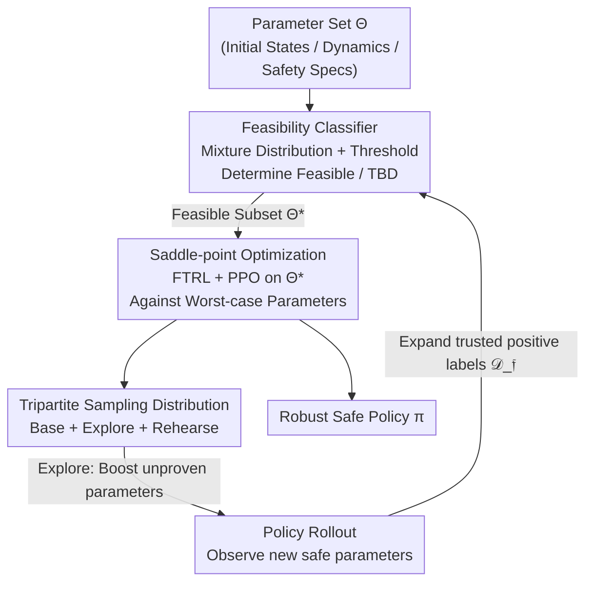

# Solving Parameter-Robust Avoid Problems with Unknown Feasibility using Reinforcement Learning

## Meta-info
- **Conference**: ICLR 2026
- **arXiv**: [2602.15817](https://arxiv.org/abs/2602.15817)
- **Code**: [https://oswinso.xyz/fge](https://oswinso.xyz/fge)
- **Area**: Reinforcement Learning
- **Keywords**: safe RL, Hamilton-Jacobi, robust optimization, feasibility, curriculum learning, MuJoCo

## TL;DR
The authors propose Feasibility-Guided Exploration (FGE) to simultaneously identify feasible parameter subsets and learn safe policies within those subsets. It addresses parameter-robust avoidance problems where feasibility is unknown, achieving over 50% higher coverage than state-of-the-art methods in MuJoCo tasks.

## Background & Motivation
- **Hamilton-Jacobi (HJ) safety control** is a powerful tool for obtaining the maximal safe set of initial states, but classical methods suffer from the curse of dimensionality.
- **Approximating HJ with Deep RL**: RL is used to learn nearly optimal control policies, but a fundamental mismatch exists between optimizing expected returns and worst-case safety—performance can be poor on low-probability states that must still remain safe.
- **Robust optimization** schemes (such as RARL) optimize for the worst case over an initial condition set, but they assume the set is feasible (i.e., a safe policy exists). If infeasible parameters are included, all policies perform poorly, leading to training degradation.
- **Key Challenge**: Identifying the feasible parameter set is itself the target of HJ analysis—it is unknown a priori!
- **Example**: In autonomous driving, a blizzard combined with high speeds might be unsafe regardless of the controller; training on such impossible scenarios prevents the model from mastering clear-day scenarios.

## Method

### Overall Architecture
FGE couples "which scenarios to train on" with "how to remain safe in those scenarios." It maintains an estimate of the maximal feasible parameter subset $\Theta^* \subseteq \Theta$ (parameters where a safe policy actually exists) while performing robust policy learning on this expanding subset. The core difficulty lies in the unknown nature of $\Theta^*$, which FGE addresses via a feasibility classifier that distinguishes "proven safe" parameters from "temporarily unlearned" ones. It uses saddle-point optimization to combat worst-case parameters within the feasible subset and a tripartite sampling distribution to push the boundaries of the safely identified region. Newly discovered safe parameters are fed back to expand the classifier's set of trusted positive labels, creating a closed loop of training and expansion.

### Key Designs

**1. Feasibility Classifier: Distinguishing "Failures" from "Impossibilities"**

Robust optimization requires a predefined feasible parameter set, yet this set is precisely what HJ analysis aims to solve and is unknown a priori. The difficulty lies in the inherent asymmetry of feasibility labels: a single safe trajectory under parameter $\theta$ confirms it is feasible, but an unsafe trajectory does not prove it is infeasible—the current policy might simply be inadequate. Treating "failures" as "infeasible" would mistakenly exclude many recoverable scenarios. FGE avoids training the classifier on single online samples, instead constructing a mixture distribution $p_{\text{mix}}(\mathfrak{f}, \theta) = \alpha \cdot p^*(\mathfrak{f}|\theta) p_{\mathcal{D}_\mathfrak{f}}(\theta) + (1-\alpha) \cdot p^\pi(\mathfrak{f}|\theta) \rho(\theta)$. The first term comes from the set of trusted positive labels $\mathcal{D}_\mathfrak{f}$ (confirmed safe), while the second term consists of online samples under the current policy (which may contain false negatives). By fitting $q_\psi(\mathfrak{f}=1|\theta)$ and thresholding, the classifier achieves near-zero false positives, ensuring truly unsolvable scenarios do not contaminate the training set and that the subsequent saddle-point optimization always plays within the "solvable" domain.

**2. Saddle-point Optimization: Stabilizing Robust Safety via Online Adversarial Learning**

Once the feasible subset $\Theta^*$ is identified, the goal is to find a policy that is safe even under the worst-case parameters, which is essentially a maximin problem. While RARL uses an adversarial policy to approximate the worst case—equivalent to Gradient Descent-Ascent (GDA), which is often unstable—FGE adopts an online learning saddle-point perspective. The policy side solves $\pi_{t+1} = \arg\max_\pi \mathbb{E}_{\theta \sim \mathcal{D}_{\theta,t}}[J(\pi, \theta)]$, while the parameter side solves $\theta_{t+1} = \arg\min_{\theta} J(\pi_t, \theta)$ exclusively within the feasible subset $\theta \in \Theta^*$. This distinction from RARL is fundamental: it does not assume the system is feasible under the worst possible disturbance but restricts the adversary to the proven feasible range. Specifically, Follow-the-Regularized-Leader (FTRL) with quadratic regularization is used alongside PPO to keep policies stable across rounds, while a rehearsal buffer stores historical worst-case parameters. FTRL's regularization allows the game to converge toward an average iterate near the saddle point, avoiding the degradation typical of GDA oscillations.

**3. Tripartite Sampling Distribution: Expanding the Safety Boundary without Regression**

A classifier and saddle-point solver alone are insufficient; the classifier can only mitigate false negatives for observed safe parameters, while $\mathcal{D}_\mathfrak{f}$ only expands when the policy masters new parameters—creating a potential deadlock. FGE breaks this by splitting the sampling distribution into three components: a **base distribution** sampled from the original parameter distribution to maintain overall coverage; an **exploration distribution** using rejection sampling $\theta\sim p(\cdot\mid\phi(\theta)=0)$ to deliberately increase the sampling probability of parameters currently deemed infeasible, forcing the policy to discover new safe regions to refill $\mathcal{D}_\mathfrak{f}$; and a **rehearsal distribution** which performs revision sampling on previously solved parameters at risk of degradation. This combination maximizes safety rate gains while minimizing losses, ensuring the feasible set expands steadily.

### Loss & Training
The policy training follows the standard PPO objective. The reward is designed as a negative indicator where the episode terminates upon the first violation: $r_k = -\mathbb{1}\{h_\theta(\bm{s}_k) > 0\}$. Remaining in a safe state yields a reward of 0, while entering an unsafe state yields $-1$ and ends the episode. This maps safety rate maximization directly to an optimizable RL objective.

## Key Experimental Results

### Main Results: MuJoCo Safety Coverage

| Environment | Domain Rand. | RARL | FGE (Ours) | Gain |
|------|-------------|------|-----------|------|
| Ant (Avoid) | ~40% | ~45% | **~70%** | +56% |
| Humanoid (Avoid) | ~35% | ~40% | **~65%** | +63% |
| HalfCheetah | ~50% | ~55% | **~78%** | +42% |

> FGE covers over 50% more safe parameter sets than the best baseline in all challenging MuJoCo tasks.

### Ablation Study: Component Contributions

| Ablation Setting | Safety Coverage | Description |
|---------|----------|------|
| FGE (Full) | ~70% | Baseline |
| W/o Feasibility Classifier | ~50% | Infeasible parameters interfere with training |
| W/o Exploration Dist. | ~55% | Insufficient exploration |
| W/o Rehearsal Dist. | ~60% | Regression in learned skills |
| Density Model instead of Classifier | ~58% | Outperformed by mixture-distribution classifier |

### Key Findings
1. Standard domain randomization and RARL are severely limited when parameter feasibility is unknown.
2. The zero-false-positive guarantee of the feasibility classifier is critical for training stability.
3. FTRL provides more stable convergence for saddle-point problems compared to GDA (as approximated by RARL).
4. Balancing exploration and rehearsal distributions is indispensable for the continuous expansion of the safe set.

## Highlights & Insights
- **Core Problem Definition**: Robust avoidance with unknown feasibility fills a significant gap between safe RL and HJ analysis.
- **Positive-Label Learning**: The approach cleverly handles the one-sided labeling problem (where only positive labels are reliable) with theoretical guarantees on zero false positives.
- **Online Learning Perspective**: Replacing unstable adversarial RL with saddle-point methods provides stronger theoretical convergence foundations.
- **Practical Tri-sampling Strategy**: The combination of base, explore, and rehearse components is inspired by curriculum and online learning.

## Limitations & Future Work
- Theoretical convergence guarantees rely on assumptions such as convexity-concavity and exact best responses, which may not be fully met in practice.
- The accuracy of the feasibility classifier in high-dimensional parameter spaces requires further validation.
- The current work only considers deterministic dynamics; extensions to stochastic systems are not yet discussed.
- There remains a gap between MuJoCo environments and real-world robotic deployment.

## Related Work & Insights
- **HJ Safety Control**: DeepReach (Bansal et al., 2021), ISAACS (Hsu et al., 2023), So et al. (2024)
- **Robust RL**: RARL (Pinto et al., 2017), WCSAC (Yang et al., 2021)
- **Unsupervised Environment Design (UED)**: PAIRED (Dennis et al., 2020), PLR (Jiang et al., 2021)
- **Safe RL**: Constrained MDP (Altman, 1999), SauteRL (Sootla et al., 2022)

## Rating
- Novelty: ⭐⭐⭐⭐⭐ — Fresh problem definition focusing on robust control with unknown feasibility.
- Theoretical Depth: ⭐⭐⭐⭐ — Classifier guarantees and saddle-point convergence analysis.
- Experimental Thoroughness: ⭐⭐⭐⭐ — Multiple MuJoCo environments with detailed ablations.
- Value: ⭐⭐⭐⭐ — Directly relevant to the safe deployment of robotics.

<!-- RELATED:START -->

## Related Papers

- [\[ICLR 2026\] SPELL: Self-Play Reinforcement Learning for Evolving Long-Context Language Models](spell_self-play_reinforcement_learning_for_evolving_long-context_language_models.md)
- [\[ICLR 2026\] Shop-R1: Rewarding LLMs to Simulate Human Behavior in Online Shopping via Reinforcement Learning](shop-r1_rewarding_llms_to_simulate_human_behavior_in_online_shopping_via_reinfor.md)
- [\[ICLR 2026\] SPIRAL: Self-Play on Zero-Sum Games Incentivizes Reasoning via Multi-Agent Multi-Turn Reinforcement Learning](spiral_self-play_on_zero-sum_games_incentivizes_reasoning_via_multi-agent_multi-.md)
- [\[ICLR 2026\] Unsupervised Learning of Efficient Exploration: Pre-training Adaptive Policies via Self-Imposed Goals](unsupervised_learning_of_efficient_exploration_pre-training_adaptive_policies_vi.md)
- [\[ICLR 2026\] Virne: A Comprehensive Benchmark for RL-based Network Resource Allocation in NFV](virne_a_comprehensive_benchmark_for_rl-based_network_resource_allocation_in_nfv.md)

<!-- RELATED:END -->
