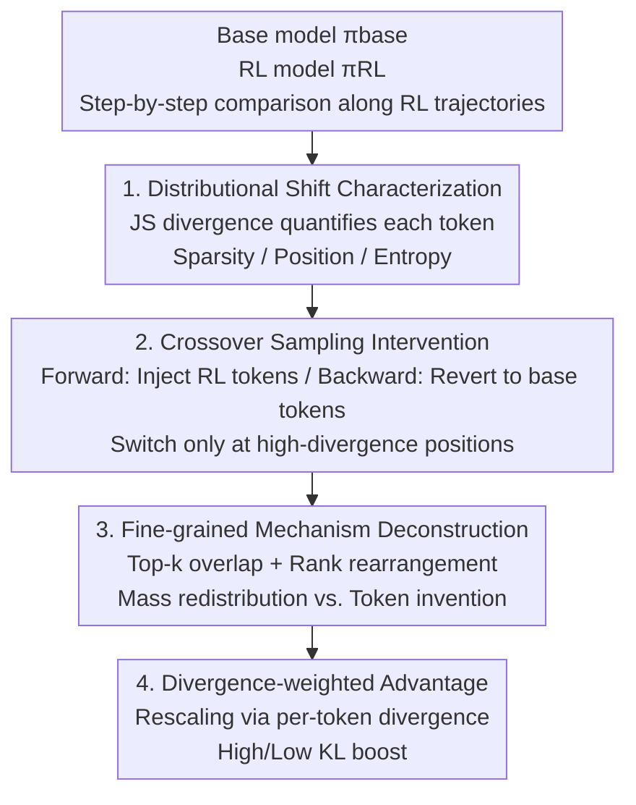

# Sparse but Critical: A Token-Level Analysis of Distributional Shifts in RLVR Fine-Tuning of LLMs

**Conference**: ICLR 2026  
**OpenReview**: [https://openreview.net/forum?id=8vWIXno8LW](https://openreview.net/forum?id=8vWIXno8LW)  
**Code**: To be confirmed  
**Area**: Reinforcement Learning / LLM Reasoning / RLVR  
**Keywords**: RLVR, token-level distributional shift, JS divergence, crossover sampling, sparsity

## TL;DR
This paper systematically dissects what Reinforcement Learning from Verifiable Rewards (RLVR) genuinely modifies in models through the lens of token-level distributional shifts. It reveals that RL fine-tuning significantly alters the next-token prediction distribution at only a very small fraction of token positions (~17% in DAPO, less than 2% in SimpleRL). Through "crossover sampling" interventions, it is demonstrated that this small group of tokens determines almost all reasoning performance gains. RLVR acts more like a precise surgery that **redistributes probability mass** within existing candidate sets rather than providing a global rewrite of the model.

## Background & Motivation

**Background**: RLVR (e.g., GRPO, DAPO, SimpleRL) has significantly improved LLM performance on mathematical reasoning benchmarks and has become a mainstream paradigm for post-training. However, evaluations of these methods are mostly limited to **aggregate metrics** such as accuracy, rewards, and answer length.

**Limitations of Prior Work**: Aggregate metrics only indicate that the "model has improved" but fail to explain **how the internal behavior of the model changes**. A core question remains unanswered: How exactly does RLVR reshape the token-level prediction distribution of the base model? Which of these changes truly drive the downstream reasoning gains? While existing works have begun exploring token entropy and uncertainty (e.g., high-entropy tokens driving RL), there is a lack of a fine-grained distributional perspective concerning how changes are distributed across sequence positions, how probability mass is redistributed among candidate tokens, how they evolve during training, and their actual contribution to performance gains.

**Key Challenge**: There is a common assumption that RL fine-tuning "broadly" rewrites model behavior. However, if changes are highly concentrated on a few critical decision points, understanding based on aggregate metrics is misleading and fails to guide the design of more efficient RL objectives.

**Goal**: ① Characterize the structure of token-level distributional shifts introduced by RLVR (sparsity, location, relationship with entropy, token identity); ② Validate the functional importance of these shifts for performance gains using causal interventions; ③ Deconstruct whether RL "invents new tokens" or "rearranges existing candidates" at high-shift positions; ④ Attempt a diagnostic intervention by modifying the advantage using divergence as a weight.

**Key Insight**: By treating RL-generated trajectories as reference paths and comparing the conditional distributions of the next token between the base model $\pi_{base}$ and the RL model $\pi_{RL}$ at each position, the "amount of change" at each position can be quantified using the **Jensen–Shannon (JS) divergence**, which is symmetric, bounded, and well-defined even if the distributions are not absolutely continuous.

**Core Idea**: Use "token-level distributional divergence" as a unified lens to understand RLVR as a **sparse, structured probability redistribution process**—performing surgery only on a few high-divergence critical token positions which drive almost all gains.

## Method

### Overall Architecture

Rather than proposing a new model, this paper presents a **four-stage progressive token-level analysis framework**, moving from "how sparse the changes are" to "whether these changes causally cause gains, what the mechanism is, and whether it can guide training." The logic is to first **characterize** the structure of distributional shifts (sparsity, position, entropy, identity, comparison with SFT), then use **causal interventions** (crossover sampling) to prove the functional importance of these sparse shifts, followed by a **microscopic deconstruction** of the shift mechanism at high-divergence positions (rearrangement vs. invention), and finally **back-feeding** these observations into a divergence-weighted advantage modification.

### Key Designs

**1. Characterizing Sparse and Structured Distributional Shifts via JS Divergence**

To answer "to what extent RLVR modifies the base model," the authors calculate the JS divergence $D_{JS}(\pi_{base}(\cdot|x_{<t})\,\|\,\pi_{RL}(\cdot|x_{<t}))$ at each token position $t$ given prefix $x_{<t}$. JS divergence is chosen over KL because it is symmetric, bounded in $[0, \log 2]$, and well-defined even when distributions are not absolutely continuous—crucial when memory limits force the use of top-p truncated distributions where KL might be undefined.

The conclusion is that RLVR modifications are **highly sparse**: more than 83% of token positions in DAPO and over 98% in SimpleRL have near-zero divergence. DAPO shows a broader divergence distribution and more exploration due to its clip-higher mechanism and lack of KL regularization. The **structure** of the shifts follows a "high at both ends, low in the middle" pattern—divergence is highest at the start (corresponding to high-level branching decisions), decreases in the middle, and rises slightly at the end (corresponding to formatting and termination). Regarding entropy, low-divergence tokens are mostly low-entropy (preserving confident predictions), while high-divergence tokens span both high and low entropy, indicating DAPO can rewrite even confident base predictions. High-divergence tokens are often functional words, reasoning-related terms, or formula fragments, but **context** is the key determinant rather than token identity. Control experiments show SFT has a significantly larger and broader high-divergence set, proving sparsity is a unique attribute of RLVR.

**2. Forward and Backward Crossover Sampling: Probing Functional Importance**

To verify if these high-divergence tokens **causally** cause performance gains, the authors designed complementary crossover sampling interventions. A switching rule $S(x_{<t}) = \mathbb{1}\{D_{JS}(\pi_{prim}\|\pi_{int}) > \varepsilon\}$ is defined: at positions where divergence exceeds threshold $\varepsilon$, the current token is sampled from the "intervention policy" $\pi_{int}$, otherwise it is sampled from the "primary policy" $\pi_{prim}$. The mixed policy is $\pi_{mix} = (1-S_t)\pi_{prim} + S_t\pi_{int}$. **Forward Crossover Sampling** sets $\pi_{prim}=\pi_{base}$ and $\pi_{int}=\pi_{RL}$ to see if injecting a few RL tokens into base generation can recover RL-level performance (**sufficiency**). **Backward Crossover Sampling** sets $\pi_{prim}=\pi_{RL}$ and $\pi_{int}=\pi_{base}$ to see how quickly performance drops when high-divergence RL tokens are reverted to base choices (**necessity**).

The results are striking: In Forward sampling on AIME 2024, injecting less than 4% RL tokens (fewer than 40 effective replacements per answer) raises base accuracy from ~8% to >25%. In Backward sampling, reverting ~5% of high-divergence tokens (fewer than 30 base tokens) drops RL performance from ~25% back to ~8%. Locally, the substituted base tokens often seem reasonable or semantically interchangeable to humans, yet they cause reasoning trajectories to derail, exposing the model's **sensitivity to trajectories**.

**3. Top-k Overlap and Rank Rearrangement: Invention vs. Rearrangement**

The authors examined high-divergence positions ($JS>0.1$) using several metrics. **Top-k overlap**: The overlap between base and RL candidate sets remains high for $k \geq 2$ (over 80% on average for SimpleRL, slightly lower for DAPO). A sharp increase from $k=1$ to $k=2$ suggests that while the top-1 token often changes, the replacement was usually already in the base top-3. **Rank rearrangement**: About 30% of RL top-1 tokens were already ranked first in the base model, and over 80% (DAPO) / 90% (SimpleRL) fell within the base top-3. **Low-probability behavior**: Only ~5% of top-1 tokens in high-divergence DAPO cases had a base probability below 0.01.

Conclusion: RLVR primarily **redistributes probability mass, rearranges, and selectively amplifies existing candidates** rather than introducing truly new tokens. During **training evolution**, JS divergence increases monotonically, with high percentiles (95th, 99th) growing faster than low ones—meaning distributional changes become increasingly concentrated.

**4. Divergence-weighted Advantage: Back-feeding for Training**

The authors defined a divergence-weighted advantage $\tilde{A}_t = w_t \cdot \hat{A}_t$, where $\hat{A}_t$ is the standard group-normalized advantage and $w_t$ is a per-token weight based on divergence (detached from the computation graph). To remain compatible with existing frameworks, KL divergence against the old policy $\mathrm{KL}^{old}_t = D_{KL}(\pi_{\theta_{old}}\|\pi_\theta)$ is used. The weighting uses a bounded sigmoid scheme $w_t = 1 + s\left(\sigma(\alpha\cdot\mathrm{KL}_t) - \tfrac12\right)$: $\alpha>0$ amplifies high-divergence tokens (**high-KL boost**), while $\alpha<0$ emphasizes low-divergence ones (**low-KL boost**).

Results on Qwen2.5-Math-7B showed that both high-KL boost and low-KL boost outperformed the baseline DAPO, providing empirical support for the idea that specific tokens disproportionately drive gains. However, this is positioned as a **diagnostic tool** rather than a definitive method, as the optimal direction may depend on specific model/task configurations.

### Loss & Training
The divergence-weighted advantage is based on the DAPO objective $J_{DAPO}(\theta)$, replacing the token-level advantage $\hat{A}_{i,t}$ with $\tilde{A}_{i,t}=w_t\hat{A}_{i,t}$. The importance sampling ratio $r_{i,t}(\theta)$ and group-normalized advantage calculations remain the same. Results are reported as Mean@32 (or pass@1) across 3 runs.

## Key Experimental Results

### Main Results: Sufficiency and Necessity of Crossover Sampling (Qwen2.5-32B)

| Dataset | Method | Effective % token | Effective # token | Initial Acc(%) | Final Acc(%) |
| :--- | :--- | :--- | :--- | :--- | :--- |
| AIME24 | SimpleRL Forward | 3.86% | 38 | 8.23 | > 25 |
| AIME24 | SimpleRL Backward | 5% | 29 | 25.52 | < 8.3 |
| AIME24 | DAPO Forward | 7.8% | 280 | 8.23 | > 44 |
| AIME24 | DAPO Backward | 10.1% | 173 | 44.8 | < 8.5 |
| AIME25 | SimpleRL Forward | 1.53% | 13 | 5.3 | > 14 |
| AIME25 | SimpleRL Backward | 4.73% | 31 | 12.71 | < 4 |

Interpretation: Injecting only a single-digit percentage of RL tokens is sufficient to recover RL performance; conversely, reverting a tiny percentage to base tokens collapses RL performance.

### Ablation Study: Divergence-weighted Advantage (Qwen2.5-Math-7B)

| Configuration | AIME24 | AIME25 | AMC | Total Avg |
| :--- | :--- | :--- | :--- | :--- |
| Baseline DAPO | 33.61 | 18.75 | 75.08 | 42.48 ± 1.35 |
| Low-KL boost | 35.90 | 19.90 | 78.97 | 44.92 ± 0.05 |
| High-KL boost | 36.74 | 20.00 | 78.40 | 45.05 ± 0.79 |

### Key Findings
- **Extreme Sparsity**: >83% (DAPO) and >98% (SimpleRL) of tokens show negligible changes. This sparsity is unique to RLVR compared to SFT.
- **Sparse is Critical**: Crossover sampling proves that <4%–10% of token decisions are responsible for almost all RL gains.
- **Rearrangement over Invention**: High-divergence tokens are rarely "new" to the model; they are typically existing high-rank candidates in the base model that are selectively amplified.
- **Trajectory Sensitivity**: Locally reasonable substitutions from the base model cause reasoning to derail due to their effect on the downstream conditional distribution.
- **Training Evolution**: Changes concentrate over time into a smaller subset of critical tokens.

## Highlights & Insights
- **Crossover sampling is the most elegant design**: It upgrades correlational evidence to causal evidence. The forward/backward curves together solidify the conclusion that sparse tokens drive gains.
- **Mixed strategies occasionally exceeding pure RL**: This suggests that the RL policy is not optimal at every single position, leaving room for further optimization.
- **"Rearrangement over Invention" has direct implications**: It supports the claim that "base models already know the answer; RL helps them select it." This provides a theoretical basis for speculative decoding or sampling enhancement.
- **Diagnostic demonstration**: The divergence-weighted advantage serves as a demonstration of converting analysis into methodological improvements, showing that distributional structure can guide RL objectives.

## Limitations & Future Work
- The divergence-weighted advantage is a **diagnostic exploration**; the fact that both boost directions improved performance suggests the underlying mechanism requires further study.
- Experiments are primarily focused on the Qwen2.5 family and math reasoning. Generalization to other models or tasks (code, general reasoning) remains to be verified.
- Divergence estimation (k3 for training, top-p for inference) might not capture the full distribution structure.
- Future work: Moving from diagnostic weights to stable training objectives, such as utilizing token-level divergence for adaptive scheduling or improving clipping mechanisms.

## Related Work & Insights
- **vs. High-entropy token perspective (Wang et al. 2025)**: While others focused on entropy, this work shows high-divergence tokens span all entropy levels, suggesting entropy is not the only characterizing factor.
- **vs. "Scalpel not Hammer" (Rajani et al. 2025)**: This work provides more direct, token-level causal evidence via crossover sampling compared to parameter-level or aggregate-KL analyses.
- **vs. Reward/Advantage reweighting (Lin et al. 2025)**: This work derives reweighting naturally from a deep analysis of "what changes" rather than proposing a standalone heuristic.

## Rating
- Novelty: ⭐⭐⭐⭐⭐ Decoupling RLVR as a "sparse mass redistribution" process via causal crossover sampling is a fresh perspective.
- Experimental Thoroughness: ⭐⭐⭐⭐ Solid dual-direction interventions and training tracking, though the task diversity is somewhat narrow.
- Writing Quality: ⭐⭐⭐⭐⭐ Exceptionally clear logic; each section starts with a clear question followed by empirical answers.
- Value: ⭐⭐⭐⭐⭐ Provides critical token-level evidence and reusable tools for understanding RL post-training.

<!-- RELATED:START -->

## Related Papers

- [\[ICLR 2026\] Proximal Supervised Fine-Tuning](proximal_supervised_fine-tuning.md)
- [\[ICLR 2026\] SRFT: A Single-Stage Method with Supervised and Reinforcement Fine-Tuning for Reasoning](srft_a_single-stage_method_with_supervised_and_reinforcement_fine-tuning_for_rea.md)
- [\[ICLR 2026\] ResT: Reshaping Token-Level Policy Gradients for Tool-Use Large Language Models](rest_reshaping_token-level_policy_gradients_for_tool-use_large_language_models.md)
- [\[ICLR 2026\] Spotlight on Token Perception for Multimodal Reinforcement Learning](spotlight_on_token_perception_for_multimodal_reinforcement_learning.md)
- [\[ICLR 2026\] RewardMap: Tackling Sparse Rewards in Fine-grained Visual Reasoning via Multi-Stage Reinforcement Learning](rewardmap_tackling_sparse_rewards_in_fine-grained_visual_reasoning_via_multi-sta.md)

<!-- RELATED:END -->
