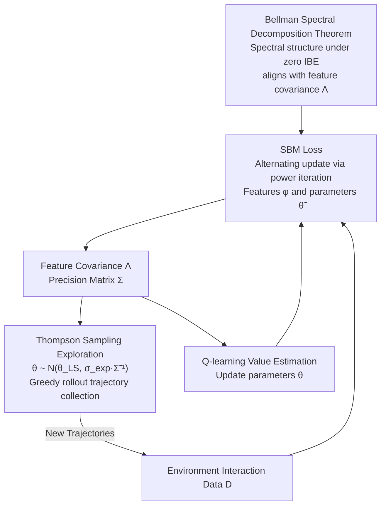

# Spectral Bellman Method: Unifying Representation and Exploration in RL

**Conference**: ICLR 2026  
**arXiv**: [2507.13181](https://arxiv.org/abs/2507.13181)  
**Code**: None  
**Area**: Reinforcement Learning  
**Keywords**: Representation Learning, Exploration, Bellman Error, Spectral Decomposition, Thompson Sampling

## TL;DR

The paper proposes the Spectral Bellman Method (SBM), which originates from the zero Intrinsic Bellman Error (IBE) condition to discover the spectral link between the Bellman operator and feature covariance. It derives a novel representation learning objective and naturally unifies representation learning with Thompson Sampling exploration.

## Background & Motivation

**Background**: Efficient reinforcement learning in complex environments faces two core challenges: **learning effective representations** and **conducting efficient exploration**. Existing methods typically treat these as independent problems, but a deep connection exists—good representations should simultaneously support accurate value estimation and strategic data collection.

**Limitations of Prior Work**: Existing representation learning methods (autoencoders, contrastive learning, predictive models, successor features, etc.) mostly originate from a model-learning perspective and lack alignment with the core RL structure (Bellman updates). A key theoretical framework is **Intrinsic Bellman Error (IBE)**:

- IBE quantifies the suitability of a feature space for value-based RL.
- Zero IBE implies that the function space is closed under the Bellman operator, which is a generalization of Linear MDPs.
- Features satisfying zero IBE can support efficient exploration.

**Key Challenge**: Direct learning of low-IBE representations faces severe difficulties:
1. Minimizing IBE directly leads to complex min-max-min optimization problems.
2. The Bellman operator is highly non-linear with respect to $Q_\theta$.
3. Simple MSE objectives neither exploit spectral properties nor promote structured features.

**Key Insight**: Under the zero IBE condition, an essential **spectral relationship** exists between the transformation of a set of Q-functions by the Bellman operator and the feature covariance structure. This spectral relationship can be leveraged to design practical learning objectives.

## Method

### Overall Architecture

SBM simultaneously addresses two problems often handled separately in RL: **learning a representation suitable for value estimation** and **efficient exploration**, driven by the same quantity. Its starting point is a theoretical observation: when the feature space satisfies zero Intrinsic Bellman Error (IBE), the function space is closed under the Bellman operator. In this case, the Singular Value Decomposition (SVD) of the transformation matrix resulting from the Bellman operator acting on a set of Q-functions aligns precisely with the feature covariance matrix. SBM translates this spectral relationship into a differentiable proxy objective—approximating this spectral structure via alternating optimization similar to power iteration—and allows the trained feature covariance to serve as the posterior for Thompson Sampling exploration. The entire algorithm is a three-stage alternating loop: collecting data via covariance-driven Thompson Sampling, updating value parameters via standard Q-learning, and updating features via the SBM loss.

### Key Designs

**1. Bellman Spectral Decomposition Theorem: Explicating the Hidden Structure of Zero IBE**

Zero IBE is a theoretical criterion for judging if "features are suitable for value estimation," but direct minimization leads to min-max-min optimization because the Bellman operator is highly non-linear with respect to $Q_\theta$. The breakthrough of SBM lies in proving that under the zero IBE condition, defining a weighted feature matrix $\Phi_P$ and a weighted post-Bellman parameter matrix $\tilde{\Theta}_P$, the Bellman transformation can be decomposed as $\mathcal{T}\bar{Q} = \Phi_P \tilde{\Theta}_P$. Its SVD is directly linked to the feature covariance matrix $\Lambda = \mathbb{E}[\phi(s,a)\phi(s,a)^\top]$—non-zero singular values are exactly the eigenvalues of $\Lambda$, with left singular vectors corresponding to weighted features and right singular vectors to weighted parameters. A key corollary is $\Lambda_1 = \Lambda_2 = \Lambda$, meaning feature covariance aligns with post-Bellman parameter covariance. This theorem converts a difficult abstract criterion into a spectral problem solvable by numerical algorithms (SVD/power iteration).

**2. SBM Loss: Converting Spectral Objectives into Trainable Alternating Optimization**

Knowing the goal is to approximate these singular vectors, SBM draws on the power iteration concept for SVD to split the problem into alternating objectives for features $\phi$ and parameters $\tilde{\theta}$:

$$\mathcal{L}(\phi, \tilde{\theta}) = \mathcal{L}_1(\phi) + \mathcal{L}_2(\tilde{\theta}) + \mathcal{L}_{orth}(\phi, \tilde{\theta})$$

The representation loss $\mathcal{L}_1(\phi)$ updates $\phi$ to align with Bellman-transformed Q-values using the current parameter covariance $\Lambda_{2,t}$ as regularization. The parameter loss $\mathcal{L}_2(\tilde{\theta})$ conversely updates $\tilde{\theta}$ to best represent the Bellman transformation results, regularized by the current feature covariance $\Lambda_{1,t}$. Orthogonal regularization $\mathcal{L}_{orth}$ constrains features of different dimensions to be orthogonal. This is more stable than direct Bellman residual minimization because the quadratic terms in SBM use robust moving average covariances $(\Lambda_{2,t})$ rather than noisy single-sample estimates.

**3. Thompson Sampling Exploration: Driving Sampling via Feature Covariance**

Since the learned feature covariance describes the representation structure and encodes the uncertainty of value estimation, SBM reuses it for exploration without extra modules. It constructs a precision matrix $\Sigma = \lambda I + \sum_{(s,a) \in \mathcal{D}} \phi(s,a)\phi(s,a)^\top$. Before each rollout, parameters are sampled from the posterior $\hat{\theta}_{TS} \sim \mathcal{N}(\hat{\theta}_{LS}, \sigma_{exp} \Sigma^{-1})$ for greedy execution. Because the covariance of low-IBE features encodes directions of uncertainty, sampling naturally biases toward informative state-action pairs. This achieves the "unification of representation and exploration" where learning a good representation and exploring well become the same task.

### Loss & Training

The complete algorithm (Algorithm 2) executes three stages alternatingly in each iteration. The data collection stage samples $\hat{\theta}_{TS} \sim \mathcal{N}(\hat{\theta}_t, \sigma_{exp} \Sigma_t^{-1})$ to collect trajectories via $\pi_{\hat{\theta}_{TS}}$. The policy optimization stage uses standard Q-learning loss $\mathcal{L}_{QL}(\theta; \phi) = \mathbb{E}[(\mathcal{T}Q_{\theta^-}(s,a) - \phi(s,a)^\top\theta)^2]$ to update $\theta$. The representation learning stage updates features $\phi$ via the SBM Loss, with the parameter distribution centered at the current Q-parameters $\nu(\theta) = \mathcal{N}(\hat{\theta}_{t+1}, \sigma_{rep}^2 I)$. Here, $\tilde{\theta}(\theta)$ is implemented as a residual network $\tilde{\theta}(\theta) = \theta + \Delta(\theta)$, and all covariance matrices are updated via exponential moving averages for stability.

## Key Experimental Results

### Main Results

| Method | Atari 57 Mean | Atari 57 Median | Atari Explore Mean | Atari Explore Median |
|------|--------------|-----------------|-------------------|---------------------|
| DQN | 1.61 | 0.63 | 0.22 | 0.03 |
| SBM + DQN (ε-greedy) | 1.83 | 0.81 | 0.36 | 0.08 |
| **SBM + DQN (TS)** | **1.91** | **0.98** | **0.42** | **0.21** |
| R2D2 | 3.2 | 1.02 | 0.42 | 0.25 |
| SBM + R2D2 (ε-greedy) | 3.3 | 1.14 | 0.45 | 0.26 |
| **SBM + R2D2 (TS)** | **3.51** | **1.32** | **0.67** | **0.31** |

(Scores are Human Normalized Scores, at 100M steps)

### Ablation Study

| Configuration | Description |
|------|------|
| SBM + ε-greedy | Gains from representation learning alone |
| SBM + TS | Synergistic gains from representation + exploration |
| Pure DQN → +SBM | +19% Mean HNS (Atari 57), +91% Mean HNS (Explore) |
| Pure R2D2 → +SBM+TS | +10% Mean HNS (Atari 57), +60% Mean HNS (Explore) |

### Key Findings

1. **Synergy of Representation and Exploration**: The gain from SBM + TS is significantly larger than using either alone, validating the superiority of the unified framework.
2. **Advantages in Hard-to-Explore Games**: The percentage improvement on the Atari Explore subset (Montezuma's Revenge, Pitfall!, etc.) is much larger than on the full 57 games.
3. **Compatibility with Multi-step Operators**: SBM naturally extends to Retrace(λ) targets and integrates seamlessly with R2D2's distributed training.
4. **Co-evolution of Representation and Policy**: Improved features → better value estimation → better policy → better data → further improved features.

## Highlights & Insights

1. **Balance of Theoretical Depth and Practicality**: Derives a spectral objective from IBE theory, yet the final algorithm only requires simple modifications to existing Q-learning by adding an auxiliary SBM loss.
2. **Elegance of the Unified Perspective**: A single spectral objective drives three aspects—features with low Bellman error, structured covariance, and covariance-based exploration noise.
3. **Avoidance of Hard Optimization**: Converts the min-max-min optimization required for direct IBE minimization into an alternating power-iteration-like optimization, which is simple and converges quickly.
4. **Analysis of SBM Loss vs. MSE**: Demonstrates that SBM's use of moving average covariance provides robust regularization compared to the noisy single-sample estimates in standard Bellman MSE.

## Limitations & Future Work

1. **Sensitivity to $\nu(\theta)$ Distribution**: The parameter $\sigma_{rep}$ requires careful tuning as different environments may need different configurations.
2. **Atari-Only Validation**: Performance on continuous control tasks (e.g., MuJoCo) has not been verified.
3. **Theoretical Analysis Gaps**: Convergence proofs and behavior analysis under non-zero IBE conditions are yet to be completed.
4. **Approximation of $\tilde{\theta}$**: Currently uses a residual MLP for $\tilde{\theta}(\theta)$; more sophisticated parameterization could further improve performance.
5. **Comparison with Other Representations**: Lack of direct comparison with other representation methods like CURL or SPR makes it difficult to judge the absolute advantage of spectral objectives over contrastive or predictive ones.

## Related Work & Insights

- **Intrinsic Bellman Error (IBE)**: Zanette et al. (2020a) proposed the IBE concept and gave regret bounds for planning-based algorithms; this work makes IBE-oriented representation learning practical.
- **Linear MDP**: Jin et al. (2020) assumed linear transitions and rewards, which are hard to satisfy; IBE relaxes this condition.
- **Spectral Decomposition Representations**: Works by Ren et al. (2022/2023) are direct predecessors, but this work establishes the link with power iteration and TS exploration.
- **Insight**: This framework demonstrates how to design practical algorithms from the core mathematical structures of RL (spectral properties of the Bellman operator) rather than relying on general self-supervised heuristics.

## Rating

- Novelty: ⭐⭐⭐⭐⭐ — Discovering the connection between IBE and spectral structures to derive SBM Loss is a highly original contribution.
- Experimental Thoroughness: ⭐⭐⭐⭐ — Covers Atari 57 and hard exploration subsets using two baselines, though lacks continuous control.
- Writing Quality: ⭐⭐⭐⭐ — Clear theoretical derivation and a complete path from theorem to algorithm.
- Value: ⭐⭐⭐⭐⭐ — Provides a theoretically grounded new paradigm for unified RL representation and exploration.

<!-- RELATED:START -->

## Related Papers

- [\[ICLR 2026\] Representation-Based Exploration for Language Models: From Test-Time to Post-Training](representation-based_exploration_for_language_models_from_test-time_to_post-trai.md)
- [\[ICLR 2026\] Mirage or Method? How Model–Task Alignment Induces Divergent RL Conclusions](mirage_or_method_how_modeltask_alignment_induces_divergent_rl_conclusions.md)
- [\[ICLR 2026\] Sample-efficient and Scalable Exploration in Continuous-Time RL](sample-efficient_and_scalable_exploration_in_continuous-time_rl.md)
- [\[ICLR 2026\] A Unifying View of Coverage in Linear Off-Policy Evaluation](a_unifying_view_of_coverage_in_linear_off-policy_evaluation.md)
- [\[ICLR 2026\] SRFT: A Single-Stage Method with Supervised and Reinforcement Fine-Tuning for Reasoning](srft_a_single-stage_method_with_supervised_and_reinforcement_fine-tuning_for_rea.md)

<!-- RELATED:END -->
