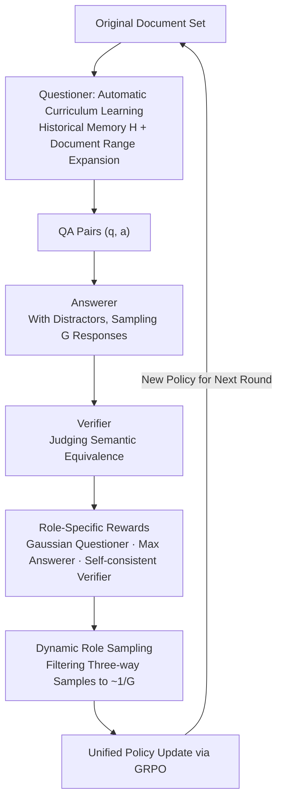

# SPELL: Self-Play Reinforcement Learning for Evolving Long-Context Language Models

## Meta Information
- **Conference**: ICLR 2026
- **arXiv**: [2509.23863](https://arxiv.org/abs/2509.23863)
- **Code**: [https://github.com/Tongyi-Zhiwen/Qwen-Doc](https://github.com/Tongyi-Zhiwen/Qwen-Doc)
- **Area**: Reinforcement Learning
- **Keywords**: self-play RL, long-context reasoning, GRPO, LLM, verifiable rewards, curriculum learning

## TL;DR
The SPELL framework is proposed, where an LLM simultaneously plays three roles—Questioner, Answerer, and Verifier—to perform self-play reinforcement learning. This approach continuously enhances long-context reasoning capabilities without human annotations, achieving consistent performance gains across 6 long-context benchmarks.

## Background & Motivation
- **Dilemma of long-context reasoning**: While RLVR (Reinforcement Learning from Verifiable Rewards) has succeeded in domains with clear correctness criteria like math and code, long-context reasoning experiences two main bottlenecks:
  1. High cost and unreliability of human labeling (human accuracy on LongBench-V2 is only 25.1%).
  2. Lack of programmatically verifiable reward signals.
- **Key Challenge of self-play**: Answers may be semantically correct but vary in expression, making string matching and majority voting unreliable.
- **Core Idea**: The model must not only generate and answer questions but also learn to verify its own answers.

## Method

### Overall Architecture

SPELL addresses the problem where long-context reasoning lacks programmatic correctness criteria like math or code and struggles to obtain reliable supervision from human labels (due to the 25.1% human accuracy on LongBench-V2), making it difficult to directly apply RLVR. The **Core Idea** is to have **the same set of parameters $\pi_\theta$ play three roles simultaneously**, closing the "data generation - problem solving - verification" supervision chain entirely within the model.

The workflow cycles between two phases. In the **Role-Specific Rollout** phase, the Questioner $\pi_\theta^{\text{que}}$ generates QA pairs $(q, a)$ from raw documents. The Answerer $\pi_\theta^{\text{res}}$ independently samples $G$ responses for each question after receiving the full document (including distractor documents not seen by the Questioner). The Verifier $\pi_\theta^{\text{ver}}$ then determines if each response is semantically equivalent to the reference answer. Each role receives specific rewards. In the **Unified Policy Update** phase, samples from the three roles are balanced through dynamic sampling and combined into a single GRPO update. The updated policy serves as the starting point for the next round of sampling. Thus, questioning, answering, and verification capabilities co-evolve and drive each other without any human annotation.

### Key Designs

**1. Automatic Curriculum Learning: Growing Difficulty with Capability**

Self-play risks stagnation if the questioner only generates simple, homogeneous questions. SPELL maintains a historical memory $\mathcal{H}$ of the $L=3$ most recently solved QA pairs and their documents, using them as conditions for the Questioner. Difficulty increases in two ways: first, new documents are sampled and merged with historical documents in each round, causing the context $X^{\text{que}}$ to expand and cover longer ranges; second, historical QA pairs $\{(q_l, a_l)\}$ are explicitly included in the prompt, forcing the Questioner to avoid solved content and generate more complex multi-hop problems. Consequently, curriculum difficulty and context length grow alongside training progress without manual intervention. A grounding filter also discards questions answerable without the document to prevent hallucinations.

**2. Role-Specific Rewards: Converting "Semantic Correctness" to Verifiable Signals via Self-Consistency**

Long-context answers are often semantically correct but worded differently, rendering string matching and majority voting unreliable. This is the core bottleneck SPELL overcomes—without credible correctness signals, self-play cannot be optimized. The Verifier reward $r_{i,j}^{\text{ver}} = \mathbb{I}(v_{i,j} = v_i^{\text{ver}})$ is based on self-consistency, rewarding a single judgment if it aligns with the majority vote $v_i^{\text{ver}}$ for that sample. For tasks with rule-based criteria, the majority vote also aligns with ground truth rules, bootstrapping reliable verification capability that can then transfer to semantic problems. The Answerer reward $r_i^{\text{res}} = \max(\mathcal{R}_{\text{rule}}(y_i, a), v_i^{\text{ver}})$ combines rule-based matching (CEM, cover exact match) with the Verifier's vote, allowing semantically correct answers missed by rules to be rescued by the Verifier, thus suppressing false negative noise. The Questioner reward uses a Gaussian function $r^{\text{que}} = \exp\!\left(-\frac{(\bar{r}^{\text{res}} - 0.5)^2}{2 \cdot (0.5/3)^2}\right)$ centered at an Answerer success rate of $\bar{r}^{\text{res}}=0.5$. Questions that are too easy or too hard receive lower rewards, guiding the Questioner to generate problems at the boundary of the model's current capability.

**3. Dynamic Role Sampling and Unified Update: Balancing Samples for Single Gradient Update**

The raw sample counts for the three roles are highly imbalanced—one question yields 1 Questioner sample, $G$ Answerer samples, and $G^2$ Verifier samples. Direct training would be overwhelmed by Verifier gradients, drowning out the Answerer. SPELL applies validity filtering: the Answerer only keeps groups where rewards vary (to generate effective advantage), while the Verifier keeps samples where the majority vote aligns with rule-based judgment, sub-sampling to match the number of questions. This reduces the training set to approximately $1/G$ of its original size. The filtered samples from all three roles share the same policy and are optimized via GRPO: $\mathcal{J}_{\text{GRPO}}(\theta) = \mathcal{J}_{\text{GRPO}}^{\text{que}}(\theta) + \mathcal{J}_{\text{GRPO}}^{\text{res}}(\theta) + \mathcal{J}_{\text{GRPO}}^{\text{ver}}(\theta)$, enhancing all three capabilities in a single update cycle.

## Key Experimental Results

### Main Results: 12 Open-Source LLMs × 6 Benchmarks (16K Context)

| Model | Baseline Avg. | +RLVR Avg. | +SPELL Avg. | Gain |
|------|----------|-----------|------------|----------|
| Qwen2.5-7B (base) | 26.7 | 40.8 | **40.6** | +13.9 |
| Qwen2.5-14B (base) | 37.3 | — | **51.7** | +14.4 |
| Qwen2.5-32B (base) | — | — | — | +9.1 |
| Qwen2.5-7B-Instruct | — | — | — | +9.0 |
| R1-Distill-Qwen-14B | — | — | — | +3.4 |
| Qwen3-30B-A3B-Thinking | — | — | — | +2.0 |

> Base models trained with SPELL even outperformed instruct models of the same scale (which require extensive human annotation).

### Ablation Study: Component Contributions

| Ablation Setting | DocMath | Frames | LB-MQA | LB-V2 | Avg. |
|---------|--------|--------|--------|-------|------|
| SPELL (Full) | Optimal | Optimal | Optimal | Optimal | Optimal |
| No Verifier (CEM only) | Decreased | Decreased | Decreased | — | Decreased |
| No Curriculum | Decreases | Decreased | Decreased | — | Decreased |
| No Questioner Difficulty Reward | Decreased | Decreased | — | — | Moderate Decrease |
| Static RLVR (DeepSeek-R1 data) | Weaker than SPELL | — | — | — | Weaker than SPELL |

### Key Findings
1. SPELL provides consistent gains across base/instruct/reasoning models and dense/MoE architectures.
2. Training base models can surpass instruct models, suggesting self-play is more efficient than human annotation.
3. Compared to static RLVR (using DeepSeek-R1 synthesized data), the dynamic curriculum of SPELL is more effective.
4. Self-consistency training for the Verifier provides reliable semantic rewards, compensating for the limitations of rule-based matching.
5. Qwen3-30B-A3B-Thinking surpasses Gemini-2.5-pro in pass@4.

## Highlights & Insights
- **Fully Unsupervised**: It does not depend on human annotations or data generated by external models.
- **Unified Policy for Three Roles**: A single model learns to question, answer, and verify simultaneously, which is an elegant design.
- **Automatic Curriculum**: Problems naturally become more difficult and context length naturally increases as training progresses.
- **Scalability**: Gains are still observed in strong reasoning models (Qwen3-30B Thinking), showing it has not yet hit a ceiling.

## Limitations
- Self-consistency training for the Verifier may be inaccurate in some cases (e.g., semantically ambiguous answers).
- Maximum input length is limited to 16K tokens, which may restrict ultra-long document scenarios (>100K).
- The Questioner may generate hallucinated questions outside the document scope (despite the grounding filter).
- Computational costs for joint training of three roles are higher than standard SFT or single-role RL.

## Related Work
- **Long-Context RL**: Wan et al. (2025) first extended RLVR to long-context scenarios.
- **Self-Play**: Absolute Zero (Zhao et al., 2025) generates single-turn programming tasks; SPAG (Cheng et al., 2024) involves adversarial taboo games.
- **RLVR**: DeepSeek-R1 (Guo et al., 2025), GRPO (Shao et al., 2024).
- **Long-Context Models**: LongBench (Bai et al., 2024), Frames (Krishna et al., 2025).

## Rating
- Novelty: ⭐⭐⭐⭐⭐ — Three-role self-play + automatic curriculum for long-context RL is a unique approach.
- Theoretical Depth: ⭐⭐⭐ — Primarily methodological innovation; lacks extensive theoretical analysis.
- Experimental Thoroughness: ⭐⭐⭐⭐⭐ — 12 models × 6 benchmarks × detailed ablations.
- Practical Value: ⭐⭐⭐⭐⭐ — Highly practical, as it improves long-context capabilities without requiring labeled data.

<!-- RELATED:START -->

## Related Papers

- [\[ICLR 2026\] SPIRAL: Self-Play on Zero-Sum Games Incentivizes Reasoning via Multi-Agent Multi-Turn Reinforcement Learning](spiral_self-play_on_zero-sum_games_incentivizes_reasoning_via_multi-agent_multi-.md)
- [\[ICLR 2026\] Unsupervised Learning of Efficient Exploration: Pre-training Adaptive Policies via Self-Imposed Goals](unsupervised_learning_of_efficient_exploration_pre-training_adaptive_policies_vi.md)
- [\[ICLR 2026\] Solving Parameter-Robust Avoid Problems with Unknown Feasibility using Reinforcement Learning](solving_parameter-robust_avoid_problems_with_unknown_feasibility_using_reinforce.md)
- [\[ICLR 2026\] Shop-R1: Rewarding LLMs to Simulate Human Behavior in Online Shopping via Reinforcement Learning](shop-r1_rewarding_llms_to_simulate_human_behavior_in_online_shopping_via_reinfor.md)
- [\[ICLR 2026\] Unveiling the Cognitive Compass: Theory-of-Mind-Guided Multimodal Emotion Reasoning](unveiling_the_cognitive_compass_theory-of-mind-guided_multimodal_emotion_reasoni.md)

<!-- RELATED:END -->
