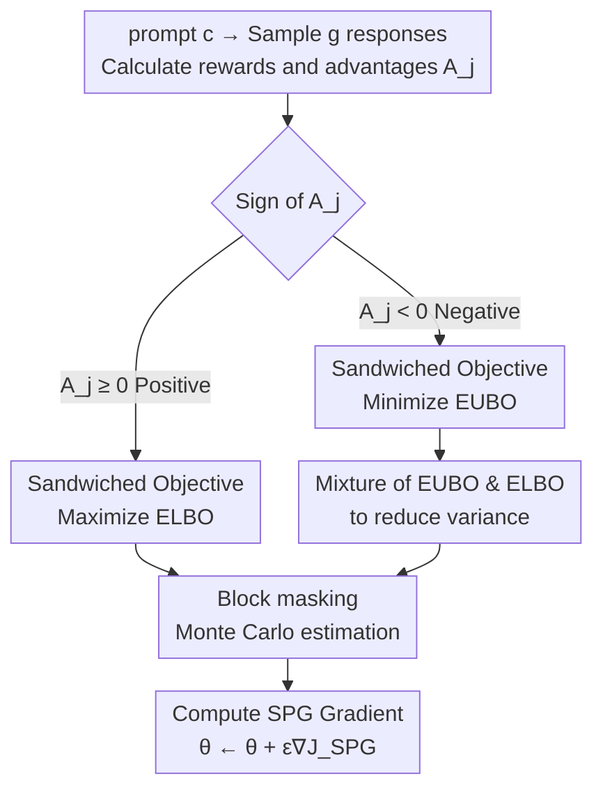

# SPG: Sandwiched Policy Gradient for Masked Diffusion Language Models

**Conference**: ICLR 2026  
**OpenReview**: [https://openreview.net/forum?id=18j5Q49GwN](https://openreview.net/forum?id=18j5Q49GwN)  
**Code**: https://github.com/facebookresearch/SPG  
**Area**: Reinforcement Learning / Diffusion Language Models / Policy Gradient  
**Keywords**: Masked Diffusion Language Models, Policy Gradient, Evidence Upper Bound, GRPO, Block Masking

## TL;DR
Addressing the issue where the uncomputable log-likelihood of masked diffusion language models (dLLMs) leads to biased RL policy gradients, this paper proposes Sandwiched Policy Gradient (SPG). It maximizes the Evidence Lower Bound (ELBO) for samples with positive advantages and minimizes a newly derived computable Evidence Upper Bound (EUBO) for samples with negative advantages, effectively "sandwiching" the true objective. Combined with block masking estimation, it achieves improvements of 3.6%, 2.6%, 18.4%, and 27.0% over previous SOTA on GSM8K, MATH500, Countdown, and Sudoku, respectively.

## Background & Motivation

**Background**: Diffusion language models (dLLMs, such as LLaDA, DREAM) are becoming efficient alternatives to autoregressive models due to their ability to "decode multiple tokens in parallel." They corrupt text using a fixed noise process (repeatedly replacing tokens with `[mask]`) and train a denoising network to predict the original tokens, typically using the Evidence Lower Bound (ELBO) of the log-likelihood as the training objective.

**Limitations of Prior Work**: Aligning dLLMs with human preferences or task rewards (e.g., inducing reasoning capabilities) requires an RL post-training phase. However, standard policy gradients rely on $\nabla_\theta \log \pi_\theta(x \mid c)$, while the log-likelihood $\log \pi_\theta(x\mid c)$ of a dLLM is **computationally intractable** (as it requires marginalizing over all noisy trajectories). Existing works (D1, UniGRPO, WD1, etc.) directly substitute the true likelihood with ELBO or single-step estimates.

**Key Challenge**: ELBO is only a **one-sided lower bound** ($\text{ELBO}\le\log\pi_\theta$) of the true log-likelihood. While maximizing ELBO raises the true likelihood (which is appropriate for **positive reward** samples), minimizing a lower bound for **negative reward** samples **does not** guarantee a reduction in true likelihood. This introduces systematic policy gradient bias. Furthermore, it renders ELBO-based RL objectives valid only when all rewards are non-negative, making them naturally incompatible with modern algorithms that use relative/negative rewards (like GRPO).

**Goal**: Construct a **bilateral, computable** proxy objective such that optimizing it is equivalent to moving towards a valid bound of the true expected reward, regardless of whether the sample advantage is positive or negative.

**Key Insight**: Since ELBO is a lower bound suitable for "pushing up," finding a **computable upper bound EUBO** ($\log\pi_\theta\le\text{EUBO}$) to "push down" allows the selection of the appropriate side of the bound based on the sign of the reward.

**Core Idea**: "Sandwich" the uncomputable log-likelihood between a lower and upper bound—maximizing ELBO for positive advantages and minimizing EUBO for negative advantages—thereby obtaining a valid lower bound for the true GRPO objective and significantly reducing policy gradient bias.

## Method

### Overall Architecture

SPG is built upon the Group Relative Policy Optimization (GRPO) family. For each prompt $c$, $g$ responses $\{x_j\}_{j=1}^g$ are sampled from the current policy, and their respective rewards $R(c,x_j)$ and intra-group relative advantages $A_j = R(c,x_j) - \frac{1}{g}\sum_{\jmath} R(c,x_\jmath)$ are calculated. GRPO defines the objective as an advantage-weighted log-likelihood $J_{\text{group}}(\theta)=\mathbb{E}\big[\frac{1}{g}\sum_j A_j \log\pi_\theta(x_j\mid c)\big]$, encouraging high-advantage responses and suppressing low-advantage ones.

The innovation of SPG lies entirely in **what replaces** $\log\pi_\theta$ when it is intractable. Instead of using ELBO for all samples, it shunts samples based on the sign of the advantage: positive advantages use the lower bound ELBO, while negative advantages use a newly derived upper bound EUBO (mixed with ELBO in practice to reduce variance). Both bounds are estimated via Monte Carlo sampling with block masking. The pipeline is as follows:

### Key Designs

**1. Sandwiched Policy Gradient Objective: Shunting by Advantage Sign**

This is the foundation of the paper. The problem is that negative advantage samples aim to "reduce true likelihood," but minimizing the ELBO (a lower bound) does not guarantee this. SPG splits the objective into two branches:

$$J_{\text{SPG}}(\theta) = \mathbb{E}\Big[\tfrac{1}{g}\textstyle\sum_{j=1}^{g}\big(\mathbb{1}_{A_j\ge 0}\cdot A_j\,\mathcal{L}_{\text{ELBO}}(x_j\mid c;\theta) + \mathbb{1}_{A_j<0}\cdot A_j\,\mathcal{L}_{\text{EUBO}}(x_j\mid c;\theta)\big)\Big]$$

The intuition is straightforward: for $A_j\ge0$, maximizing the product with the lower bound $\mathcal{L}_{\text{ELBO}}$ pushes the true likelihood up. For $A_j<0$, since the coefficient is negative, minimizing the upper bound $\mathcal{L}_{\text{EUBO}}$ effectively **pushes the upper bound down**, which necessarily reduces the true likelihood "sandwiched" beneath it. Because $\mathcal{L}_{\text{ELBO}}\le\log\pi_\theta\le\mathcal{L}_{\text{EUBO}}$, it can be proven that $J_{\text{SPG}}(\theta)\le J_{\text{group}}(\theta)$, meaning SPG is a **valid lower bound** of the true GRPO objective. This addresses the directional error of ELBO-only methods for negative advantages.

**2. Computable Evidence Upper Bound (EUBO): Derived via Rényi Variational Bound**

For the sandwiched objective to be feasible, $\mathcal{L}_{\text{EUBO}}$ must be **computable**. The paper derives a theorem based on the Rényi variational bound: for any $\beta\ge1$ and sequence $x_{1:n}$, there exists an upper bound whose gradient in the continuous-time limit $T\to\infty$ can be estimated by (omitting constants $C(T)$ independent of $\theta$):

$$\tilde{\mathcal{L}}_{\text{EUBO}}(x_{1:n};\theta) = \frac{1}{\beta}\sum_{i=1}^{n}\log\,\mathbb{E}_{t,z_t}\big[\,w(t)\cdot\mathbb{1}(z_{t,i}=m)\cdot\pi_\theta^{\beta}(x_i\mid z_t)\,\big]$$

The structural difference from ELBO is that while ELBO sums over positions with the log inside the expectation, EUBO moves the **log outside the expectation over time/noise** and applies a power $\beta$ to the model output $\pi_\theta^\beta$. The hyperparameter $\beta\ge1$ controls the tightness—closer to 1 is tighter and performs better (chosen from $\{1.0, 1.5, 2.0\}$). $\pi_\theta^\beta$ serves to "sharpen" predictions, amplifying confidence as a strong correction signal for negative advantage samples.

**3. Block Masking Estimation: Aligning Training and Inference Mask Distributions**

Both $\mathcal{L}_{\text{ELBO}}$ and $\tilde{\mathcal{L}}_{\text{EUBO}}$ are estimated via Monte Carlo sampling by randomly picking $m$ time steps for each $x_j$. Naive random masking creates a distribution mismatch: modern dLLMs like LLaDA use **block semi-autoregressive decoding** (unmasking blocks from left to right), so rollout sequences have a structured mask much narrower than purely random masking.

The paper adopts block masking: the sequence is divided into blocks, one is randomly selected, **preceding blocks are kept clean and subsequent blocks are fully masked**, while tokens within the selected block are randomly masked. Following D1, prompts and clean blocks are slightly perturbed with $p_{\text{mask}}=0.15$ for stability. This aligns the training distribution with the policy rollout distribution. Ablations show this raises Countdown accuracy from 45.4 (random) to 69.3 (+23.9).

**4. Bound Mixture: Reducing Gradient Variance via Convex Combination**

Directly using the Monte Carlo estimate of $\tilde{\mathcal{L}}_{\text{EUBO}}$ is **biased** and requires many samples for reliable approximation, leading to high computational costs and instability. The authors use a convex mixture of EUBO and ELBO for negative advantage samples:

$$\tilde{\mathcal{L}}_{\text{Mix}}(x\mid c;\theta) := \omega\cdot\tilde{\mathcal{L}}_{\text{EUBO}}(x\mid c;\theta) + (1-\omega)\cdot\mathcal{L}_{\text{ELBO}}(x\mid c;\theta)$$

EUBO provides a strong correction signal via sharpening but has high noise; ELBO allows stable estimation with fewer samples but lacks penalty strength for negative advantages. The mixture balances both. Proposition 1 proves that there exists a unique optimal $\omega^\star_k$ such that the mixture gradient variance is **strictly smaller** than using either bound alone. This provides "confidence-aware weighting": uncertain tokens (low $\pi_\theta^\beta$) receive lower weight. In practice, $\omega=0.5$ is used.

### Loss & Training

Training (Algorithm 1): Iteratively sample prompt $c$ and $g$ completions; compute rewards and $A_j$. In $\mu$ inner updates, generate $m$ perturbed samples for each $x_j$ using block masking, assemble $J_{\text{SPG}}(\theta)$ (Equation 5), and perform gradient ascent $\theta\leftarrow\theta+\epsilon\nabla J_{\text{SPG}}(\theta)$. Implementation uses LoRA ($r=128, \alpha=64$) to fine-tune LLaDA-8B-Instruct. Rollout uses semi-autoregressive confidence decoding with length 256 and temperature 0.9 (0.3 for Sudoku).

## Key Experimental Results

### Main Results

Base model: LLaDA-8B-Instruct. Baselines: D1 / WD1 / UniGRPO / LLaDA-1.5. Accuracies (%) at sequence length 256:

| Benchmark | Prev. SOTA | SPG w/ Mixture | Gain |
|-----------|-----------|----------------|------|
| GSM8K (0-shot) | 82.5 (UniGRPO) | 86.1 | +3.6 |
| MATH500 (0-shot) | 37.4 (WD1/UniGRPO) | 40.0 | +2.6 |
| Countdown (0-shot) | 52.3 (WD1) | 70.7 | +18.4 |
| Sudoku (3-shot) | 67.0 (UniGRPO) | 94.0 | +27.0 |

Gains in logical reasoning (Countdown, Sudoku) are significantly higher than in mathematics, suggesting SPG is particularly effective for tasks requiring learning to avoid incorrect solutions from negative feedback. SPG also leads in code tasks: HumanEval (256) from 39.6 to 41.5 (EUBO, +1.9), MBPP (256) from 45.9 to 50.6 (Mixture, +4.7).

### Ablation Study

Ablation of likelihood estimation for negative advantages (average accuracy across four benchmarks, green denotes gain relative to SPG w/ ELBO):

| Configuration | GSM8K | MATH500 | Countdown | Sudoku | Description |
|---------------|-------|---------|-----------|--------|-------------|
| SPG wo/ neg | 77.4 | 32.7 | 45.5 | 68.8 | Significant drop without negative advantage term |
| SPG w/ ELBO | 80.9 | 37.4 | 67.1 | 82.4 | Using lower bound for negative advantages |
| SPG w/ EUBO | 81.6 | 36.7 | 69.3 | 86.1 | Using upper bound for negative advantages |
| SPG w/ Mixture| 83.1 | 38.4 | 69.9 | 90.0 | **Best**: Mixture of bounds |

Ablation of masking strategy (Average Accuracy):

| Configuration | Masking | MATH500 | Countdown |
|---------------|---------|---------|-----------|
| SPG w/ EUBO | Random | 36.7 | 45.4 |
| SPG w/ EUBO | Block | 36.7 | 69.3 (+23.9) |
| SPG w/ Mixture| Random | 36.9 | 62.8 |
| SPG w/ Mixture| Block | 38.4 | 69.9 (+7.1) |

### Key Findings
- **Negative advantage penalties are indispensable**: Removing the negative term (SPG wo/ neg) causes massive performance drops, proving that learning from "bad samples" is critical for dLLM RL—exactly what ELBO-only methods fail to capture.
- **Mixture outperforms single-sided bounds**: Figure 4 (Sudoku reward curve) shows that ELBO converges fast but plateaus early; EUBO reaches high rewards but is unstable; Mixture achieves the best of both worlds.
- **Block masking provides massive gains for structured tasks**: In Countdown, it adds +23.9 (EUBO), highlighting the importance of aligning input distributions between optimization and rollout.
- **$\beta \approx 1$ is optimal**: Tighter upper bounds lead to higher performance; $\omega=0.5$ provides stable gains, consistent with variance-optimal mixture theory.

## Highlights & Insights
- **"Sandwiching" is a clean theoretical fix**: By clamping the uncomputable log-likelihood between two bounds, $J_{\text{SPG}}\le J_{\text{group}}$ holds consistently. This is a fundamental correction of the "sign error" in ELBO-only methods for negative rewards.
- **EUBO derivation fills a vacuum**: The dLLM community previously only had ELBO. This paper derives a computable upper bound via Rényi variational bounds, providing a correct optimization target for "minimizing likelihood."
- **Block masking identifies distribution mismatch**: The gap between random masking at training and block decoding at inference is worth 24 points in Countdown, serving as a reminder to align these distributions in dLLM RL.
- **Variance analysis supports the mixture**: Proposition 1 proves the existence of a variance-reducing optimal $\omega^\star$, elevating the mixture strategy from empirical observation to provable conclusion.

## Limitations & Future Work
- $\beta$ and $\omega$ are fixed hyperparameters in this work; they could potentially be adaptively tuned during training to match evolving data distributions.
- The Monte Carlo estimate of EUBO is biased and requires more samples for reliability, hence the necessity of the Mixture approach; pure EUBO remains computationally heavy.
- Evaluation is focused on verifiable tasks (math/logic/code); performance on open-ended human preference alignment (with nosier rewards) has not been fully explored.
- Experiments are based on LLaDA-8B-Instruct with LoRA; evidence for larger models or full-parameter tuning is limited.

## Related Work & Insights
- **vs ELBO-only methods (D1 / UniGRPO)**: These use ELBO for all samples, leading to systematic bias and incompatibility with negative rewards. SPG corrects this with a valid bilateral bound.
- **vs WD1**: While WD1 performs weighted preference optimization on dLLMs, it still relies on one-sided likelihood approximations. SPG significantly outperforms it on tasks like Countdown (52.3→70.7) due to better learning from negative feedback.
- **vs Trajectory-level updates (Huang et al. 2025)**: The latter accumulates gradients along entire diffusion trajectories, which is computationally expensive. SPG is more economical, requiring only a few Monte Carlo samples via block masking.

## Rating
- Novelty: ⭐⭐⭐⭐⭐ First to derive a computable EUBO for dLLMs and use "sandwiching" to fix directionality in negative advantage gradients.
- Experimental Thoroughness: ⭐⭐⭐⭐ Coverage across six benchmarks with extensive ablations, though model scale is somewhat limited.
- Writing Quality: ⭐⭐⭐⭐ Clear correspondence between motivation, theory, and ablation results.
- Value: ⭐⭐⭐⭐⭐ Provides a theoretically grounded, reusable policy gradient framework for dLLM post-training.

<!-- RELATED:START -->

## Related Papers

- [\[ACL 2026\] d-TreeRPO: Towards More Reliable Policy Optimization for Diffusion Language Models](../../ACL2026/reinforcement_learning/d-treerpo_towards_more_reliable_policy_optimization_for_diffusion_language_model.md)
- [\[ICLR 2026\] Revolutionizing Reinforcement Learning Framework for Diffusion Large Language Models](revolutionizing_reinforcement_learning_framework_for_diffusion_large_language_mo.md)
- [\[ICLR 2026\] Reevaluating Policy Gradient Methods for Imperfect-Information Games](reevaluating_policy_gradient_methods_for_imperfect-information_games.md)
- [\[ICML 2026\] Learning Unmasking Policies for Diffusion Language Models](../../ICML2026/reinforcement_learning/learning_unmasking_policies_for_diffusion_language_models.md)
- [\[ICLR 2026\] ResT: Reshaping Token-Level Policy Gradients for Tool-Use Large Language Models](rest_reshaping_token-level_policy_gradients_for_tool-use_large_language_models.md)

<!-- RELATED:END -->
