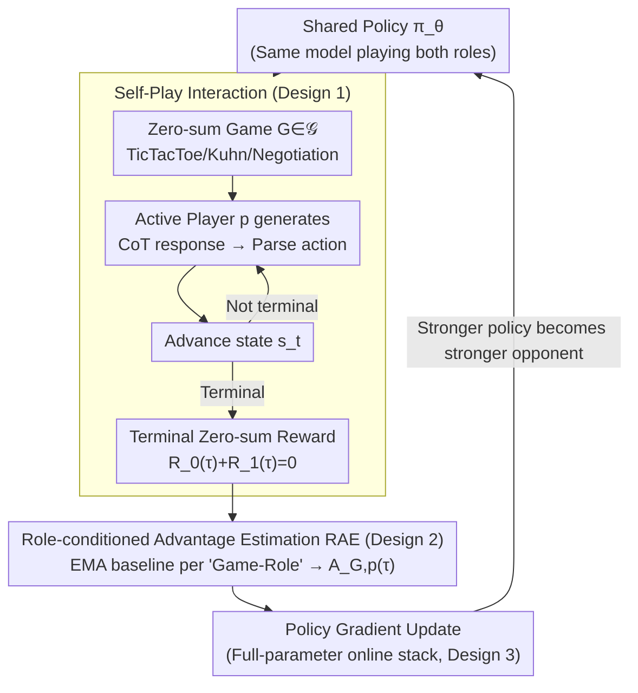

# SPIRAL: Self-Play on Zero-Sum Games Incentivizes Reasoning via Multi-Agent Multi-Turn Reinforcement Learning

## Meta Information
- **Conference**: ICLR 2026
- **arXiv**: [2506.24119](https://arxiv.org/abs/2506.24119)
- **Code**: [https://github.com/spiral-rl/spiral](https://github.com/spiral-rl/spiral)
- **Area**: Reinforcement Learning
- **Keywords**: self-play, zero-sum games, multi-agent RL, reasoning, LLM, transfer learning

## TL;DR
The SPIRAL framework is proposed, enabling LLMs to undergo self-play training in multi-turn zero-sum games. By stabilizing training through Role-conditioned Advantage Estimation (RAE), it improves reasoning capabilities by up to 10% without domain-specific data and identifies complementary cognitive skills developed across different games.

## Background & Motivation
- **Limitations of Prior Work in RLVR**: Current RL approaches for enhancing LLM reasoning rely on meticulously designed reward functions and domain-specific datasets (e.g., mathematics), leading to limited scalability.
- **Potential of Self-Play**: From TD-Gammon to AlphaGo, self-play has achieved tremendous success in traditional AI, but its application to enhancing LLM reasoning remains largely unexplored.
- **Key Challenge with Fixed Opponents**: Training models against a fixed opponent (e.g., Mistral/Gemini) leads to overfitting on static strategies (Figure 2).
- **Technical Challenges**: Computational demands for multi-turn multi-agent autoregressive generation are immense, and standard RL exhibits high variance in multi-agent settings.

## Method

### Overall Architecture
SPIRAL aims to solve the problem: why must reasoning enhancement depend on human-annotated mathematical problems? It delegates training signals entirely to a set of two-player zero-sum games—where the same LLM plays against itself. Victory or defeat provides the reward, eliminating the need for domain data. The cycle operates as follows: the shared policy $\pi_\theta$ acts as both Player 0 and Player 1 via system prompting. In each turn, the active player generates a complete response containing a Chain-of-Thought (CoT), from which a valid action is parsed to advance the game state until a terminal zero-sum reward is reached. These trajectories are then used to calculate advantages via Role-conditioned Advantage Estimation (RAE) for policy gradient updates. The updated policy immediately serves as a stronger opponent for subsequent rounds. Since the opponent is "the self that just improved," the difficulty automatically scales with the model's current level, creating an infinite adaptive curriculum. The game set $\mathcal{G}$ covers three skill categories: TicTacToe (spatial reasoning), Kuhn Poker (probabilistic reasoning), and Simple Negotiation (strategy optimization). The pipeline runs on a distributed Actor-Learner architecture to handle the throughput of multi-turn multi-agent interactions.

### Key Designs

**1. Self-Play with Multi-Game Shared Policy: Infinite Adaptive Curriculum via Zero-Sum Play**

This design enables the loop where the "opponent is always the improving self." While RLVR depends on manual rewards and domain data, and fixed opponents cause overfitting to static strategies, SPIRAL uses $\pi_\theta$ for both sides. Role conditioning is achieved via system prompts. Each turn, the active player $p$ samples a response $y_t^{(p)} \sim \pi_\theta(\cdot \mid s_t, p, G_i)$, and rewards are distributed only at the end under the zero-sum constraint $R_0(\tau)+R_1(\tau)=0$. The difficulty scales automatically with model performance, removing the need for human labels and preventing static overfitting. The three games elicit complementary cognitive skills—spatial, probabilistic, and strategic—where multi-game training produces synergy.

**2. Role-conditioned Advantage Estimation (RAE): Eliminating Training Variance from Positional Advantages**

Stability is the primary bottleneck for updating models from self-play trajectories. In zero-sum games, the same model optimizes two opposing objectives, and asymmetric games (e.g., the inherent advantage of starting first in TicTacToe) lead to different expected returns for different roles. Using a single global baseline would contaminate advantage signals with positional bias, resulting in high variance. RAE maintains an Exponential Moving Average (EMA) baseline $b_{G,p} \leftarrow \alpha\, b_{G,p} + (1-\alpha)\, R_p(\tau)$ for each "game-role" pair. Advantages are calculated as $A_{G,p}(\tau) = R_p(\tau) - b_{G,p}$, leading to the following variance-reduced policy gradient:

$$\nabla_\theta J_{\text{SPIRAL}}(\theta) = \mathbb{E}_{G \sim \mathcal{G}} \,\mathbb{E}_{\tau \sim \pi_\theta \times \pi_\theta \mid G} \left[\sum_{p \in \{0,1\}} \sum_{t \in T_p} A_{G,p}(\tau)\, \nabla_\theta \log \pi_\theta(y_t^{(p)} \mid s_t, p, G)\right]$$

Role-specific normalization removes positional dividends, ensuring gradients reflect whether a move was better than the average performance of that specific role. Without RAE, models experience "thinking collapse," abandoning reasoning for empty CoT traces after approximately 200 steps.

**3. Engineering Stack for Full-Parameter Online Training: Supporting Multi-Turn Multi-Agent Compute Costs**

Implementing the above requires managing the massive throughput of multi-turn multi-agent autoregressive generation. The implementation utilizes a distributed Actor-Learner architecture via the Oat framework, using vLLM for efficient inference and TextArena for environment simulation. It employs full-parameter (non-LoRA) and fully online (non-offline) updates to ensure the Actor's sampling policy remains synchronized with the Learner's optimization, allowing the self-play curriculum to progress on the latest strategy rather than a lagging version.

## Key Experimental Results

### Main Results: Reasoning Benchmark Performance

| Model | Math500 | AIME24 | AIME25 | AMC-23 | GPQA-D | Avg. |
|------|---------|--------|--------|--------|--------|------|
| Qwen3-4B-Base | 73.4 | 9.6 | 6.2 | 42.4 | 30.6 | 34.0 |
| + SFT-Multi | 74.2 | 13.7 | 11.7 | 51.1 | 37.8 | 39.7 |
| + **SPIRAL-Multi** | **78.2** | **19.7** | **13.3** | **61.6** | **40.1** | **44.5** |
| | +4.8 | +10.1 | +7.1 | +19.2 | +9.5 | **+10.5** |

| Model | Avg. Baseline | + SPIRAL-Multi | Gain |
|------|---------|---------------|------|
| Qwen3-4B-Base | 34.0 | **44.5** | +10.5 |
| Qwen3-8B-Base | 39.5 | **49.6** | +10.1 |
| Octothinker-8B-Base | 25.8 | **33.8** | +8.0 |
| Llama-3.1-8B-Instruct | — | — | +2.0 |

> Multi-game SPIRAL outperforms SFT on 25K expert trajectories; DeepSeek-R1-Distill models still benefit.

### Ablation Study: Contribution of Each Game (Qwen3-4B-Base)

| Training Setting | Math500 | AIME24 | Minerva | Avg. |
|---------|---------|--------|---------|------|
| SPIRAL-TicTacToe | 76.0 | 15.0 | 38.2 | ~40 |
| SPIRAL-Kuhn | 76.4 | 18.2 | 42.4 | 43.4 |
| SPIRAL-Negotiation | 75.8 | 14.5 | 39.0 | ~39 |
| **SPIRAL-Multi** | **78.2** | **19.7** | **42.6** | **44.5** |

> Different games develop complementary abilities: TicTacToe for spatial reasoning, Kuhn for probabilistic reasoning, and Negotiation for strategy optimization. Multi-game combinations yield synergistic effects.

### Key Findings
1. Self-play consistently improves performance across four model families (Qwen3, Llama, Octothinker).
2. Multi-game training > Single-game training > SFT on expert trajectories > Fixed opponent training.
3. RAE is critical for training stability; its absence leads to thinking collapse.
4. CoT trace analysis identifies three reasoning patterns transferred from games to mathematics: case-by-case analysis, expected value calculation, and pattern recognition.
5. The adaptive curriculum of self-play is essential—training against a fixed opponent fails.

## Highlights & Insights
- **Zero Human Supervision**: Requires no math problems or domain-specific data; games generate infinite training data automatically.
- **Transferability Discovery**: Reasoning patterns learned in games (case analysis, probability estimation) are transferable to academic reasoning tasks.
- **Necessity of RAE**: Elegantly resolves variance issues in multi-agent zero-sum training, preventing thinking collapse.
- **Complementary Skills**: Different games cultivate different cognitive abilities; multi-game synergy > single game.

## Limitations & Future Work
- Only three relatively simple games were tested; the effectiveness on complex games (e.g., Diplomacy) remains unknown.
- High computational overhead: Multi-turn multi-agent autoregressive generation requires significant GPU resources.
- Analysis of transfer mechanisms remains post-hoc and qualitative, lacking rigorous theoretical explanation.
- Gains are limited on highly optimized instruct models (Llama-3.1-8B-Instruct showed only +2.0).

## Related Work & Insights
- **LLM RL Reasoning**: OpenAI o1, DeepSeek-R1, GRPO (Shao et al., 2024).
- **LLM Self-Play**: SPAG (Cheng et al., 2024) single-game offline; Absolute Zero (Zhao et al., 2025) single-turn coding.
- **LLMs in Games**: RAGEN (Wang et al., 2025b), ViGaL (Xie et al., 2025b).
- **Multi-Agent RL**: Cicero (FAIR et al., 2022) focused on superhuman performance in a single game.

## Rating
- Novelty: ⭐⭐⭐⭐⭐ — Multi-game multi-turn zero-sum self-play for general reasoning is a new paradigm.
- Theoretical Depth: ⭐⭐⭐ — RAE is intuitively explained but lacks rigorous theoretical derivation.
- Experimental Thoroughness: ⭐⭐⭐⭐⭐ — 4 model families × 8 reasoning benchmarks × detailed ablations × CoT analysis.
- Value: ⭐⭐⭐⭐ — Improves reasoning without domain data, though at a high computational cost.

<!-- RELATED:START -->

## Related Papers

- [\[ICLR 2026\] SPELL: Self-Play Reinforcement Learning for Evolving Long-Context Language Models](spell_self-play_reinforcement_learning_for_evolving_long-context_language_models.md)
- [\[ICLR 2026\] Unsupervised Learning of Efficient Exploration: Pre-training Adaptive Policies via Self-Imposed Goals](unsupervised_learning_of_efficient_exploration_pre-training_adaptive_policies_vi.md)
- [\[ICLR 2026\] RuleReasoner: Reinforced Rule-based Reasoning via Domain-aware Dynamic Sampling](rulereasoner_reinforced_rule-based_reasoning_via_domain-aware_dynamic_sampling.md)
- [\[ICLR 2026\] Unveiling the Cognitive Compass: Theory-of-Mind-Guided Multimodal Emotion Reasoning](unveiling_the_cognitive_compass_theory-of-mind-guided_multimodal_emotion_reasoni.md)
- [\[ICLR 2026\] Solving Parameter-Robust Avoid Problems with Unknown Feasibility using Reinforcement Learning](solving_parameter-robust_avoid_problems_with_unknown_feasibility_using_reinforce.md)

<!-- RELATED:END -->
