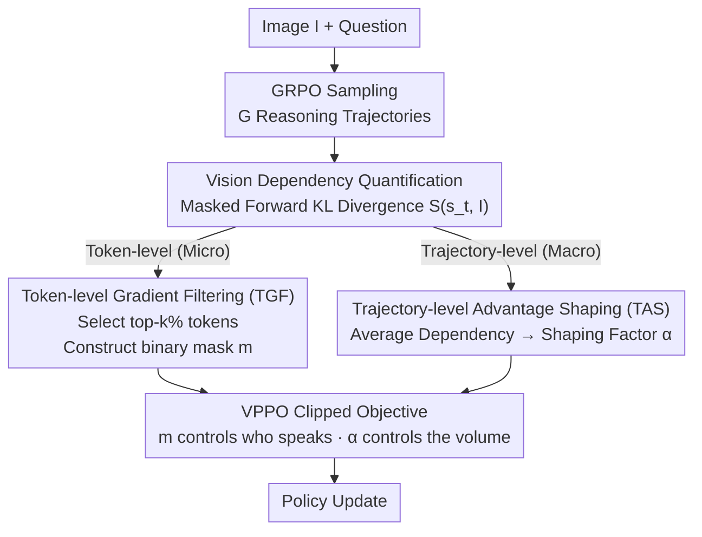

# Spotlight on Token Perception for Multimodal Reinforcement Learning

**Conference**: ICLR 2026  
**arXiv**: [2510.09285](https://arxiv.org/abs/2510.09285)  
**Code**: [https://github.com/huaixuheqing/VPPO-RL](https://github.com/huaixuheqing/VPPO-RL)  
**Area**: Multimodal Reinforcement Learning / Vision-Language Models  
**Keywords**: RLVR, Multimodal Reasoning, Token Perception, Vision Dependency, Policy Optimization

## TL;DR

This paper proposes Visually-Perceptive Policy Optimization (VPPO), which quantifies the vision dependency of each token to refine learning signals at both the trajectory and token levels, significantly enhancing the multimodal reasoning capabilities of Large Vision-Language Models.

## Background & Motivation

- **Limitations of RLVR in Multimodal Scenarios**: Existing RLVR frameworks (e.g., GRPO, DAPO) are primarily designed for text-based reasoning and overlook the critical role of visual perception in multimodal contexts. They broadcast uniform learning signals to all tokens, failing to distinguish which tokens truly rely on visual information.
- **Coupling of Perception and Reasoning**: Effective multimodal reasoning requires accurate visual perception as the foundation for logical inference. For instance, in a geometry problem, the model must recognize from the image that OA and OB are radii of a circle to conclude it is an isosceles triangle.
- **Key Findings**:
    - **Key Insight 1**: The vision dependency of tokens within a trajectory is sparsely distributed—only a few tokens exhibit high vision dependency.
    - **Key Insight 2**: There is significant heterogeneity in overall vision dependency across different reasoning trajectories—not all correct paths are truly driven by visual reasoning.

## Method

### Overall Architecture

The premise of VPPO is that since vision-dependent tokens are sparse and visual engagement varies greatly across trajectories, broadcasting uniform learning signals via GRPO to all tokens and trajectories is wasteful or even detrimental to the gradient. VPPO first quantifies the dependency of each token on the image using a metric that requires no additional annotation. This score then serves as a unified basis to redistribute signals at two levels: the trajectory level (macro), which amplifies paths that are truly "visually grounded" based on average dependency, and the token level (micro), which allows only key tokens with high vision dependency to contribute to the gradient. Both modules are built upon GRPO without altering the sampling or reward processes, allowing them to be integrated into existing RLVR training in a plug-and-play manner.

### Key Designs

**1. Vision Dependency Quantification: Scoring Every Token via Masked Forward Pass**

To regulate signals hierarchically, one must first identify which tokens depend on the image. The authors define the vision dependency of a token at time $t$ as the KL divergence between the output distributions under the original image and a masked image: $\mathcal{S}(s_t, I) := D_{\text{KL}}\left(\pi_\theta(\cdot|s_t, I) \,\|\, \pi_\theta(\cdot|s_t, I')\right)$, where $I'$ is a masked version of the image replaced with non-informative content. The intuition is clear: if the predictive distribution of a token remains nearly unchanged after masking the image, it is likely generated based on linguistic priors; conversely, a larger $\mathcal{S}$ indicates the token's prediction is highly anchored in visual evidence. This score requires only one additional masked forward pass without extra annotations or auxiliary models. Empirically, the distribution is highly right-skewed—only a few tokens like numbers, geometric concepts, and logical operators receive high scores, confirming the observation of "sparse vision dependency."

**2. Token-level Gradient Filtering (TGF): Combatting Signal Dilution**

Most tokens in a reasoning trajectory are generic (e.g., conjunctions, formatting tokens). Treating them equally to tokens that carry the weight of visual reasoning dilutes effective signals with noise. TGF selects the top-$k\%$ tokens with the highest vision dependency $\mathcal{S}$ for each trajectory $\tau_i$ to form a set $\mathcal{K}_i$ and constructs a binary mask $m_{i,t} = \mathbb{I}(t \in \mathcal{K}_i)$. Policy gradients are only calculated for these tokens, while others are masked. Experiments show $k=0.4$ is the optimal filtering ratio. This concentrates gradients on the few perceptive tokens that determine the correctness of reasoning, preventing low-information tokens from biasing the update direction.

**3. Trajectory-level Advantage Shaping (TAS): Amplifying Truly Vision-Driven Paths**

In GRPO, any trajectory with a correct answer receives a positive advantage. However, some "correct" trajectories are merely guessed through linguistic shortcuts rather than genuine visual reasoning. TAS calculates the average vision dependency $\bar{\mathcal{S}}(\tau_i)$ for each trajectory and maps this value to a shaping factor:

$$\alpha(\tau_i) = \beta_{\min} + (\beta_{\max} - \beta_{\min}) \frac{\bar{\mathcal{S}}(\tau_i) - \min_{\tau_j} \bar{\mathcal{S}}(\tau_j)}{\max_{\tau_j} \bar{\mathcal{S}}(\tau_j) - \min_{\tau_j} \bar{\mathcal{S}}(\tau_j)}$$

falling within the interval $[\beta_{\min}, \beta_{\max}]$. The shaped advantage $\hat{A}'(\tau_i) = \alpha(\tau_i) \cdot \hat{A}_{\text{GRPO}}(\tau_i)$ gives larger updates to trajectories with high visual engagement and suppresses low-dependency paths, directing learning preference toward grounded reasoning.

### Loss & Training

Integrating both modules into the GRPO clipped objective, the token-level mask $m_{i,t}$ controls "who speaks," and the trajectory-level shaped advantage $\hat{A}'_i$ controls "the volume":

$$\mathcal{L}^{\text{VPPO}}(\theta) = \mathbb{E}\left[\frac{1}{G}\sum_{i=1}^{G}\frac{1}{|o_i|}\sum_{t=1}^{|o_i|} m_{i,t} \cdot \min\left(r_{i,t}(\theta)\hat{A}'_i, \text{clip}(r_{i,t}(\theta), 1-\varepsilon, 1+\varepsilon)\hat{A}'_i\right)\right]$$

The authors further provide a variance reduction theorem $\text{Var}(\mathbf{g}_{\text{VPPO}}) \approx k \cdot \mathbb{E}[\alpha(\tau)^2] \cdot \text{Var}(\mathbf{g}_{\text{GRPO}})$. Since the sparsity rate $k \in (0,1)$ and $\alpha(\tau)$ is constrained near 1, the product results in a gradient variance significantly lower than GRPO, explaining why VPPO maintains more stable training and faster convergence.

## Key Experimental Results

### Main Results: 8 Multimodal Reasoning Benchmarks (avg@8 acc %)

| Model | MathVerse | DynaMath | MMK12 | Geo3k | MathVision | We-Math | LogicVista | MMMU-Pro | Avg. |
|------|-----------|----------|-------|-------|------------|---------|------------|----------|------|
| Qwen2.5-VL-7B | 39.0 | 55.7 | 42.5 | 37.1 | 18.4 | 46.4 | 42.4 | 25.1 | 38.3 |
| + GRPO | 66.5 | 65.8 | 72.3 | 40.2 | 30.7 | 68.1 | 45.6 | 35.2 | 53.1 |
| + DAPO | 68.3 | 66.6 | 82.1 | 41.5 | 30.5 | 68.0 | 46.8 | 35.9 | 55.0 |
| **+ VPPO** | **71.6** | **68.1** | **82.8** | **46.5** | **33.3** | **71.5** | **47.9** | **37.9** | **57.5** |

### 32B Model Scaling

| Model | Avg. |
|------|------|
| Qwen2.5-VL-32B + GRPO | 62.6 |
| Qwen2.5-VL-32B + DAPO | 63.5 |
| **Qwen2.5-VL-32B + VPPO** | **64.6** |

### Key Findings

- On the 7B model, VPPO achieves an average gain of **19.2%** over the baseline, outperforming all open-source RL methods.
- On the 32B model, it yields a **7.6%** average gain.
- Training is more stable with faster convergence.

## Ablation Study

| Setting | Avg. Acc |
|------|----------|
| VPPO (Full) | 57.5 |
| TAS Only (Trajectory-level Advantage Shaping) | 55.8 |
| TGF Only (Token-level Gradient Filtering) | 56.2 |
| w/o TAS + w/o TGF (DAPO baseline) | 55.0 |

- Both TAS and TGF are independently effective, with their combination yielding the best performance.
- A gradient filtering ratio of $k=0.4$ is the optimal choice.

## Highlights & Insights

1. **First analysis of multimodal RLVR from a token perception perspective**: Revealing two key insights: sparse vision dependency distribution and trajectory heterogeneity.
2. **Dual-level signal regulation**: The hierarchical design of trajectory-level and token-level regulation is both elegant and effective.
3. **Plug-and-play**: Seamlessly integrates into mainstream algorithms like GRPO and DAPO.
4. **Theoretical support**: Provides proof for the variance reduction effect.

## Limitations & Future Work

- Computing vision dependency requires an additional masked image forward pass, increasing computational overhead.
- Validated only on the Qwen2.5-VL series; generalization to other model architectures remains to be verified.
- The choice of masking strategy (how to construct $I'$) may affect the quality of dependency estimation.

## Related Work & Insights

- **Multimodal Reasoning RL**: GRPO, DAPO, NoisyRollout, VL-Rethinker, etc., but all overlook visual perception.
- **Reward Design**: Perception-aware reward methods like PAPO-D, but they do not improve the algorithm itself.
- **Key Token Identification**: Bifurcation point detection in RLHF, exploration of low-confidence points, etc., but not tailored for multimodal vision dependency.

## Rating

- **Novelty**: ⭐⭐⭐⭐ — Innovative perspective on multimodal RL through token vision dependency.
- **Technical Depth**: ⭐⭐⭐⭐ — Solid theoretical analysis with a proof of variance reduction.
- **Experimental Thoroughness**: ⭐⭐⭐⭐⭐ — Comprehensive testing across 8 benchmarks, two scales, and rigorous ablation.
- **Value**: ⭐⭐⭐⭐ — Plug-and-play with significant performance gains.

<!-- RELATED:START -->

## Related Papers

- [\[ICLR 2026\] LaSeR: Reinforcement Learning with Last-Token Self-Rewarding](laser_reinforcement_learning_with_last-token_self-rewarding.md)
- [\[ICLR 2026\] Token Hidden Reward: Steering Exploration-Exploitation in Group Relative Deep Reinforcement Learning](token_hidden_reward_steering_exploration-exploitation_in_group_relative_deep_rei.md)
- [\[ICLR 2026\] Sparse but Critical: A Token-Level Analysis of Distributional Shifts in RLVR Fine-Tuning of LLMs](sparse_but_critical_a_token-level_analysis_of_distributional_shifts_in_rlvr_fine.md)
- [\[ICLR 2026\] R1-Reward: Training Multimodal Reward Model Through Stable Reinforcement Learning](r1-reward_training_multimodal_reward_model_through_stable_reinforcement_learning.md)
- [\[ICLR 2026\] Masked Skill Token Training for Hierarchical Off-Dynamics Transfer](masked_skill_token_training_for_hierarchical_off-dynamics_transfer.md)

<!-- RELATED:END -->
