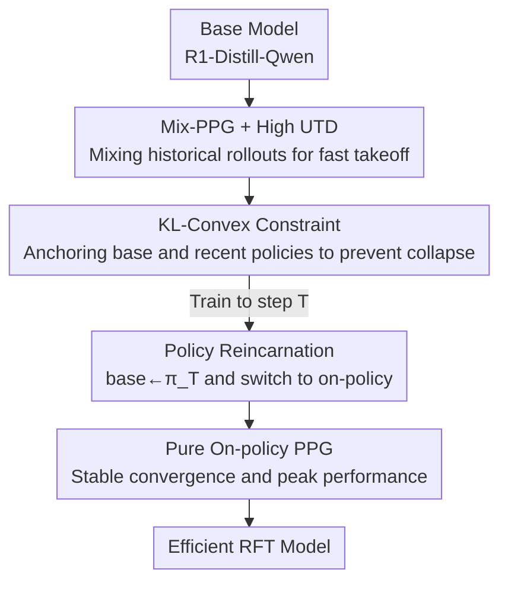

# Squeeze the Soaked Sponge: Efficient Off-Policy RFT for Large Language Model

**Conference**: ICLR 2026  
**OpenReview**: [https://openreview.net/forum?id=quBjNSJMrC](https://openreview.net/forum?id=quBjNSJMrC)  
**Code**: https://anitaleungxx.github.io/ReMix/  
**Area**: Reinforcement Learning / LLM Post-training  
**Keywords**: Off-policy RL, Reinforcement Fine-Tuning (RFT), Mathematical Reasoning, Sample Efficiency, Policy Reincarnation  

## TL;DR
This paper proposes ReMix, which transforms naturally on-policy reinforcement fine-tuning (RFT) methods like PPO/GRPO into mixed-policy algorithms capable of reusing historical rollouts. Utilizing a trio of Mix-PPG, KL-Convex constraints, and policy reincarnation, it achieves SOTA-level accuracy across five mathematical reasoning benchmarks with 30×–450× less rollout data.

## Background & Motivation
**Background**: The reasoning capabilities of large models (System 2 thinking, long-chain reasoning) largely rely on Reinforcement Fine-Tuning (RFT)—treating the LLM as a policy $\pi_\theta$ and using verifiable rewards (1 for correct, 0 for incorrect) for RL. Currently, PPO, GRPO, and RLOO are widely adopted due to their training stability and engineering friendliness.

**Limitations of Prior Work**: These algorithms are entirely **on-policy**, meaning data sampled by the current policy is discarded after a single iteration. RL is notoriously sample-inefficient, and on-policy learning exacerbates this: improving performance requires continuous re-rollouts, which (as auto-regressive generation of long responses) constitutes the most expensive computational overhead in RFT. This inefficiency directly bottlenecks the scaling of model size and response length.

**Key Challenge**: Off-policy RL is inherently more sample-efficient (learning from historical experience), but directly feeding off-policy data into RFT causes issues—excessive distribution shift leads to training degradation or even collapse. Thus, there is a sharp trade-off between **data reuse efficiency** and **training stability / final performance**. Furthermore, existing off-policy RFT works have neither competed directly with SOTA on mainstream math benchmarks nor explained how off-policy learning specifically affects the formation of reasoning behaviors.

**Goal**: Design a general framework that enables existing on-policy proximal policy gradient methods (PPO/GRPO) to **efficiently utilize off-policy data** while achieving SOTA reasoning accuracy and clarifying the impact of off-policy learning on reasoning behavior.

**Key Insight**: Returning to classic off-policy RL literature on generalized proximal gradient theory, it was found that proximal gradient methods inherently allow the use of historical trajectories; the key lies in fine-grained control over "how much old data to mix," "constraining the policy from deviating," and "when to switch back to pure on-policy."

**Core Idea**: "Squeeze the sponge" (the policy saturated with historical data)—use mixed-policy gradients to extract value from old data to accelerate early training, apply dynamic KL constraints to prevent collapse, and finally switch seamlessly to on-policy via "policy reincarnation" to conclude, gaining both early efficiency and final performance.

## Method

### Overall Architecture
The goal of ReMix (Reincarnating Mix-policy Proximal Policy Optimization) is to suppress RFT rollout overhead to extremely low levels without sacrificing final accuracy. The training is divided into two serial stages: the early stage uses a **mixed-policy** to consume historical data for rapid takeoff, and after triggering **policy reincarnation** at step $T$, it switches to **pure on-policy** for a stable finish. Three components collaborate: Mix-PPG (mixed-policy gradient + increased UTD) for data extraction, KL-Convex constraints for drift prevention, and policy reincarnation for stage switching.

### Key Designs

**1. Mix-PPG + High UTD: Extracting early efficiency from historical data without letting distribution shift overwhelm training**

To address the "sample-and-discard" waste of on-policy methods, the authors introduce a mixed On-/Off-policy proximal policy gradient (Mix-PPG). During step $k$ training, the mini-batch no longer comes solely from the current policy $\pi_k$, but is sampled from a mixed distribution: historical trajectories generated by policies $\pi_{k-i}$ ($i\sim\nu$, within window $N$) are sampled with probability $p$, and new trajectories from the current policy with $1-p$. The objective generalizes the PPO clip term into a cross-policy importance sampling form:

$$L^{\text{Mix-PPG}}_k(\theta) = -\mathbb{E}_{i\sim\nu}\,\mathbb{E}_{(s,a)\sim d^{\pi_{k-i}}_{s,a}}\Big[\min\big(r^{k-i}_\theta A^{\pi_k},\ \text{clip}(r^{k-i}_\theta,\ \tfrac{\pi_k}{\pi_{k-i}}-\epsilon,\ \tfrac{\pi_k}{\pi_{k-i}}+\epsilon) A^{\pi_k}\big)\Big]$$

where $r^{k-i}_\theta(s,a)=\frac{\pi_\theta(a|s)}{\pi_{k-i}(a|s)}$ is the importance ratio relative to historical policies, and the clip boundaries shift with $\pi_k/\pi_{k-i}$. This approach cuts significant rollout/inference costs through data reuse while maintaining distribution alignment via sufficient on-policy samples. The authors emphasize that the on-policy proportion must be high enough; otherwise, excessive off-policyness leads to degradation or collapse. Building on this, the **UTD ratio** (number of gradient updates per data batch) is set to $m$ to further reduce the demand for fresh samples—effectively "squeezing the soaked sponge multiple times."

**2. KL-Convex Policy Constraint: Replacing rigid static anchors with a dynamic convex combination of base and recent policies**

Conventional RFT applies a **static** KL penalty for deviating from the base $\pi_{\text{base}}$. However, a fixed anchor fails to keep pace with the evolving policy distribution, leading to suboptimal updates. The authors change the anchor target to a convex combination of $\pi_{\text{base}}$ and the previous policy $\pi_{k-1}$:

$$L_{\text{KLC}}(\theta;\pi_{\text{base}},k) = \mathbb{E}_s\big[\lambda D_{\text{KL}}(\pi_\theta\|\pi_{\text{base}}) + (1-\lambda)D_{\text{KL}}(\pi_\theta\|\pi_{k-1})\big]$$

The constraint against $\pi_{\text{base}}$ preserves foundational capabilities and prevents catastrophic forgetting, while the constraint against $\pi_{k-1}$ serves as a dynamic adaptation to the "current knowledge frontier," allowing for smooth refinement. $\lambda$ follows a **decay** schedule (linear decay is used; the authors found $\lambda(t)=\max(1-0.1\cdot\lceil\max(t-50,0)/10\rceil,\,0.5)$ effective)—weighting toward the base anchor early for stability and relaxing it later to give the policy more optimization space. This consistently outperforms a fixed $\lambda$.

**3. Policy Reincarnation: Mid-training base update to switch seamlessly from "efficiency" to "convergence"**

While Mix-PPG accelerates the early phase, off-policy bias can limit asymptotic (final) performance. Inspired by Reincarnating RL, the authors split training into two stages: first running Mix-PPG for a predetermined $T$ steps to rapidly increase scores; then triggering "reincarnation" with two changes—**(1) resetting the reference model in the KL constraint from the initial $\pi_{\text{base}}$ to the current policy $\pi_T$**, and **(2) switching Mix-PPG back to pure on-policy PPG (PPO/GRPO)**. The complete objective is defined piecewise by stage:

$$L^{\text{ReMix}}(\theta)=\begin{cases}\mathbb{E}\big[L^{\text{Mix-PPG}}+cH[\pi_\theta]\big]+\beta L_{\text{KLC}}(\theta;\pi_{\text{base}},t) & t\le T\\[4pt] \mathbb{E}\big[L^{\text{PPO}}+cH[\pi_\theta]\big]+\beta L_{\text{KLC}}(\theta;\pi_T,t) & t>T\end{cases}$$

The brilliance of reincarnation lies in resetting $\pi_{\text{base}}\to\pi_T$, which makes the KL constraint looser and more dynamic (no longer tethered to a lagging initial model), thereby unlocking greater optimization space. Simultaneously, switching back to on-policy eliminates off-policy bias, ensuring stable convergence in the latter half. Early efficiency and final performance are thus "seamlessly connected."

### Loss & Training
Base models include DeepSeek-R1-Distill-Qwen-1.5B/-7B, using the DeepScaleR dataset (~40k problems). Default hyperparameters: off-policy ratio $p=0.4$, UTD $m=2$, history window $N=2$, reincarnation step $T\in\{50,100\}$ (ReMix-PPO) / $T=50$ (ReMix-GRPO); prompt truncation at 766 tokens, max generation 8192 tokens; reward is verifiable rule-based (1 for correct answer and format). Implementation based on the verl framework and tinyzero code.

## Key Experimental Results

### Main Results
Pass@1 results on five math reasoning benchmarks (AIME'24 / AMC'23 / MATH500 / Minerva / OlympiadBench), with efficiency measured by rollout data volume.

| Model | Scale | Avg Pass@1 | Rollout Cost | Note |
|------|------|------------|--------------|------|
| R1-Distill-Qwen (Base) | 1.5B | 37.58 | N/A | Base |
| DeepScaleR (Strong baseline) | 1.5B | 52.14 | 2.519M | |
| PPO (900 Steps) | 1.5B | 50.61 | 0.230M | On-policy |
| **ReMix-PPO (350 Steps)** | 1.5B | **52.10** | **0.079M** | ≈DeepScaleR, 30× more efficient |
| ReMix-PPO (100 Steps) | 1.5B | 50.61 | 0.020M | Matches PPO with 10× less |
| R1-Distill-Qwen (Base) | 7B | 52.08 | N/A | Base |
| AceReason-Nemotron | 7B | 63.24 | >3.584M | Strong baseline |
| **ReMix-PPO (75 Steps)** | 7B | **64.39** | **0.011M** | Surpasses, 450× more efficient |
| ReMix-GRPO (200 Steps) | 7B | 66.09 | 0.163M | |

ReMix-PPO delivers average increases of +14.52 / +12.31 for 1.5B/7B bases respectively; it saves 6×–10× rollouts when surpassing PPO, and 30×–450× when matching/surpassing the strongest baselines.

### Ablation Study
Based on ReMix-PPO (1.5B, within 500 steps) removing components one by one:

| Configuration | Avg Pass@1 | Description |
|------|-----------|------|
| ReMix-PPO (350 Steps) | 52.10 | Full Model |
| w/o Increased UTD | 50.63 | Drop of 1.47 |
| w/o KL-Convex | 49.36 | Drop of 2.74 |
| w/o Policy Reincarnation | 47.26 | Drop of 4.84 (Largest impact) |
| w/o All Three (≈Pure Mix-PPG) | 48.70 | Mix-PPG alone performs even lower |
| PPO (500 Steps) | 49.56 | On-policy reference |

### Key Findings
- **Policy Reincarnation is the primary contributor**: Removing it causes the average score to drop from 52.10 to 47.26 (−4.84), confirming that while Mix-PPG is fast, its asymptotic performance suffers from off-policy bias and requries reincarnation to switch back to on-policy.
- **Synergy of three components**: Mix-PPG + high UTD provides impressive early gains in the first 100 steps, while KL-Convex and policy reincarnation ensure steady late-stage improvement; the absence of any leads to PPO-level results.
- **The degree of off-policyness is a double-edged sword**: Heavier off-policy weighting leads to faster early gains but greater policy shift, causing shorter responses and premature "forgetting" of self-reflection (lower self-reflection rate), eventually harming reasoning. Pure Mix-PPG with high UTD even experiences destructive degradation after 200 steps. ReMix's training dynamics show a fusion curve of "initially shortening responses for rapid gains, then lengthening responses to increase reflection and refinement."
- **Comprehensive efficiency lead**: Achieves 40+ points on Olympiad, with rollout data and wall-clock time saved by 6× and 4× respectively compared to PPO.

## Highlights & Insights
- **"Squeezing the sponge" sample reuse**: Treating off-policy data as a saturated sponge to be squeezed (Mix-PPG + high UTD) is a rare example in RFT of cleanly implementing classic off-policy RL ideas into LLM post-training; the 30×–450× cost compression is highly compelling.
- **Whipping Effect—A formal explanation of off-policy preference for short responses**: The authors derive the average Mix-PPG loss $L^{\text{Mix-PPG}}_{\text{Avg}}\propto-\frac{1}{H}\sum_h r^{k-i}_\theta A^{\pi_k}_h$, finding that advantage estimates are often negative while importance ratios are empirically $>1$. Consequently, the model tends to decrease the ratio to reduce loss. Since longer responses experience greater distribution drift at later states, the loss is amplified—much like the tip of a whip having the largest swing. As a result, the model actively prefers **shorter responses** to mitigate loss. This analysis provides a deep understanding of why off-policy learning shortens reasoning, applicable to any offline RFT analysis involving importance sampling.
- **Reusable "Reference Model Reset" trick in Policy Reincarnation**: Replacing the KL anchor from a lagging $\pi_{\text{base}}$ to the current $\pi_T$ dynamically relaxes constraints and opens up optimization space; this technique is worth considering for any LLM RL training requiring long-term KL regularization.

## Limitations & Future Work
- **Task Scope**: Experiments primarily cover mathematical reasoning (verifiable rule-based rewards). While supplementary code generation experiments exist, scenarios involving open-ended generation or learned reward models have not been fully validated.
- **Hyperparameter Sensitivity**: $p$, UTD $m$, reincarnation step $T$, and the $\lambda$ decay schedule all require tuning. Degradation or collapse occurs if the off-policy proportion is too high, suggesting a narrow operating window that likely requires retuning for new bases/tasks.
- **Caveats in Horizontal Comparisons**: Training budgets, data sources, and starting bases are not perfectly consistent across baselines (some baseline rollout costs only have lower bounds ">"). Absolute multiplier comparisons for rollout volume should be interpreted cautiously.
- **Improvement Directions**: Generalizing reincarnation from a "single hard switch" to multiple or adaptive triggers, or allowing the off-policy ratio to self-adjust dynamically during training, might further stabilize performance under high UTD.

## Related Work & Insights
- **vs Standard On-policy RFT (PPO/GRPO)**: They discard data after collection and are sample-inefficient. ReMix inserts mixed-policy sampling and reuses historical rollouts, compressing costs by 6×–450× for the same accuracy at the cost of introducing off-policy bias that reincarnation must resolve.
- **vs Other Off-policy RFT (Non-uniform replay / Asymmetric learning / Generative consistency / Learning from superior models)**: Most existing works do not provide systematic SOTA comparisons across multiple math benchmarks or explain the impact of off-policy on reasoning behavior. ReMix provides both system-wide efficiency-performance comparisons and mechanistic understanding through analyses like the Whipping Effect.
- **vs Reincarnating RL (Agarwal et al., 2022)**: ReMix migrates the "reincarnation" concept from general RL to the LLM RFT context, specifically operationalizing it as "resetting the KL reference model + switching back to on-policy."

## Rating
- Novelty: ⭐⭐⭐⭐⭐ Systematically applies classic off-policy RL (mixed-policy, UTD, Reincarnation) to LLM RFT with mechanistic "Whipping Effect" analysis.
- Experimental Thoroughness: ⭐⭐⭐⭐⭐ Five benchmarks + 1.5B/7B scales + comparison with 15 advanced models + complete ablation and dynamic analysis.
- Writing Quality: ⭐⭐⭐⭐ Clear narrative of the three components with progressive motivation; hyperparameters and stage-wise objectives are somewhat dense.
- Value: ⭐⭐⭐⭐⭐ The 30×–450× rollout cost compression has direct engineering significance for reasoning model training.

<!-- RELATED:START -->

## Related Papers

- [\[ICLR 2026\] Toward Efficient Exploration by Large Language Model Agents](toward_efficient_exploration_by_large_language_model_agents.md)
- [\[ICLR 2026\] Buffer Matters: Unleashing the Power of Off-Policy Reinforcement Learning in Large Language Model Reasoning](buffer_matters_unleashing_the_power_of_off-policy_reinforcement_learning_in_larg.md)
- [\[ICLR 2026\] Structured In-context Environment Scaling for Large Language Model Reasoning](structured_in-context_environment_scaling_for_large_language_model_reasoning.md)
- [\[ICLR 2026\] CDE: Curiosity-Driven Exploration for Efficient Reinforcement Learning in Large Language Models](cde_curiosity-driven_exploration_for_efficient_reinforcement_learning_in_large_l.md)
- [\[ICLR 2026\] BAPO: Stabilizing Off-Policy Reinforcement Learning for LLMs via Balanced Policy Optimization with Adaptive Clipping](bapo_stabilizing_off-policy_reinforcement_learning_for_llms_via_balanced_policy_.md)

<!-- RELATED:END -->
