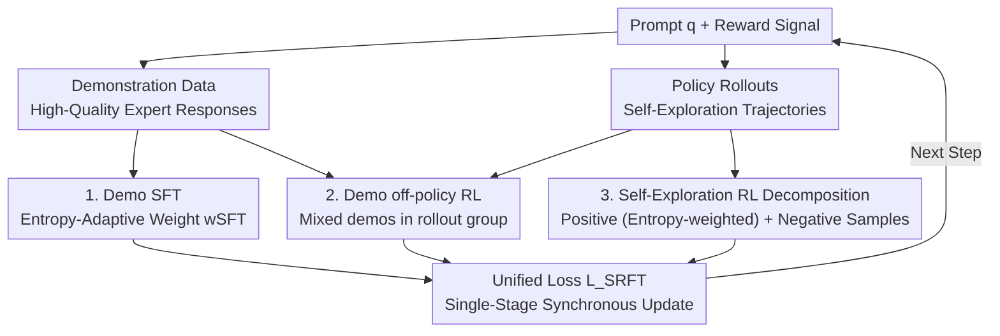

# SRFT: A Single-Stage Method with Supervised and Reinforcement Fine-Tuning for Reasoning

**Conference**: ICLR 2026  
**OpenReview**: [https://openreview.net/forum?id=n6E0r6kQWQ](https://openreview.net/forum?id=n6E0r6kQWQ)  
**Code**: Yes (Link provided in the main text, "The source code is available at here")  
**Area**: Reinforcement Learning / LLM Reasoning  
**Keywords**: SFT+RL Integration, Single-Stage Fine-tuning, Entropy-Adaptive Weighting, GRPO, Mathematical Reasoning

## TL;DR
SRFT uses entropy as a dynamic indicator to simultaneously apply SFT and RL losses to both demonstration data and self-exploration rollouts in a **single stage**. This avoids the "learning tax" of the SFT→RL two-stage paradigm and outperforms the zero-RL baseline by an average of 9.0 points across five mathematical reasoning benchmarks.

## Background & Motivation

**Background**: To enhance the reasoning capabilities of LLMs, the mainstream approach involves two steps: first, base Supervised Fine-Tuning (SFT) using expert demonstrations, followed by policy optimization via Reinforcement Learning (RL, typically GRPO or PPO). Most works treat these as **two independent, sequential stages** (SFT→RL).

**Limitations of Prior Work**: The two-stage paradigm suffers from structural flaws. SFT often causes models to memorize demonstration patterns and overfit to the training set without truly learning to reason. Pure RL has low sample efficiency, struggles with exploration in massive solution spaces, and may suffer from mode collapse by repeatedly generating sub-optimal answers. The authors conducted analysis experiments and found that in the SFT→RL pipeline, the **optimization direction of the second RL stage is often opposite to that of SFT**. RL consumes effort correcting the bias introduced by SFT overfitting, effectively paying a "learning tax." Conversely, RL→SFT is worse; as shown in Table 1, RL→SFT averages only 37.4, significantly lower than standalone SFT (47.3) or RL (49.4).

**Key Challenge**: There is a delicate trade-off between "knowledge distillation" in SFT and "policy exploration" in RL. Insufficient integration allows SFT errors to propagate and limits RL gains, while over-reliance on demonstrations leads to overfitting and suppresses exploration beyond the base policy. The sequential two-stage structure cannot dynamically balance these throughout training.

**Key Insight**: The authors approached the problem through **entropy**, performing three key analyses: (1) Token distribution—SFT acts as a "sledgehammer," performing coarse-grained global reshaping of sequences, while RL acts as a "scalpel," refining only a small subset of tokens. (2) Learning dynamics—Visualizing training trajectories via 3D coordinates of cross-entropy against three reference models confirmed that SFT causes large drifts while RL stays close to the initial policy. (3) Entropy dynamics—Entropy collapses rapidly after RL towards deterministic output, which **weakens the model's "plasticity" for continued learning**. Entropy can serve as the metric to balance both paradigms.

**Core Idea**: Since the friction in the two-stage approach stems from "sequential order," the authors **eliminate the stages and apply both simultaneously**. SFT and RL losses are optimized together in a single step, using the entropy of the current policy to dynamically adjust weights, allowing the model to benefit from demonstrations while maintaining stable exploration.

## Method

### Overall Architecture

SRFT (Supervised and Reinforcement Fine-Tuning) is built upon the GRPO framework. Its core mechanism involves extracting SFT-style and RL-style optimization signals from both "demonstration learning" and "self-exploration," and **synchronously updating the policy using a unified loss in a single stage**. Specifically, for each prompt $q$, the model samples its own rollouts (self-exploration) and retrieves expert trajectories from a demonstration dataset $\mathcal{D}_{\text{demo}}$ (high-quality reasoning responses generated by DeepSeek-R1). The final loss comprises three components: SFT loss on demonstrations, off-policy RL loss on demonstrations, and RL loss on self-exploration rollouts. All three use entropy as a dynamic weighting indicator.

$$\mathcal{L}_{\text{SRFT}}(\theta) = \mathcal{L}_{\text{SFT}}^{\text{demo.}}(\theta) + \mathcal{L}_{\text{RL}}^{\text{demo.}}(\theta) + \mathcal{L}_{\text{RL}}^{\text{self-rollout}}(\theta)$$

### Key Designs

**1. Entropy-adaptive SFT Weighting on Demonstrations: Weakening "Coarse Distillation" when Appropriate**

Demonstration data carries the generation patterns of the expert policy $\pi_\beta$. The most direct utilization is SFT, minimizing the negative log-likelihood $\mathcal{L}_{\text{SFT}}^{\text{demo.}} = \mathbb{E}_{(x,y)\sim\mathcal{D}_{\text{demo.}}}[-\log\pi_\theta(y|x)]$ to approach $\pi_\beta$. However, SFT reshapes sequence probabilities like a "sledgehammer." Without constraints, distribution mismatch between the demonstration policy and the training policy crashes performance. The authors make this adaptive using entropy: the weight is defined as $w_{\text{SFT}} = 0.5\times\text{stop\_grad}(\exp(-H(\pi_\theta)))$, resulting in:

$$\mathcal{L}_{\text{SFT}}^{\text{demo.}}(\theta) = w_{\text{SFT}}\cdot\mathbb{E}_{(x,y)\sim\mathcal{D}_{\text{demo.}}}[-\log\pi_\theta(y|x)].$$

The logic is: when policy entropy is high (uncertainty is high, model is exploring), $\exp(-H)$ is small, automatically reducing the SFT impact to prevent forced imitation during large distribution mismatches. As the policy converges and entropy decreases, SFT becomes stronger. This leaves the decision of "when to listen to the expert" to the real-time entropy. In ablation studies, replacing this with a fixed $w_{\text{SFT}}=0.1$ dropped the average score from 59.5 to 55.1.

**2. Mixing Demonstrations into Rollout Groups for off-policy RL: Raising Group Advantages for Optimistic Exploration**

SFT alone is not granular enough. SRFT borrows the off-policy concept from LUFFY, combining demonstration trajectories with the model's own on-policy rollouts into a **heterogeneous training group** $\mathcal{G}_{\text{aug.}} = \mathcal{G}_{\text{roll.}}\cup\mathcal{G}_{\text{demo.}}$. GRPO's group relative advantage $\hat{A}_k$ is then calculated across the entire group. Since expert responses usually receive higher rewards, including them **raises the baseline for advantage estimation**, providing an optimistic signal that "better answers exist" and pushing the model to explore more aggressively toward the demonstrations. To handle distribution mismatch between $\pi_\beta$ and $\pi_\theta$, this path uses a clipped objective with importance sampling ratios $r_{k,t}(\theta)=\pi_\theta(y_{k,t}|\cdot)/\pi_\beta(y_{k,t}|\cdot)$. Following recent practice, $\pi_\beta$ is set to 1 to bypass token alignment complexity. Removing this path (w/o demoRL) dropped the average score to 55.2.

**3. Decomposition of Self-Exploration RL + Entropy Weighting on Positive Samples: Taming the "Hidden SFT" in on-policy learning**

The authors discovered an interesting structure: under binary rewards $\{1,-1\}$, the standard on-policy RL objective can be **naturally decomposed into two halves**:

$$\mathcal{L}_{\text{RL}}^{\text{self-rollout}} = \underbrace{\mathbb{E}_{y^+}[-\log\pi_\theta(y^+|x)]}_{\text{Positive: Equivalent to SFT}} + \underbrace{\mathbb{E}_{y^-}[\log\pi_\theta(y^-|x)]}_{\text{Negative: Likelihood Minimization}}.$$

The positive sample term is mathematically identical to SFT, except these samples are **generated online** by the current policy rather than an external dataset. The negative term systematically suppresses the probability of incorrect responses. The key insight is that the "coarse" positive term, if left unchecked, causes rapid entropy loss and forces deterministic output, harming exploration. Thus, the authors apply an entropy-adaptive weight $w_{\text{RL}}=0.1\times\text{stop\_grad}(\exp(H(\pi_\theta)))$ to the positive term only—opposite to the $w_{\text{SFT}}$ logic. High entropy encourages learning from positives, while low entropy automatically reduces force to preserve exploration. The negative term remains unchanged:

$$\mathcal{L}_{\text{RL}}^{\text{self-rollout}}(\theta) = w_{\text{RL}}\cdot\mathbb{E}_{y^+}[-\log\pi_\theta(y^+|x)] + \mathbb{E}_{y^-}[\log\pi_\theta(y^-|x)].$$

This design allows self-exploration to benefit from the entropy metric and is the primary reason SRFT maintains stable entropy and avoids typical RL entropy collapse.

### Loss & Training
The three losses (Demo SFT + Demo off-policy RL + Self-exploration RL) are summed to form $\mathcal{L}_{\text{SRFT}}$ for synchronous single-stage optimization. The training set is OpenR1-Math-46k-8192 (DeepSeek-R1 generated, Math-Verify filtered, length ≤ 8192 tokens). The same data acts as prompts for rollouts, ground-truth for rewards, and demonstrations. The base model is Qwen2.5-Math-7B. Each prompt samples 8 rollouts with a max length of 8192, trained for 500 steps. The `stop_grad` in the entropy weights ensures they act as scheduling coefficients without backpropagating gradients themselves.

## Key Experimental Results

### Main Results
On five competition-level mathematical reasoning benchmarks (in-distribution) and three out-of-distribution (OOD) benchmarks, with Qwen2.5-Math-7B as the base:

| Method | Math Reasoning Avg. (ID) | OOD Avg. |
|------|------|------|
| Qwen2.5-Math-7B (base) | 23.5 | 15.4 |
| SFT | 54.3 | 49.2 |
| RL$_{\text{GRPO}}$ | 49.3 | 49.7 |
| SFT→RL | 54.5 | 54.6 |
| SFT+RL (Naive Sync) | 52.3 | 50.9 |
| LUFFY | 55.5 | 57.8 |
| TAPO | 55.7 | 56.4 |
| ReLIFT | 54.0 | 55.9 |
| **SRFT (Ours)** | **59.5** | **62.5** |

SRFT outperforms the strongest zero-RL baseline by +9.0 points on ID and is +4.8 points higher than SFT, +3.4 higher than SFT→RL, and +7.2 higher than naive SFT+RL. On OOD, it outperforms the strongest baseline by +4.7 points. Individual high scores include AIME24 (35.3), AMC (74.3), MATH500 (89.8), Minerva (39.7), and Olympiad (58.3), mostly ranking as best or second-best in the table.

### Ablation Study

| Configuration | Math Reasoning Avg. | Description |
|------|---------|------|
| SRFT (Full) | 59.5 | Three losses + dual entropy weights |
| w/ Fixed $w_{\text{SFT}}=0.1$ | 55.1 | Replaced adaptive SFT weight; dropped 4.4 |
| w/ Fixed $w_{\text{RL}}=1.0$ | 56.2 | Replaced adaptive positive weight; dropped 3.3 |
| w/o demoSFT | 53.9 | Removed demo SFT loss; **largest drop (5.6)** |
| w/o demoRL | 55.2 | Removed demo off-policy RL loss; dropped 4.3 |

### Key Findings
- **Demo SFT loss contributes the most**: Removing it (w/o demoSFT) caused the average score to plummet from 59.5 to 53.9, confirming the central role of "coarse-grained supervision" in single-stage integration.
- **Entropy-adaptive weights significantly beat fixed weights**: Switching weights to constants dropped scores to 55.1/56.2, proving that balancing exploration and exploitation via entropy is a core driver of SRFT's success.
- **SRFT maintains stable entropy and increasing response length**: While RL causes rapid entropy collapse and shorter responses, SRFT maintains stable entropy and gradually increasing response lengths, indicating sustained exploration and the development of more complete reasoning processes.

## Highlights & Insights
- **Quantifying the "two-stage friction" as a "learning tax"**: Visualizing the training trajectory via 3D cross-entropy coordinates showed RL optimizing in the opposite direction of SFT, providing a compelling explanation for why single-stage is superior—it’s a structural issue, not a tuning one.
- **On-policy RL goal decomposition under binary rewards**: Identifying the "hidden SFT" term (maximizing likelihood of self-generated correct answers) allowed authors to unify demonstration supervision and self-exploration under the same "entropy-weighting" logic.
- **Transferability of the "Sledgehammer vs. Scalpel" analogy**: Any training task requiring the fusion of "expert imitation" and "self-improvement" (e.g., agents, alignment, code generation) can adopt this entropy-based dynamic scheduling.

## Limitations & Future Work
- **Binary rewards $\{1,-1\}$**: The decomposition of self-exploration RL relies on a simple binary reward structure. Whether this holds for dense or continuous rewards remains undiscussed.
- **Behavior policy approximation $\pi_\beta=1$**: Setting the expert policy probability to 1 to avoid tokenization complexity is an engineering approximation that might introduce bias in importance sampling ratios for highly mismatched demonstrations.
- **Evaluation concentrated on Math + Qwen2.5-Math-7B**: While OOD benchmarks were included, the base model is singular and the domain is math-specific. Performance on larger models or general reasoning/coding tasks is yet to be verified.
- **Hyperparameters for entropy weights (0.5 and 0.1)**: These scaling constants are manually set and not adaptive themselves, potentially requiring re-tuning for different tasks.

## Related Work & Insights
- **vs LUFFY**: LUFFY mixes stronger model trajectories into on-policy learning; SRFT inherits the "mixed rollout group" approach but adds demo SFT and self-exploration positive sample weighting into a unified entropy-adaptive framework, achieving higher ID/OOD scores (59.5/62.5 vs 55.5/57.8).
- **vs SFT→RL Two-stage**: Sequential RL must correct SFT overfitting (learning tax); SRFT optimizes synchronously in a single stage with a more direct training trajectory and higher efficiency (+3.4 points).
- **vs Naive SFT+RL**: Simple addition $(\mathcal{L}_{\text{SFT}}+\mathcal{L}_{\text{RL}})$ without entropy scheduling scores 52.3 (lower than SFT→RL). SRFT’s gain (+7.2 points) demonstrates that the *method* of integration is more important than the *fact* of integration.
- **vs ReLIFT / TAPO / SASR / CHORD**: These also integrate SFT and RL via interleaved training or adaptive weights. SRFT differentiates itself through systematic entropy-based analysis and the resulting single-stage, entropy-adaptive unified loss.

## Rating
- Novelty: ⭐⭐⭐⭐ Single-stage entropy-adaptive integration and the insight into on-policy RL decomposition are solid, though the "SFT/RL fusion" space is crowded.
- Experimental Thoroughness: ⭐⭐⭐⭐ Covered 8 benchmarks, 11 baselines, weight/loss ablations, and dynamics analysis; base model variety was limited.
- Writing Quality: ⭐⭐⭐⭐⭐ Extremely clear motivational chain from analysis (tax, sledgehammer, entropy) to method.
- Value: ⭐⭐⭐⭐ Provides an actionable entropy-adaptive recipe for fusing SFT and RL, with direct reference value for reasoning training.

<!-- RELATED:START -->

## Related Papers

- [\[ICLR 2026\] Proximal Supervised Fine-Tuning](proximal_supervised_fine-tuning.md)
- [\[ICLR 2026\] On-Policy RL Meets Off-Policy Experts: Harmonizing Supervised Fine-Tuning and Reinforcement Learning via Dynamic Weighting](on-policy_rl_meets_off-policy_experts_harmonizing_supervised_fine-tuning_and_rei.md)
- [\[ICLR 2026\] R1-Code-Interpreter: LLMs Reason with Code via Supervised and Multi-stage Reinforcement Learning](r1-code-interpreter_llms_reason_with_code_via_supervised_and_multi-stage_reinfor.md)
- [\[ICLR 2026\] RewardMap: Tackling Sparse Rewards in Fine-grained Visual Reasoning via Multi-Stage Reinforcement Learning](rewardmap_tackling_sparse_rewards_in_fine-grained_visual_reasoning_via_multi-sta.md)
- [\[ICLR 2026\] Fine-tuning Behavioral Cloning Policies with Preference-Based Reinforcement Learning](fine-tuning_behavioral_cloning_policies_with_preferencebased_reinforcement_learn.md)

<!-- RELATED:END -->
