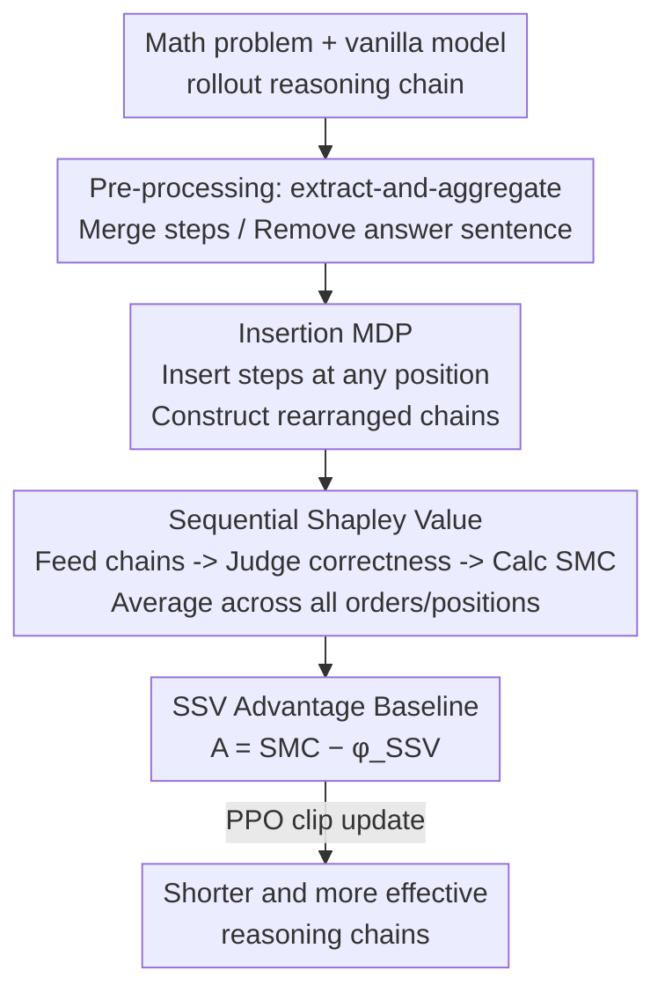

# SSVPO: Toward Effective Step-level Credit Assignment for Language Model RL Training

**Conference**: ICLR 2026  
**OpenReview**: [https://openreview.net/forum?id=g33DGvnHYd](https://openreview.net/forum?id=g33DGvnHYd)  
**Code**: Anonymous repository (to be open-sourced upon acceptance, see Appendix F)  
**Area**: Reinforcement Learning / LLM Reasoning / Credit Assignment  
**Keywords**: Step-level Credit Assignment, Sequential Shapley Value, Insertion MDP, RLVR, Inference Efficiency

## TL;DR
SSVPO draws inspiration from Shapley Values in multi-agent RL (MARL), treating each step in a reasoning chain as an "agent." Through an Insertion MDP, it rearranges steps into various new chains to measure the marginal contribution of each step (Sequential Shapley Value). This value serves as the advantage baseline for PPO-based policy optimization. It provides fair credit assignment for partially correct chains and identifies zero-contribution steps to shorten reasoning chains. On 7 mathematical reasoning benchmarks, SSVPO outperforms RLOO, GRPO, DAPO, VinePPO, and SPO, achieving up to a +11.6% accuracy gain, -18.1% token usage, and 1.6x inference efficiency.

## Background & Motivation

**Background**: Utilizing outcome-based RL for LLM post-training is currently the mainstream approach for enhancing mathematical reasoning, represented by methods like RLOO, GRPO, and DAPO. These methods provide a reward only after the entire reasoning chain is generated and the final answer is correct. This avoids biases from human preference feedback and is effective on structured problems such as algebra, geometry, and number theory.

**Limitations of Prior Work**: A critical issue with outcome-based rewards is low training efficiency—intermediate steps receive no explicit signal, making it impossible for the model to discern which step actually contributed to the answer. Consequently, post-trained models tend to treat all steps as equally important, assigning rewards uniformly. This leads models to **intentionally elongate reasoning chains** to accumulate rewards, generating redundant steps. Longer chains make the model more likely to abandon coherent reasoning in favor of memorizing answers, causing generalization to fail on unseen problems.

**Key Challenge**: Recent credit assignment methods (VinePPO using Monte Carlo returns, SPO using value differences between adjacent steps, GTPO using dynamic entropy weighting) attempt to decompose outcome rewards into intermediate steps. However, they **lack fair estimation for step-level rewards**, especially in "partially correct" chains (e.g., leading steps are correct but subsequent ones are wrong, or vice-versa), where they fail to equitably evaluate the exact value of each step.

**Goal**: Design a credit assignment method with **theoretical guarantees** that faithfully characterizes the marginal contribution of each reasoning step, thereby identifying key steps and improving RL training efficiency.

**Key Insight**: The authors were inspired by the use of Shapley Values for fair credit assignment in multi-agent RL (MARL). They model the reasoning process as a series of agents, where each step in a Chain-of-Thought (CoT) is an agent. However, classical Shapley Values assume participants are interchangeable, whereas reasoning steps exhibit strong **sequential dependence and position sensitivity**. Thus, the Shapley Value must be extended from the "spatial domain" of MARL to the "temporal domain" of reasoning.

**Core Idea**: Propose the Sequential Shapley Value (SSV)—by rearranging reasoning steps into all possible new chains and measuring the average marginal contribution of each step across different orders and positions, a fair credit for each step is obtained. Using SSV as the value baseline for the advantage function drives PPO, achieving both fairness and efficiency.

## Method

### Overall Architecture

SSVPO addresses the problem of "how to fairly decompose the final 0/1 outcome reward into each step of the reasoning chain and use this signal to drive RL." The pipeline consists of a pre-processing stage and three main phases:

First, a vanilla model executes a rollout for a math problem to obtain a long reasoning chain. **Pre-processing** uses extract-and-aggregate to compress the chain—identifying and merging intermediate steps and removing sentences containing the final answer (to prevent direct ground-truth leakage after rearrangement), which reduces the number of steps for subsequent rearrangement and lowers computational overhead. Subsequently: **Stage 1** constructs various rearranged chains from these extracted steps according to an Insertion MDP; **Stage 2** feeds each rearranged chain as a prompt to the LLM, requiring it to provide an answer and determining correctness to obtain a reward. From this, the Sequential Marginal Contribution (SMC) and Sequential Shapley Value (SSV) are calculated; **Stage 3** uses SSV as the step-level value baseline, combined with SMC for fair advantage estimation in PPO-style policy updates, ultimately producing shorter, more effective reasoning chains.

Note: The "rearrangement" in Stage 1 does not rely on the LLM's autoregressive generation but purely uses permutations to construct different "alternative prompts." The Insertion MDP itself does not involve generation; it is a specialized credit assignment model used to estimate marginal contributions.

### Key Designs

**1. Insertion MDP: Measuring single-step marginal contribution by shifting from "terminal appending" to "any-position insertion"**

Standard reasoning MDPs append steps sequentially to the end of the chain, where state transitions are deterministic concatenations and the final reward is given only once. This perspective only cares about "what step was generated at the end" and cannot distinguish the specific contribution of an intermediate step across different chains. The authors propose the **Insertion MDP**: it operates on a set of pre-generated candidate steps. The state $s=(Q, n_{1:t})$ is the current chain (prompt + first $t$ steps), and the action $a=(n,x)$ is inserting candidate step $n$ at any position $x$ in the chain, resulting in a new chain $s'=\text{Ins}(s,n,x):=(Q, n_{1:x-1}, n, n_{x:t})$. The reward function $R(s)\in\{0,1\}$ is 1 if the chain yields the correct answer and 0 otherwise.

With chains before and after insertion, the **Sequential Marginal Contribution (SMC)** of a step is defined as:

$$\text{SMC}_n(s,x) = R(s') - R(s).$$

This represents "how the correctness of the answer changes by adding this step given the current context and insertion position." Crucially, these insertions are **semantics-agnostic**—the rearranged chains are not required to be coherent or human-readable. As long as the model can answer correctly from a rearranged chain, that permutation is treated as revealing an additional reasoning path inherent to the model. This transforms "evaluating single-step contribution" from an indecomposable terminal reward into enumerable and comparable insertion operations.

**2. Sequential Shapley Value: Averaging across all orders and positions for axiomatically fair credit**

A single insertion's SMC is unfair as it depends on both the order of preceding steps and the specific insertion position. SSV averages a step's SMC over **all possible permutations**. Let $\mathcal{S}(N)$ be the set of all step permutations. For a permutation $\sigma$, let $\text{pred}_\sigma(n)$ denote the predecessors of $n$ in $\sigma$, and $s_\sigma:=(Q,\text{pred}_\sigma(n))$. The Sequential Shapley Value for step $n$ is:

$$\phi_{\text{SSV}}(n) = \mathbb{E}_{\sigma\in\mathcal{S}(N)}\,\mathbb{E}_{x\in\{1,\dots,|s_\sigma|+1\}}\big[\text{SMC}_n(s_\sigma, x)\big].$$

This extends the classical Shapley Value from the spatial domain of MARL to the temporal domain of reasoning. While the classical version assumes exchangeable participants, SSV explicitly enumerates permutations to capture sequential dependence and position sensitivity. The authors prove that SSV satisfies four Shapley axioms (Theorem 1): **Sequential Efficiency** (the final reward is exactly distributed among all steps, $\sum_n \phi_{\text{SSV}}(n)=\mathbb{E}_{\sigma,x}[R(s^{\text{full}})-R(s^{\varnothing})]$), **Sequential Symmetry** (steps with identical contributions get identical credit), **Sequential Additivity** (credit for merged independent chains equals the sum of individual credits), and **Sequential Null Step** (steps with zero impact on the final reward receive zero credit). The last axiom is particularly useful for identifying "zero-contribution steps," which can be removed to shorten chains and improve efficiency. Moreover, it allows positive credit for correct steps even in chains that eventually fail.

**3. SSV Advantage Baseline: Unbiased and minimum variance for stable PPO training**

To integrate fairness into RL, SSV serves as a value baseline that reduces variance without introducing bias. The step-level advantage is defined as the single-insertion SMC minus the SSV of that step:

$$A^{\text{SSV}}_t = \text{SMC}_{n_t}(s_t, x_t) - \phi_{\text{SSV}}(n_t).$$

Since $\phi_{\text{SSV}}(n_t)$ depends only on the step itself and not the specific insertion position, it is a valid "control variate." Substituting this into the PPO clipped objective yields the SSVPO training objective:

$$J_{\text{SSVPO}}(\theta) = \mathbb{E}\Big[\min\big\{r_t(\theta)A^{\text{SSV}}_t,\ \text{clip}(r_t(\theta),1-\epsilon,1+\epsilon)A^{\text{SSV}}_t\big\} - \beta\, D_{\text{KL}}(\pi_\theta\,\|\,\pi_{\text{ref}})\Big],$$

where $a_t=(n_t,x_t)$ is the insertion action. Theorem 2 proves two key properties: **Unbiasedness** (the SSV baseline does not change the expected policy gradient) and **Minimum Variance** (among all baselines that depend only on the step and maintain unbiasedness, SSV uniquely minimizes the update variance). This reduces the frequency of PPO clipping and associated bias, leading to more stable convergence and higher sample efficiency.

## Key Experimental Results

### Main Results

Using Qwen3-4B as the backbone, compared against outcome-reward methods (7 math benchmarks, fixed token budget):

| Method | GSM8K Acc | MATH-500 Acc | AMC23 Acc | AIME24 Acc | AIME25 Acc | Avg Acc | Avg Token |
|------|-----------|--------------|-----------|------------|------------|----------|------------|
| Vanilla | 93.6 | 91.2 | 87.5 | 60.0 | 46.6 | 82.1 | 6327 (−0%) |
| RLOO | 94.6 | 92.2 | 94.1 | 63.3 | 55.5 | 84.9 (+2.8) | 5650 (−10.7%) |
| GRPO | 94.6 | 92.4 | 91.6 | 61.1 | 50.0 | 83.4 (+1.3) | 5894 (−6.8%) |
| DAPO | 94.8 | 91.8 | 91.6 | 62.2 | 47.7 | 83.0 (+0.9) | 6828 (+7.9%) |
| **SSVPO** | **95.2** | **95.0** | **95.0** | **66.6** | **61.1** | **86.7 (+4.6)** | **5178 (−18.1%)** |

SSVPO achieved SOTA on 6 out of 7 benchmarks, significantly outperforming competitors on difficult tasks like MATH-500 and AIME. It reduced token usage by 18.1% compared to vanilla.

With DeepSeek-R1-Distill-Qwen-1.5B, compared against credit assignment methods:

| Method | GSM8K Acc | MATH-500 Acc | AMC23 Acc | AIME24 Acc | AIME25 Acc | Avg Acc |
|------|-----------|--------------|-----------|------------|------------|----------|
| Vanilla | 76.1 | 69.0 | 52.2 | 23.3 | 13.3 | 57.1 (+0.0) |
| VinePPO | 85.4 | 81.8 | 67.5 | 23.3 | 20.0 | 63.7 (+6.6) |
| SPO | 88.9 | 82.4 | 77.5 | 26.6 | 20.0 | 66.3 (+9.2) |
| **SSVPO** | **90.2** | **86.4** | **79.6** | **28.8** | **24.4** | **68.7 (+11.6)** |

SSVPO improved average accuracy by 11.6% over vanilla, comprehensively outperforming VinePPO and SPO.

### Ablation Study

Impact of the rearrangement step count (reorder num) hyperparameter (Qwen3-1.7B, Acc / Length):

| Config | GSM8K Acc | MATH-500 Acc | AMC23 Acc | AIME24 Acc | AIME25 Acc | Description |
|------|-----------|--------------|-----------|------------|------------|------|
| 2 Steps | 90.5 | 79.4 | 77.5 | 43.3 | 40.0 | Shallowest depth, shortest generation |
| 3 Steps | 91.3 | 80.0 | 80.0 | 43.3 | 43.3 | Medium |
| 4 Steps | 91.8 | 82.0 | 82.5 | 46.6 | 43.3 | Deepest depth, highest accuracy |

### Key Findings
- **Rearrangement depth is the core trade-off**: Increasing reorder num from 2 to 4 improves accuracy across the board, especially for difficult competition problems (AIME), which require fine-grained credit.
- **Fairness equals Efficiency**: The Sequential Null Step axiom allows the model to identify and remove zero-contribution steps, which is the fundamental mechanism for increasing accuracy while saving tokens.
- **Fair scoring excels on "partially correct" chains**: Case studies show SSVPO's step-level credit aligns closely with human-annotated process rewards, whereas GRPO assigns zero credit to any failing chain.

## Highlights & Insights
- **Temporal extension of Shapley Values**: Extending Shapley fairness from spatial MARL to temporal reasoning by enumerating permutations and insertions is a brilliant conceptual transfer.
- **Efficiency through credit assignment**: Identifying zero-contribution steps naturally leads to shorter chains, unifying "fair scoring" and "length reduction" into a single mechanism without needing external length penalties.
- **Theoretical and empirical synergy**: The method is backed by fairness and variance theorems, and its alignment with process reward ground truth is empirically verified.

## Limitations & Future Work
- **Combinatorial computational cost**: SSV requires averaging over all permutations, which is computationally expensive. This necessitates step compression (extract-and-aggregate) and limits reorder counts.
- **Binary reward signal**: The 0/1 outcome reward is coarse. SMC might be 0 for many insertions, making it insensitive to "nearly correct" steps.
- **Domain limitation**: Experiments are restricted to mathematical reasoning. Applicability to open-ended tasks without verifiable binary rewards remains unknown.

## Related Work & Insights
- **vs. Outcome-reward methods (RLOO/GRPO)**: These treat all steps equally, leading models to elongate chains. SSVPO provides fair step-level credit and shortens chains.
- **vs. VinePPO/SPO**: VinePPO uses Monte Carlo sampling, and SPO uses adjacent value differences. SSVPO uses permutation-averaged marginal contributions, which is axiomatically fairer and more stable.

## Rating
- Novelty: ⭐⭐⭐⭐⭐ Extending Shapley Values to the time domain through Insertion MDP is a clean and theoretically grounded innovation.
- Experimental Thoroughness: ⭐⭐⭐⭐ Extensive benchmarks and baselines, though lacking non-math tasks.
- Writing Quality: ⭐⭐⭐⭐ Clear logic across motivation, theory, and results.
- Value: ⭐⭐⭐⭐⭐ Provides a theoretically guaranteed step-level credit assignment paradigm that intrinsically improves efficiency.

<!-- RELATED:START -->

## Related Papers

- [\[ICLR 2026\] RL Grokking Recipe: How Does RL Unlock and Transfer New Algorithms in LLMs?](rl_grokking_recipe_how_does_rl_unlock_and_transfer_new_algorithms_in_llms.md)
- [\[ICLR 2026\] Webscale-RL: Automated Data Pipeline for Scaling RL Data to Pretraining Levels](webscale-rl_automated_data_pipeline_for_scaling_rl_data_to_pretraining_levels.md)
- [\[ICLR 2026\] RL Squeezes, SFT Expands: A Comparative Study of Reasoning LLMs](rl_squeezes_sft_expands_a_comparative_study_of_reasoning_llms.md)
- [\[ICLR 2026\] RL for Reasoning by Adaptively Revealing Rationales](rl_for_reasoning_by_adaptively_revealing_rationales.md)
- [\[ICLR 2026\] From f(x) and g(x) to f(g(x)): LLMs Learn New Skills in RL by Composing Old Ones](from_fx_and_gx_to_fgx_llms_learn_new_skills_in_rl_by_composing_old_ones.md)

<!-- RELATED:END -->
