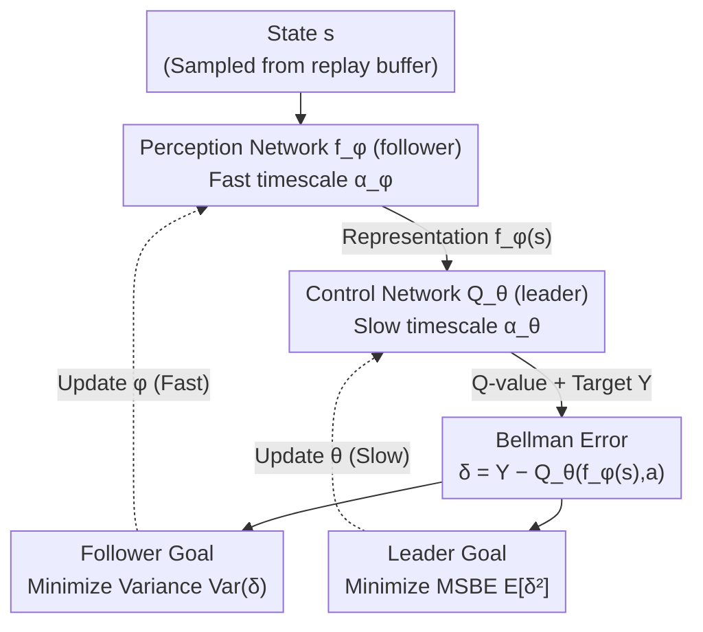

# Stackelberg Coupling of Online Representation Learning and Reinforcement Learning

**Conference**: ICLR 2026  
**arXiv**: [2508.07452](https://arxiv.org/abs/2508.07452)  
**Code**: [https://github.com/fernando-ml/SCORER](https://github.com/fernando-ml/SCORER)  
**Area**: Reinforcement Learning / Representation Learning  
**Keywords**: Stackelberg Game, Representation Learning, Deep Q-Learning, Two-Time-Scale, Variance Minimization

## TL;DR

The SCORER framework is proposed to model representation learning and value function learning in Deep Q-Learning as a Stackelberg game. Through two-time-scale updates (slow update for the Q-network as the leader and fast update for the encoder as the follower), it achieves stable co-adaptation and enhances performance without altering the network architecture.

## Background & Motivation

- **Deadly Triad Problem**: The combination of function approximation, bootstrapping, and off-policy learning in Deep Q-Learning leads to instability, potentially causing representation collapse and catastrophic learning failure.
- **Limitations of Monolithic Networks**: Traditional methods learn representations and value functions simultaneously within a single network. This forces the representation to constantly adapt to non-stationary value targets, while value estimation depends on changing representations, creating a vicious cycle.
- **Auxiliary Loss Conflicts**: Introducing extra auxiliary losses (e.g., self-supervised objectives) to stabilize representations may cause gradient conflicts with the primary value learning objective.
- **Core Idea**: Instead of simply adding auxiliary losses, the optimization problem is fundamentally restructured by modeling it as a hierarchical Stackelberg game.

## Method

### Overall Architecture

SCORER aims to resolve the vicious cycle where representation and value functions hinder each other: the representation tracks non-stationary value targets, while value estimation relies on ever-changing representations. It decomposes the agent from a single network into two players with a leader-follower relationship—the control network $Q_\theta$ acts as the leader (responsible for value estimation, moving on a slow time scale to provide stable targets), and the perception network $f_\phi$ acts as the follower (responsible for representation learning, moving on a fast time scale to learn an optimal response to the current leader). At each step, samples are drawn from the replay buffer, the perception network encodes representations, and the control network calculates Q-values and Bellman errors. Both players optimize different statistics of this error, and their updates are organized into an approximate Stackelberg equilibrium using the ratio of fast and slow learning rates. The method maintains the existing network architecture and only rearranges the optimization scheme.

### Key Designs

**1. Leader Goal: Minimizing MSBE given Optimal Representation**

To address the dependency of value estimation on changing representations, the leader focuses solely on value accuracy. It assumes the follower has provided the optimal representation $f_{\phi^*(\theta)}$ and minimizes the Mean Squared Bellman Error (MSBE) accordingly:

$$\min_\theta \mathcal{L}_{\text{leader}}(Q_\theta, f_{\phi^*(\theta)}) \triangleq \mathbb{E}_{(s,a,r,s') \sim \mathcal{B}} \left[(Y - Q_\theta(f_{\phi^*(\theta)}(s), a))^2\right]$$

This matches the standard Q-learning goal, but the representation no longer drifts passively with the value target; instead, it comes from an independent player providing an optimal response, decoupling the tracking issue.

**2. Follower Goal: Minimizing Bellman Error Variance instead of MSBE**

To address the representation tracking issue, the follower does not directly minimize the mean Bellman error. Instead, it minimizes the variance within a batch:

$$\phi^*(\theta) \in \arg\min_\phi \mathcal{L}_{\text{follower}}(f_\phi, Q_\theta) \triangleq \text{Var}_{j \in B}[\delta_j(\phi, \theta)]$$

Where $\delta_j(\phi, \theta) = Y_j - Q_\theta(f_\phi(s_j), a_j)$. This is a core counter-intuitive step: minimizing variance forces the representation to produce consistent Bellman errors across different samples, making it robust against bootstrapped noise targets. This directly tackles the root of the Deadly Triad without causing the gradient conflicts associated with shared MSBE minimization.

**3. Two-Time-Scale Approximation for Stackelberg Equilibrium**

The targets form a bilevel optimization problem where the leader is outer and the follower's optimal response is the inner constraint:

$$\min_\theta \mathcal{L}_{\text{leader}}(Q_\theta, f_{\phi^*(\theta)}) \quad \text{s.t.} \quad \phi^*(\theta) \in \arg\min_\phi \mathcal{L}_{\text{follower}}(f_\phi, Q_\theta)$$

Since computing exact inner responses is expensive, SCORER uses two-time-scale gradient descent: the follower uses a larger learning rate $\alpha_{\phi,k}$ (fast scale) and the leader uses a smaller learning rate $\alpha_{\theta,k}$ (slow scale), such that $\lim_{k \to \infty} \alpha_{\theta,k} / \alpha_{\phi,k} = 0$. In the leader's slow window, the follower sees a quasi-static $Q_\theta$ and converges to an optimal response. Updates use stop-gradients (denoted as $\bar{\theta_k}$, $\bar{\phi_{k+1}}$) to cut cross-player gradient flows:

$$\phi_{k+1} \leftarrow \phi_k - \alpha_{\phi,k} \nabla_\phi \mathcal{L}_{\text{follower}}(\phi_k; B_{\text{follower}}, Y, \bar{\theta_k})$$

$$\theta_{k+1} \leftarrow \theta_k - \alpha_{\theta,k} \nabla_\theta \mathcal{L}_{\text{leader}}(\theta_k; B_{\text{leader}}, Y, \bar{\phi_{k+1}})$$

**4. Plug-and-Play: Learning Rate Modification without Structural Changes**

This game-theoretic restructuring is implemented simply by splitting existing networks into perception/control segments and assigning different decaying learning rates. SCORER can be integrated into DQN, DDQN, Dueling DQN, R2D2, PQN, etc., with negligible computational overhead (measured at 0.99–1.01x speed).

## Key Experimental Results

### Main Results: MinAtar Environment (Final IQM Return, 30 seeds)

| Algorithm | Method | Asterix | Breakout | Freeway | SpaceInvaders | Speed |
|-----------|--------|---------|----------|---------|---------------|-------|
| DQN | Baseline | 54.95 | 19.16 | 62.70 | 127.78 | 1.00x |
| DQN | **SCORER** | **54.78** | **65.69** | **63.03** | **148.71** | 0.99x |
| DDQN | Baseline | 50.77 | 36.47 | 62.22 | 116.72 | 1.00x |
| DDQN | **SCORER** | **52.59** | **64.44** | **62.68** | **146.67** | 1.00x |
| DuelingDQN| Baseline | 39.22 | 27.81 | 61.89 | 121.21 | 1.00x |
| DuelingDQN| **SCORER** | **52.28** | **60.04** | **62.27** | **139.08** | 1.01x |

### Key Findings

- DQN+SCORER improved the final score on Breakout by **over 3x** (19.16 → 65.69).
- SCORER makes legacy replay-buffer methods competitive with advanced methods like PQN.
- Computational overhead is near-zero (0.99-1.01x).

### Ablation Study

| Follower Goal | Performance |
|---------------|-------------|
| Bellman Error Variance | **Optimal** |
| MSBE | Suboptimal |
| No follower | Baseline |

- Variance minimization consistently outperforms direct MSBE minimization.
- Independent batch sampling for the follower yields better results.

## Highlights & Insights

1.  **Novel Game-Theoretic Perspective**: First to model representation-control interaction in value-based RL as a Stackelberg game.
2.  **Minimalist Implementation**: Only requires learning rate schedule modifications without changing architectures.
3.  **Broad Applicability**: Effective across DQN, DDQN, Dueling DQN, R2D2, and PQN.
4.  **Theoretical Foundation**: Two-time-scale convergence theory guarantees convergence to first-order stationary points.

## Limitations & Future Work

- Requires tuning of decay parameters for two different learning rates.
- Theoretical analysis relies on first-order approximations, omitting implicit gradient effects.
- Primarily validated in discrete action spaces; effectiveness in continuous action spaces remains unexplored.

## Related Work & Insights

- **Representation Learning in RL**: Auxiliary tasks (SPR, CURL), contrastive learning, self-supervised methods.
- **Two-Time-Scale Optimization**: TTSA theory (Borkar 1997, Hong et al. 2023).
- **Value Decomposition**: Architectural separation like Dueling DQN, but lacking game-theoretic coupling.

## Rating

- **Novelty**: ⭐⭐⭐⭐ — Introduces Stackelberg games to representation-value co-learning.
- **Technical Depth**: ⭐⭐⭐⭐ — Formal bilevel optimization framework and convergence analysis.
- **Experimental Thoroughness**: ⭐⭐⭐⭐ — Covers multiple algorithms and environments with complete ablations.
- **Value**: ⭐⭐⭐⭐⭐ — Simple to implement, plug-and-play, with zero additional computational cost.

<!-- RELATED:START -->

## Related Papers

- [\[ICLR 2026\] 3D-aware Disentangled Representation for Compositional Reinforcement Learning](3d-aware_disentangled_representation_for_compositional_reinforcement_learning.md)
- [\[ICML 2026\] Learning in Structured Stackelberg Games](../../ICML2026/reinforcement_learning/learning_in_structured_stackelberg_games.md)
- [\[ICLR 2026\] Learning to Play Multi-Follower Bayesian Stackelberg Games](learning_to_play_multi-follower_bayesian_stackelberg_games.md)
- [\[ICLR 2026\] Nearly-Optimal Bandit Learning in Stackelberg Games with Side Information](nearly-optimal_bandit_learning_in_stackelberg_games_with_side_information.md)
- [\[ICLR 2026\] What Matters for Batch Online Reinforcement Learning in Robotics?](what_matters_for_batch_online_reinforcement_learning_in_robotics.md)

<!-- RELATED:END -->
