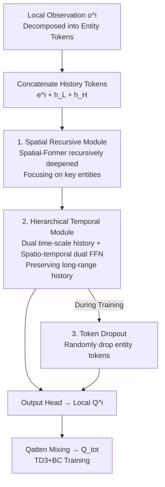

# STAIRS-Former: Spatio-Temporal Attention with Interleaved Recursive Structure Transformer for Offline Multi-Task Multi-Agent Reinforcement Learning

**Conference**: ICLR 2026  
**OpenReview**: [https://openreview.net/forum?id=Biz1vpQeLI](https://openreview.net/forum?id=Biz1vpQeLI)  
**Code**: [https://github.com/Jiwonjeon9603/Stairs-Former](https://github.com/Jiwonjeon9603/Stairs-Former)  
**Area**: Reinforcement Learning  
**Keywords**: Offline Multi-Agent RL, Multi-Task Generalization, Transformer, Spatiotemporal Attention, Partial Observability

## TL;DR
Addressing the issue in offline multi-task multi-agent reinforcement learning (MT-MARL) where existing Transformers underutilize attention and fail to exploit historical information, STAIRS-Former reconstructs the architecture with a "recursive spatial Transformer + dual-time scale history module + token dropout." This refocuses attention on key entities and historical tokens, increasing the average win rate on benchmarks like SMAC / SMAC-v2 from 57.2% (HiSSD) to 67.4%, setting a new SOTA.

## Background & Motivation
**Background**: Offline MARL aims to learn collaborative policies from fixed datasets that generalize across multiple tasks and varying numbers of agents. To handle the challenge of "different agent counts across tasks," mainstream methods (e.g., ODIS, HiSSD) adopt the UPDeT approach: decomposing each agent's observation $o^i$ into semantic entities ("self / other agents / environment"), linearly tokenizing them, appending a history token, and feeding them into a Transformer to output local Q-values. Since Transformer parameters are independent of the number of tokens, previously learned parameters can be reused when agent counts change, naturally supporting variable-length inputs.

**Limitations of Prior Work**: The authors analyzed the attention maps of the SOTA method HiSSD on SMAC Marine-Easy and identified two critical flaws. First, both ODIS and HiSSD use only a **single-layer (depth 1)** UPDeT; this single layer lacks sufficient expressiveness, resulting in attention being **uniformly distributed** across all tokens (see Fig. 2 in the paper), failing to capture key entities in both seen (3m) and unseen (4m) tasks. Second, the handling of history tokens in UPDeT is essentially a simple RNN: $e^i_{hs,t+1} = W_{down}\sigma(W_{up}(A_t e^i_{hs,t} + B_t o^i_t))$. This linear combination fails to preserve long-term history crucial in partially observable environments, leading to these "information-poor" history tokens being largely ignored by other positions.

**Key Challenge**: Previous works treated the Transformer merely as a tool to handle "observation dimensions that vary with tasks," failing to leverage its inherent ability to model sequence history and complex token relationships. Consequently, spatial entity correlations are missed and temporal long-range history is lost—both of which are wasted.

**Goal**: While maintaining the variable-length scalability of UPDeT, the objective is to develop an architecture capable of (a) performing richer relational reasoning between entities, (b) effectively utilizing long-range history, and (c) robustly generalizing to unseen agent configurations.

**Core Idea**: The Transformer is enhanced with both a **spatial hierarchy** (a recursively deepened Spatial-Former focusing on key entities) and a **temporal hierarchy** (dual-update frequency history states + spatio-temporal decoupled FFNs to preserve long-range history). Additionally, **token dropout** is used during training to simulate variable-length entity sets and improve generalization.

## Method

### Overall Architecture
The input to STAIRS-Former is the entity-level local observation sequence of each agent $i$, and the output is the local Q-value, which is aggregated into a global $Q_{tot}$ via a Qatten mixing network for TD learning. The pipeline consists of two trainable networks: a spatial Transformer $f(\cdot;\theta_S)$ (Spatial-Former) and a GRU $g(\cdot;\psi)$. The process involves: decomposing observations into entity tokens, concatenating them with two history tokens of different update frequencies, and feeding them into the Spatial-Former for recursive deep relational reasoning. Inside the Spatial-Former, each attention block is followed by two independent FFNs to refine entity tokens and history tokens separately. The output history positions are read to update low-frequency/high-frequency history states. Finally, the spatial representation passes through an output head to obtain Q-values for each action, aggregated by Qatten. During training, token dropout is applied to randomly discard entity tokens, and the model is optimized using a TD3+BC style objective.

### Key Designs

**1. Spatial Recursive Module: Redirecting Uniform Attention to Key Entities via Recursive Deepening**

This design directly addresses the "uniform attention" issue in single-layer UPDeT. STAIRS-Former replaces the shallow Transformer with a **recursively deep Transformer**. The Spatial-Former consists of $M$ different layers, and the weights $\theta_l$ of each layer $l$ are **shared and applied repeatedly** $\nu_l$ times (nominally $\nu_l=1$) to deepen relational reasoning without inflating parameter counts. The initial input is the sequence of entity embeddings concatenated with history tokens $z^0 = [e^i, h_L, h_H]$. At layer $l$, the recursive state is initialized as $z^l_0 = 0$ and then updated recursively by combining the final state of the previous layer $z^{l-1}$:

$$z^l_{j+1} = f\!\left(z^l_j + z^{l-1};\, \theta_l\right),\quad j=0,\dots,\nu_l-1.$$

The final state of each layer $z^l := z^l_{\nu_l}$ is passed to the next. After all $M$ layers, the spatial representation $z_{sp}=z^M$ is obtained, and the output head computes $Q(o^i,\cdot)=f_O(z_{sp};\theta_O)$. This "weight sharing + residual recursion" allows the model to achieve deeper relational reasoning at a controlled parameter cost, enabling attention to select truly important entities among allies, enemies, and the environment. Fig. 4 in the paper shows that after this replacement, attention shifts significantly from uniform to focusing on key entities and history tokens.

**2. Hierarchical Temporal Module: Dual-Time Scale History and Spatio-Temporal Decoupled FFNs**

Under partial observability, each agent sees only local $o^i_t$ rather than the global state $s_t$, and the simple RNN in UPDeT cannot retain long-range information. This design maintains **two history states with different update frequencies** for each agent: a low-level history $h^{i,L}_t$ updated **every step**, and a high-level history $h^{i,H}_t$ updated by a GRU only **every $T_H$ steps**:

$$h^{i,L}_t = z_{sp}[-2,:],\qquad h^{i,H}_t = \begin{cases} g(h^{i,H}_{t-1}, h^{i,L}_t;\psi), & t \equiv 0 \pmod{T_H},\\ h^{i,H}_{t-1}, & \text{otherwise.}\end{cases}$$

Both are initialized to zero. The low-level history ensures rapid response to immediate changes, while the high-level history provides long-range summaries. Thus, at time $t$, the Transformer input is a set of tokens $\{e^i_t, h^{i,L}_{t-1}, h^{i,H}_{t-1}\}$ with length $K_a+K_e+3$. Additionally, this design introduces a **spatio-temporal decoupled dual FFN** (Temporal Focus Layer, TFL). If a single shared FFN is used after the attention block, the "relational content of entity tokens" and the "temporal evolution of history tokens" get mixed. Following the perspective that two-layer FFNs perform key matching and value reconstruction, the authors attach two non-shared position-wise FFNs to each attention block: $\tilde{x}^l_{j,obs}=\text{FFN}_{obs}(x^l_{j,obs})$ and $\tilde{x}^l_{j,his}=\text{FFN}_{his}(x^l_{j,his})$, which are then concatenated back into $z^l_j$. This allows spatial reasoning and temporal abstraction to be refined along separate paths, specializing without interference. Dormant neuron analysis confirms that TFL significantly reduces the proportion of "dormant neurons" for observation tokens.

**3. Token Dropout: Simulating Variable-Length Configurations During Training**

The number of entities $K$ in unseen tasks changes with the number of agents and enemies. Although Transformers accept variable-length inputs, having only seen the entity counts in $C_{train}$ during training can lead to performance degradation on new configurations. Token dropout randomly discards entity embeddings in $e^i=(e^i_{own}, e^i_{oa,1:K_a}, e^i_{en,1:K_e})$ with probability $p_{drop}$ during training. However, **three types of tokens are protected**: (1) the self-entity $e^i_{own}$ (core for stable learning); (2) the two history tokens $h^{i,L}$ and $h^{i,H}$; and (3) when action heads are bound to per-entity outputs like in UPDeT, the entity token associated with the dataset action (respecting offline regularization). By continuously exposing the model to variable-length token sets during training, robustness to unseen entity configurations is improved and overfitting to $C_{train}$ is suppressed. Ablations show this significantly contributes to generalization on unseen tasks.

### Loss & Training
Training utilizes a **TD3+BC style** objective adapted for discrete action spaces, combining TD learning with behavior cloning (BC) regularization. Each agent outputs $Q^i_t=Q(o^i_{0:t},a^i_{0:t};\theta)$, which is aggregated via the Qatten mixing network into a global $Q_{tot}(\tau_t,s_t,a_t;\theta,\phi)$. The TD target is $y_t = r_t + \gamma \max_{a'} Q_{tot}(\tau_{t+1},s_{t+1},a';\bar\theta,\bar\phi)$, and the total loss is:

$$L_{STAIRS}(\theta,\phi) = \mathbb{E}\Big[\underbrace{(Q_{tot}(\tau_t,s_t,a_t;\theta)-y_t)^2}_{\text{TD loss}} - \frac{\lambda}{N}\sum_{i=1}^{N}\underbrace{Q(o^i_{0:t},a^i_{0:t};\theta)}_{\text{BC loss}}\Big],$$

The first term fits the TD target, while the second encourages higher Q-values for actions in the dataset, with $\lambda$ controlling regularization strength. Token dropout is applied during training, and target networks are updated at fixed intervals.

## Key Experimental Results

### Main Results
Evaluated on SMAC (Marine-Easy / Marine-Hard / Stalker-Zealot) and SMAC-v2 for offline MT-MARL. Each task set is divided into seen (training) and unseen (testing) tasks, each with four data quality levels: Expert / Medium / Medium-Expert / Medium-Replay. Results are averaged over 5 random seeds. The table below shows the average win rate (%) across data qualities:

| Scenario | UPDeT-m | ODIS | HiSSD | STAIRS (Ours) |
| :--- | :--- | :--- | :--- | :--- |
| Seen · Marine-Hard | 21.2 | 47.9 | 64.6 | **79.0** |
| Seen · Marine-Easy | 44.3 | 59.3 | 83.9 | **91.2** |
| Seen · Stalker-Zealot | 20.3 | 34.8 | 45.9 | **63.4** |
| Seen · Mean | 28.6 | 47.3 | 64.8 | **77.9** |
| Unseen · Mean | 21.6 | 32.3 | 54.7 | **64.0** |
| **Total Mean** | 23.5 | 37.0 | 57.2 | **67.4** |

Compared to the previous SOTA HiSSD, STAIRS-Former achieves average improvements of 39.5%, 36.6%, and 40.5% on sub-optimal datasets (Medium / Medium-Expert / Medium-Replay) for Marine-Hard and Stalker-Zealot respectively. On Stalker-Zealot, which requires complex interactions between heterogeneous units, it outperforms HiSSD by 48.6%. It also maintains a lead in SMAC-v2 (higher stochasticity):

| SMAC-v2 | UPDeT-m | ODIS | HiSSD | STAIRS (Ours) |
| :--- | :--- | :--- | :--- | :--- |
| Seen · Mean | 9.1 | 12.7 | 25.1 | **31.0** |
| Unseen · Mean | 6.7 | 10.9 | 24.1 | **30.0** |
| Total Mean | 7.4 | 11.5 | 24.4 | **30.3** |

### Ablation Study
Removing components individually ("ST" = Spatial + Temporal, "STD" = ST + Dropout), showing average win rate (%):

| Configuration | Seen · Mean | Unseen · Mean | Total Mean | Description |
| :--- | :--- | :--- | :--- | :--- |
| STAIRS (Full) | **77.9** | **64.0** | **67.4** | Complete model |
| w/o Temporal | 76.2 | 60.6 | 64.6 | Removed temporal module |
| w/o Spatial | 72.4 | 60.2 | 63.1 | Removed spatial module; largest drop in seen tasks |
| w/o Dropout | 76.0 | 61.8 | 65.4 | Removed token dropout |
| w/o ST | 69.0 | 58.7 | 61.4 | Removed both spatial and temporal |
| w/o STD | 69.6 | 53.2 | 57.3 | Removed all three components |

### Key Findings
- **Spatial module dominates seen tasks**: Removing the spatial recursive module resulted in the largest drop in the seen mean (from 77.9% to 72.4%), indicating that rich entity correlations are key to capturing structured interactions in known environments. Dropout and temporal abstraction contributed less individually on seen tasks.
- **Unseen tasks require synergy**: On unseen tasks, all three components are necessary. Only with the full suite is the optimal generalization of 64.0% achieved—dropout mitigates overfitting, the temporal hierarchy preserves long-range history, and the spatial hierarchy helps identify key tokens in new configurations.
- **Dormant neuron analysis confirms mechanism**: Both spatial and temporal modules reduced the proportion of "dormant neurons," with the temporal module having a stronger effect. Specifically, the Temporal Focus Layer (dual FFN) significantly reduced dormant neurons in observation tokens driving Q-value estimation, which is central to the performance gain.
- **Attention interpretability**: Observation of attention in the 3m scenario over time shows that STAIRS-Former adaptively switches between "ally stability → encountering enemy/switching to enemy tokens → protecting low-health teammates → using history tokens to decide on retreat/counter-attack." It learns high-level tactics like focus fire and kiting, whereas basic Transformer attention remains nearly uniform.

## Highlights & Insights
- **"Recursive Deepening + Weight Sharing" is a cost-effective way to deepen models**: Using repeated application of the same parameters $\nu_l$ times for deeper relational reasoning fixes the uniform attention of single-layer Transformers without exploding parameter counts. This trick is transferable to any budget-constrained Transformer policy network.
- **Dual-time scale history is a direct response to partial observability**: The low-frequency and high-frequency history tracks handle "immediate response" and "long-range summary" separately, fitting POMDP requirements better than the simple RNN in UPDeT. This "fast and slow clocks" idea is highly versatile in sequential decision-making.
- **Using dormant neurons to validate components is clever**: Instead of just reporting win rate drops, the authors used dormant neuron ratios to explain *why* TFL is effective, linking performance differences to "model capacity utilization"—a great example of combining interpretability with ablation studies.

## Limitations & Future Work
- Evaluation is concentrated on the SMAC family (StarCraft micro-management) and MPE/MaMuJoCo, where unit types are similar and only numbers vary. Transfer to truly heterogeneous tasks (different dynamics/reward semantics) remains to be verified.
- On the most difficult unseen tasks with the highest agent counts (e.g., 13m15m, 10m12m), all methods have win rates near 0. STAIRS also fails to break through, indicating that extrapolation to agent counts far exceeding training scales is still an open challenge.
- New hyperparameters like recursion count $\nu_l$, high-level update period $T_H$, and dropout probability $p_{drop}$ are introduced. Sensitivity analysis for these is not fully detailed in the main text, implying a tuning cost for deployment.
- The method follows the offline paradigm of value decomposition + Qatten. Integration with online fine-tuning (e.g., HyGen) has not been explored and serves as a future direction for improving generalization.

## Related Work & Insights
- **vs UPDeT / ODIS / HiSSD**: All three use UPDeT-style single-layer Transformers, treating the Transformer only as a container for variable-length observations. This results in uniform attention and history tokens degenerating into simple RNNs. STAIRS-Former distinguishes itself by leveraging Transformer's modeling of token relations and sequences—recursive spatial reasoning and dual-time scale history—leading to comprehensive improvements, notably outperforming HiSSD by 48.6% on heterogeneous Stalker-Zealot.
- **vs Single-Task Offline MARL (CFCQL / OMAR / OMIGA / B3C / MA-ICQ)**: These methods focus on offline training stability (conservative estimation, regularization, BC + critic clipping) but are limited to single tasks and do not address multi-task generalization or varying agent counts. This paper focuses on the orthogonal line of "cross-task, variable agent count generalization."
- **vs Representation/Skill Transfer (M3 / DT2GS / Multi-Task Shared Layers)**: These emphasize decoupling agent-invariant/specific representations or decomposing sub-tasks for transfer. However, they do not address "how to attend to historical context and changing agent interactions," which is critical for robust policies in POMDPs—the focus of STAIRS-Former.

## Rating
- Novelty: ⭐⭐⭐⭐ Systematically embedding spatial recursion + dual-time history + token dropout into MT-MARL Transformers to solve the "underutilized attention" problem is a solid structural innovation.
- Experimental Thoroughness: ⭐⭐⭐⭐⭐ Covers SMAC/SMAC-v2 multi-task sets × 4 data qualities × 5 seeds. Main results, ablations, attention visualization, and dormant neuron analysis are comprehensive.
- Writing Quality: ⭐⭐⭐⭐ Motivation driven by attention map diagnosis is logical and clear. Formulas correspond well with components, though some notation (e.g., reading $z_{sp}[-2,:]$) requires cross-referencing with diagrams.
- Value: ⭐⭐⭐⭐ Sets a new SOTA for offline MT-MARL and is open-sourced. The recursive deepening and dual-clock history ideas are valuable for budget-constrained Transformer policy networks.

<!-- RELATED:START -->

## Related Papers

- [\[CVPR 2026\] TaskForce: Cooperative Multi-agent Reinforcement Learning for Multi-task Optimization](../../CVPR2026/reinforcement_learning/taskforce_cooperative_multi-agent_reinforcement_learning_for_multi-task_optimiza.md)
- [\[ICLR 2026\] LadderSym: A Multimodal Interleaved Transformer for Music Practice Error Detection](laddersym_a_multimodal_interleaved_transformer_for_music_practice_error_detectio.md)
- [\[ICLR 2026\] Continuous-Time Value Iteration for Multi-Agent Reinforcement Learning](continuous-time_value_iteration_for_multi-agent_reinforcement_learning.md)
- [\[CVPR 2026\] MangoBench: A Benchmark for Multi-Agent Goal-Conditioned Offline Reinforcement Learning](../../CVPR2026/reinforcement_learning/mangobench_a_benchmark_for_multi-agent_goal-conditioned_offline_reinforcement_le.md)
- [\[ICLR 2026\] MAGE: Multi-scale Autoregressive Generation for Offline Reinforcement Learning](mage_multi-scale_autoregressive_generation_for_offline_reinforcement_learning.md)

<!-- RELATED:END -->
