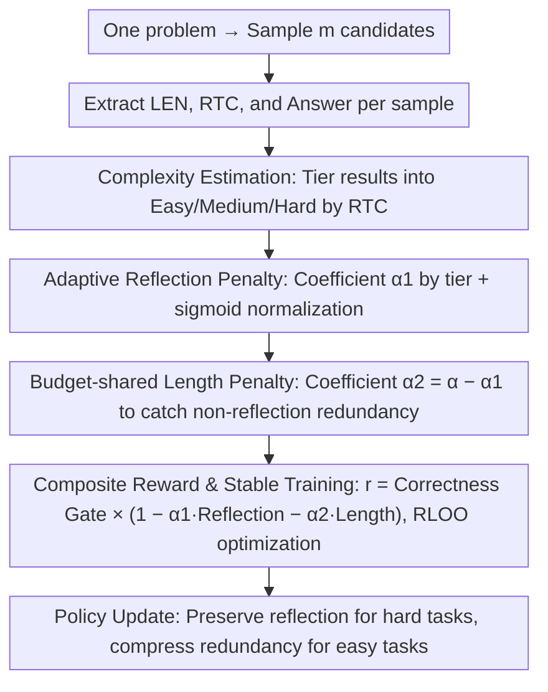

# Stop Unnecessary Reflection: Training LRMs for Efficient Reasoning with Adaptive Reflection and Length Coordinated Penalty

**Conference**: ICLR 2026  
**arXiv**: [2602.12113](https://arxiv.org/abs/2602.12113)  
**Code**: [https://github.com/ZeweiYu1/ARLCP](https://github.com/ZeweiYu1/ARLCP)  
**Area**: Reinforcement Learning  
**Keywords**: Large Reasoning Models, Excessive Reflection, Adaptive Penalty, Efficient Reasoning, RLVR

## TL;DR

Proposes ARLCP (Adaptive Reflection and Length Coordinated Penalty), an adaptive reinforcement learning method that dynamically adjusts the weights of reflection and length penalties based on problem complexity. It significantly reduces inference token consumption while maintaining or improving accuracy.

## Background & Motivation

- **Over-reasoning Issue**: Large Reasoning Models (LRMs) like DeepSeek-R1 generate extensive redundant reflections in the Chain-of-Thought (e.g., repeated "wait", "hmm"), leading to high token consumption and computational overhead without improving accuracy.
- **Key Observations**:
  1. **Reflection Correlates with Complexity**: Harder problems result in more reflection tokens.
  2. **Over-reflection Leads to Errors**: The average reflection tokens in incorrect answers are significantly higher than in correct ones.
  3. **Accuracy Declines with Increased Reflection**: Beyond a certain threshold, more reflection actually reduces the accuracy rate.
- **Limitations of Prior Work**:
    - Inference-stage methods (e.g., Early Exit) do not change model capabilities, offering limited efficiency gains.
    - Training-stage methods (e.g., uniform length penalty) often sacrifice reasoning quality.
    - Lack of mechanisms to dynamically adjust based on problem complexity.

## Method

### Overall Architecture

ARLCP (Adaptive Reflection and Length Coordinated Penalty) formulates "reducing reflection" as reward shaping within reinforcement learning. For each problem, it samples multiple candidate answers, counts the reflection tokens to estimate "how difficult this problem is for the current model," and then superimposes a **fixed-budget** penalty term on the 0/1 correctness reward. This budget is dynamically allocated between "reflection penalty" and "length penalty" based on difficulty—allowing more reflection for hard problems while strictly compressing redundancy for easy ones. Finally, it optimizes the policy using RLOO to reduce tokens while preserving accuracy.

### Key Designs

**1. Complexity Estimation: Using the Model's Own Reflection Count as a Meter**

To avoid the cost of training an external difficulty evaluator that might not align with the model, ARLCP counts the reflection tokens (RTC, identified by keywords like "wait", "hmm", "alternatively") within a response. It classifies problems into three tiers based on two thresholds: $\text{RTC}\le n_1$ (Easy), $n_1<\text{RTC}\le n_2$ (Medium), and $\text{RTC}>n_2$ (Hard), with $n_1=40, n_2=80$ in experiments. The model's own reflection behavior serves as a built-in "difficulty meter" naturally aligned with its current capability.

**2. Adaptive Reflection Penalty: Lenient for Hard, Strict for Easy**

Using a uniform penalty is ineffective—low pressure fails to cut redundancy in easy tasks, while high pressure prunes necessary reflection in hard ones. ARLCP sets the reflection penalty coefficient $\alpha_1$ based on the complexity tier: $\lambda_1=0.05, \lambda_2=0.1, \lambda_3=0.15$ for Easy/Medium/Hard respectively. A higher weight for harder problems ensures the penalty curve is steeper to suppress "excessive" reflection relative to the complexity. The penalty itself is normalized using a sigmoid function against the distribution of correct answers: $f(\text{RTC})=\sigma\!\big((\text{RTC}-\mu_R)/\sigma_R\big)$, where $\mu_R, \sigma_R$ are the mean and standard deviation of RTC in correct answers.

**3. Budget-shared Length Penalty: Catching Non-reflection Redundancy**

Since RTC only targets specific tokens, non-reflection redundancy like verbose descriptions is handled by a length penalty $f(\text{LEN})=\sigma\!\big((\text{LEN}-\mu_L)/\sigma_L\big)$. Crucially, its coefficient uses the **remaining** budget: $\alpha_2=\alpha-\alpha_1$ (total budget $\alpha=0.2$). This "Coordinated" design ensures that as the reflection penalty increases, the length penalty decreases, preventing the combined penalty from overwhelming the reward.

**4. Composite Reward & Stable Training: Correctness First, Token Savings Second**

To ensure efficiency does not come at the cost of accuracy, ARLCP combines terms into a final reward $r=\mathcal{C}\cdot\big(1-\alpha_1 f(\text{RTC})-\alpha_2 f(\text{LEN})\big)$, where $\mathcal{C}=\mathbf{1}\{\text{Correct Answer}\}$ is a 0/1 correctness gate. This multiplicative gate ensures that incorrect answers yield zero reward, preventing the model from sacrificing accuracy for length savings. The training uses RLOO (REINFORCE Leave-One-Out) for stability and calculates $\mu, \sigma$ statistics **only on correct answers** to prevent noisy, incorrect samples from distorting the penalty baseline.

## Key Experimental Results

### Main Results: DeepSeek-R1-Distill-Qwen-1.5B

| Method | AMC2023 Acc | AIME2024 Acc | AIME2025 Acc | GSM8K Acc | MATH500 Acc | ΔAcc | ΔLength |
|------|------------|-------------|-------------|-----------|------------|------|---------|
| Vanilla | 66.72 | 30.00 | 21.40 | 78.46 | 80.20 | - | - |
| NoThinking | 49.22 | 14.38 | 9.79 | 69.98 | 69.20 | -12.84 | -81.04% |
| TLMRE | 72.10 | 25.80 | 19.60 | 84.30 | 82.10 | +1.42 | -58.10% |
| AdaptThink | 67.19 | 30.83 | 22.50 | 84.23 | 83.20 | +2.23 | -51.47% |
| LASER | 75.94 | 28.75 | 25.42 | 82.26 | 84.60 | +4.04 | -38.69% |
| **ARLCP** | **73.28** | **34.17** | **26.46** | **87.34** | **84.60** | **+5.81** | **-53.05%** |

### DeepSeek-R1-Distill-Qwen-7B

| Method | ΔAcc | ΔLength |
|------|------|---------|
| Vanilla | - | - |
| AdaptThink | +1.87 | -34.68% |
| **ARLCP** | **+2.70** | **-35.00%** |

### Ablation Study

| Setting | ΔAcc | ΔLength |
|------|------|---------|
| ARLCP (Full) | +5.81 | -53.05% |
| Reflection Penalty Only | +4.2 | -45.3% |
| Length Penalty Only | +2.1 | -48.7% |
| Fixed Penalty (Non-adaptive) | +3.5 | -50.1% |

### Key Findings

- **1.5B Model**: Length reduced by **53.1%**, accuracy improved by **5.8%**.
- **7B Model**: Length reduced by **35.0%**, accuracy improved by **2.7%**.
- The adaptive mechanism performs significantly better than a fixed penalty.
- The two penalty components are complementary and both essential.

## Highlights & Insights

1. **In-depth Empirical Analysis**: Systematically reveals the over-reflection phenomenon and its link to complexity.
2. **Reflection Tokens as Complexity Metric**: Utilizes internal model behavior to estimate difficulty, avoiding external evaluators.
3. **Dynamic Penalty Allocation**: Automatically distributes the total budget $\alpha$ between reflection and length based on complexity.
4. **Efficiency-Accuracy Win-Win**: Improves accuracy while substantially reducing token consumption.

## Limitations & Future Work

- Complexity thresholds $(n_1, n_2)$ require manual tuning.
- Reflection detection via keyword matching ("wait", "hmm") may lack precision.
- Validated only on mathematical reasoning; effectiveness in code reasoning or other scenarios is unknown.
- Evaluation limited to DeepSeek-R1 distilled models; generalizability to non-distilled models needs exploration.

## Related Work & Insights

- **Efficient Inference**: Early Exit, Model Switch, NoThinking (skipping thoughts).
- **Training-stage Methods**: TLMRE (Length Penalty RL), LASER (Accuracy-based length constraints).
- **SFT Methods**: SFT-Shortest (selecting the shortest correct answers for fine-tuning).

## Rating

- **Novelty**: ⭐⭐⭐⭐ — Adaptive reflection penalty is a unique entry point.
- **Technical Depth**: ⭐⭐⭐ — The method is straightforward but well-designed.
- **Experimental Thoroughness**: ⭐⭐⭐⭐ — Comprehensive across multiple benchmarks and models.
- **Value**: ⭐⭐⭐⭐⭐ — Directly addresses deployment efficiency pain points for LRMs.

<!-- RELATED:START -->

## Related Papers

- [\[ICLR 2026\] REA-RL: Reflection-Aware Online Reinforcement Learning for Efficient Reasoning](rea-rl_reflection-aware_online_reinforcement_learning_for_efficient_reasoning.md)
- [\[ICLR 2026\] Learn to Reason Efficiently with Adaptive Length-based Reward Shaping](learn_to_reason_efficiently_with_adaptive_length-based_reward_shaping.md)
- [\[ICLR 2026\] Prompt Curriculum Learning for Efficient LLM Post-Training](prompt_curriculum_learning_for_efficient_llm_post-training.md)
- [\[ICML 2026\] CAMEL: Confidence-Gated Reflection for Reward Modeling](../../ICML2026/reinforcement_learning/camel_confidence-gated_reflection_for_reward_modeling.md)
- [\[ICLR 2026\] QuRL: Low-Precision Reinforcement Learning for Efficient Reasoning](qurl_low-precision_reinforcement_learning_for_efficient_reasoning.md)

<!-- RELATED:END -->
