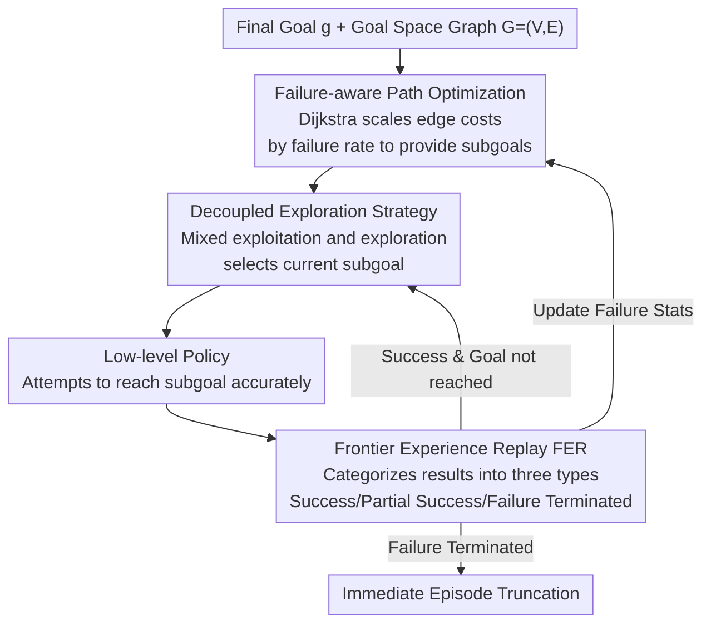

# Strict Subgoal Execution: Reliable Long-Horizon Planning in Hierarchical Reinforcement Learning

**Conference**: ICLR 2026  
**arXiv**: [2506.21039](https://arxiv.org/abs/2506.21039)  
**Code**: [https://github.com/Jaebak1996/SSE](https://github.com/Jaebak1996/SSE)  
**Area**: Hierarchical Reinforcement Learning / Goal-Conditioned RL  
**Keywords**: Hierarchical RL, Subgoal Execution, Graph Planning, Frontier Experience Replay, Long-Horizon Tasks

## TL;DR

Ours proposes the SSE (Strict Subgoal Execution) framework, which strictly distinguishes between success and failure in reaching subgoals through **Frontier Experience Replay (FER)**. Combined with a decoupled exploration strategy and failure-aware path optimization, it enforces subgoal completion within each high-level step, significantly reducing the number of high-level decision steps and improving success rates in long-horizon tasks.

## Background & Motivation

- **Challenges of Long-Horizon Goal-Conditioned Tasks**: Distant goals and sparse rewards make exploration difficult.
- **Limitations of Prior Work (HER in Hierarchical RL)**: Traditional graph-based hierarchical RL uses Hindsight Experience Replay (HER) for high-level policies, treating intermediate states in failed trajectories as virtual subgoals. This leads to:
    - The high-level policy repeatedly selecting unreachable subgoals.
    - Excessively long high-level trajectories, complicating credit assignment.
    - Highly inconsistent transitions generated by the same subgoal.
- **Key Insight**: Instead of allowing the high-level policy to repeatedly attempt unreachable subgoals, the execution should be strict—continue if successful, but terminate immediately upon failure.

## Method

### Overall Architecture

SSE introduces a significant modification to standard graph-based hierarchical RL architectures: whenever the high-level selects a subgoal, the low-level must reach it precisely; otherwise, the episode is truncated immediately to prevent the high-level from wasting steps on unreachable subgoals. The overall mechanism is a closed loop: graph planning (via failure-aware path optimization) provides a sequence of subgoals on the goal-space graph. A decoupled exploration strategy selects the current subgoal based on this sequence, and the low-level policy attempts to reach it accurately. Frontier Experience Replay (FER) categorizes the attempt into one of three types to update the high-level buffer and feedbacks failure statistics to the graph planner—continuing if successful or truncating the episode if unsuccessful. Two variants are provided: SSE Grid (suitable for 2D/3D goal spaces) and SSE Model (extensible to high-dimensional goal spaces), differing only in how subgoal nodes are represented and sampled.

### Key Designs

**1. Frontier Experience Replay (FER): Marking Reachability Boundaries to Prevent High-level Contamination**

Traditional hierarchical RL uses HER for the high-level policy, inserting intermediate states from failed trajectories as "hindsight subgoals" into the buffer. This causes the high-level policy to receive incorrect signals that unreachable points are reachable. FER instead categorizes high-level transitions into three types based on actual execution results and writes them to the buffer $\mathcal{B}_F^h$:

$$\mathcal{B}_F^h = \begin{cases} (s_t, g, \tilde{g}_t, \sum_{j=t}^{t'-1} r_j, s_{t'}) & \text{Success} \\ (s_t, g, \tilde{g}_t, 0, s_T) & \text{Failure Terminated} \\ (s_t, g, \text{wp}_{\text{final}}, \sum_{j=t}^{t_{\text{wp}}-1} r_j, s_{t_{\text{wp}}}) & \text{Partial Success} \end{cases}$$

A success is recorded with the real reward when the low-level reaches the subgoal. If determined unreachable (error $\|\phi(s_{t'}) - \tilde{g}_t\| \geq \lambda$), it is recorded as "failure terminated" with 0 reward, the next state as terminal $s_T$, and the episode is truncated. This forces the high-level Q-values to mark "unreachability" as low value. Transitions between these are "partial successes," using the last successfully reached waypoint $\text{wp}_{\text{final}}$ as the valid subgoal. This ensures that Q-values accurately characterize the reachability frontier.

**2. Decoupled Exploration Strategy: Separating Exploitation and Exploration to Avoid Exploration Collapse**

While strict execution ensures precision, a purely greedy high-level policy might fail to explore unverified distant areas, causing coverage to collapse. SSE splits the high-level into exploitation $\pi^h$ and exploration $\pi^{\text{exp}}$ policies, mixed at a ratio $\eta : (1-\eta)$. The exploitation side uses standard $\epsilon$-greedy:

$$\pi^h(\tilde{g}_t | s_t, g) = \begin{cases} \arg\max_{\tilde{g}} Q^h(s_t, \tilde{g}, g) & 1-\epsilon \\ \text{Uniform}(\mathcal{G}) & \epsilon \end{cases}$$

The exploration side splits probability equally among the final goal $g$, the currently known furthest reachable point $\tilde{g}_{\max,t}$, and unvisited points $\tilde{g}_{\text{novel}}$ sampled from a set of novel nodes $V_{\text{novel}}$:

$$\pi^{\text{exp}}(\tilde{g}_t | s_t, g) = \begin{cases} g & 1/3 \\ \tilde{g}_{\max,t} & 1/3 \\ \tilde{g}_{\text{novel}} \sim \text{Uniform}(V_{\text{novel}}) & 1/3 \end{cases}$$

This ensures the frontier continues to expand while maintaining strict execution.

**3. Failure-aware Path Optimization: Guiding Dijkstra to Evade High-Failure Regions**

Subgoal sequences are provided by the shortest path on graph $G=(V,E)$. To avoid wasting episodes on nodes that are consistently unreachable, SSE multiplies edge costs by a penalty factor tied to the failure rate of the target node:

$$\tilde{d}(v_1 \to v_2) = d(v_1 \to v_2) \times \max(1, c_{\text{dist}} \cdot \text{ratio}_{\text{fail}}(v_2))$$

where $\text{ratio}_{\text{fail}}(v_2)$ is the historical failure rate of node $v_2$, and $c_{\text{dist}}$ controls the penalty intensity. Dijkstra on this modified graph naturally bypasses frequent failure zones, prioritizing viable paths.

## Key Experimental Results

### Main Results: 9 Long-Horizon Tasks (5 seeds)

| Environment | HIRO | HRAC | HIGL | DHRL | BEAG | NGTE | SSE |
|------|------|------|------|------|------|------|-----|
| U-maze | ✗ | ✗ | △ | △ | ✓ | ✓ | **✓✓** |
| π-maze | ✗ | ✗ | △ | △ | ✓ | ✓ | **✓✓** |
| AntMazeComplex | ✗ | ✗ | ✗ | △ | ✓ | △ | **✓✓** |
| AntMazeBottleneck | ✗ | ✗ | ✗ | ✗ | △ | ✗ | **✓✓** |
| AntKeyChest | ✗ | ✗ | ✗ | ✗ | ✗ | ✗ | **✓✓** |
| AntDoubleKeyChest | ✗ | ✗ | ✗ | ✗ | ✗ | ✗ | **✓✓** |

(✓✓=High success & fast convergence, ✓=Success, △=Partial success, ✗=Failure)

### Ablation Study (AntDoubleKeyChest)

| Variant | Performance |
|------|------|
| SSE Full | ✓ (Solved in ~3M steps) |
| SSE + FPS (Grid replaced with FPS) | Success but slower convergence |
| SSE + HER (FER replaced with HER) | **Complete Failure** |
| SSE w/o $\mathcal{B}_F^h$ (No FER) | **Complete Failure** |
| SSE w/o $\pi^{\text{exp}}$ (No exploration strategy) | Significant degradation |
| SSE w/o Path Optimization | Moderate degradation |

### Key Findings

- FER is the core component—removing FER or using HER leads to total failure.
- SSE allows agents to reach any reachable position on the map in a **single high-level step**.
- AntDoubleKeyChest requires only **3 high-level steps** to complete the entire task (collecting two keys + reaching the goal).

## Highlights & Insights

1. **Mandatory Reachability**: Enforcing that subgoals must be reached before proceeding fundamentally reduces the number of high-level decision steps.
2. **Precise FER Design**: Categorizing experience into success/failure/partial success allows for accurate localization of the reachability frontier.
3. **No Curriculum Needed**: SSE automatically discovers the correct execution sequence of subgoals.
4. **Computational Efficiency**: Immediate episode termination upon failure avoids long, unproductive trajectories, leading to faster practical iterations.

## Limitations & Future Work

- Introduces new hyperparameters ($\eta$, $c_{\text{dist}}$, $d_\mathcal{G}$), though ablation studies show a stable effective range.
- Assumes the goal space $\mathcal{G}$ is known—a standard assumption in many environments.
- The grid-based method is only suitable for low-dimensional goal spaces.
- Primarily evaluated in static goal settings.

## Related Work & Insights

- **Goal-conditioned RL**: HER, UVFA, prioritized goal sampling.
- **Graph Planning HRL**: HIGL, DHRL, BEAG, NGTE.
- **Frontier Exploration**: Unlike traditional frontier exploration (boundary states), SSE's "frontier" refers to the success/failure boundary.

## Rating

- **Novelty**: ⭐⭐⭐⭐ — The idea of strict subgoal execution is simple yet highly effective.
- **Technical Depth**: ⭐⭐⭐⭐ — The FER design is elegant, with well-motivated categorization of experience types.
- **Experimental Thoroughness**: ⭐⭐⭐⭐⭐ — 9 environments, comprehensive comparison against 7 baselines, and detailed ablations.
- **Value**: ⭐⭐⭐⭐ — Significantly outperforms existing methods on complex long-horizon tasks.

<!-- RELATED:START -->

## Related Papers

- [\[ICLR 2026\] RD-HRL: Generating Reliable Sub-Goals for Long-Horizon Sparse-Reward Tasks](rd-hrl_generating_reliable_sub-goals_for_long-horizon_sparse-reward_tasks.md)
- [\[ICLR 2026\] RLVMR: Reinforcement Learning with Verifiable Meta-Reasoning Rewards for Robust Long-Horizon Agents](rlvmr_reinforcement_learning_with_verifiable_meta-reasoning_rewards_for_robust_l.md)
- [\[ICLR 2026\] Toward Conservative Planning from Human-AI Preferences in Reinforcement Learning](toward_conservative_planning_from_human-ai_preferences_in_reinforcement_learning.md)
- [\[ICML 2026\] Long-Horizon Model-Based Offline Reinforcement Learning Without Explicit Conservatism](../../ICML2026/reinforcement_learning/long-horizon_model-based_offline_reinforcement_learning_without_explicit_conserv.md)
- [\[ICLR 2026\] Goal Reaching with Eikonal-Constrained Hierarchical Quasimetric Reinforcement Learning](goal_reaching_with_eikonal-constrained_hierarchical_quasimetric_reinforcement_le.md)

<!-- RELATED:END -->
