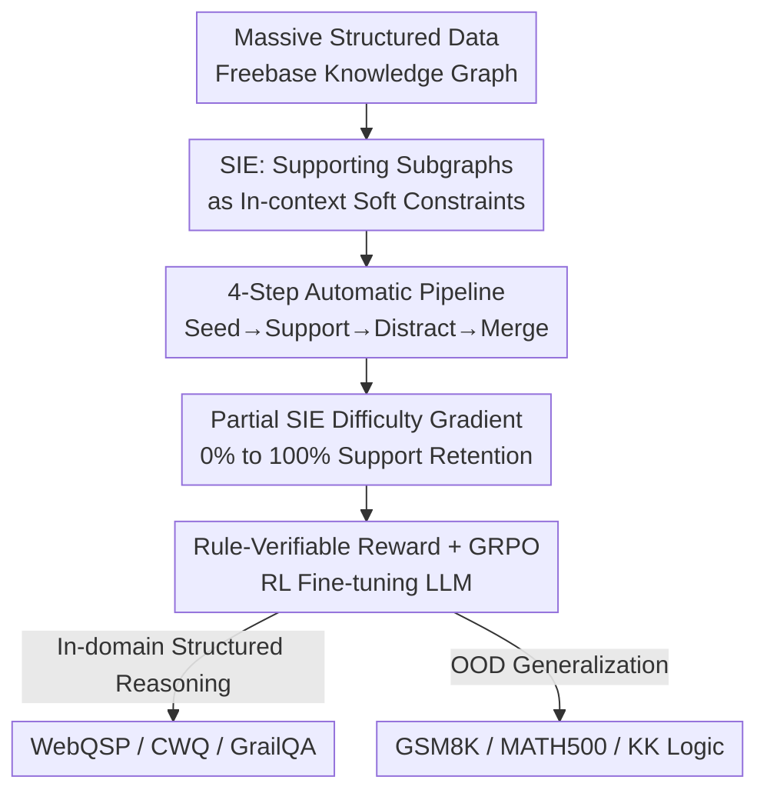

# Structured In-context Environment Scaling for Large Language Model Reasoning

**Conference**: ICLR 2026  
**OpenReview**: [https://openreview.net/forum?id=CicK2lJMUy](https://openreview.net/forum?id=CicK2lJMUy)  
**Code**: https://github.com/PursuitYP/SIE_ICLR  
**Area**: Reinforcement Learning / LLM Reasoning  
**Keywords**: RL Fine-tuning Environment, Structured Data, Knowledge Graph, Compositional Reasoning, Generalization

## TL;DR
This paper proposes the **Structured In-context Environment (SIE)** framework, which automatically constructs scalable, generalizable, and verifiable LLM reasoning environments from large-scale Knowledge Graphs (KGs). By treating supporting subgraphs as soft constraints within prompts and employing GRPO for RL fine-tuning, the method significantly enhances performance on structured reasoning tasks and transfers compositional reasoning capabilities to out-of-distribution tasks such as mathematics and logic.

## Background & Motivation

**Background**: Post-training with Reinforcement Learning (RL) has become a prevailing paradigm for eliciting complex reasoning in LLMs—models learn strategies like self-reflection, backtracking, and Chain-of-Thought from environmental feedback, showing significant progress in math and code. However, most research focuses on **RL algorithm optimization** (e.g., GRPO, PPO improvements), while the equally critical factor of the "environment itself" remains under-explored.

**Limitations of Prior Work**: The intrinsic properties of an environment determine what capabilities a model can acquire. An ideal LLM reasoning environment should possess three traits: **scalability** (low-cost automatic construction from massive data), **generalizable reasoning** (learned strategies transfer to general domains), and **verifiability** (explicit rules to judge correctness). Existing environments rarely satisfy all three: "internalized rule" environments (like math) rely on expensive expert annotations and are hard to scale; "externalized rule" environments (like game engines) have clear rules but produce specialized skills that fail to generalize.

**Key Challenge**: A tension exists between scalability and generalizability—automatically scalable environments are often narrow in scope, while those teaching general reasoning are difficult to scale. Breaking this trade-off requires a data source that is both automatically constructible at scale and capable of teaching general compositional reasoning.

**Key Insight**: The authors focus on **structured data** (data organized by predefined schemas with clear fields, types, and constraints, such as KGs or tables). It offers three natural advantages: vast real-world structured resources allow for automatic environment construction via multi-hop retrieval (addressing scalability); structured data encapsulates human experience and domain knowledge, offering reasoning patterns that generalize to general tasks (addressing generalizability); and explicit schemas allow for rigorous rule-based verification (addressing verifiability).

**Core Idea**: Extract supporting subgraphs that bridge "questions to answers" from a KG and treat them as **in-context soft constraint environments** within LLM prompts. This allows LLMs to perform multi-hop compositional reasoning (implicit MDP exploration) within this context, driven by GRPO fine-tuning with rule-based verifiable rewards. This replaces expert annotation with structured environments while cultivating compositional reasoning.

## Method

### Overall Architecture

The SIE framework performs two main functions: **automatic construction of structured in-context environments from large-scale KGs, and RL fine-tuning of LLMs using these environments as soft constraints**. Formally, the KGQA task is modeled as an implicit MDP—for the $i$-th sample at time $t$, the state $s_{i,t}$ represents the currently explored subgraph, the action $a_{i,t}$ is the selection of the next entity to explore, the state transition reflects the updated subgraph, and the final reward $r_i$ is provided by an external verifier based on the LLM's answer $y_i$. Each sample is represented as (Question $Q$, Structured Context $SI$, Answer $A$), where $SI$ serves as a soft constraint in the reasoning prompt, and the LLM output directly informs the reward signal.

The construction side uses a four-step automatic pipeline: ① Seed subgraph retrieval → ② Supporting subgraph extraction → ③ Distractive subgraph filtering → ④ Partial SIE construction. The training side utilizes GRPO for RL fine-tuning within the constructed SIEs.

### Key Designs

**1. SIE: Encoding Structured Subgraphs as In-context Soft Constraint Environments**

To address the issue that existing environments are either unscalable or non-generalizable, this work avoids explicitly implementing an environment engine with hard transition functions. Instead, it **encodes environmental dynamics into the structured context and embeds them as soft constraints in the LLM prompt**. LLM exploration within this context is modeled as implicit actions, with outputs yielding rewards. This "relaxed" design simplifies implementation and scaling—no task-specific environment rules are needed; switching structured data effectively switches the MDP, facilitating seamless integration with mainstream RL algorithms. KGs are chosen for instantiation: KG triples are highly structured representations containing domain cognitive primitives, where multi-hop paths naturally correspond to complex reasoning processes, serving as "scaffolding" for compositional reasoning.

**2. Four-Step Automatic Pipeline: Precise Extraction of Supporting Subgraphs**

This is the core of "scalability." Given a KGQA instance (Question $Q$, Answer $A$, Question Entity set $E_Q$, Answer Entity set $E_A$), the pipeline extracts the local environment in four steps:

- **Seed Subgraph Retrieval**: Multi-hop retrieval starting from question entities yields $G_{seed}$. Since naive BFS leads to exponential explosion (Freebase contains 2.56M entities and 8.3M triples), **bidirectional retrieval** is used—simultaneous multi-hop searches from both question and answer sides, constrained such that the sum of hops equals the task maximum ($q_{hop}+a_{hop}=n_{hop}$), significantly compressing the subgraph: $$G_{seed} = \text{MultiHopSearch}(G, E_Q, q_{hop}) \cup \text{MultiHopSearch}(G, E_A, a_{hop})$$
- **Supporting Subgraph Extraction**: Dijkstra's algorithm is used on $G_{seed}$ to find all shortest paths between $E_Q$ and $E_A$ within $n_{hop}$, yielding a supporting subgraph $G_{support}=\text{ShortestPathSearch}(G_{seed}, E_Q, E_A, n_{hop})$ containing complete reasoning paths (retaining all question entities and top-10 answers). Due to semantic mismatches between $Q$ and $G$, some supporting subgraphs may be empty; the authors **intentionally retain** these samples to study the impact of incomplete environments.
- **Distractive Subgraph Filtering**: The distraction set is $G_{seed}\setminus G_{support}$ (averaging nearly 10,000 triples, exceeding LLM context limits). A pre-trained cross-encoder `ms-marco-MiniLM-L12-v2` performs two-stage re-ranking—first **relation filtering** (retaining top relations $rel_{retain}$ based on semantic similarity to $Q$), then **triple filtering** (retaining top triples within $rel_{retain}$), preserving challenging distractions while fitting context length.

This pipeline fully automates environment creation, providing the scalability of SIE.

**3. Partial SIE: Difficulty Gradients via Support Retention Rates**

To systematically study how reasoning evolves under information constraints, the fourth step merges and shuffles supporting and distractive subgraphs: $$\text{SIE-ratio} = \text{Shuffle}(\text{Retain}(G_{support}, ratio) \cup G_{distract})$$ By controlling the retention ratio $ratio\in\{100\%, 75\%, 50\%, 25\%, 0\%\}$ and adjusting $G_{distract}$ to maintain total context length, five difficulty tiers from SIE-100% to SIE-0% are constructed. SIE-0% means all supporting information is removed, leaving only distractions. This gradient simulates the transition from complete to incomplete information. A key finding is that RL still provides stable improvements in extreme information-deficient scenarios like SIE-25%/SIE-0%—the model's reasoning paradigm shifts from **shallow context retrieval** toward **deep compositional reasoning** (learning to explore the environment and combine parametric knowledge), which is the source of generalization.

**4. Rule-Verifiable Reward + GRPO Fine-tuning**

With SIE as a soft constraint, fine-tuning is straightforward: given input $x=(Q, SI)$, GRPO samples a set of responses $\{y_1, ..., y_G\}$ from the old policy and calculates the advantage $A_i=\frac{r_i-\text{mean}(\{r\})}{\text{std}(\{r\})}$ using relative scores within the group, simplifying training without a standalone critic model. The reward is **rule-verifiably** composed of two parts: Answer Reward (extracting the final answer from `<answer>` tags for exact matching with ground truth, 1.0 for correct, 0.0 for incorrect) and Format Reward (encouraging adherence to the `<think>`/`<answer>` template). These rule-based rewards effectively prevent reward hacking and ensure optimization toward correct reasoning, guiding the LLM to learn the compositional reasoning paradigm inherent in the structured environment.

## Key Experimental Results

Experiments address four RQs: Can SIE improve structured reasoning (RQ1)? Is SIE more efficient than SFT on structured data (RQ2)? Does it generalize OOD (RQ3)? How does partial SIE impact performance (RQ4)? Training utilized Freebase + WebQSP/CWQ, fine-tuning Qwen2.5-7B(-Instruct), Llama3.1-8B-Instruct, and Qwen3-8B using GRPO (VeRL framework, prompt length 8192, response length 2048), reporting zero-shot pass@1.

### Main Results

RL w/ SIE vs. RL w/o Context (removing structured context), average Gain on structured reasoning tasks across four models:

| Dataset | w/o Context (Avg) | w/ SIE (Avg) | Average Gain |
|--------|------|------|----------|
| WebQSP | ~58 | ~92.5 | +34.4% |
| CWQ | ~36 | ~86 | +50.2% |
| GrailQA (Held-out in-domain) | ~22 | ~84 | +62.6% |

Comparison with SFT w/ SRD (SFT using structured reasoning data distilled from DeepSeek-R1) for Qwen2.5-7B-Instruct / Llama3.1-8B-Instruct:

| Method | WebQSP | CWQ | GrailQA | Rel. CoT Avg Gain |
|------|--------|-----|---------|-----------------|
| CoT | 26.3 / 36.5 | 34.4 / 37.2 | 40.5 / 43.6 | — |
| SFT w/ SRD | 40.5 / 43.4 | 43.3 / 49.5 | 55.7 / 60.0 | +11.4% |
| RL w/ SIE | 93.4 / 93.2 | 87.7 / 89.7 | 85.8 / 85.0 | +53.7% |

RL w/ SIE achieves >40% additional gain over SFT w/ SRD across three tasks, suggesting environment-exploratory RL is more efficient than imitative SFT.

OOD Generalization (Average Gain of RL w/ SIE vs. CoT across four models): GSM8K +20.4%, MATH500 +18.1%, KK-easy +12.3%, KK-hard +11.1%, proving structured reasoning transfers to math/logic domains.

### Ablation Study

| Configuration | Key Finding | Description |
|------|---------|------|
| Partial SIE 100%→0% (Avg across four models) | +64.2% → +52.5% | Performance slightly drops as difficulty increases, but SIE-0% still shows large stable gains. |
| Partial SIE OOD Generalization (Qwen2.5-7B-Inst) | +40.3% → +38.6% | Generalization gains are nearly consistent across tiers; information deficiency doesn't hurt generalization. |
| RL Algorithms (GRPO/REINFORCE++/PPO) | GRPO≈REINFORCE++ > PPO | SIE is universally applicable across mainstream RL algorithms. |
| RL w/ SIE f/ SFT (RL after SFT cold-start) | Structured ↓, Generalization ↑ | WebQSP 88.5 vs 93.4; KK-hard 33.5 vs 29.0; a trade-off exists. |

### Key Findings

- **Information Constraint is a Feature, Not a Flaw**: In SIE-0%, where all support is removed, the model is forced to shift from "shallow KG retrieval" to "deep multi-hop compositional reasoning" using its own parametric knowledge. Case studies show that pre-fine-tuned models hallucinate when information is missing, while post-fine-tuned models recognize the lack of info and utilize internal knowledge correctly.
- **Generalization is Insensitive to Environment Completeness**: OOD generalization gains remain nearly constant (~40%→38.6%) across the partial SIE gradient, indicating the model learns transferable compositional reasoning patterns rather than memorizing specific subgraphs.
- **The Double-Edged Sword of SFT Cold-start**: Initial SFT followed by RL improves math/logic generalization but limits environmental exploration, reducing structured reasoning performance—long-chain SFT data favors generalization but constrains exploration.

## Highlights & Insights
- **Transforming "Environment Construction" into "Subgraph Extraction"**: Using KG multi-hop paths as scaffolding for compositional reasoning successfully addresses scalability (automatic retrieval), generalization (knowledge concentration), and verifiability (schema rules).
- **Soft-Constraint In-context Environment**: By embedding the environment as a soft constraint in prompts rather than writing hard engines, changing data effectively changes the MDP, allowing seamless integration with RL. This "relaxed" design is transferable to any structured source (tables, code ASTs, etc.).
- **Proactively Shaping Reasoning via Information Scarcity**: The strategy of forcing models from "retrieval" to "composition" by creating information gaps is highly instructive for designing reasoning training data.

## Limitations & Future Work
- Validated only on Knowledge Graphs (Freebase); effects on other structured sources like tables or relational databases remain unknown.
- OOD generalization only tested on math (GSM8K/MATH500) and logic (KK puzzles); transferability to code or planning domains requires verification.
- Qwen3-8B showed low initial accuracy on MATH500 due to over-length responses or format non-compliance, suggesting verification issues for models that do not "cooperate" with formats.
- The trade-off in SFT cold-starts (Generalization ↑ vs. Structured ↓) lacks a unified solution; balancing the two is an open problem.

## Related Work & Insights
- **vs. Math/Code Environments**: These rely on internalized rules from pre-training and expert annotation for construction, making them hard to scale. SIE automatically extracts subgraphs from KGs, offering high scalability and explicit verifiability.
- **vs. Game Engine Environments**: Rules are explicit but skills are too specialized to generalize. SIE's compositional reasoning transfers to OOD math/logic tasks.
- **vs. SFT on SRD (Distillation + SFT)**: SFT is imitative with limited gains (~11%). SIE's RL encourages environmental exploration, yielding much higher gains (~54%) and learning generalizable exploration strategies rather than memorized chains.

## Rating
- Novelty: ⭐⭐⭐⭐⭐ Reframes environment construction from "algorithmic" to "data/environment" perspective; unifies scalability, generalization, and verifiability via structured soft constraints.
- Experimental Thoroughness: ⭐⭐⭐⭐⭐ 4 models × multiple tasks × partial gradients × 3 RL algorithms × SFT cold-start comparisons; RQs are comprehensive.
- Writing Quality: ⭐⭐⭐⭐ Clear narrative around the three traits; certain construction details (cross-encoder thresholds, top-k values) are somewhat brief.
- Value: ⭐⭐⭐⭐⭐ Provides a cost-effective path to automatically build generalizable RL reasoning environments; directly applicable to RL post-training data engineering.

<!-- RELATED:START -->

## Related Papers

- [\[ICLR 2026\] Toward Efficient Exploration by Large Language Model Agents](toward_efficient_exploration_by_large_language_model_agents.md)
- [\[ICLR 2026\] Squeeze the Soaked Sponge: Efficient Off-Policy RFT for Large Language Model](squeeze_the_soaked_sponge_efficient_off-policy_rft_for_large_language_model.md)
- [\[ICLR 2026\] Buffer Matters: Unleashing the Power of Off-Policy Reinforcement Learning in Large Language Model Reasoning](buffer_matters_unleashing_the_power_of_off-policy_reinforcement_learning_in_larg.md)
- [\[ICLR 2026\] The Markovian Thinker: Architecture-Agnostic Linear Scaling of Reasoning](the_markovian_thinker_architecture-agnostic_linear_scaling_of_reasoning.md)
- [\[ICLR 2026\] Improving and Accelerating Offline RL in Large Discrete Action Spaces with Structured Policy Initialization](improving_and_accelerating_offline_rl_in_large_discrete_action_spaces_with_struc.md)

<!-- RELATED:END -->
