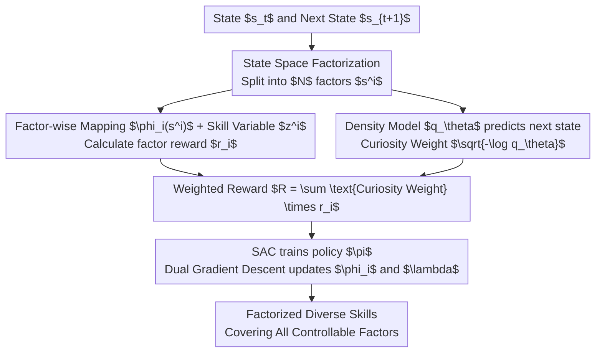

# SUSD: Structured Unsupervised Skill Discovery through State Factorization

**Conference**: ICLR 2026  
**arXiv**: [2602.01619](https://arxiv.org/abs/2602.01619)  
**Code**: [https://github.com/hadi-hosseini/SUSD](https://github.com/hadi-hosseini/SUSD)  
**Area**: Unsupervised Skill Discovery / Reinforcement Learning  
**Keywords**: Unsupervised Skill Discovery, State Factorization, Distance Maximization, Curiosity-driven, Hierarchical Reinforcement Learning

## TL;DR

Proposes SUSD (Structured Unsupervised Skill Discovery), which factorizes the state space into independent factors and assigns exclusive skill variables to each. Combined with a curiosity-driven factor weighting mechanism, it achieves the discovery of diverse skills covering all controllable factors in complex multi-object/multi-agent environments.

## Background & Motivation

- **Goal**: Autonomous learning of diverse skills without external rewards for downstream tasks.
- **Background**:
    - **Mutual Information (MI) methods** (e.g., DIAYN): Maximize MI between skill variables and states, but tend to learn simple static behaviors due to transformation invariance.
    - **Distance Maximization (DSD) methods** (e.g., CSD, METRA): Encourage dynamic behavior by maximizing state space distance, but focus only on the easiest-to-control factors in complex multi-object environments.
- **Key Challenge**: DSD lacks a mechanism to ensure skill diversity covers all controllable factors. While it performs well in simple environments like Ant and HalfCheetah, it degrades in multi-object environments (multi-agent, Kitchen).
- **Core Idea**: Utilize the compositional structure of the environment as an inductive bias by factorizing the state space and learning exclusive skills for each factor.

## Method

### Overall Architecture

SUSD builds upon distance-maximizing skill discovery (DSD) to solve a major pain point: DSD only learns skills for the most easily controlled factor in multi-object environments, ignoring others. The approach splits the single "state → skill" mapping into multiple independent channels aligned with the environment's compositional structure. The state is factorized into $N$ factors, each assigned an exclusive embedding network $\phi_i$ and skill variable $z^i$ to compute individual factor intrinsic rewards. Simultaneously, a density model predicts the next state to calculate a "curiosity" weight for each factor, measuring how difficult it is to influence. Finally, factor-level rewards are weighted by curiosity and summed as the total intrinsic reward for training the underlying skill policy using SAC. Mapping functions and constraint multipliers are updated via dual gradient descent. The entire process is reward-free and end-to-end.

### Key Designs

**1. State Space Factorization: Exclusive skills per factor to prevent dominance by easily controlled components**

The root cause of DSD degradation is using a global mapping $\phi$ to maximize total state displacement, causing the policy to focus solely on the easiest factor (e.g., the agent's position). SUSD uses the natural compositional structure of the environment as an inductive bias, defining the state space as a Cartesian product $\mathcal{S} := \mathcal{S}^1 \times \cdots \times \mathcal{S}^N$. The skill space is factorized as $\mathcal{Z} := \mathcal{Z}^1 \times \cdots \times \mathcal{Z}^N$, and the mapping function is split into $N$ independent sub-networks $\phi_i(s^i)$, each processing only its corresponding factor. The distance maximization objective becomes a factor-wise sum:

$$\sup_{\pi, \{\phi_i\}_{i=1}^N} \mathbb{E}_{p(\tau, z)} \sum_{i=1}^N \sum_{t=0}^{T-1} (\phi_i(s_{t+1}^i) - \phi_i(s_t^i))^\top z^i, \quad \text{s.t.}\ \sum_{i=1}^N \|\phi_i(s'^i) - \phi_i(s^i)\|_2 \leq 1,\ \forall (s, s') \in \mathcal{S}_{\text{adj}}$$

Since each factor has an independent skill variable $z^i$, the policy must generate distinguishable behaviors for every factor to receive rewards, forcing diversity across all controllable factors.

**2. Curiosity-driven Factor Weighting: Dynamically directing exploration budget to under-explored factors**

Even with factorization, exploration difficulty varies across factors. SUSD trains a Gaussian density model $q_\theta(s'|s) = \mathcal{N}(\mu_\theta(s), \Sigma_\theta(s))$ to predict the next state. Since the marginals of a Gaussian are also Gaussian, the model provides a marginal for each factor. "Curiosity" is quantified using negative log-likelihood:

$$-\log q_\theta(s_{t+1}^i | s_t) \propto (s_{t+1}^i - \mu_\theta^i(s_t))^\top \Sigma_\theta^i(s_t)^{-1} (s_{t+1}^i - \mu_\theta^i(s_t))$$

Higher values indicate transitions that are less expected or under-explored, warranting more attention. Unlike CSD, which uses a coarse-grained weight for the entire transition, SUSD calculates weights per factor. Lemma 4.1 proves that $\sqrt{-\log q_\theta(s_{t+1}^i|s_t)}$ is a valid distance metric, ensuring that this weighting does not violate the distance maximization semantics of DSD.

**3. Weighted Intrinsic Reward and Dual Training: Synthesizing factor-level signals into a single objective**

The individual factor skill reward is defined as $r_i^{\text{SUSD}} := (\phi_i(s_{t+1}^i) - \phi_i(s_t^i))^\top z^i$. The total intrinsic reward received by the policy is the curiosity-weighted sum:

$$R := \sum_{i=1}^N \sqrt{-\log q_\theta(s_{t+1}^i | s_t)} \cdot r_i^{\text{SUSD}}$$

This preserves directional skill signals for each factor while giving under-explored factors higher priority. The mapping functions $\{\phi_i\}$ and Lagrange multiplier $\lambda$ are updated via dual gradient descent, while the skill policy $\pi(a|s,z)$ is trained using SAC on this intrinsic reward.

## Key Experimental Results

### Downstream Task Performance (Multi-Particle and Kitchen)

| Method | MP Avg Return | Kitchen Avg Return |
|------|------------|-----------------|
| DIAYN | Low | Low |
| LSD | Low | Low |
| CSD | Medium | Low |
| METRA | Medium | Low-Medium |
| DUSDi | Medium | Low |
| **Ours (SUSD)** | **High** | **High** |

SUSD significantly outperforms all baselines in complex factorized environments, with a particularly large margin in the Kitchen environment.

### Accidental Task Completion during Skill Learning

| Task | SUSD | CSD | METRA | LSD | DUSDi |
|------|------|-----|-------|-----|-------|
| BiP (Butter in Pan) | **39.9±18.5** | 0.0 | 0.0 | 0.0 | 0.0 |
| MiP (Meat in Pan) | **58.9±25.8** | 0.0 | 0.0 | 0.0 | 2.5 |
| PoS (Pot on Stove) | **20.5±18.0** | 0.0 | 0.0 | 0.0 | 1.3 |

SUSD accidentally completes downstream tasks during the skill learning phase, which other methods fail to do entirely.

### Factor Decoding Error

| Method | Multi-Particle | Kitchen | 2D-Gunner |
|------|---------------|---------|-----------|
| **Ours (SUSD)** | **0.060** | **0.014** | **0.080** |
| METRA | 0.147 | 0.028 | 0.186 |
| CSD | 0.313 | 0.049 | 0.404 |
| LSD | 0.308 | 0.038 | 0.224 |

SUSD's latent skill embeddings contain the most factor-relevant information.

## Key Findings

- SUSD achieves significantly better state coverage, especially for the least-explored agents.
- It remains competitive in non-factorized environments (Ant, HalfCheetah).
- The curiosity-weighting mechanism effectively directs attention to under-explored factors.

## Highlights & Insights

1. **First Factorized DSD**: Successfully introduces the inductive bias of state factorization into the DSD framework.
2. **Fine-grained Curiosity Weighting**: Calculates weights at the factor level rather than using a single global weight for the entire state transition.
3. **Composable Skills**: Factorized skill representations natively support the combination and chaining of skills.
4. **Theoretical Support**: Lemma 4.1 rigorously proves that the distance term can serve as a coefficient for the intrinsic reward.

## Limitations & Future Work

- Requires prior knowledge of the state factorization structure (which dimensions belong to which factor).
- Needs additional decoupled representation learning for pixel-based inputs.
- Skill space dimensions grow linearly with the number of factors.
- Advantages are less pronounced in strictly non-factorized environments.

## Related Work & Insights

- **MI-based USD**: DIAYN, DADS, DUSDi (factorized MI).
- **DSD-based USD**: LSD, CSD, METRA.
- **State Factorization in RL**: FMDP, Causal Factorization, DUSDi.

## Rating

- **Novelty**: ⭐⭐⭐⭐ — Factorized DSD combined with curiosity-driven weighting is novel and effective.
- **Technical Depth**: ⭐⭐⭐⭐ — Solid theoretical derivation (Lemma 4.1) and complete optimization framework.
- **Experimental Thoroughness**: ⭐⭐⭐⭐ — Evaluated across multiple environments with extensive ablation and qualitative analysis.
- **Value**: ⭐⭐⭐ — High performance gains, though limited by the state factorization assumption.

<!-- RELATED:START -->

## Related Papers

- [\[ICLR 2026\] Reference Grounded Skill Discovery](reference_grounded_skill_discovery.md)
- [\[ICML 2026\] COLLIE: Guiding Skill Discovery in Semantically Coherent Latent Space](../../ICML2026/reinforcement_learning/collie_guiding_skill_discovery_in_semantically_coherent_latent_space.md)
- [\[ICLR 2026\] Self-Improving Skill Learning for Robust Skill-based Meta-Reinforcement Learning](self-improving_skill_learning_for_robust_skill-based_meta-reinforcement_learning.md)
- [\[ICLR 2026\] Exploratory Diffusion Model for Unsupervised Reinforcement Learning](exploratory_diffusion_model_for_unsupervised_reinforcement_learning.md)
- [\[ICLR 2026\] The State of Reinforcement Finetuning for Transformer-based Agents](the_state_of_reinforcement_finetuning_for_transformer-based_agents.md)

<!-- RELATED:END -->
