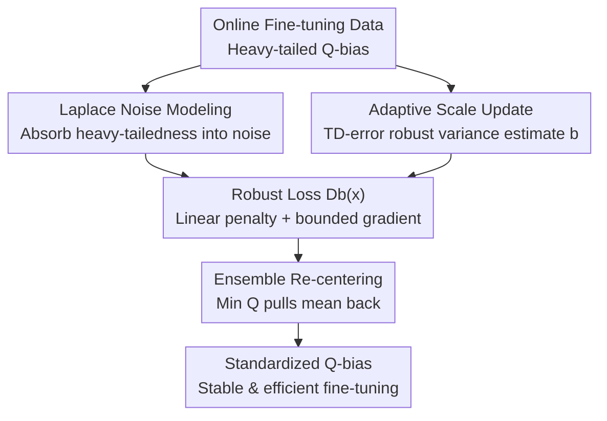

# Tackling Heavy-Tailed Q-Value Bias in Offline-to-Online Reinforcement Learning with Laplace-Robust Modeling

**Conference**: ICLR 2026  
**OpenReview**: [https://openreview.net/forum?id=I7UK5qHNBL](https://openreview.net/forum?id=I7UK5qHNBL)  
**Code**: https://github.com/USTC-AI4EEE/LAROO  
**Area**: Reinforcement Learning / Offline-to-Online RL  
**Keywords**: Offline-to-Online RL, Q-value Bias, Heavy-tailed Distribution, Laplace-Robust Modeling, Ensemble Models

## TL;DR
This paper reveals for the first time that the Q-value bias during the online fine-tuning stage of Offline-to-Online Reinforcement Learning (O2O RL) follows a **heavy-tailed distribution**. It proposes LAROO: using an adaptive Laplace noise to "absorb" the heavy-tailed nature of the bias into the noise, combined with a robust loss $D_b(x)$ to reduce estimation variance, and a conservative ensemble estimate to pull the bias mean back to zero. LAROO outperforms previous state-of-the-art O2O methods with an average improvement of +54.8% on D4RL.

## Background & Motivation

**Background**: O2O RL pre-trains an agent on an offline dataset and then fine-tunes it with a small amount of online interaction to break through the ceiling of insufficient state-action coverage in offline data. Due to distribution shifts between offline and online data, the pre-trained Q-network misestimates Q-values on online data, misleading the update direction. Mainstream approaches focus on "improving Q-value accuracy"—either by adding conservative penalties (Cal-QL), using ensemble models for stable estimation (ENOTO), or increasing update frequency (SO2).

**Limitations of Prior Work**: A common assumption of these methods is that the Q-bias (the difference between estimated Q-values and true cumulative returns) has **finite variance** or follows a **Gaussian distribution**. By using Monte Carlo for ground truth returns and calculating sample-wise differences, this paper statistics the Q-bias distribution of Cal-QL / PEX / ENOTO / SO2 during online fine-tuning. It finds their **Kurtosis generally ranges from 8.5 to 9.0** (Gaussian is only 3), with variances in the tens of thousands and extremely long right tails—clearly indicating a heavy-tailed, positively skewed distribution rather than Gaussian.

**Key Challenge**: The root of the heavy-tailed Q-bias is **non-homogeneous distribution shift**. Online samples further from the offline distribution exhibit larger Q-bias (verified by Spearman correlations of ~0.44-0.54 with DDR/DKNN distances). These distant points constitute the long tail, while the max operator amplifies these overestimations. Heavy-tailed bias brings immense estimation variance; under $l_2$ loss, extreme outliers in the tail dominate gradients, causing Q-values to oscillate violently or even collapse, making fine-tuning unstable and slow. Existing methods focus only on reducing the **mean/variance** of the bias without addressing its **distributional shape**, thus failing to suppress Kurtosis.

**Goal**: Explicitly model and eliminate the "heavy-tail" pathology at the distributional level, "standardizing" Q-bias from a difficult heavy-tailed distribution into a form with a near-zero mean and controlled tails.

**Key Insight**: The authors draw inspiration from robust regression, where the Laplace distribution is used to model errors with outliers. The Laplace distribution is naturally suited for heavy-tailed data with outliers, and its negative log-likelihood is proportional to the absolute error $|x|$ (linear growth) rather than the square growth of $l_2$, naturally suppressing tail outliers.

**Core Idea**: Introduce a parameterizable, adaptive Laplace noise term to "absorb" the heavy-tailedness of the Q-bias, transferring the heavy tails from the bias to the noise. Then, use an ensemble model to pull the residual overestimation mean back to zero. Together, these steps reshape the heavy-tailed Q-bias into a standardized form.

## Method

### Overall Architecture

LAROO performs two operations on top of standard off-policy Q-learning (using TD3/TD3BC as the backbone): ① **Modeling and transferring heavy tails**—assuming the difference between true and estimated Q-values follows a Laplace noise $\varepsilon_\theta$. The Q-network is updated by minimizing the KL divergence between two Laplace likelihoods ("ground truth given TD target" and "ground truth given estimated Q"), deriving a robust loss function $D_b(x)$ to replace the original $l_2$ loss. ② **Adaptation + Re-centering**—using a robust variance estimate of the in-batch TD-error to update the Laplace scale parameter $b$ in real-time (ensuring the noise fits the current heavy-tailedness). Simultaneously, an ensemble model calculates the TD target using a minimum value to pull the bias mean toward zero.

### Key Designs

**1. Laplace Noise Modeling: Transferring heavy tails from bias to noise**

Addressing the mismatch where Q-bias is heavy-tailed but prior methods assume Gaussian/finite variance, LAROO assumes the target Q-value and estimated Q-value each carry independent Laplace noise $\varepsilon_{\hat\theta}\sim\mathrm{Laplace}(\mu,b_1)$ and $\varepsilon_\theta\sim\mathrm{Laplace}(\mu,b_2)$, binding the noise to the bias via the definition $\mathrm{Bias}(Q_\theta)=-\mathbb{E}[\varepsilon_\theta]$. The Laplace likelihood of the true $Q(s,a)$ is written under both conditions, and the Q-network is updated by minimizing their KL divergence (Eq. 5). The advantage is that the negative log of the Laplace likelihood is proportional to $|Q(s,a)-Q_\theta(s,a)|$, demonstrating **linear** rather than quadratic growth. Consequently, optimization is dominated by the "central mass" of the Q-bias rather than rare extreme outliers in the tail. The heavy-tailedness is explicitly handled by the noise term, while the Q-value itself remains an expectation estimate.

**2. Robust Loss $D_b(x)$: Replacing $l_2$ square penalty with bounded gradients**

Simplifying the KL divergence by setting $b=b_1=b_2$ yields the robust function replacing $l_2$:

$$D_b(x)=\exp\!\left(-\frac{|x|}{b}\right)+\frac{|x|}{b}-1$$

It possesses two critical properties: first, the exponential term $\exp(-|x|/b)$ **down-weights** the loss for large tail deviations, weakening the influence of outliers; second, its gradient is **constrained within $[-1/b,\,1/b]$** and does not increase with $x$. This contrasts with $l_2$ loss gradients, which diverge linearly with bias. Furthermore, $D_b(x)$ is intrinsically coupled with the Laplace distribution: as heavy-tailed bias becomes more frequent and scale $b$ increases, the gradient bounds tighten, automatically increasing suppression of extreme deviations. The authors theoretically prove (Theorem 4.4/4.5) that when $b>1$, both single-step estimation bias and variance updated with $D_b(x)$ are **strictly smaller** than with $l_2$.

**3. Adaptive Scale Update: Tracking heavy-tailedness with TD-error robust variance**

To ensure the Laplace noise fits the changing bias distribution during fine-tuning, the scale parameter $b$ (corresponding to tail thickness and variance) must be updated in real-time. Since true Q-bias is unavailable during training and standard sample variance is sensitive to Kurtosis, LAROO uses two techniques: first, **TD-error is used as a proxy**—under independence assumptions, $T Q_{\hat\theta}-Q_\theta=\varepsilon_\theta-\varepsilon_{\hat\theta}$, so the TD-error variance is exactly twice the Q-bias variance, thus $b=s_{\omega^*}/\sqrt{2}$. Second, the **Kurtosis-robust MBBE variance estimator** (MSE-best biased estimator) $s_{\omega^*}^2=\big(\tfrac{\kappa}{n}+\tfrac{n+1}{n-1}\big)^{-1}s^2$ replaces standard sample variance, explicitly incorporating Kurtosis $\kappa$.

**4. Ensemble Re-centering: Pulling residual overestimation mean to zero**

Noise modeling + $D_b(x)$ mainly suppress the "heavy tail," but large positive tail deviations can still push the mean positive (overestimation). LAROO introduces an ensemble of Q-functions, where the TD target uses the **minimum Q-value over a random subset**: $y_{\min}=r+\gamma\max_{a'}\min_{1\le k\le M}Q^{(k)}_{\hat\theta}(s',a')$. The final loss averages $D_b\big(Q^{(k)}_{\theta}-y_{\min}\big)$ across $K$ heads (Eq. 8). Taking the minimum effectively re-centers because different Q-heads are approximately independent; taking the minimum reduces the probability of selecting the "most optimistic head," thereby lowering high positive bias and pushing the mean toward zero.

### Loss & Training
The offline phase uses TD3BC pre-training for 1 million gradient steps (LAPO for sparse AntMaze). The online phase uses TD3 with ensemble Q-functions for 100k steps. The online loss is the ensemble $D_b(x)$ loss (Eq. 8), with scale $b$ re-estimated per batch using MBBE. The backbone aligns with the ENOTO baseline for fairness.

## Key Experimental Results

### Main Results
On D4RL (MuJoCo + sparse AntMaze), LAROO is compared against SOTA methods like PEX / SO2 / Cal-QL / ENOTO / BOORL over 5 seeds. Normalized returns after fine-tuning for representative tasks:

| Task | SO2 | Cal-QL | ENOTO | BOORL | LAROO |
|------|-----|--------|-------|-------|-------|
| Hopper-medium | 94.4 | 90.8 | 96.6 | 102.1 | **106.7** |
| Walker2d-random | 20.8 | 1.6 | 38.3 | 6.4 | **71.6** |
| Walker2d-medium | 100.6 | 83.7 | 110.2 | 98.6 | **120.4** |
| Walker2d-medium-expert | 110.8 | 110.2 | 118.0 | 109.1 | **126.7** |
| Halfcheetah-medium | 84.4 | 52.2 | 84.8 | 89.7 | **92.5** |

Total performance gain across all tasks within 100k steps $\delta_{\text{sum}}(0.1M)$: LAROO reaches **550.4**, far exceeding the 355.4 of the second-best BOORL. Final performance is **+54.8%** higher than BOORL on average.

### Ablation Study

| Configuration | Phenomenon | Explanation |
|------|------|------|
| LAROO (Full) | Near-zero mean, controlled tails | Noise + Ensemble synergistically standardize Q-bias |
| w/o Noise Model | Near-zero mean but still heavy-tailed | Ensemble only re-centers the mean, cannot suppress Kurtosis |
| w/o Ensemble Model | Removed tails but still overestimated | Noise removes tails but mean remains positive |
| $D_b(x)$ vs Huber/Cauchy | $D_b(x)$ is superior | Better fit for heavy-tailed Q-bias |
| Laplace vs Gaussian fit | Laplace fits better | Empirical Q-bias is closer to Laplace |

### Key Findings
- **Noise model contributes more than ensemble**: Laplace noise modeling is the more critical component, though both are necessary—one handles heavy tails, the other handles the mean.
- **Strong plug-and-play capability**: Simply replacing the $l_2$ loss of existing methods (TD3 / Cal-QL / ENOTO) with $D_b(x)$ further improves performance.
- **Gains beyond high UTD/Ensemble**: Even with UTD=1 and ensemble size=1, LAROO outperforms Cal-QL/PEX in 10 out of 13 experiments, showing gains stem from robust modeling rather than just hyperparameter tuning.

## Highlights & Insights
- **Turning "Diagnosis" into "Explicit Modeling Goal"**: After statistically proving Q-bias has a high Kurtosis (8.5+), the authors targeted this with Laplace noise. This creates a logical closed loop from problem discovery to design.
- **"Transferring" rather than "Eliminating" Heavy Tails**: Moving heavy-tailedness from the bias to a parameterizable noise term is equivalent to replacing $l_2$ with the linear-penalty $D_b(x)$, which is elegant and theoretically sound.
- **TD-error as a Proxy for Q-bias Variance**: Since true Q-bias is unobservable during training, using $\mathrm{Var}(\text{TD-error})=2\,\mathrm{Var}(\text{Q bias})$ combined with MBBE provides a robust observation mechanism.

## Limitations & Future Work
- The methodology relies on Assumptions 4.1/4.2 (independent noise, same Laplace parameters). If the actual bias deviates significantly from Laplace (e.g., Cauchy-like extreme tails), the fitting advantage might diminish.
- Theoretical guarantees (smaller bias/variance) depend on $b>1$; guarantees for $b \le 1$ are not provided.
- Evaluations are limited to continuous control in D4RL; generalization to image-based observations or discrete actions remains to be verified.

## Related Work & Insights
- **vs Cal-QL / ENOTO**: These methods reduce the **mean/variance** of Q-bias but cannot suppress Kurtosis; LAROO operates at the **full distribution** level to handle heavy tails explicitly.
- **vs Distributional RL (DSAC)**: DSAC models the entire Q-value (return) distribution and often assumes Gaussianity, which is incompatible with expectation-based pre-trained Q-networks. LAROO only models the **Q-bias** as heavy-tailed, keeping the Q-value as an expectation estimate for better compatibility.
- **vs Extreme Q-learning**: The latter uses the Gumbel distribution to estimate max Q-values, but its training objective differs from standard offline algorithms. LAROO changes only the loss and re-centering method, preserving the Q-value estimation target.

## Rating
- Novelty: ⭐⭐⭐⭐⭐ First to reveal heavy-tailed Q-bias in O2O RL and explicitly model it via Laplace noise.
- Experimental Thoroughness: ⭐⭐⭐⭐ Extensive D4RL tasks with 5 seeds; solid ablation and plug-and-play testing.
- Writing Quality: ⭐⭐⭐⭐ Clear logic from discovery to theory.
- Value: ⭐⭐⭐⭐⭐ $D_b(x)$ is highly practical for stable O2O RL fine-tuning.

<!-- RELATED:START -->

## Related Papers

- [\[ICLR 2026\] Distributionally Robust Cooperative Multi-agent Reinforcement Learning with Value Factorization](distributionally_robust_cooperative_multi-agent_reinforcement_learning_with_valu.md)
- [\[ICLR 2026\] ROMI: Model-based Offline RL via Robust Value-Aware Model Learning with Implicitly Differentiable Adaptive Weighting](model-based_offline_rl_via_robust_value-aware_model_learning_with_implicitly_dif.md)
- [\[ICLR 2026\] Offline Preference-based Value Optimization](offline_preference-based_value_optimization.md)
- [\[ICLR 2026\] Trajectory Generation with Conservative Value Guidance for Offline Reinforcement Learning](trajectory_generation_with_conservative_value_guidance_for_offline_reinforcement.md)
- [\[ICLR 2026\] Peng's Q($\lambda$) for Conservative Value Estimation in Offline Reinforcement Learning](pengs_qlambda_for_conservative_value_estimation_in_offline_reinforcement_learnin.md)

<!-- RELATED:END -->
