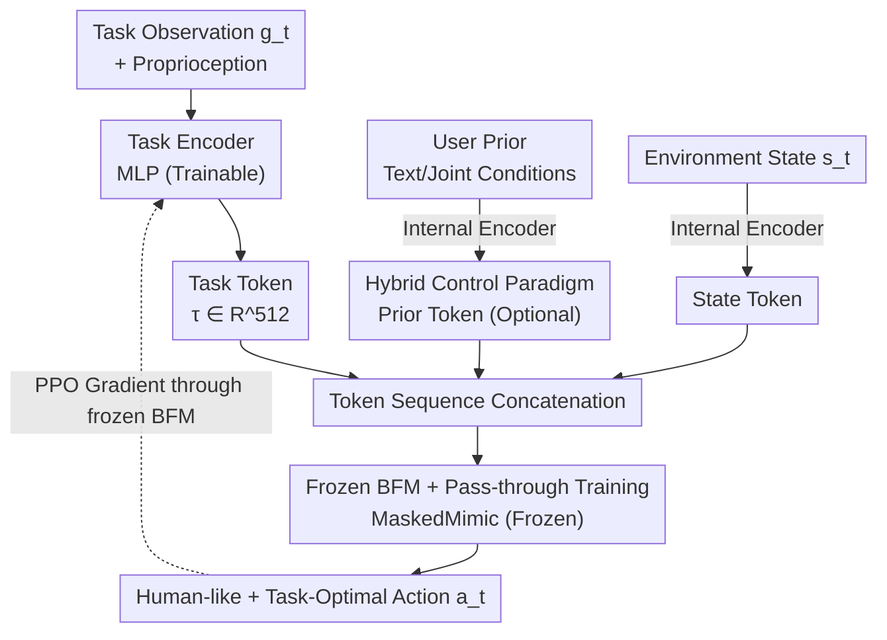

# Task Tokens: A Flexible Approach to Adapting Behavior Foundation Models

**Conference**: ICLR 2026  
**OpenReview**: [https://openreview.net/forum?id=6T3wJQhvc3](https://openreview.net/forum?id=6T3wJQhvc3)  
**Code**: See supplementary material (Project page: sites.google.com/view/task-tokens)  
**Area**: Reinforcement Learning  
**Keywords**: Behavior Foundation Models, Parameter-Efficient Adaptation, Humanoid Control, Task Token, PPO

## TL;DR
To address the dilemma where "Goal-Conditioned Behavior Foundation Models" (GC-BFM, e.g., MaskedMimic) suffer from either cumbersome prompt engineering or prior-damaging full fine-tuning, this paper proposes **Task Tokens**: the entire BFM is frozen, and only a lightweight "task encoder" is trained via reinforcement learning. This encoder produces a learnable token inserted into the transformer sequence to adapt the BFM to new tasks. Each task requires only ~200K trainable parameters (125x fewer than baselines), converges 6x faster, and is more robust and human-like in OOD scenarios (varying gravity/friction) compared to full fine-tuning.

## Background & Motivation
**Background**: Imitation learning has recently led to the development of transformer-based **Behavior Foundation Models (BFMs)** capable of generating diverse, human-like motions for humanoid agents. This paper focuses on **Goal-Conditioned BFMs (GC-BFM)**, such as MaskedMimic, which tokenize high-level goals (e.g., "walk along a path," "reach with the right hand") as conditions for motion generation. Their primary advantage is **zero-shot generalization**—the ability to generate robust motions for new goals without further training.

**Limitations of Prior Work**: When solving **specific complex tasks**, GC-BFMs face difficulties. Existing methods are problematic: (1) **Prompt engineering**—manual design of high-level goal tokens is often non-intuitive and lacks precision for many tasks; (2) **Reward design / Full fine-tuning**—directly optimizing with environmental rewards often results in unnatural motions that destroy the rich motion priors learned during pre-training and leads to catastrophic forgetting.

**Key Challenge**: The paper illustrates this with an example: asking a character to "walk to an object and strike it." Using only reward design, the character might **walk backward** to the target (high reward but unnatural); using high-level prompts, it is difficult to precisely specify the "strike" action. A fundamental gap exists between the **model's ability to generate robust natural motion** and the **precise control required for specific tasks**.

**Goal**: To find a unified, flexible, and scalable paradigm to adapt BFMs to numerous complex downstream tasks while **preserving the robustness and multi-modal capabilities of the original motions**.

**Key Insight**: Since the BFM is a transformer that inherently **processes token sequences**, a **learnable token** can be added to its input interface. This allows task information to be injected without altering model parameters. Drawing from parameter-efficient adaptation ideas in NLP (like LoRA, Adapter, or Prefix-Tuning), a lightweight trainable module can guide behavior using gradients passed back through the frozen large model.

**Core Idea**: **Freeze the BFM and train only a small encoder that produces a "task token"**. RL is used to compress the optimization of task rewards into this single token, achieving task adaptation without touching the foundation model.

## Method

### Overall Architecture
The approach addresses how to adapt a BFM without modifying its parameters. Task Tokens employ a **hybrid control paradigm**: the BFM's input sequence consists of three sources—① **Prior Token**: Optional, providing high-level behavioral priors via text or joint conditions (generated by the BFM's pre-trained encoder); ② **Task Token**: Produced by the newly trained **Task Encoder** based on the current task goal observation $g_t^i$; ③ **State Token**: The current environment state $s_t^i$, processed by the BFM's encoder. These tokens are concatenated into a sequence and fed into the **frozen GC-BFM**, which outputs human-like and task-optimal actions $a_t^i$.

A key part of training is using PPO to calculate the policy gradient, which is **backpropagated through the frozen BFM to the Task Encoder**. Only the small encoder is updated. This leverages meaningful gradient signals from the BFM while ensuring the generated actions remain within the BFM's pre-defined "motion manifold," preserving robustness and multi-modal capabilities.

### Key Designs

**1. Task Token: Compressing task information into a learnable transformer token**
The bottleneck in adapting GC-BFMs is the need for manual prompt engineering or model modification. Since the MaskedMimic transformer architecture naturally accepts token sequences, this method inserts a **task-specific learnable token**. It encodes the unique requirements and constraints of the target behavior into a concise signal that guides the foundation model without destroying its general motion priors. This design is universal—**as long as a BFM allows additional input tokens, Task Tokens can be applied**, regardless of the specific MaskedMimic structure. One task corresponds to one token (and one small encoder), making the expansion overhead minimal.

**2. Task Encoder: Mapping task goals to tokens while aligning with pre-trained representations**
The Task Token is not a static vector but is produced dynamically by the **Task Encoder**. It receives the current task goal observation $g_t^i$ (egocentric representation) and outputs a token $\tau_t^i \in \mathbb{R}^{512}$. Observations change per task—e.g., in a Steering task, $g_t^i$ includes target direction, orientation, and desired speed. A crucial detail: since MaskedMimic was trained to "reach future pose goals," the Task Encoder also receives **proprioception** information to align the encoder's output with the BFM's pre-trained representation (ablation in Section E).

**3. Frozen BFM + Gradient Pass-through Training: Updating only the encoder to preserve priors**
This is the core architectural trade-off. Training uses PPO, where the BFM predicts action probabilities based on the combined input. Gradients **pass through the frozen BFM** to update only the Task Encoder. This ensures that generated actions always stay close to the BFM's motion manifold. The direct benefit is **extreme parameter efficiency**: each task requires only ~200K trainable parameters, compared to ~25M for standard full fine-tuning (a 125x difference).

**4. Hybrid Control Paradigm: Synergy between high-level user priors and reward-driven optimization**
Because the BFM input can accommodate multiple tokens, the Task Token can work alongside **manually constructed prior tokens**. This decomposes the problem: parts of the behavior easy to describe go into the prior, while parts easier to define via rewards go into the task token. For example, in a Strike task, an orientation prior can make the character face the target, while the task token (and reward) optimizes the terminal strike. Full fine-tuning would suffer from **catastrophic forgetting** of these multi-modal prompt capabilities, whereas the frozen BFM retains them perfectly.

### Loss & Training
The training objective is the standard PPO policy gradient objective $\pi^* = \arg\max_{\pi}\mathbb{E}_\pi[\sum_t \gamma^t r_t]$, where $r_t$ is a task-specific dense reward. Gradients are only backpropagated to the Task Encoder (~200K parameters), while the BFM remains frozen. A separate Task Encoder is trained for each downstream task.

## Key Experimental Results

### Main Results
Experiments used a 69-DOF SMPL humanoid in Isaac Gym across five tasks: Reach, Direction, Steering, Strike, and Long Jump. Metrics are success rates (mean ± std over 5 seeds).

| Method | Reach | Direction | Steering | Long Jump | Strike |
|------|-------|-----------|----------|-----------|--------|
| **Task Tokens (Ours)** | **94.88 ± 1.99** | **99.26 ± 0.79** | **88.69 ± 4.04** | **99.75 ± 0.57** | 76.61 ± 3.49 |
| MaskedMimic (J.C. only, Zero-shot) | 24.77 | 2.19 | 3.83 | - | - |
| MaskedMimic Fine-Tune | 93.70 ± 4.59 | 99.10 ± 1.29 | 87.44 ± 6.79 | 47.36 ± 54.78 | **83.07 ± 5.71** |
| PULSE | 83.96 ± 2.20 | 97.60 ± 0.62 | 40.72 ± 7.64 | 99.37 ± 1.40 | 83.18 ± 2.67 |
| AMP | 57.14 ± 4.80 | 5.14 ± 0.68 | 4.28 ± 1.42 | 76.59 ± 43.42 | 52.21 ± 47.58 |
| PPO (Pure RL) | 89.90 ± 3.25 | 97.74 ± 1.40 | 32.64 ± 40.21 | 61.91 ± 52.26 | 81.36 ± 1.41 |

Task Tokens achieved the highest success rates in most tasks. In terms of efficiency: Task Tokens converged in **~50M steps** for Strike, while PULSE required **~300M steps** (6x slower).

### Analysis: Human Study on Motion Naturalness
Approximately 100 anonymous participants voted for the "more human-like" motion. The table below shows the win rate of Task Tokens against other methods.

| vs. Method | Direction | Steering | Reach | Strike | Long Jump |
|----------|-----------|----------|-------|--------|-----------|
| MaskedMimic Fine-Tune | 99% ± 1% | 90% ± 4% | 85% ± 6% | 85% ± 5% | 94% ± 2% |
| PULSE | 15% ± 5% | 46% ± 6% | 36% ± 9% | 24% ± 5% | 39% ± 5% |
| PPO | 99% ± 2% | 93% ± 4% | 89% ± 5% | 82% ± 4% | 94% ± 3% |

Task Tokens **significantly outperformed full fine-tuning and pure RL** in naturalness, validating the "frozen BFM" strategy. However, it **lost to PULSE**, likely because PULSE constrains latent representations more tightly to the prior.

### Key Findings
- **OOD Robustness is a major highlight**: When disturbing ground friction (e.g., ×0.4) or gravity (e.g., ×1.5), Task Tokens remained significantly more robust than all baselines. **Full fine-tuning actually degraded the BFM's inherent robustness**.
- **The freeze vs. fine-tune trade-off**: While fine-tuning might occasionally yield higher rewards (Strike), the cost is unnatural motion, brittle OOD performance, and catastrophic forgetting of multi-modal capabilities.
- **Proprioception alignment is critical**: Feeding proprioceptive data to the Task Encoder is essential for generating meaningful target signals relative to the BFM's pre-trained state.

## Highlights & Insights
- **Elegant Transition**: Adapting a model by "adding a token" is a clean transfer of NLP Prefix-Tuning to behavior models.
- **Counter-intuitive Robustness**: Freezing the foundation model yields better OOD performance—less intervention preserves the pre-trained manifold.
- **Unified Paradigm**: Task Tokens bridge the gap between prompt engineering and reward design.
- **Extreme Efficiency**: The 125x parameter reduction makes deploying multiple task-specific encoders for a single BFM feasible.

## Limitations & Future Work
- **Dependence on BFM Capacity**: Task Tokens cannot provide capabilities not already present or reachable in the underlying BFM.
- **Sim-to-Real**: Currently validated only in simulation; transitions to physical robots are the next step.
- **Task Specificity**: Each task currently requires a separate encoder; multi-task or continual learning encoders have not yet been explored.
- **Naturalness vs. PULSE**: Lacks a mechanism to explicitly constrain representations near the prior, which could be improved using discriminators (like AMP).

## Related Work & Insights
- **vs. MaskedMimic (Zero-shot)**: Zero-shot performance is low on complex tasks; Task Tokens serve as a high-performance "plugin" without changing the base model.
- **vs. MaskedMimic (Fine-Tune)**: Fine-tuning yields comparable rewards but sacrifices motion quality and robustness.
- **vs. PULSE**: PULSE is more human-like but 6x slower to converge and 46.5x larger in parameters.
- **Insight**: The combination of "PEFT + Frozen Model + Gradient Pass-through" can likely be applied to any token-conditioned foundation model (Vision, VLA, Decision Transformer) for low-cost, prior-preserving adaptation.

## Rating
- Novelty: ⭐⭐⭐⭐ 
- Experimental Thoroughness: ⭐⭐⭐⭐ 
- Writing Quality: ⭐⭐⭐⭐ 
- Value: ⭐⭐⭐⭐ 

<!-- RELATED:START -->

## Related Papers

- [\[ICLR 2026\] Optimistic Task Inference for Behavior Foundation Models](optimistic_task_inference_behavior_models.md)
- [\[ICLR 2026\] ARM-FM: Automated Reward Machines via Foundation Models for Compositional Reinforcement Learning](arm-fm_automated_reward_machines_via_foundation_models_for_compositional_reinfor.md)
- [\[ICLR 2026\] Efficient Estimation of Kernel Surrogate Models for Task Attribution](efficient_estimation_of_kernel_surrogate_models_for_task_attribution.md)
- [\[ICLR 2026\] Deep SPI: Safe Policy Improvement via World Models](deep_spi_safe_policy_improvement_via_world_models.md)
- [\[ICLR 2026\] Mixture-of-World Models: Scaling Multi-Task Reinforcement Learning with Modular Latent Dynamics](mixture-of-world_models_scaling_multi-task_reinforcement_learning_with_modular_l.md)

<!-- RELATED:END -->
