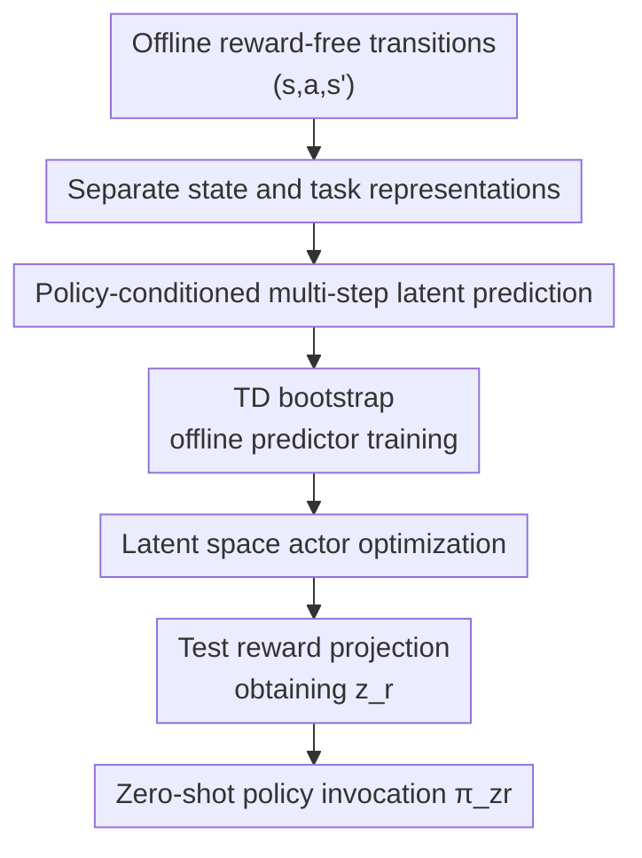

# TD-JEPA: Latent-predictive Representations for Zero-Shot Reinforcement Learning

**Conference**: ICLR 2026  
**OpenReview**: [https://openreview.net/forum?id=SzXDuBN8M1](https://openreview.net/forum?id=SzXDuBN8M1)  
**Code**: https://github.com/facebookresearch/td_jepa  
**Area**: Reinforcement Learning / Zero-Shot Reinforcement Learning / Representation Learning  
**Keywords**: Zero-shot Reinforcement Learning, latent prediction, successor features, temporal difference, reward-free offline RL  

## TL;DR
TD-JEPA transforms JEPA-style latent prediction from an "auxiliary one-step prediction loss" into a "multi-policy, multi-step, TD-trained core objective." By simultaneously learning a state encoder, task encoder, successor-feature predictor, and latent policy on reward-free offline data, it enables zero-shot strategy selection using only a few reward samples at test time.

## Background & Motivation
**Background**: Zero-shot unsupervised reinforcement learning aims to pre-train a generalist agent on reward-free offline interaction data. At test time, given a new reward function or goal, the agent should directly provide a strategy adapted to that task. A mainstream approach involves successor features/measures: learning a task encoder $\psi(s)$ to define a linear reward space, along with a family of policies $\pi_z$ conditioned on latent $z$ and successor features $F(s,a;z)$, such that any reward $r(s)=\psi(s)^\top z_r$ can be approximated via $Q \approx F(s,a;z_r)^\top z_r$.

**Limitations of Prior Work**: The primary bottleneck of this approach is representation learning. Many methods focus on contrastive learning, distance preservation, or bilinear factorization around the task encoder or successor features but do not explicitly learn a control-oriented state encoder. Another category of latent-predictive methods, such as BYOL, BYOL-$\gamma$, and RLDP, can learn state representations from reward-free data but often only predict one-step or multi-step dynamics of the behavior policy, failing to align with the family of policies $\pi_z$ to be optimized at test time.

**Key Challenge**: Zero-shot RL requires representations that predict the long-term state occupancy of a task-conditioned policy, rather than just what happens on average in the dataset. One-step latent dynamics are too shortsighted, and behavior policy dynamics are inconsistent with the downstream optimal policy. Without capturing policy-conditioned long-term dynamics, subsequent successor-feature policy optimization is prone to being built on incorrect state geometry.

**Goal**: The authors aim to solve three specific problems: first, how to learn latent representations with predictive power for the multi-step future from offline, reward-free transition data; second, how to make this prediction target dependent on the policy latent $z$ rather than just the behavior policy in the data; and third, how to turn latent prediction directly into the training objective for zero-shot RL rather than just an auxiliary regularization term.

**Key Insight**: Successor features are essentially the "discounted average of task features visited by a policy over the long term." If a predictor predicts the long-term latent occupancy of policy $\pi_z$ instead of the next frame's latent, it can naturally be interpreted as successor features. Furthermore, successor features satisfy the Bellman equation, allowing them to be trained via TD bootstrap on offline transitions without requiring on-policy long trajectories for every policy.

**Core Idea**: Approximate successor features using policy-conditioned latent prediction in a TD format, converting JEPA's "predictive latent future" into "predicting the long-term task features of a latent policy," thereby training a family of zero-shot callable policies end-to-end.

## Method
TD-JEPA connects the worlds of JEPA-style latent-predictive representation learning and successor-feature zero-shot RL. Instead of learning representations first and then an RL head separately, it uses a TD latent-prediction loss to simultaneously shape representations, the predictor, and the policy.

### Overall Architecture
The input consists of a batch of offline reward-free transitions $(s,a,s')$ and task latents $z$ sampled from the latent space. TD-JEPA uses a state encoder $\phi$ to convert observations into control-oriented state representations, a task encoder $\psi$ to define the expressible reward space, and a predictor $T_\phi(\phi(s),a,z)$ to predict the long-term accumulated task features of policy $\pi_z$ starting from $(s,a)$. An actor $\pi(\phi(s),z)$ selects actions in the latent space to maximize $T_\phi^\top z$.

Training is a closed loop: the current policy provides the next action $a'\sim\pi_z(\phi(s'))$, and the TD target pulls the predictor towards $\psi(s')+\gamma T_\phi(\phi(s'),a',z)$. Simultaneously, the actor is trained to select actions that yield higher predictor scores for the current task latent. At test time, a few reward-bearing samples are used to linearly project the reward function into the $\psi$ space, obtaining $z_r$, and then $\pi_{z_r}$ is directly invoked.

### Key Designs
**1. Policy-conditioned multi-step latent prediction: Aligning JEPA targets with Zero-Shot RL needs**

Traditional latent-predictive RL methods are often written as $P(\phi(s))\approx\phi(s')$, at most predicting further into the future along behavior policy trajectories. TD-JEPA argues this is insufficient for zero-shot RL, as the downstream evaluation requires knowing "what will be visited in the future if policy $\pi_z$ is executed from the current state-action." Thus, it defines the predictor as $T_\phi(\phi(s),a,z)$, explicitly conditioned on action and policy latent $z$. The target is not a future state latent but the long-term successor features of policy $\pi_z$.

This allows the predictor's output to enter value evaluation directly: if the reward is written as $r(s)=\psi(s)^\top z_r$ in the task representation space, then $T_\phi(\phi(s),a,z)^\top z_r$ approximates the Q-value of policy $\pi_z$ for that reward. Latent prediction becomes the zero-shot policy evaluation itself rather than an auxiliary task.

**2. TD-based JEPA loss: Learning long-term successor features from single-hop offline transitions**

Using a Monte Carlo target would require the predictor to match long-term future state representations sampled under $s^+\sim M^{\pi_z}(\cdot|s,a)$:

$$
\mathcal{L}_{MC}=\mathbb{E}\left[\left\|T_\phi(\phi(s),a,z)-\phi(s^+)\right\|^2\right].
$$

This is impractical offline since on-policy trajectories for each potential policy $\pi_z$ are unavailable. TD-JEPA leverages the Bellman equation to rewrite this as a one-step TD objective:

$$
\mathcal{L}_{TD}=\mathbb{E}\left[\left\|T_\phi(\phi(s),a,z)-\psi(s')-\gamma T_\phi(\phi(s'),a',z)\right\|^2\right],
$$

where $a'\sim\pi_z(\cdot|s')$. This bridge allows "predicting long-term latent dynamics" to rely only on $(s,a,s')$ from the dataset while maintaining policy conditioning by sampling $a'$ from the current policy at $s'$.

**3. Separated State and Task Encoders: Letting control and reward representations serve different roles**

The state encoder $\phi:S\to\mathbb{R}^{d_\phi}$ compresses high-dimensional observations for the predictor and actor, while the task encoder $\psi:S\to\mathbb{R}^{d_\psi}$ defines the linear reward space $\mathcal{R}_\psi=\{r(s)=\psi(s)^\top z\}$. To constrain both representations, TD-JEPA trains dual predictors: $T_\phi$ predicts long-term features in the $\psi$ space from $\phi$, and $T_\psi$ predicts long-term features in the $\phi$ space from $\psi$. The actor primarily relies on $T_\phi$ as policy input is $\phi(s)$ and task latent $z$ resides in the $\psi$ space.

**4. Non-contrastive stable training: Orthogonality regularization and target networks**

To prevent representation collapse, TD-JEPA uses target networks (EMA bootstrap) and covariance/orthonormality regularization on $\phi$ and $\psi$. The regularization encourages representations of different states within a batch to be orthogonal while maintaining non-zero norms, effectively keeping the representation matrix close to identity covariance.

### Loss & Training
TD-JEPA training includes three types of objectives. First is the bidirectional TD-JEPA latent-predictive loss:

$$
\widehat{\mathcal{L}}_{TD}(\phi,T_\phi,\psi)=\frac{1}{2B}\sum_i\left\|T_\phi(\phi(s_i),a_i,z_i)-\psi^-(s'_i)-\gamma T^-_\phi(\phi^-(s'_i),a'_i,z_i)\right\|^2.
$$

The network with the minus superscript is the EMA target network used to stabilize the bootstrap target.

Second is orthonormality regularization, which uses pairwise dot products within the batch to penalize correlation between representations while rewarding non-zero norms.

Third is the actor loss. Given sampled $z_i$, the actor produces $\hat a_i\sim\pi(\phi(s_i),z_i)$ and maximizes the predictor's score for that task direction:

$$
\mathcal{L}_{actor}(\pi)=-\frac{1}{B}\sum_i T_\phi(\phi(s_i),\hat a_i,z_i)^\top z_i.
$$

In implementation, DMC uses $\gamma=0.98$ and OGBench uses $\gamma=0.99$. Visual inputs are $64\times64$ RGB stacks with a DrQ-v2 style convolutional encoder.

## Key Experimental Results

### Main Results
Zero-shot performance was evaluated across 13 datasets and 65 tasks, including locomotion in ExoRL/DMC and navigation/manipulation in OGBench.

| Suite | Metric | TD-JEPA | Strongest Baseline | Conclusion |
|-------|--------|---------|--------------------|------------|
| DMCRGB avg | Return | 628.8 ± 5.5 | BYOL-$\gamma$ 582.4 ± 9.8 | Significant lead in pixel control. |
| DMC avg | Return | 661.2 ± 6.3 | FB 648.2 ± 4.1 | Competitive/slightly superior in proprioception. |
| OGBenchRGB avg | Success | 41.34 ± 0.45 | BYOL-$\gamma$ 41.58 ± 0.64 | Overlapping confidence intervals with the best methods. |
| OGBench avg | Success | 37.98 ± 0.77 | FB 39.04 ± 0.66 | Competitive in low-coverage expert data. |

### Ablation Study
| Configuration | Performance (DMCRGB) | Note |
|---------------|----------------------|------|
| TD-JEPA | 628.8 ± 5.5 | Full method: separated $\phi,\psi$, policy-conditioned TD. |
| TD-JEPA symmetric | 598.1 ± 5.9 | Shared state/task encoder; slight performance drop. |
| Contrastive TD-JEPA | 437.2 ± 9.8 | Contrastive instead of predictive; large gap in pixels. |
| BYOL | 513.8 ± 11.6 | Predicts one-step behavior; lacks long-term policy alignment. |
| BYOL-$\gamma$ | 582.4 ± 9.8 | Predicts multi-step behavior; stronger than BYOL but less stable. |

### Key Findings
- **Ours** shows the most stable advantage in pixel-based control. Policy-conditioned long-term prediction forces the encoder to focus on control-relevant factors (e.g., end-effectors, objects) rather than irrelevant visual changes.
- Modeling the dynamics of the optimized policy $\pi_z$ is more effective than modeling the behavior policy dynamics (as in BYOL/BYOL-$\gamma$).
- Separating state and task encoders is beneficial. While a symmetric architecture works, division of labor between control input and reward space definition improves average performance.

## Highlights & Insights
- TD-JEPA beautifully reinterprets JEPA's "predict future latent" as successor-feature estimation, giving a self-supervised objective clear value-function semantics.
- The introduction of TD loss is pivotal. It converts the Monte Carlo requirement of long-term rollouts into an off-policy offline objective.
- Theoretical analysis of non-collapse and successor-measure factorization provides a rigorous foundation for why the algorithm is stable without contrastive samples.

## Limitations & Future Work
- **Theoretical assumptions**: Guarantees rely on idealized conditions such as linear predictors and symmetric transition kernels.
- **Complexity**: Training two encoders, two predictors, an actor, and target networks involves higher computational overhead and hyperparameter tuning than simpler methods.
- **Low-coverage data**: Zero-shot successor features still struggle with significant distribution shifts; regularization like BC or FQL may still be necessary.
- **Reward projection**: The expressivity of tasks is limited by the linear span of $\psi(s)$. Sparse or highly nonlinear rewards may be difficult to approximate.

## Related Work & Insights
- **vs. FB**: FB uses bilinear decomposition for SFs, while TD-JEPA uses non-contrastive latent prediction. TD-JEPA shows a clear advantage in pixel-based control.
- **vs. BYOL-$\gamma$**: Both are self-predictive, but TD-JEPA's target is conditioned on policy $z$, better representing the family of policies to be optimized.
- **Insight for future work**: Pre-training visual representations for robot offline data should consider merging "representation pre-training" with "downstream reward optimization" into a single successor-feature-aware TD objective.

## Rating
- Novelty: ⭐⭐⭐⭐⭐ 
- Experimental Thoroughness: ⭐⭐⭐⭐⭐ 
- Writing Quality: ⭐⭐⭐⭐ 
- Value: ⭐⭐⭐⭐⭐ 

<!-- RELATED:START -->

## Related Papers

- [\[ICLR 2026\] Wavelet Predictive Representations for Non-Stationary Reinforcement Learning](wavelet_predictive_representations_for_non-stationary_reinforcement_learning.md)
- [\[ICLR 2026\] Zero-Shot Adaptation of Behavioral Foundation Models to Unseen Dynamics](zero-shot_adaptation_of_behavioral_foundation_models_to_unseen_dynamics.md)
- [\[ICLR 2026\] Predictive CVaR Q-Learning](predictive_cvar_q-learning.md)
- [\[ICLR 2026\] Bridging Successor Measure and Online Policy Learning with Flow Matching-Based Representations](bridging_successor_measure_and_online_policy_learning_with_flow_matching-based_r.md)
- [\[NeurIPS 2025\] Dynamics-Aligned Latent Imagination in Contextual World Models for Zero-Shot Generalization](../../NeurIPS2025/reinforcement_learning/dynamics-aligned_latent_imagination_in_contextual_world_models_for_zero-shot_gen.md)

<!-- RELATED:END -->
