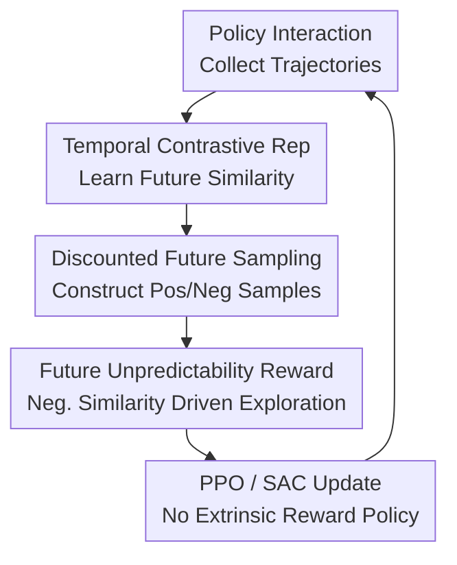

# Temporal Representations for Exploration: Learning Complex Exploratory Behavior without Extrinsic Rewards

**Conference**: ICLR2026  
**OpenReview**: [https://openreview.net/forum?id=KjYpHySlb0](https://openreview.net/forum?id=KjYpHySlb0)  
**Project Website**: [Project Website](https://temp-contrastive-explr.github.io/)  
**Code**: https://github.com/FaisalAhmed0/c-tec.git  
**Area**: Reinforcement Learning / Exploration / Representation Learning  
**Keywords**: Temporal Contrastive Learning, Intrinsic Rewards, Unsupervised Reinforcement Learning, State Coverage, Exploratory Representations

## TL;DR
This paper proposes C-TeC, which utilizes temporal contrastive representations to estimate the similarity between current state-action pairs and future states. By converting the degree to which "future outcomes are difficult to predict in the representation space" into intrinsic rewards, it learns complex exploratory behaviors in maze coverage, robotic arm pick-and-place, and Craftax survival games without extrinsic rewards.

## Background & Motivation
**Background**: Unsupervised reinforcement learning and curiosity-driven exploration typically use intrinsic rewards to drive agents to discover tasks. Common approaches include count/pseudo-count rewards, prediction error rewards such as RND/ICM, state coverage rewards based on representation entropy or KNN distance, and more recent exploration methods based on temporal distance or episodic memory.

**Limitations of Prior Work**: Each of these methods has specific blind spots. Counting methods struggle to define "the same state" in continuous high-dimensional spaces; standard prediction error methods are easily attracted by meaningless random noise (the Noisy TV problem); methods focusing solely on state representation entropy do not necessarily identify which states are truly important for future behavior; and temporal distance methods like ETD, while capturing "temporal structure," require quasimetric parameterization and episodic memory, leading to higher algorithmic complexity and difficulty in integrating with off-policy RL.

**Key Challenge**: Exploration rewards should encourage agents to visit areas they do not yet fully understand without treating random noise as "novel." In other words, rewards should focus on environment dynamics and what the policy can effect in the future, rather than every reconstructable pixel or random bit in the observation.

**Goal**: The authors aim to construct a more direct exploration signal: one that does not rely on extrinsic task rewards, does not explicitly learn a full world model, does not maintain episodic memory, yet can judge which state-action pairs lead to "informative but not yet easily predictable" futures based on the temporal structure within trajectories.

**Key Insight**: RL is essentially a decision-making problem concerning time. A good exploratory representation does not necessarily need to reconstruct the entire input but should preserve information that distinguishes "where one will go from here." Temporal contrastive learning provides this capability by pulling the current state-action pair closer to its discounted future states in the same trajectory while pushing other future states away as negative samples.

**Core Idea**: Utilize temporal contrastive representation to learn a similarity model between current state-action pairs and future states, then use the representation distance corresponding to low-similarity future states as an intrinsic reward, prompting the agent to actively seek states where future outcomes remain unpredictable but are supported by real trajectories.

## Method

### Overall Architecture
The workflow of C-TeC can be understood as a closed loop: the agent first collects trajectories using the current policy and stores them in a buffer; subsequently, it samples state-action pairs $(s_t, a_t)$ from the buffer and draws a future offset $\Delta$ from a geometric distribution to obtain $s_f = s_{t+\Delta}$; the contrastive model learns to judge whether this $s_f$ is indeed the future of $(s_t, a_t)$; finally, the degree to which "the current state-action pair and future state are dissimilar" in the representation space is fed as a reward to PPO or SAC. It does not reward "unseen random observations" but rather rewards "future outcomes that are not yet well-explained by the representation within the future distribution of collected trajectories."

The core contributions in this diagram are the middle three steps: temporal contrastive representation translates "temporal reachability" into representation similarity, discounted future sampling defines how far into the future positive samples are drawn, and the future unpredictability reward converts representation distance into a scalar reward optimizable by RL. Trajectory collection and PPO/SAC updates serve as standard scaffolding, allowing this reward to be used in both on-policy and off-policy settings.

### Key Designs
**1. Temporal Contrastive Representation: Preserving Reachability Information**

Traditional curiosity methods often use "observation prediction" as a target, but complete observations contain much information irrelevant to control. C-TeC chooses to learn two encoders: $\phi_\theta(s_t, a_t)$ encodes the current state-action pair, and $\psi_\theta(s_f)$ encodes the future state. The model does not reconstruct $s_f$ but learns a similarity $C_\theta((s_t, a_t), s_f)$ such that true future states are more similar than other negative samples in the distribution. The resulting representations are closer to a summary of "which futures can be reached from here" rather than an observation compressor.

The paper defines the future state distribution as a discounted occupancy distribution over the trajectory buffer: $p_T(s_f \mid s_t, a_t) = (1-\gamma) \sum_{\Delta=0}^{\infty} \gamma^\Delta p_T(s_{t+\Delta}=s_f \mid s_t, a_t)$. During training, $\Delta \sim \mathrm{Geom}(1-\gamma)$ is sampled first, then $s_{t+\Delta}$ is taken from the same trajectory as a positive sample. This definition is critical: positive samples are not just adjacent frames but discounted futures, allowing the representation to perceive both short-term and long-term reachability.

**2. Future Unpredictability Reward: Converting Low Temporal Similarity into Exploration Signals**

Once the contrastive model is trained, C-TeC does not directly reward classification accuracy. Instead, it rewards the negative similarity between the current state-action pair and sampled future states. If similarity is expressed as negative distance, e.g., $C_\theta((s_t, a_t), s_f) = -\|\phi_\theta(s_t, a_t) - \psi_\theta(s_f)\|$, then the intrinsic reward is $r_{\mathrm{intr}}(s_t, a_t) = -C_\theta((s_t, a_t), s_f)$. Intuitively, the agent is encouraged to go to positions where future outcomes are not yet easily predicted by the temporal representation.

The difference from ordinary surprise maximization is that C-TeC's "surprise" is filtered through the temporal contrastive representation. If random noise does not help distinguish trajectory futures, it will not stably improve contrastive classification ability nor become a strong reward source. This is emphasized in the Noisy TV setup: representations only capture features useful for temporal classification, making them less sensitive to classification-irrelevant random perturbations.

**3. Reverse KL Perspective: Rewarding Multiple Future Possibilities on Familiar Support**

The authors provide an insightful interpretation: if the contrastive critic perfectly estimates point mutual information, the expected intrinsic reward can be written as $-D_{\mathrm{KL}}[p_T(s_f \mid s_t, a_t) \| p_T(s_f)]$. This is not simple state entropy maximization, nor does it fit the conditional future distribution to a broad mean-style distribution; rather, it biases toward mode-seeking behavior.

Expanding this reveals two terms: one is $H[S_f \mid s_t, a_t]$, which encourages the future following the current state-action to be more dispersed; the other is $\mathbb{E}_{p_T(s_f \mid s_t, a_t)}[\log p_T(s_f)]$, which requires these future states to still fall within regions already supported by the buffer. This explanation clarifies why C-TeC prefers positions that "can lead to many real futures" rather than being drawn into completely unfamiliar but meaningless noise.

**4. Simplified Temporal Exploration: No Quasimetrics or Episodic Memory**

Like ETD, C-TeC utilizes temporal contrastive ideas but simplifies the design significantly. ETD explicitly learns quasimetric distances and calculates the minimum temporal distance from the current state to historical states via episodic memory. C-TeC calculates $L_1$ or $L_2$ distance directly between two representations, requiring no metric residual network and no maintenance of episodic memory for "where it has been."

This simplification is not merely an engineering optimization. The paper argues that ETD's signal is more backward-looking (how far the current state is from the past), while C-TeC is more forward-looking (what future state distribution the current state-action pair can lead to). For long-chain open-world tasks like Craftax, forward-looking rewards may more easily encourage agents to discover states that unlock subsequent skills and resources.

### Mechanism
Consider a humanoid agent starting at the entrance of a U-shaped maze. Early trajectories only fluctuate near the entrance, and future states in the buffer are concentrated nearby. The contrastive model quickly learns that from certain actions at the entrance, the short-term future is likely still near the entrance. Consequently, these future states and state-action pairs become close in representation space, and rewards gradually decrease.

When the policy accidentally moves toward walls, jump-points, or climbing postures, subsequent trajectories might suddenly enter the other side of the maze. For the current representation, these distant future states are no longer as predictable as local movements, so $\|\phi(s_t, a_t) - \psi(s_f)\|$ increases, and rewards rise. RL updates then increase the probability of such action sequences, leading the agent into positions that generate new future distributions. The `humanoid-u-maze` results reflect this: C-TeC learns to jump over walls to escape the maze, while other exploration methods fail to find this effective behavior.

In Craftax, a random policy might only move around. If C-TeC finds that certain states lead to future branches like "gathering resources, crafting tools, or opening new areas," it assigns higher rewards to those state-action pairs. It does not know external achievement rewards, but changes in the structure of the future distribution itself serve as exploration signals, ultimately unlocking more achievements.

### Loss & Training
The contrastive model is trained using InfoNCE. For a batch $B = \{(s_t^{(i)}, a_t^{(i)}, s_f^{(i)})\}_{i=1}^{K}$, the future state of each sample serves as the positive sample, while future states of other samples in the batch serve as negative samples. The loss encourages $C_\theta((s_t^{(i)}, a_t^{(i)}), s_f^{(i)})$ to be higher than $C_\theta((s_t^{(i)}, a_t^{(i)}), s_f^{(j)})$. A LogSumExp regularizer, common in contrastive RL, is used along with a learned temperature parameter $\tau$.

For policy training, SAC is used for continuous control experiments, while PPO is used for Craftax, including PPO-RNN with GRU memory. In robotic environments, negative $L_1$ distance works best for the critic similarity, while negative $L_2$ distance is better for Craftax. The authors emphasize the need for unit-norm normalization of representations; ablation shows that omission significantly harms exploration.

Implementation-wise, C-TeC adds trajectories to the buffer after each interaction, samples $(s_t, a_t)$ and discounted $s_f$, calculates intrinsic rewards, and updates the contrastive representation and RL policy. Most environments use a single future state to approximate the expectation; in Craftax, to reduce variance, the authors use Monte Carlo estimation with multiple future states, utilizing a return-accumulation trick to reduce computation from $O(H^2)$ to $O(H)$.

## Key Experimental Results

### Main Results
The paper validates whether C-TeC can replace the more complex ETD, whether rewards reflect future state distributions, and its ability to learn exploratory behaviors in locomotion, manipulation, and open-world survival (ant_maze, humanoid_u_maze, arm_binpick, Craftax, Crafter).

| Scenario | Metric | Ours (C-TeC) | Prev. SOTA/Methods | Conclusion |
|------|------|-----------|--------------|------|
| ant_hardest_maze vs ETD | States visited | Close to ETD | ETD | Comparable performance without quasimetrics |
| humanoid_u_maze vs ETD | States visited | Higher than ETD | ETD | C-TeC discovers complex behaviors (jumping) more easily |
| arm_binpick_hard vs ETD | Cube coverage | Lower than ETD | ETD | ETD remains stronger in some manipulation scenarios |
| Crafter / Craftax | Score / Achievements | Significantly higher | ETD, RND, ICM, E3B | Forward-looking rewards are highly effective in open worlds |

C-TeC also demonstrates strong state coverage with limited environment steps.

| Environment | 500M steps | 50M steps | 30M steps | Description |
|------|------|-----------|-----------|------|
| Ant-hardest-maze | $2500 \pm 300$ | $1916 \pm 430$ | $1119 \pm 304$ | Large coverage even with 10-16x fewer steps |
| Humanoid-u-maze | $230 \pm 40$ | $143 \pm 34$ | $102 \pm 11$ | Significant exploration in high-dimensional humanoid |
| Arm-binpick-hard | $135000 \pm 10000$ | $40000 \pm 14000$ | $31150 \pm 3156$ | Coverage scales with steps, peak at 500M |

### Ablation Study
| Configuration | Key Impact | Description |
|------|---------|------|
| Full C-TeC | Highest state coverage | Best combination of normalization, InfoNCE, and discounted sampling |
| No normalization | Coverage drops significantly | Unit norm constraint is vital for similarity scale stability |
| Monolithic critic $f(s,a,s_f)$ | Much weaker than dual encoder | Decomposition of $\phi(s,a)$ and $\psi(s_f)$ is key for geometry |
| Forward KL reward | Much weaker than reverse KL | Confirms mode-seeking signals are necessary for exploration |
| Critic distance choice | $L_1$ best for robotics, $L_2$ for Craftax | Similarity function requires environment tuning |
| Future sampling variation | Most variants remain strong | Robust to geometric vs uniform sampling and $\gamma$ schedules |

### Key Findings
- C-TeC’s advantage lies in its simpler representation distance and omission of episodic memory, while remaining competitive in continuous control and superior in long-range open-world tasks.
- Reward heatmaps show that C-TeC rewards migrate as the policy's coverage changes: rewards decrease for familiar states and increase for areas where future distributions are not yet explained.
- Noisy TV experiments prove it is not easily deceived by pure random noise, a major advantage of temporal contrastive representations over prediction error.
- The two most critical ablation points are representation parameterization (dual encoder) and the reward direction (reverse-KL/mode-seeking).

## Highlights & Insights
- The primary highlight is shifting "exploration" from state novelty to "future predictability." It rewards whether the current action opens future distributions that the representation model has not yet mastered.
- The method is cleaner than ETD: no quasimetrics, no episodic memory, and no explicit looking back. This facilitates integration with off-policy algorithms like SAC and reduces complexity.
- The reverse KL interpretation explains both the resistance to Noisy TV and the persistence of exploration. It requires future states to stay within existing marginal support while keeping the conditional distribution dispersed.
- Representation learning is not an auxiliary task but part of the reward definition. The failure of the monolithic critic shows that without the distance structure between two representation spaces, simple triplet classification does not naturally form an exploratory geometry.
- Insights for other tasks: As long as "current decision unit" and "future outcome" can be defined, C-TeC can be applied to skill discovery, offline pre-training, and goal-conditioned RL.

## Limitations & Future Work
- C-TeC still requires a large number of environment interactions (up to 1B steps for Craftax), which is costly for real robotics.
- Similarity functions and discount factors are environment-dependent. Finding optimal settings for $L_1$/$L_2$ and $\gamma_{cl}$ still requires tuning.
- In `arm_binpick_hard`, ETD outperforms C-TeC, suggesting forward-looking rewards are not always superior to backward-looking novelty in manipulation, where causal control might matter more.
- Current experiments focus on exploration without extrinsic rewards. Future work should investigate combining this with task rewards and adapting to pixel inputs or POMDPs.
- For real robots, C-TeC must handle safety constraints. Relying solely on "future unpredictability" might encourage dangerous states, requiring integration with risk estimation.

## Related Work & Insights
- **vs RND / ICM**: RND/ICM use prediction error for curiosity, which wastes rewards on noise. C-TeC's prediction target is temporal contrastive classification, focusing representation on reachability and ignoring random perturbations.
- **vs APT**: APT estimates state entropy via KNN distance in observation space. C-TeC learns the temporal structure between state-action pairs and futures, serving control and long-term exploration more directly.
- **vs ETD**: ETD learns quasimetric distances and uses episodic memory for novelty; C-TeC uses representation distance to reward state-action pairs leading to low-predictability futures. ETD is backward-looking novelty; C-TeC is forward-looking reachability distribution.
- **vs World-model exploration**: World models predict or reconstruct future observations, which is computationally expensive and prone to irrelevant details. C-TeC is a lightweight temporal structure model that only learns to distinguish discounted futures.
- **Insight**: If a task's core difficulty is finding states that unlock subsequent possibilities rather than immediate goals, future-distribution rewards like C-TeC are highly suitable, especially in open worlds or pre-training.

## Rating
- Novelty: ⭐⭐⭐⭐☆ Combines negative temporal similarity, reverse-KL interpretation, and omission of episodic memory into a coherent framework.
- Experimental Thoroughness: ⭐⭐⭐⭐☆ Covers locomotion, manipulation, and Craftax with extensive ablations; lacks some tabular values in main figures and real-world robot validation.
- Writing Quality: ⭐⭐⭐⭐☆ Clear methodology and information-theoretic explanations, though with minor formatting issues in equations and numbering.
- Value: ⭐⭐⭐⭐⭐ A valuable reference for unsupervised RL exploration, providing a simpler, more noise-robust framework than ETD.

<!-- RELATED:START -->

## Related Papers

- [\[ICLR 2026\] Exploratory Diffusion Model for Unsupervised Reinforcement Learning](exploratory_diffusion_model_for_unsupervised_reinforcement_learning.md)
- [\[ICLR 2026\] Lookahead Tree-Based Rollouts for Enhanced Trajectory-Level Exploration in Reinforcement Learning with Verifiable Rewards](lookahead_tree-based_rollouts_for_enhanced_trajectory-level_exploration_in_reinf.md)
- [\[ICLR 2026\] Diversity-Incentivized Exploration for Versatile Reasoning](diversity-incentivized_exploration_for_versatile_reasoning.md)
- [\[ICLR 2026\] Beyond Noisy-TVs: Noise-Robust Exploration Via Learning Progress Monitoring](beyond_noisy-tvs_noise-robust_exploration_via_learning_progress_monitoring.md)
- [\[ICLR 2026\] Dual Goal Representations](dual_goal_representations.md)

<!-- RELATED:END -->
