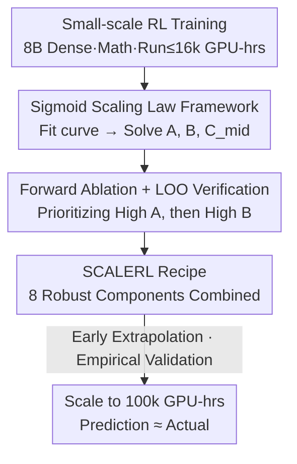

# The Art of Scaling Reinforcement Learning Compute for LLMs

**Conference**: ICLR 2026  
**OpenReview**: [https://openreview.net/forum?id=FMjeC9Msws](https://openreview.net/forum?id=FMjeC9Msws)  
**Code**: [www.devvrit.com/scalerl_curve_fitting](https://www.devvrit.com) (Minimal reproduction script for curve fitting)  
**Area**: Reinforcement Learning / LLM Post-training / Scaling Law  
**Keywords**: RL Scaling Laws, Predictable Scaling, Computational Efficiency, PipelineRL, SCALERL

## TL;DR
This paper introduces a sigmoid-shaped "compute-performance" scaling law that decomposes LLM RL training into two fittable parameters: "performance ceiling $A$" and "computational efficiency $B$." Based on 400,000 GPU-hours of systematic ablation, the authors identify a robust recipe called SCALERL. By extrapolating curves from low-compute runs, they accurately predicted final validation performance in a single 100,000 GPU-hour training run, bringing pre-training-level predictability to RL.

## Background & Motivation
**Background**: Reinforcement Learning (RL) has become a core component of LLM post-training, unlocking capabilities like test-time thinking and agentic behavior. Compute investment is soaring exponentially: the RL phase of DeepSeek-R1-Zero consumed 100,000 H800 GPU-hours, and RL compute for models like o1→o3 and Grok-3→Grok-4 is estimated to jump by over 10×.

**Limitations of Prior Work**: However, "how to scale RL" remains more art than science. Recent breakthroughs mostly stem from isolated algorithmic research (DAPO, GSPO, CISPO) or model-specific training reports (Magistral, MiniMax-M1). These provide ad-hoc solutions for specific scenarios, leaving the question of whether an RL method can improve predictably as compute increases unanswered. While pre-training has scaling laws like Kaplan or Chinchilla to extrapolate from small to large models, RL lacks corresponding tools.

**Key Challenge**: Without reliable "prior screening" methods, judging an RL recipe requires running it to the compute limit, which excludes most of academia and turns design choices into "alchemy." Worse, methods that appear superior at small scales often perform worse when scaled up (the "bitter lesson"), meaning small-scale comparisons can be systematically misleading.

**Goal**: (1) Establish a "compute-performance" prediction framework for RL similar to pre-training scaling laws; (2) Use this framework to systematically ablate common design choices to determine if they raise the performance ceiling or merely improve efficiency; (3) Combine the optimal choices into a predictably scalable recipe.

**Key Insight**: The authors observed that RL validation set pass rates grow saturately with $\log(\text{compute})$—slow at low compute, fast in the middle, and saturating at high compute—matching a sigmoid shape. Consequently, they replaced power laws used in pre-training with a sigmoid curve for fitting, which proved significantly more robust in empirical tests.

**Core Idea**: Use the sigmoid scaling law to decouple RL performance into an "asymptotic ceiling $A$" and "computational efficiency $B, C_{mid}$." By estimating these parameters from early training dynamics, the scalability of a method can be predicted at low compute, enabling the selection and assembly of the SCALERL recipe.

## Method

### Overall Architecture
The "method" in this paper is not the invention of a new RL algorithm but rather the establishment of a **yardstick for scalability** (the sigmoid scaling law), followed by using this yardstick to **systematically ablate and select components**, and finally assembling the winning components into the **SCALERL recipe** while verifying its predictable scaling to extreme compute.

The pipeline is as follows: Run a set of low-compute RL sessions (single run ≤16k GPU-hours) on 8B dense models and verifiable math tasks → Fit a sigmoid curve to each run to solve for $(A, B, C_{mid})$ → Perform "forward ablation," prioritizing options with high $A$ (or high $B$ if $A$ is equal) across each design axis → Merge optimal choices into SCALERL and use "Leave-One-Out" (LOO) to verify each component's positive contribution → Finally, scale SCALERL to a 100,000 GPU-hour run, using the first 50k hours to extrapolate the latter 50k to confirm the prediction matches observations.

### Key Designs

**1. Sigmoid Scaling Law Framework: Decoupling "Ceiling $A$" and "Efficiency $B$"**

The pain point is that RL lacks predictable metrics: it is often unclear if a recipe has a "higher ceiling" or "faster convergence." This paper fits a saturated sigmoid curve between "expected reward $R_C$ (iid validation pass rate)" and "training compute $C$":

$$R_C - R_0 = (A - R_0)\cdot\frac{1}{1+(C_{mid}/C)^B}$$

Where $0\le A\le 1$ is the **asymptotic pass rate (performance ceiling)** at the limit of compute; $R_0$ is the initial reward at zero compute; $B>0$ is the scaling exponent determining **computational efficiency** (steeper climb); and $C_{mid}$ is the compute required to reach half of the total gain. Intuitively, $A$ characterizes "how strong the method can eventually become," while $B$ and $C_{mid}$ characterize "how fast it gets there." The authors chose a sigmoid over power laws because pass rate is a bounded metric (saturating at 1). By ignoring the initial ~1.5k GPU-hours of noisy data, the remaining trend follows a predictable trajectory. This tool allows researchers to **predict scalability before exhausting compute budgets**, serving as an antidote to the "bitter lesson."

**2. Forward Ablation + LOO: Systematic Component Screening**

The authors split the ablation process into two steps. **Forward Ablation**: Starting from a "baseline" GRPO (without KL regularization, using DAPO asymmetric clipping), they tested options across six design axes (loss aggregation, advantage normalization, precision fixes, data curriculum, batch definition, and loss type) plus an asynchronous RL setup. Each option was fitted with a curve using 3.5k–4k GPU-hours. **The selection criterion prioritizes raising $A$ first, then $B$**. A key empirical finding was that while asynchronous algorithms, loss functions, and model precision significantly affect $A$, other interventions (loss aggregation, curriculum, length penalty, advantage normalization) mostly tune efficiency $B$ without moving the ceiling.

After merging winners into SCALERL, **Leave-One-Out (LOO)** validation was performed: starting from the full SCALERL, one component at a time was reverted to baseline and retrained to 16k GPU-hours to ensure every component contributes positively. Since many LOO variants have similar ceilings $A$, the authors rewrote the sigmoid as a power law form $F(R_C)=C^B$ to visualize the slope $B$ on $\log F$–$\log C$ plots, proving SCALERL's superior efficiency.

**3. SCALERL Recipe: 8 Robust Components for Predictable Scaling**

SCALERL combines eight selected components: ① **Asynchronous PipelineRL-8**—The generator streams rollouts; the trainer pushes updated parameters to the generator (using stale KV caches to continue generation), leading by up to $k=8$ steps. This matches the $A$ of traditional PPO-off-policy but drastically reduces idle time, increasing $B$. ② **Forced Length Termination**—Inserting a `</think>` phrase to force the model to conclude "thinking" instead of using length penalties. ③ **CISPO Loss**—Clipping importance sampling with the original policy gradient, using stop-gradient on the IS ratio $\text{sg}(\min(\rho_{i,t},\epsilon))$. This significantly raises $A$ compared to DAPO. ④ **Prompt-level Loss Aggregation** (equal weight per prompt). ⑤ **Batch-level Advantage Normalization** (normalized by reward standard deviation across the entire batch). ⑥ **FP32 Logits**—Fixing numerical mismatch between generator and trainer kernels at the LM head, which otherwise contaminates IS ratios; this raised $A$ from 0.52 to 0.61. ⑦ **Zero-variance Filtering**—Discarding prompts where all rollouts in a batch have identical rewards (zero advantage). ⑧ **No-Positive-Resampling**—Removing prompts once they reach a pass rate ≥ 0.9.

The final loss function is:

$$J_{\text{SCALERL}}(\theta)=\mathbb{E}\Big[\tfrac{1}{\sum_g |y_g|}\sum_{i}\sum_{t}\text{sg}(\min(\rho_{i,t},\epsilon))\,\hat A_i^{norm}\log\pi_\theta^{train}(y_{i,t})\Big]$$

### Loss & Training
Main Experiment: 8B dense model, verifiable math tasks, batch size 768, max output 14,336 tokens. A set of 1000 iid prompts from Polaris-53k was used for validation, measuring mean@16 pass rate every 100 steps to fit the curve. Forward ablation used 3.5k–4k GPU-hours, LOO used 16k, and final scaling reached 100k GPU-hours (8B) / 50k (17B×16 Scout MoE).

## Key Experimental Results

### Main Results
Comparison of asymptotic ceiling $A$ between SCALERL and mainstream recipes on iid validation (Eq. 1):

| Method | Source Example | Asymptotic Ceiling $A$ | Predictability |
|------|----------|----------------|----------|
| GRPO | DeepSeek | Lower | Large Extrapolation Bias |
| DAPO | Qwen-2.5 | Lower | — |
| Magistral | Mistral | Medium | — |
| MiniMax-M1 (CISPO) | MiniMax | Higher | Stable Extrapolation |
| **SCALERL** | Ours | **0.61 (Highest)** | Accurate 50k→100k Extrapolation |

Predictable scaling verification (extrapolated curves match actual points "×" during extended training):

| Scaling Axis | Setting | Effect |
|--------|------|------|
| Model Scale | 8B → 17B×16 MoE (Scout) | Ceiling significantly raised; beats 8B using 1/6 compute |
| Generation Length | 14k → 32k tokens | Slower initially ($B$↓, $C_{mid}$↑) but raises ceiling $A$ |
| Global Batch | → 2k | Stable training; 50k→100k extrapolation matches |
| Rollouts per Prompt | 8/16/24/32 (Fixed Total Batch) | Curve remains largely unchanged (second-order choice) |

### Ablation Study
LOO (reverting single component, 16k GPU-hours) and Forward Ablation key conclusions:

| Configuration | Influence on $A$ / $B$ | Description |
|------|---------------------|------|
| Full SCALERL | $A=0.61$, highest $B$ | Complete recipe with highest efficiency |
| w/o FP32 logits | $A$ 0.61 → 0.52 | Largest single-item ceiling drop |
| CISPO replaced by DAPO | $A$ drops significantly | Loss type significantly moves the ceiling |
| PipelineRL replaced by PPO-off-policy | Same $A$, lower $B$ | Hurts efficiency, not the ceiling |
| Reverting Loss Agg. / Norm. / Curriculum | $A$ unchanged, $B$ drops slightly | These mostly tune efficiency |

### Key Findings
- **Distinct Division of Labor**: Asynchronous algorithms, loss functions, and model precision primarily determine the ceiling $A$. Other components (aggregation, normalization, curriculum, filtering) mostly influence efficiency $B$.
- **FP32 Logits is the most cost-effective fix**: Simply calculating the LM head in FP32 raised $A$ from 0.52 to 0.61 by fixing the numerical mismatch contaminating IS ratios.
- **Asymmetry between Forward and Backward Ablation**: In forward ablation, new components often improve both $A$ and $B$. However, in LOO from the full recipe, each component's impact on $A$ is small, but they collectively sustain $B$—indicating gathered robustness from cumulative effects.
- **The Bitter Lesson Confirmed**: Methods that lead at low compute (e.g., certain DAPO configs) are often overtaken during scaling, but fitting $(A, B)$ early can predict who will win at the limit.

## Highlights & Insights
- **Quantifying "Scalability" with two numbers**: Decoupling $A$ (ceiling) and $B$ (efficiency) transforms the evaluation of RL tricks from "alchemy" into a fittable, predictable science.
- **Predicting High-Compute with Low-Compute**: Using ≤16k GPU-hours to predict a 100k GPU-hour run allows academia to participate in RL recipe research by fitting early curves instead of "burning to the limit."
- **Sigmoid vs. Power Law**: Choosing a saturated curve for bounded metrics (pass rate) is a valuable strategy for any accuracy-based scaling law.
- **Robustness through Combination**: SCALERL does not invent new algorithms but proves that "predictable scaling" relies more on engineering robustness (precision, asynchrony, filtering) than on novel losses.

## Limitations & Future Work
- **Focus on In-distribution Performance**: The scaling law fits the iid validation set; the laws governing true out-of-distribution generalization remain partially uncharacterized.
- **Narrow Task Range**: Experiments focused on math; predictability under multi-task scenarios and varying data ratios requires further study.
- **Lack of a Multi-dimensional Scaling Law**: This work focuses on compute-performance curves for fixed models/data. A complete scaling law integrating model size and data volume is future work.

## Related Work & Insights
- **vs. ProRL**: ProRL uses heuristics (KL, policy reset, entropy) for stable long-term training on 1.5B models; this work uses 6× more compute and larger models, focusing on the scaling law framework.
- **vs. LitePPO**: LitePPO conducts design ablations under consistent conditions on 4B/8B models but focuses on comparative empirical results; this work explicitly fits and extrapolates scaling curves.
- **vs. Training Reports (DAPO/MiniMax-M1, etc.)**: These provide ad-hoc recipes; this work unifies components into the $(A, B)$ framework to quantify scalability and assemble a SOTA recipe.

## Rating
- Novelty: ⭐⭐⭐⭐⭐ First systematic application of pre-training scaling law methodology to LLM RL training; the $A/B$ decoupling is a new paradigm.
- Experimental Thoroughness: ⭐⭐⭐⭐⭐ 400k GPU-hour systematic ablation + 100k GPU-hour scaling validation is exceptionally rigorous.
- Writing Quality: ⭐⭐⭐⭐⭐ Clear principles, self-consistent logic, and well-structured presentation.
- Value: ⭐⭐⭐⭐⭐ Reduces RL recipe research from "burn to the limit" to "fit early curves," with direct utility for both academia and industry.

<!-- RELATED:START -->

## Related Papers

- [\[ICLR 2026\] floq: Training Critics via Flow-Matching for Scaling Compute in Value-Based RL](floq_training_critics_via_flow-matching_for_scaling_compute_in_value-based_rl.md)
- [\[ICLR 2026\] PROS: Towards Compute-Efficient RLVR via Rollout Prefix Reuse](pros_towards_compute-efficient_rlvr_via_rollout_prefix_reuse.md)
- [\[ICLR 2026\] ReTool: Reinforcement Learning for Strategic Tool Use in LLMs](retool_reinforcement_learning_for_strategic_tool_use_in_llms.md)
- [\[ICLR 2026\] QeRL: Quantization-enhanced Low-rank Reinforcement Learning for LLMs](qerl_beyond_efficiency_-_quantization-enhanced_reinforcement_learning_for_llms.md)
- [\[ICLR 2026\] Erase to Improve: Erasable Reinforcement Learning for Search-Augmented LLMs](erase_to_improve_erasable_reinforcement_learning_for_search-augmented_llms.md)

<!-- RELATED:END -->
