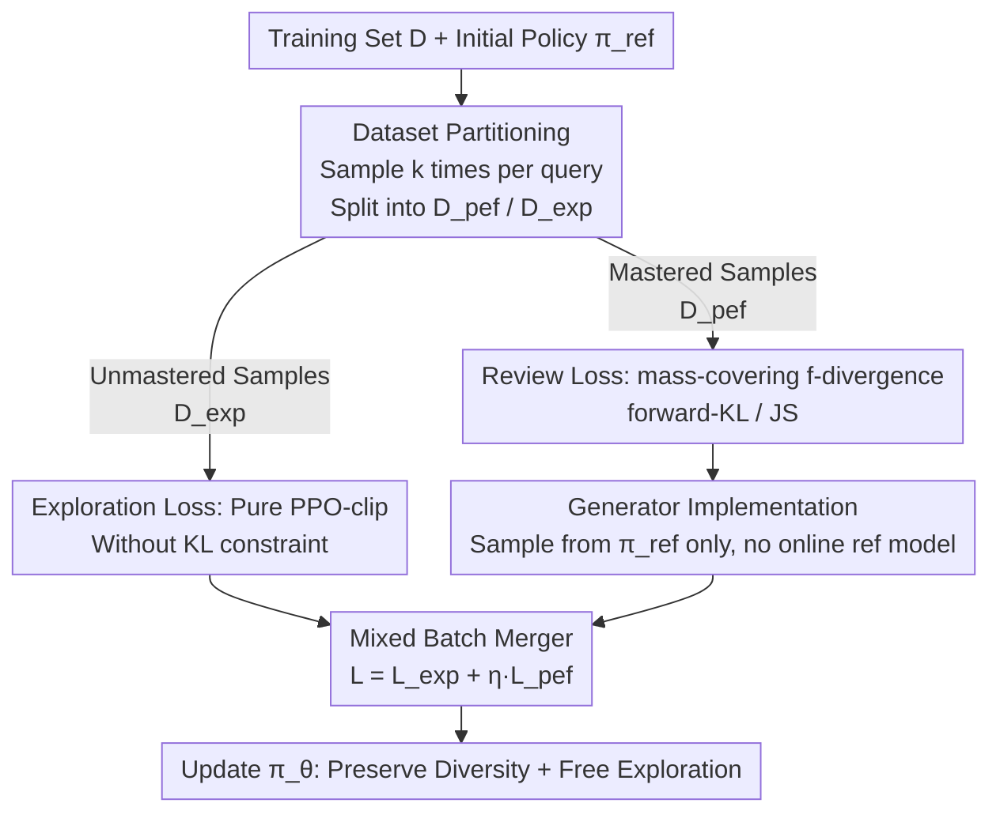

# The Choice of Divergence: A Neglected Key to Mitigating Diversity Collapse in Reinforcement Learning with Verifiable Reward

**Conference**: ICLR 2026  
**OpenReview**: [https://openreview.net/forum?id=xPEsxcO7F7](https://openreview.net/forum?id=xPEsxcO7F7)  
**Code**: https://github.com/seamoke/DPH-RL (Available)  
**Area**: LLM Reasoning / Reinforcement Learning / RLVR  
**Keywords**: RLVR, Diversity Collapse, f-divergence, Pass@k, Catastrophic Forgetting

## TL;DR
This paper identifies that the commonly used reverse-KL (mode-seeking) regularization in RLVR is the primary cause of Pass@k diversity collapse and catastrophic forgetting. It proposes using mass-covering f-divergences (forward-KL / JS) as a "review mechanism," combined with dataset partitioning and generator-based implementations, to simultaneously improve Pass@1 and Pass@k while preserving cross-domain capabilities in mathematics and SQL tasks.

## Background & Motivation

**Background**: Reinforcement Learning with Verifiable Rewards (RLVR, such as GRPO and DAPO) is a mainstream approach for enhancing LLM mathematical and code reasoning. Rewards are derived from answer correctness, with a KL divergence term constraining the policy to remain close to a reference model.

**Limitations of Prior Work**: An anomalous phenomenon exists where the single-attempt accuracy (Pass@1) increases after RLVR fine-tuning, but the multi-attempt accuracy (Pass@k) stagnates or falls below the base model. This is accompanied by catastrophic forgetting, where the model only correctly answers about 85% of previously solved problems on out-of-distribution (OOD) tasks. This suggests RLVR overfits the model to a minority of known solutions rather than learning new reasoning patterns, sacrificing solution diversity.

**Key Challenge**: The community almost exclusively uses standard reverse-KL $D_{\mathrm{KL}}(\pi_\theta\|\pi_{\mathrm{ref}})=\mathbb{E}_{\pi_\theta}\log\frac{\pi_\theta}{\pi_{\mathrm{ref}}}$. Its **mode-seeking** nature actively narrows the policy toward a single high-probability solution, accelerating diversity decay. Conversely, removing the KL term entirely (GRPO w/o KL, DAPO) eliminates the guardrails preventing the model from drifting away from its original knowledge base. Both approaches lack a mechanism to "preserve existing knowledge."

**Goal**: Within the online RLVR framework, achieve continued improvements in Pass@1 while maintaining Pass@k and cross-domain generalization to avoid catastrophic forgetting.

**Key Insight**: The research shifts focus from the three frequently studied axes—entropy control, Pass@k rewards, and training recipes—to a neglected fourth axis: the **choice of the divergence term itself**. The f-divergence family includes "mass-covering" members like forward-KL, JS, and $\alpha$-divergence, which penalize the policy for missing any peaks in the reference distribution. Theoretically, these address diversity collapse but have previously only been used in offline RL or preference alignment (f-DPO, f-PO).

**Core Idea**: Redefine the divergence term from a "mere policy constraint" to an "active diversity preservation mechanism." By using mass-covering forward-KL/JS divergence to constantly refer back to the initial policy, the model is forced to "review" its existing broad knowledge base, fundamentally preventing collapse and forgetting.

## Method

### Overall Architecture

DPH-RL (Diversity-Preserving Hybrid RL) optimizes the policy with f-divergence regularization:

$$\max_{\pi_\theta}\ \mathbb{E}_{q\sim D}\Big[\mathbb{E}_{a\sim\pi_\theta(\cdot|q)}[r(a|q)]-\eta\, D_f\big(\pi_\theta(\cdot|q)\,\|\,\pi_{\mathrm{ref}}(\cdot|q)\big)\Big]$$

However, the authors found that "applying regularization uniformly to all queries" is suboptimal. For simple problems where $\pi_{\mathrm{ref}}$ already performs well, aggressive reward maximization harms existing capabilities. For difficult problems where $\pi_{\mathrm{ref}}$ fails, the divergence term excessively constrains $\pi_\theta$ and limits exploration. Thus, DPH-RL partitions the dataset $D$ based on mastery: **Pre-sampling** performs partitioning, and **Online training** applies dual losses for the two subsets using a generator-based implementation to avoid an online reference model. The pipeline is as follows:

### Key Designs

**1. Using mass-covering f-divergence as a "Review Mechanism": Turning constraints into diversity drivers**

This is the core thesis. f-divergence is unified as $D_f(p\|q)=\int q(x)\,f\!\big(\frac{p(x)}{q(x)}\big)\,dx$, where $f$ is a convex function with $f(1)=0$. Reverse-KL is mode-seeking and contracts $\pi_\theta$ toward a single peak of $\pi_{\mathrm{ref}}$. Ours defines "forward-KL" as $D_{\text{forward-KL}}(\pi_\theta\|\pi_{\mathrm{ref}})\triangleq D_{\mathrm{KL}}(\pi_{\mathrm{ref}}\|\pi_\theta)=\mathbb{E}_{a\sim\pi_{\mathrm{ref}}}[\log\pi_{\mathrm{ref}}(a|q)-\log\pi_\theta(a|q)]$. Its **mass-covering** property heavily penalizes cases where $\pi_{\mathrm{ref}}$ assigns high probability but $\pi_\theta$ assigns near-zero probability, forcing the new policy to cover all modes of the reference policy. JS divergence is a symmetric, more stable alternative that prevents collapse while maintaining high similarity. Intuitively, forward-KL creates an "anchor dataset" for the model to review the initial knowledge base.

**2. Pre-sampling Dataset Partitioning: Dividing queries into "Review" and "Exploration" zones**

To ensure the regularization constrains when necessary and allows freedom when needed, a pre-sampling partition is performed. For each query $Q$, $k$ independent samples are generated and evaluated. Based on accuracy thresholds, queries are categorized as "near-perfect" or "exploration," entering $D_{\mathrm{pef}}$ and $D_{\mathrm{exp}}$ respectively. To eliminate sampling bias, an additional sample is collected for queries in $D_{\mathrm{pef}}$; they remain in $D_{\mathrm{pef}}$ only if this sample is also correct. This ensures the forward-KL review acts only on problems the model has truly mastered.

**3. Dual-Loss Mixed Online Training: Optimization for exploration, divergence for review**

During the online phase, both subsets are trained using different losses. For difficult queries in $D_{\mathrm{exp}}$, the KL penalty is removed to grant maximum exploration freedom using the standard PPO-clip objective $L_{\text{DPH-exp}}(\theta)$. For mastered queries in $D_{\mathrm{pef}}$, the f-divergence loss $L_{\mathrm{pef}}(\theta)=\mathbb{E}_{q\sim D_{\mathrm{pef}}}[D_f(\pi_\theta\|\pi_{\mathrm{ref}})]$ is applied to preserve capability. Combined loss: $L_{\text{DPH-RL}}(\theta)=L_{\mathrm{exp}}(\theta)+\eta\,L_{\mathrm{pef}}(\theta)$. The authors also theoretically provide an **Enhanced Monotonic Improvement guarantee** (Theorem 1).

**4. Generator-based Implementation: Eliminating the online reference model**

Calculating $D_f$ according to the divergence definition requires online inference of $\pi_{\mathrm{ref}}(a|q)$ and re-sampling from $\pi_\theta$, which is expensive. Ours uses a generator form: relying on static samples drawn from $\pi_{\mathrm{ref}}$ during pre-sampling to estimate the divergence. This eliminates the need to run the reference model during the training loop, saving time and memory.

### Loss & Training
The total objective is $L_{\text{DPH-RL}}=L_{\mathrm{exp}}+\eta L_{\mathrm{pef}}$. $D_{\mathrm{exp}}$ uses KL-free PPO-clip, while $D_{\mathrm{pef}}$ uses forward-KL or JS review loss. Baselines include GRPO/DAPO/RKL across models like Llama-3.1-8B, Qwen2.5-Math-7B, and OmniSQL-32B. $\eta$ is the critical hyperparameter controlling review intensity.

## Key Experimental Results

### Main Results

SQL Task (Llama-3.1-8B-Instruct), Bird as In-Domain, Spider as Cross-Domain:

| Dataset | Metric | Base | GRPO | DAPO | RKL | DPH-F | DPH-JS |
|--------|------|------|------|------|------|-------|--------|
| Bird | Greedy | 42.4 | 58.5 | 60.0 | 60.0 | 60.4 | **62.8** |
| Bird | Pass@8 | 68.8 | 66.2 | 67.2 | 69.8 | 70.1 | **70.5** |
| Bird | Pass@16 | 75.0 | 67.7 | 69.0 | 71.8 | 71.6 | **72.4** |
| Spider | Pass@16 | 93.2 | 80.6 | 76.7 | 80.6 | **85.7** | 84.1 |

Key Observations: Pass@8 for GRPO/DAPO drops below the base model, while DPH-F/JS exceeds it. DPH-JS's Bird Pass@8 is 4.3% / 3.3% higher than GRPO/DAPO. On cross-domain Spider, DPH-F's Pass@16 is 9.0% higher than DAPO.

Cross-domain Generalization (SQL-trained model evaluated on Math, Average Pass@k):

| Model | Avg (OOD Math) |
|-------|------|
| Base | 60.35 |
| GRPO | 52.37 |
| DAPO | 52.63 |
| RKL | 48.45 |
| DPH-F | **60.98** |
| DPH-JS | 60.23 |

DPH-F/JS show almost no degradation, outperforming DAPO by an average of 8.35% / 7.6%. RKL performs worst on OOD, confirming that reverse-KL focuses excessively on the training distribution at the cost of generalization.

### Ablation Study

| Configuration | Key Metric | Description |
|------|---------|------|
| $\eta\to 0$ | ≈ DAPO (on $D_{\mathrm{pef}}$) | Review term fails, degrades to baseline |
| Increasing $\eta$ | Pass@16 steadily ↑ | f-divergence review is effective |
| Generator Form | Comparable to definition but faster | No online reference model or re-sampling needed |
| Definition Form | Comparable performance but slow | Requires re-sampling and extra reference model |
| $\alpha=0.2\to 0.8$ | Pass@k approaches forward-KL | $\alpha$-divergence provides tunable balance |

### Key Findings
- **Divergence choice is a neglected key axis**: Replacing reverse-KL with mass-covering forward-KL/JS improves both Pass@1 and Pass@k—orthogonal to entropy control or reward shaping.
- **DPH-JS is the strongest overall**: Symmetric and stable, leading in both Pass@1 and Pass@k.
- **Capability Decomposition**: DPH balances "keeping solved problems" and "additional exploration," showing that high Pass@k results from both defense and offense.

## Highlights & Insights
- **Redefining the role of the KL term**: Pivoting from a "constraint to prevent drifting" to a "driver to review and preserve a broad knowledge base."
- **"Anchor Dataset" Intuition**: Forward-KL is equivalent to letting the model constantly review samples from the initial strategy, likening to the human concept of "reviewing the old to know the new."
- **Engineering Efficiency**: The generator-based implementation removes the online reference model completely without degrading performance, a trick transferable to any RLVR pipeline requiring KL/f-divergence.

## Limitations & Future Work
- Partitioning thresholds (6/8, 7/8) are heuristic; they lack adaptive tuning and may require recalibration for different models/tasks.
- Verification is limited to Math and SQL; effectiveness on open-ended generation without clear correctness markers remains unknown.
- Forward-KL review heavily depends on the quality of $\pi_{\mathrm{ref}}$. If the initial strategy has poor diversity or incorrect patterns, the "review" may anchor suboptimal behaviors.

## Related Work & Insights
- **vs reverse-KL / GRPO / DAPO**: These either narrow distributions or lose guardrails, causing Pass@k collapse. Ours uses mass-covering f-divergence to solve both.
- **vs f-PO / f-DPO**: While they also use f-divergence, those methods focus on **offline** preference alignment. Ours targets **online** RLVR with verifiable rewards.
- **vs Orthogonal Methods**: Divergence choice is independent of entropy control or Pass@k-specific rewards and can be used in conjunction with them.

## Rating
- Novelty: ⭐⭐⭐⭐⭐ 
- Experimental Thoroughness: ⭐⭐⭐⭐ 
- Writing Quality: ⭐⭐⭐⭐ 
- Value: ⭐⭐⭐⭐⭐ 

<!-- RELATED:START -->

## Related Papers

- [\[ICLR 2026\] Towards High Data Efficiency in Reinforcement Learning with Verifiable Reward](towards_high_data_efficiency_in_reinforcement_learning_with_verifiable_reward.md)
- [\[ICLR 2026\] From Verifiable Dot to Reward Chain: Harnessing Verifiable Reference-based Rewards for RL of Open-ended Generation](from_verifiable_dot_to_reward_chain_harnessing_verifiable_reference-based_reward.md)
- [\[ICLR 2026\] Reinforcement Learning with Verifiable Rewards Implicitly Incentivizes Correct Reasoning in Base LLMs](reinforcement_learning_with_verifiable_rewards_implicitly_incentivizes_correct_r.md)
- [\[ICLR 2026\] RiskPO: Risk-based Policy Optimization with Verifiable Reward for LLM Post-Training](riskpo_risk-based_policy_optimization_with_verifiable_reward_for_llm_post-traini.md)
- [\[ICLR 2026\] Rubrics as Rewards: Reinforcement Learning Beyond Verifiable Domains](rubrics_as_rewards_reinforcement_learning_beyond_verifiable_domains.md)

<!-- RELATED:END -->
