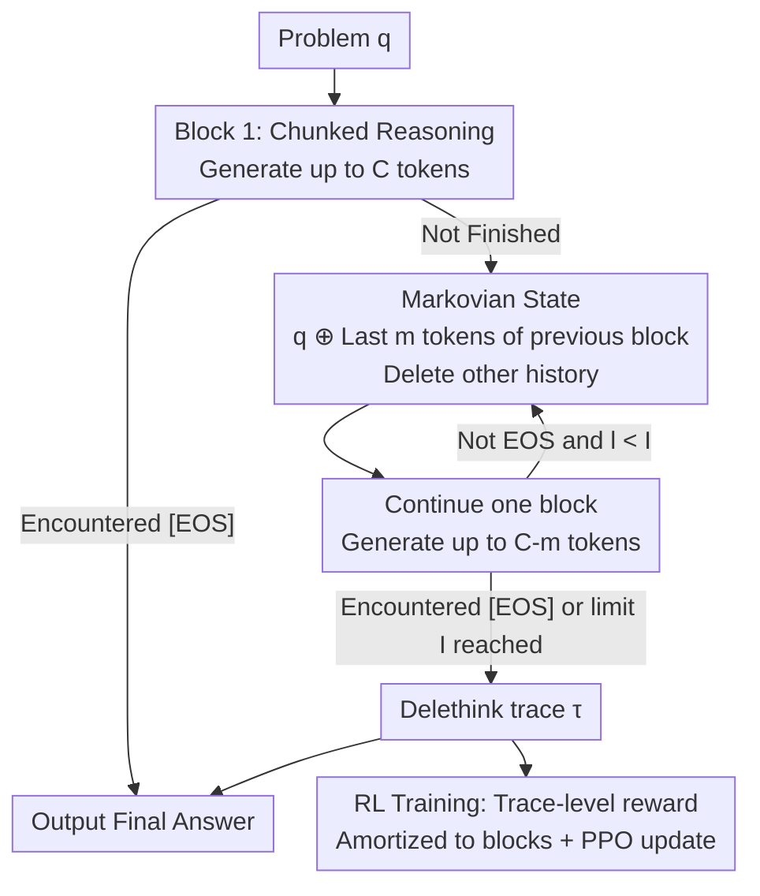

# The Markovian Thinker: Architecture-Agnostic Linear Scaling of Reasoning

**Conference**: ICLR 2026  
**OpenReview**: [https://openreview.net/forum?id=3As6AQ9ELI](https://openreview.net/forum?id=3As6AQ9ELI)  
**Code**: None (Paper claims implementation based on verl + sglang, no public repository released)  
**Area**: LLM Reasoning / Reinforcement Learning / LLM Efficiency  
**Keywords**: Markovian Thinking, Long-Chain-of-Thought, RLVR, Linear Computation, KV cache

## TL;DR
This paper proposes **Delethink**: a method that enables reasoning LLMs to break an ultra-long Chain-of-Thought (CoT) into several fixed-length "chunks." Each chunk carries only a small number of tokens from the end of the previous chunk as a "Markovian state" while deleting the rest of the history. This reduces reasoning computation from quadratic to linear and maintains constant memory usage **without modifying any model architecture**, while achieving performance comparable to or exceeding standard Long-Chain-of-Thought (LongCoT).

## Background & Motivation

**Background**: Current reasoning LLMs (o1, DeepSeek-R1, Qwen3-Thinking, etc.) enhance capabilities by generating a long sequence of "thinking tokens" (LongCoT) before providing an answer. Longer thinking generally leads to better performance, making it the mainstream paradigm for RLVR (Reinforcement Learning with Verifiable Rewards) and test-time scaling.

**Limitations of Prior Work**: While thinking tokens grow linearly, self-attention has quadratic complexity, leading to an explosion in training and inference costs. A forward pass for a 1M-token context is over 1000x more expensive than 32K; throughput is inversely proportional to context length, with 1M context being over 30x slower than 32K. This makes "thinking longer" engineeringly prohibitive.

**Key Challenge**: Thinking length is strictly bound by **context length**—to think more, the entire history must be kept in context, and as context grows, the quadratic cost of attention becomes unavoidable.

**Goal**: Instead of "saving costs by thinking less," the objective is to allow models to "think more using linear computation" without approximating attention, replacing architectures, or distilling shorter trajectories.

**Key Insight**: The authors propose a counter-intuitive hypothesis: Does a model really need to see the **entire** thinking history to generate the next step of reasoning? Or is retaining only a **recent segment** sufficient to move forward? If the latter holds, context length can be decoupled from thinking length.

**Core Idea**: Transform the reasoning process into a **Markovian** one—the next step depends only on the original problem + a snippet from the end of the previous chunk (a sufficient "Markovian state"), while the rest of the history is deleted. This allows thinking to extend indefinitely while each chunk's context remains constant, resulting in linear computation and constant memory.

## Method

### Overall Architecture

Delethink rewrites a "long CoT" into a "sequence of short chunks," termed a **Delethink trace**. Given a problem $q$, the first block generates up to $C$ thinking tokens as usual. If `[EOS]` is not encountered, most of this block is discarded, and only its last $m$ tokens are appended to the original problem to form the input for the next block, which then generates $C-m$ new tokens. This loop continues until the model outputs `[EOS]` or reaches the iteration limit $I$. The model can think up to $C+(I-1)(C-m)$ tokens in a full trajectory, while each block's context is always capped by the constant $|q|+C$—thus decoupling thinking length from context length.

This mechanism has two applications: **Delethink Inference** (zero-shot application to existing models) and **Delethink Training** (using RL to train the model into a "native Markovian thinker"). During training, the entire chunk sequence is sampled as described, a single reward is calculated for the whole trajectory, and the reward is amortized across each block using GRPO/PPO-like objectives to update the model.

### Key Designs

**1. Delethink trace: Breaking long CoT into fixed chunks for linear computation**

Addressing the bottleneck where thinking length is tied to context length, Delethink generates a sequence of short chunks instead of a single monolithic trajectory. The thinking context for each block is fixed at $C$ (e.g., 8K). Formally, the first block $y_1\sim\pi(\cdot|x_1=q)$; if not finished, the input for the $l$-th block is $x_l = q \oplus y_{(l-1)}[-m:]$ ($l\ge 2$), where the original problem is concatenated with the last $m$ tokens of the previous block, followed by generating up to $C-m$ new tokens. Since $q$ is fixed and $|q|\ll C$ in practice, the maximum context per block is $O(C)=O(1)$, independent of the total thinking tokens. This is the origin of the "delete + think" name—previous reasoning tokens are **deleted** when constructing the next input. This is orthogonal to work that reduces cost by shortening CoT: it is not about using fewer tokens for the same performance, but about using **longer** trajectories for better performance.

**2. Markovian State: Retaining only the last m tokens as a "sufficient state for continuation"**

This is the key bet of the paradigm: the authors assume that continuing reasoning requires only the most recent thinking segment rather than the full history. Thus, for each cross-block transition, only the last $m$ tokens of the previous block are carried over (fixed at $m=C/2$ in the paper) as a "Markovian state"—the next step depends only on this state. An engineering detail is that approximately the first 100 tokens of the initial block (usually containing planning content) are folded into $q$ and retained. Surprisingly, this aggressive deletion works zero-shot: existing reasoning models exhibit "latent Markovian behavior" without specific training—continuing from just a few thousand tokens allows performance to match or exceed LongCoT. Intuitively, if $m$ is too small, the model "loses the reasoning thread," requiring $C$ to be sufficiently large ($C\ge 8$K for R1-Distill, $C\ge 16$K for Qwen3-30B) to stabilize the Markovian state.

**3. Delethink Training: RL on chunk sequences to solidify native capabilities**

Zero-shot Delethink Inference has a risk: the model does not know the iteration limit $I$, potentially leading to early `[EOS]` (under-thinking) or never stopping (over-thinking). Delethink Training addresses this with RL. The goal is to maximize the expected reward $J(\theta)=\mathbb{E}_{q,\tau}[R(\tau)]-\beta\,\mathrm{KL}[\pi_\theta\|\pi_{\mathrm{ref}}]$, where $\tau$ is the entire chunk sequence sampled via Delethink, and $R(\tau)$ is the trace-level reward (e.g., accuracy of the final block). The loss normalizes each trajectory by its total thinking tokens $\ell(\tau)=\sum_l |y_l|$ and applies a PPO clipped importance sampling objective to each block:

$$U(x,y,\theta)=\sum_{t=1}^{|y|}\min\Big(\tfrac{\pi_\theta(y_t)}{\pi_{\theta_{\mathrm{old}}}(y_t)}\hat A_t,\ \mathrm{clip}\big(\tfrac{\pi_\theta(y_t)}{\pi_{\theta_{\mathrm{old}}}(y_t)},1-\epsilon,1+\epsilon\big)\hat A_t\Big)-\beta\,\mathrm{KL}[\pi\|\pi_{\mathrm{ref}}]$$

The advantage $\hat A_t$ follows the GRPO format: rewards of $G$ trajectories within a group are standardized as $A_{\tau_g}=(R(\tau_g)-\mu)/\sigma$. All blocks within the same trajectory share the same advantage—the intuition is "if the answer is correct, increase the probability of every block in this trajectory." This objective is nearly identical to standard LLM RL, allowing seamless integration into existing GRPO/PPO frameworks. Training also encourages "budget awareness": trajectories exceeding $I$ are penalized, and compliant ones rewarded, causing correct trajectories to lengthen (utilizing budget) and over-thinking ones to shorten.

### Loss & Training
- Models: R1-Distill-Qwen-1.5B; Data: DeepScaleR (40k verifiable math problems), OpenMath used for longer budget experiments.
- Main Settings: Iteration limit $I=5$, block context $C=8$K, $m=C/2=4$K, total thinking budget 24K (aligned with LongCoT-24k).
- Optimization: 1000 RL steps, learning rate $1\text{e-}6$, 128 problems per step with 8 responses each; 8×H100, no sequence parallelism; implemented in verl + sglang.
- Long-budget experiments: Fixed $C=8$K, increased $I$ from 5 to 23 for a 96K budget, continued training from a 24K checkpoint for 150 steps.

## Key Experimental Results

### Main Results (Computational Complexity Comparison)

| Metric | Base ($n$ tokens) | LongCoT ($S\times$ larger) | Delethink ($S\times$ larger) |
|------|------|------|------|
| Thinking Tokens | $n$ | $nS$ | $nS$ |
| FLOPs | $O(n^2)$ | $O(n^2S^2)$ | $O(n^2S)$ |
| Peak Memory | $O(n)$ | $O(nS)$ | $O(n)$ |
| Backward/Generation Time | $T$ | $O(TS^2)$ | $O(TS)$ |

Core Conclusion: LongCoT metrics grow quadratically with thinking length, while Delethink remains linear with constant memory. At 1M tokens, Delethink saves approximately **17× FLOPs** in physical measurements.

| Scenario | Delethink | LongCoT-24k | Note |
|------|-----------|-------------|------|
| Benchmark performance after 24K training | Comparable/Superior | Baseline | Delethink overtakes at same RL steps |
| Time per RL step | 215s | 248.5s | Delethink is faster |
| Generation throughput (tokens/s/H100) | 8,500 | 6,000 | — |
| KV cache memory | −70% | Baseline | — |
| Estimated cost to train 96K Avg. length model | 7 H100-months | 27 H100-months | Quadratic cost of LongCoT |

### Ablation Study

| Configuration | Key Phenomenon | Explanation |
|------|---------|------|
| Block context $C$=8K/4K/2K (Fixed 24K budget) | 8K≈4K, 2K lags but improves with training | $C$ too small results in insufficient Markov state $m$, losing reasoning threads |
| LongCoT-8k vs Delethink-24k | LongCoT-8k lags by 5.5% | Proves the extra 16k tokens are necessary and utilized by Delethink |
| Zero-shot R1-Distill@128K | AIME'24 up 9%, scaling continues to 128K | LongCoT saturates around 40K tokens |
| Qwen3-30B requires $C\ge16$K | 8K still scales but with a different profile | Different models require different context sizes to enter a stable Markovian state |

### Key Findings
- **Existing models have "latent Markovian properties"**: Without training or specific prompting, continuing from just the last few thousand tokens matches LongCoT, suggesting most long history is redundant for continuation.
- **Delethink is true test-time scaling**: LongCoT saturates quickly once it exceeds the training budget, whereas Delethink trained on 24K scaling up to 100K+ tokens; some AIME'25 problems were only solved at 140K tokens.
- **Limits appear when "state cannot be compressed into $m$"**: Tasks requiring real-time grid maintenance (like CrossWordBench) fail when history is deleted; Delethink significantly lags on 14×14 puzzles, suggesting a need for **native** Markovian training for such tasks.
- **32K is the throughput inflection point for Delethink**: Below 32K, non-attention modules dominate, potentially making Delethink slightly slower; above 32K, attention's quadratic terms dominate, making Delethink increasingly faster.

## Highlights & Insights
- **Architecture-Agnostic**: No attention approximation, no Mamba replacement, no learnable eviction gates. Model weights and structure remain untouched; linear computation is achieved purely by restructuring the "organization of the reasoning process"—orthogonal to linear attention or KV compression.
- **Deletion as a Feature, Not a Bug**: Unlike traditional approaches focusing on "how to keep more context," this paper demonstrates that "actively deleting history + retaining sufficient state" actually unlocks longer effective thinking.
- **Amortizing trace-level rewards to chunks** allows multi-block trajectories to integrate seamlessly with standard GRPO/PPO—"increasing the probability of every block in a correct trajectory" is engineeringly simple and transferable to any RL task with verifiable rewards.
- **Decoupling thinking length from context length** theoretically opens the door for next-generation reasoning models with "million-token linear computation and constant memory."

## Limitations & Future Work
- **Task state must fit in $m$**: When reasoning requires global state that cannot be compressed (e.g., a real-time grid in crosswords), deleting history loses information. Zero-shot Delethink lags on 14×14 CrossWordBench; authors acknowledge this requires native training, though evidence for closing this gap via training is pending.
- **$C, m, I$ require tuning**: The minimum context to enter a Markovian state varies by model (R1-Distill 8K vs Qwen3 16K); $m=C/2$ is an empirical heuristic lacking an adaptive mechanism.
- **Limited training scale**: RL training was only validated on 1.5B models and mathematics; native training for larger models and other domains (code, PhD-level reasoning) remains an open question (only zero-shot results provided for these).
- **Future Directions**: Upgrading the Markovian state from "last $m$ tokens" to a learnable compressed state (like a learned summary or memory slot) could solve the state compression bottleneck while maintaining linearity.

## Related Work & Insights
- **vs. Reasoning Compression (Summarization/Pruning/Early-exit, e.g., InftyThink, Lin et al.)**: These focus on "shortening thinking length" but remain bound by quadratic costs and are often locked into fixed patterns distilled from human datasets; Delethink pursues "longer trajectories for better performance" via RL.
- **vs. Linear Architectures (Mamba / Linear Attention / Sparse Attention)**: These use approximation or architectural changes to eliminate quadratic terms; Delethink is architecture-independent, orthogonal, and stackable.
- **vs. KV Eviction / Compression (H2O, StreamingLLM, Quantization)**: These select or compress KV pairs for a single long chain during inference; Delethink **restructures and learns** the reasoning process itself to require only short contexts from the start, eliminating long KV strings at the source.

## Rating
- Novelty: ⭐⭐⭐⭐⭐ "Markovian Thinking" paradigm is highly novel, turning history deletion into a feature with an architecture-agnostic approach.
- Experimental Thoroughness: ⭐⭐⭐⭐ Zero-shot covers 1.5B–30B models across tasks, but RL training is limited to 1.5B on math.
- Writing Quality: ⭐⭐⭐⭐⭐ Clear motivation, complete complexity analysis, and honest reporting of failure cases.
- Value: ⭐⭐⭐⭐⭐ Paves the way for ultra-long reasoning with linear computation and constant memory at a low engineering cost.

<!-- RELATED:START -->

## Related Papers

- [\[ICLR 2026\] Structured In-context Environment Scaling for Large Language Model Reasoning](structured_in-context_environment_scaling_for_large_language_model_reasoning.md)
- [\[NeurIPS 2025\] Decoder-Hybrid-Decoder Architecture for Efficient Reasoning with Long Generation](../../NeurIPS2025/reinforcement_learning/decoderhybriddecoder_architecture_for_efficient_reasoning_wi.md)
- [\[ICLR 2026\] Chessformer: A Unified Architecture for Chess Modeling](chessformer_a_unified_architecture_for_chess_modeling.md)
- [\[ICLR 2026\] RESCHED: Rethinking Flexible Job Shop Scheduling from a Transformer-based Architecture with Simplified States](resched_rethinking_flexible_job_shop_scheduling_from_a_transformer-based_archite.md)
- [\[ICLR 2026\] The Art of Scaling Reinforcement Learning Compute for LLMs](the_art_of_scaling_reinforcement_learning_compute_for_llms.md)

<!-- RELATED:END -->
