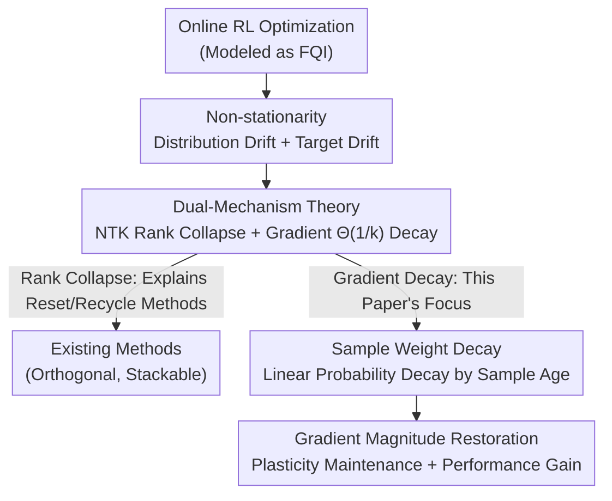

# The Rank and Gradient Lost in Non-stationarity: Sample Weight Decay for Mitigating Plasticity Loss in Reinforcement Learning

**Conference**: ICLR 2026  
**OpenReview**: [https://openreview.net/forum?id=5DpzzTPnJZ](https://openreview.net/forum?id=5DpzzTPnJZ)  
**Code**: https://github.com/wzhhasadream/CleanRL-JAX  
**Area**: Reinforcement Learning  
**Keywords**: Plasticity Loss, Neural Tangent Kernel, Gradient Decay, Experience Replay, Sample Weighting

## TL;DR
From a theoretical optimization perspective, this paper decomposes "plasticity loss" in deep reinforcement learning into two mechanisms: rank collapse of the NTK Gram matrix and $\Theta(1/k)$ decay of gradient magnitude. For the latter, a lightweight Sample Weight Decay (SWD) is proposed, which linearly decreases playback sampling probability with sample "age" to compensate for gradient decay and maintain learning capacity, consistently improving TD3, Double DQN, and SAC performance on MuJoCo, ALE, and DMC.

## Background & Motivation
**Background**: Deep reinforcement learning (RL) combines the representational power of neural networks with RL training paradigms, but learning capacity often declines as training progresses—a phenomenon known as "plasticity loss." The community has proposed various remedies: Network Reset, Recyclable Dormant Neurons (ReDo), Plasticity Injection, and gradient-magnitude-based resets (ReGraMa).

**Limitations of Prior Work**: Most existing methods are **heuristically driven**—they observe a phenomenon (dormant neurons, sparse activation) and design an intervention without explaining *why* plasticity loss occurs or the relative contributions of underlying mechanisms. The theoretical side remains largely blank, leaving remedies isolated and lacking a unified explanation.

**Key Challenge**: The RL optimization process is inherently **non-stationary**—the loss function changes every iteration, effectively starting new optimization "tasks" where the initial point is the endpoint of the previous optimization (unlike supervised learning starting from random initialization). Deciphering how this "sequential initialization" mechanism impairs optimization is the unresolved core problem.

**Goal**: (1) Establish a unified theory to explain the sources of plasticity loss; (2) Design a theoretically grounded, plug-and-play remedy based on these findings.

**Key Insight**: The authors abstract RL optimization as Fitted Q-Iteration (FQI) and attribute the "evolution of the loss function across iterations" to the properties of the **initialization point**. They analyze two factors crucial for optimization: the NTK matrix (determining fitting capacity) and initial gradient magnitude (determining the speed of escaping saddle points).

**Core Idea**: Theoretical proofs show that non-stationarity leads to NTK rank collapse and gradient decay at a rate of $\Theta(1/k)$. While existing methods mostly address the first mechanism, this paper tackles the second by using a sample weight that decays linearly with sample age to counteract the $1/k$ factor and "restore" gradient magnitude.

## Method

### Overall Architecture
The paper combines a unified theory with a lightweight algorithm. The theory formalizes non-stationarity in online RL from two sources: **data distribution non-stationarity** (drift of the experience distribution $\mu_h^k$ in the replay buffer) and **target non-stationarity** (continuous changes in TD targets $T_h \hat f_{h+1}^k$ due to bootstrapping). These are proven to cause two detrimental effects: **rank collapse** of the NTK Gram matrix and **$\Theta(1/k)$ decay** of the initial gradient magnitude. The first mechanism justifies why "reset/recycle" methods work, while the second remained unexplored—forming the basis for SWD. The algorithm is a replay reweighting strategy that modifies only sampling probabilities: newer samples have higher probability, neutralizing the harmful $1/k$ factor.

### Key Designs

**1. Dual-Mechanism Plasticity Loss Theory: Tracing Rank and Gradient Loss to Non-stationarity**

This step answers "why plasticity loss occurs." Starting from the FQI loss $L_h^k(f,\hat f_{h+1}^k) = \frac{1}{|D_h^k|}\sum (f(s_h,a_h) - [r + \max_{a'}\hat f_{h+1}^k(s_{h+1},a')])^2$, the authors prove the empirical distribution of the replay buffer follows the recursion $\mu_h^{k+1} = \frac{k}{k+1}\mu_h^k + \frac{1}{k+1}\hat d_h^{\pi_{k+1}}$ (Proposition 1). This implies **data collected by the new policy only accounts for a $1/(k+1)$ weight in the distribution**, becoming increasingly submerged. Substituting this into the initial gradient decomposition (Theorem 3) yields the key conclusion:

$$\nabla \mathbb{E}_{\mu_h^k}\big[(f - T_h\hat f_{h+1}^k)^2\big]\Big|_{\hat f_h^{k-1}} = \underbrace{\tfrac{1}{k}\nabla \mathbb{E}_{\hat d_h^{\pi_k}}[\,\cdot\,]}_{\text{Distribution Drift}} + \underbrace{\mathbb{E}_{\mu_h^k}[\nabla f^2 \cdot (T_h\hat f_{h+1}^{k-1} - T_h\hat f_{h+1}^k)]}_{\text{Target Drift}}$$

The distribution drift term carries a $1/k$ coefficient—as iterations $k$ increase, the initial gradient magnitude approaches zero, trapping the optimizer near saddle points (the time to escape depends on the gradient magnitude projected onto negative curvature directions). Separately (Section 4.1), while random initialization guarantees a full-rank, well-conditioned NTK for over-parameterized networks with probability 1, RL starts from the previous iteration's argmin, breaking this guarantee and leading to rank loss and degraded value function fitting. These two mechanisms—fitting capacity (rank) and fitting speed (gradient)—jointly constitute plasticity loss.

**2. Sample Weight Decay: Counteracting $1/k$ Gradient Decay via Linear Weighting**

Since the $1/k$ coefficient is the root of gradient degradation, SWD intervenes at the **data distribution level** without altering the network. It assigns a linearly decaying weight to each sample based on "age": $age_i = t - t_i$ (where $t$ is current step, $t_i$ is collection step). The weight $w_i = \max(w_{\min},\, 1 - \frac{age_i}{T})$ is normalized to a sampling probability $p_i = w_i / \sum_j w_j$. Intuitively, newer samples receive higher weights, "boosting" the contribution of the current policy distribution $\hat d^{\pi_k}$ to the gradient and neutralizing the $1/k$ decay coefficient. The main hyperparameters are the decay horizon $T$ and floor weight $w_{\min}$.

The defining feature of SWD is **orthogonality**: existing methods (Reset/ReDo/Plasticity Injection) modify network structure or parameters (Mechanism 1), whereas SWD modifies the sampling distribution (Mechanism 2). Operating at different stages allows them to be synergistic, as confirmed by experiments where SWD+S&P achieved superior results. It is also extremely lightweight, merely replacing uniform sampling with weighted sampling.

**3. Reverse Verification with SWA: Proving "Recency Bias" is Critical**

To prove SWD's efficacy is not due to random tuning, the authors designed Sample Weight Augmentation (SWA)—assigning higher weights to **older samples**. Theory predicts this exacerbates gradient decay and plasticity loss. Experiments on Humanoid-Run provided three-fold evidence: SWA performance was consistently lower than SWD and even uniform sampling; SWA's gradient L1 norm was lower (weaker learning signals); and the GraMa metric indicated SWA caused sparser gradients and more severe plasticity loss. This "inverse experiment" provides causal evidence for the theoretical hypothesis that favoring recent experience is vital for non-stationary RL. GraMa is the plasticity metric (from ReGraMa) where higher values indicate weaker learning capacity.

## Key Experimental Results

Experiments addressed five questions: universal improvement (Q1), impact on plasticity loss (Q2), adaptation to high UTD (Q3), comparison with other methods (Q4), and sensitivity (Q5). Benchmarks included TD3 (MuJoCo), Double DQN (ALE), and SimBa-SAC (DMC), with Prioritized Experience Replay (PER) as a baseline.

### Main Results

| Base / Benchmark | Task | Conclusion |
|------|------|------|
| TD3 / MuJoCo | Ant, HalfCheetah, Humanoid, Walker2d, Hopper | Ours (+SWD) universally improves sample efficiency and final policy, especially on Ant/Humanoid. |
| Double DQN / ALE | Phoenix, DemonAttack, Breakout | Ours (+SWD) consistently improves returns and learning speed. |
| SimBa-SAC / DMC | Humanoid-Run/Walk, Dog-Run/Walk | Ours (+SWD) achieves SOTA on difficult DMC Humanoid tasks. |
| SAC / DMC | vs. PER | PER requires significantly more training time for limited gain; SWD is more efficient. |

### Ablation Study

| Configuration | Key Metrics | Note |
|------|---------|------|
| SAC + SWD | Best Performance / L1 / GraMa | Full method. |
| SAC + SWA (Reverse) | Worst in all three | Favoring old samples -> Smaller gradients, higher GraMa; validates SWD's direction. |
| SAC (Uniform) | Medium | SWA < Uniform < SWD. |
| UTD=1/2/5 (Humanoid-Run) | IQM +25.4% / +17.3% / +30.1% | Higher UTD (frequent updates) yields higher gains. |
| vs. ReGraMa / S&P / Plasticity Inj. | SWD Leads | Superior to NTK-based methods on SimBa networks. |
| SWD + S&P | Best Overall | Validates orthogonality and synergy with NTK methods. |

### Key Findings
- **Mechanism Specificity**: GraMa analysis shows SWD primarily acts during **middle and late training stages**—where gradient decay is theoretically predicted to dominate (large $k$).
- **High UTD Benefits**: Gains were largest at UTD=5 (+30.1%), indicating that more frequent updates exacerbate $1/k$ decay, making SWD's compensation more valuable without requiring UTD-specific tuning.
- **Hyperparameter Stability**: Performance is stable across $T$ and $w_{\min}$ grid searches; linear decay outperforms exponential/polynomial decay, matching the linear $1/k$ decay term in the theory.
- **Orthogonality**: Since SWD targets a different mechanism than structural reset methods, SWD+S&P achieves the best performance, validating the "dual-mechanism" design philosophy.

## Highlights & Insights
- **Translating Empirical Phenomena to Theoretical Causes**: Using a simple recursion $\mu_h^{k+1} = \frac{k}{k+1}\mu_h^k + \frac{1}{k+1}\hat d^{\pi_{k+1}}$, the paper clarifies why new data is submerged and gradients decay. It provides a unified explanation: reset methods fix the NTK rank, while SWD fixes the gradient magnitude.
- **Alignment of Solution and Cause**: The cause is $1/k$, and the remedy is a linear weight $1-age/T$. The direction and magnitude match precisely, providing high credibility compared to general "recency priority" heuristics.
- **Design Philosophy of Orthogonality**: Decomposing plasticity loss into independent "rank" and "gradient" fronts means data-level reweighting and model-level resets can be used in parallel. This "decompose, solve separately, then stack" paradigm is transferable to other multi-factor degradation problems.
- **Power of Negative Evidence (SWA)**: Constructing a theoretically doomed control (SWA) and showing it fails across three metrics (performance, gradient norm, GraMa) provides robust causal evidence for the underlying theory.

## Limitations & Future Work
- **Theoretical Simplifications**: Core theorems are derived for the simplest FQI (though claimed extendable). A gap remains between this and practical deep RL (actor-critic, function approximation errors, continuous control).
- **Secondary Mechanism Dependence**: SWD focuses on gradient decay; it still relies on external reset methods for NTK rank collapse.
- **Simplistic Age-based Weights**: Weights only consider sample age, ignoring TD-error or uncertainty (losing benefits of PER). Fusing "recency bias" with "importance bias" is a natural extension.
- **Plasticity Metric Reliance**: Plasticity is primarily measured via GraMa. Cross-validation with other metrics like dormant neuron ratios or effective rank would strengthen the conclusions.

## Related Work & Insights
- **vs. ReDo / Plasticity Injection / Network Reset**: These modify structure or parameters at the **model level**, addressing the NTK rank collapse mechanism. SWD operates at the **data level**, addressing gradient decay. They are synergistic.
- **vs. ReGraMa**: ReGraMa uses gradient magnitude to trigger neuron resets (model-level). SWD uses the same metric to validate its data-level reweighting, outperforming ReGraMa on SimBa networks.
- **vs. Prioritized Experience Replay (PER)**: PER samples based on TD-error to find "informative" samples. SWD samples based on age to "compensate gradient decay." While their starting points differ, they could potentially be combined.

## Rating
- Novelty: ⭐⭐⭐⭐⭐ Theoretically decomposes plasticity loss into NTK rank collapse + $\Theta(1/k)$ gradient decay for the first time.
- Experimental Thoroughness: ⭐⭐⭐⭐ Coverage of three benchmarks/bases + reverse verification + UTD/orthogonality/hyperparameter analysis, though mostly presented as aggregated curves.
- Writing Quality: ⭐⭐⭐⭐ Clear logic chain and takeaways; theoretical notation is dense, demanding for non-theorists.
- Value: ⭐⭐⭐⭐⭐ Plug-and-play, near-zero overhead, orthogonal to existing methods, and achieves SOTA on difficult DMC tasks.

<!-- RELATED:START -->

## Related Papers

- [\[ICML 2026\] SPHERE: Mitigating the Loss of Spectral Plasticity in Mixture-of-Experts for Deep Reinforcement Learning](../../ICML2026/reinforcement_learning/sphere_mitigating_the_loss_of_spectral_plasticity_in_mixture-of-experts_for_deep.md)
- [\[ICML 2025\] Mitigating Plasticity Loss in Continual Reinforcement Learning by Reducing Churn](../../ICML2025/reinforcement_learning/mitigating_plasticity_loss_in_continual_reinforcement_learning_by_reducing_churn.md)
- [\[ICLR 2026\] Reinforcement Learning via Value Gradient Flow](reinforcement_learning_via_value_gradient_flow.md)
- [\[ICLR 2026\] QeRL: Quantization-enhanced Low-rank Reinforcement Learning for LLMs](qerl_beyond_efficiency_-_quantization-enhanced_reinforcement_learning_for_llms.md)
- [\[ICLR 2026\] Wavelet Predictive Representations for Non-Stationary Reinforcement Learning](wavelet_predictive_representations_for_non-stationary_reinforcement_learning.md)

<!-- RELATED:END -->
