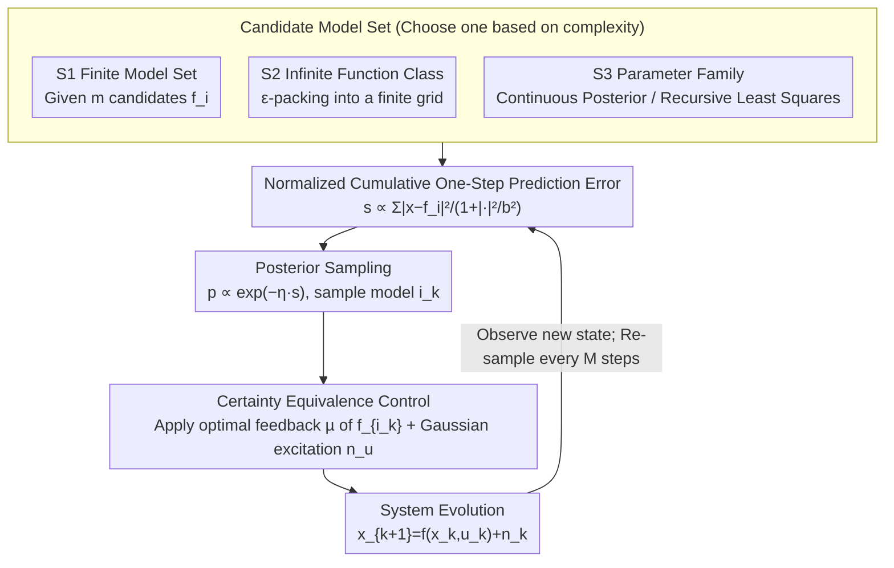

# The Sample Complexity of Online Reinforcement Learning: A Multi-Model Perspective

**Conference**: ICLR 2026  
**arXiv**: [2501.15910](https://arxiv.org/abs/2501.15910)  
**Code**: None  
**Area**: Reinforcement Learning / Online Control  
**Keywords**: sample complexity, online reinforcement learning, multi-model adaptive control, policy regret, nonlinear dynamical systems

## TL;DR

This paper proposes a set of online reinforcement learning algorithms for nonlinear dynamical systems with continuous state-action spaces. By utilizing multi-model posterior sampling and certainty equivalence policies, the approach achieves online learning of unknown systems and provides non-asymptotic policy regret guarantees ranging from finite model sets to parameterized model families.

## Background & Motivation

Online reinforcement learning faces a core dilemma: the decision-maker must balance **exploration** (acquiring information about system dynamics) and **exploitation** (optimizing performance). Traditional work primarily focuses on linear dynamical systems (such as LQR), using two-step strategies (identification followed by control) to analyze sample complexity. However, many real-world systems exhibit nonlinear dynamics (e.g., robotics, traffic systems), and online control analysis in continuous state-action spaces is significantly more complex than in discrete cases.

Existing methods have the following limitations:

**Background**: The machine learning community (e.g., Dean et al., 2018; Simchowitz & Foster, 2020) mainly focuses on linear systems, relying on two-step learning strategies (alternating between least-squares estimation and optimal control design), which cannot be generalized to nonlinear systems.

**Limitations of Prior Work**: The adaptive control community (e.g., Anderson et al., 2000; Hespanha et al., 2001) focuses on asymptotic stability and boundedness but lacks non-asymptotic performance characterization.

**Key Challenge**: Recent work on online switching control (e.g., Li et al., 2023; Kim & Lavaei, 2024) handles nonlinear dynamics, but the regret upper bounds grow exponentially with the number of non-stabilizing controllers.

**Goal**: The motivation of this paper is to establish a unified analytical framework covering multi-level system complexity—from finite model sets to infinite function classes and parameterized model families—while providing concise and practical online learning algorithms.

## Method

### Overall Architecture

The paper considers a standard stochastic nonlinear dynamical system:

$$x_{k+1} = f(x_k, u_k) + n_k$$

where $f$ is the unknown dynamics and $n_k \sim \mathcal{N}(0, \sigma^2 I)$ is the process noise. The objective is to minimize the cumulative loss $\sum_{k=1}^N l(x_k, u_k)$. The difficulty lies in $f$ being unknown, necessitating identification during control.

**Mechanism**: The algorithm decomposes this into a closed loop of "Posterior Sampling + Certainty Equivalence + Persistent Excitation": at each step, a one-step prediction error is calculated for each candidate model based on the trajectory so far. Models with smaller errors are more likely to be the true model. A model is then sampled from the candidates according to a softmax distribution and treated as the true model to apply its corresponding optimal feedback policy. Simultaneously, a small amount of Gaussian excitation noise is added to the control input to ensure persistent excitation for model identification. The paper's contribution is applying this same mechanism across three levels of model complexity—Finite Candidate Set (S1), Infinite Function Class (S2), and Continuous Parameter Family (S3)—and providing non-asymptotic policy regret bounds for each.

### Key Designs

**1. Setting S1: Finite Model Set — Logarithmic Regret via Posterior Sampling**

The most basic scenario involves $m$ candidate nonlinear models $\{f_1, \dots, f_m\}$, where the goal is to identify the one that describes the system online. The algorithm maintains a normalized cumulative one-step prediction error for each model:

$$s_k^i = \sum_{j=1}^{k-1} \frac{|x_{j+1} - f_i(x_j, u_j)|^2}{1 + |(x_j, u_j)|^2 / b^2}$$

**Design Motivation**: The normalization factor $1 + |(x_j, u_j)|^2 / b^2$ in the denominator is key—it ensures that even if states and inputs become large, the single-step error contribution remains bounded, preventing $s_k^i$ from being dominated by a few large excitations. Sampling is performed with probability $p_k^i \propto \exp(-\eta s_k^i)$. Under the Gaussian noise assumption, $\exp(-s_k^i)$ is exactly proportional to the posterior probability of model $f_i$ given past trajectories, making this a form of Thompson Sampling. $\eta$ acts as the softmax temperature. This "one observation updates all candidates" property leads to policy regret that is logarithmic in the number of models—Theorem 2.1 provides an $\mathcal{O}(\ln N + \ln m)$ bound.

**2. Setting S2: Infinite Cardinality Function Class — Discretization via ε-packing**

When the candidate set $F$ is an infinite bounded set in a normed vector space (e.g., a bounded Lipschitz function space), errors cannot be calculated for every model. **Core Idea**: The algorithm uses greedy covering to construct an $\epsilon$-packing $F_\epsilon$, approximating the infinite set with a finite grid, and then applies the S1 framework. This introduces discretization error, resulting in a trade-off in the regret bound (Theorem 2.2): $\mathcal{O}(N\epsilon^2 + \ln(m(\epsilon))/\epsilon^2)$. For bounded $L$-Lipschitz functions, the optimal $\epsilon$ yields a regret growth rate of approximately $T^{(d_x+d_u)/(d_x+d_u+2)} = o(T)$, achieving no-regret learning, though it approaches linearity as dimensions increase.

**3. Setting S3: Parameterized Model Family — Direct Sampling from Continuous Posterior**

When the model family is parameterized as $F = \{f_\theta \mid \theta \in \Omega \subset \mathbb{R}^p\}$ (e.g., neural network parameterization), parameters $\theta_k$ are sampled directly from the continuous posterior. **Mechanism**: A practical special case is linear feature mapping $f_\theta(x,u) = \phi(x,u)^\top \theta$. Here, the posterior is Gaussian, with mean and covariance updated online via recursive least squares in $\mathcal{O}(p^2)$ time. Theorem 2.3 provides $\mathcal{O}(\sqrt{Np})$ regret, matching known optimal results for linear systems.

### Loss & Training

The algorithm runs online without explicit offline training. Key elements include:

1.  **Excitation Signal Design**: $\sigma_{u_k}^2 \propto 2/k + \ln(m)/k^2$, ensuring sufficient exploration early on and gradual reduction later.
2.  **Model Switching Interval**: Switching the model index every $M$ steps to ensure persistent excitation conditions are met.
3.  **Core Insight**: Using the cost function $V$ as a Lyapunov function and analyzing the regret bound by decomposing $\Pr(i_k = i^*)$ and $\Pr(i_k \neq i^*)$ cases, combined with model convergence rates $\Pr(i_k \neq i^*) \leq M^2/(k-M)^2$.

## Key Experimental Results

### Main Results

Verification was performed on a linear time-invariant system with 20D state and 5D input, consisting of four 5D leaky integrators in series with a 5-step delay.

| Setting | Algorithm | Steps to Near-Optimal | Parameter Space Dim |
| :--- | :--- | :--- | :--- |
| S1 (Finite Models) | Algorithm 1 (100 candidates) | ~10 steps | 100 models |
| S3 (Parameterized) | Algorithm 3 | ~60 steps | $d_x^2 + d_x d_u = 500$ |

### Ablation Study

| Configuration | Key Finding | Description |
| :--- | :--- | :--- |
| S1 vs S3 | S1 converges 6x faster | Finite sets are more efficient but require prior knowledge |
| $\eta$ Parameter | Theory-based selection | $\eta \leq \min\{1/(4M\sigma^2), 1/(2ML^2b^2)\}$ |
| $\sigma_{u_k}$ Decay | Ensures boundedness | Two stages: identification followed by performance |

### Key Findings

1.  **Ours vs. Model-Free**: In model-based methods, a single iteration provides information on all candidate models, resulting in $\mathcal{O}(\ln m)$ dependence on model count. Model-free methods only obtain information for the current policy, leading to at least $\mathcal{O}(m)$ regret.
2.  **Separation Principle**: The algorithm naturally implements a separation principle for nonlinear systems—decoupling model identification from optimal control.
3.  **State Boundedness**: Under the condition $l(x,u) \geq \bar{L}_l |x|^2/2$, $\mathbb{E}[|x_k|^2]$ is shown to be uniformly bounded with only finite steps of persistent excitation.
4.  **Finite-time Convergence**: The model index sequence $\{i_k\}$ converges to the true model in finite time almost surely.

## Highlights & Insights

1.  **Unified Framework**: Three settings (finite/infinite/parameterized) are handled under a single analytical framework, with the latter two naturally extending the first.
2.  **Novelty**: Especially in S1 and the linear feature mapping case of S3, the algorithm only requires Gaussian sampling and recursive least squares, making it very simple to implement.
3.  **Value**: Recovering the $\mathcal{O}(\sqrt{T} \cdot (d_x^2 + d_x d_u))$ regret bound for linear systems validates the framework's correctness.
4.  **Depth**: Reveals the fundamental difference between the logarithmic $\ln(m)$ dependence in model-based RL and the polynomial $m$ dependence in model-free RL.

## Limitations & Future Work

1.  **Persistent Excitation Assumption**: Assumption 3.2 must hold for any initial state and excitation variance, which may be difficult to verify for certain degenerate systems.
2.  **Computational Feasibility**: The argmin and greedyCover in S2 are generally computationally infeasible; S2 remains of primary theoretical interest.
3.  **Observability**: The study only considers full state observability and does not address output feedback (partial observability).
4.  **Cost Function Smoothness**: Assumption 3.1 requires precise quadratic bounds on the cost function, which may be too restrictive for non-standard costs.
5.  **Robustness**: Only expected performance ($\mathcal{H}_2$) is considered, without discussing robust ($\mathcal{H}_\infty$) worst-case performance.

## Related Work & Insights

-   **Relationship to Thompson Sampling**: The algorithm is essentially a nonlinear version of Thompson Sampling—sampling from the model posterior and applying certainty equivalence.
-   **Link to Online Learning Theory**: The $\mathcal{O}(\ln m)$ regret for finite sets aligns with classical results in online learning and multi-armed bandits.
-   **Application Potential**: Due to its simplicity and ability to incorporate prior knowledge, it is suitable for engineering scenarios like intelligent transportation and automated supply chains.

## Rating

-   Novelty: ⭐⭐⭐⭐ (Unified framework is innovative, though core techniques are standard)
-   Experimental Thoroughness: ⭐⭐⭐ (Verified only on linear systems; lacks purely nonlinear experiments)
-   Writing Quality: ⭐⭐⭐⭐⭐ (Clear structure, excellent presentation of proof logic)
-   Value: ⭐⭐⭐⭐ (Solid theoretical contribution establishing a foundation for nonlinear online control)

<!-- RELATED:START -->

## Related Papers

- [\[ICLR 2026\] Benefits and Pitfalls of Reinforcement Learning for Language Model Planning: A Theoretical Perspective](benefits_and_pitfalls_of_reinforcement_learning_for_language_model_planning_a_th.md)
- [\[ICML 2025\] The Sample Complexity of Online Strategic Decision Making with Information Asymmetry and Knowledge Transportability](../../ICML2025/reinforcement_learning/the_sample_complexity_of_online_strategic_decision_making_with_information_asymm.md)
- [\[ICLR 2026\] On the Generalization of SFT: A Reinforcement Learning Perspective with Reward Rectification](on_the_generalization_of_sft_a_reinforcement_learning_perspective_with_reward_re.md)
- [\[ICLR 2026\] Stackelberg Coupling of Online Representation Learning and Reinforcement Learning](stackelberg_coupling_of_online_representation_learning_and_reinforcement_learnin.md)
- [\[ICLR 2026\] Near-Optimal Second-Order Guarantees for Model-Based Adversarial Imitation Learning](near-optimal_second-order_guarantees_for_model-based_adversarial_imitation_learn.md)

<!-- RELATED:END -->
