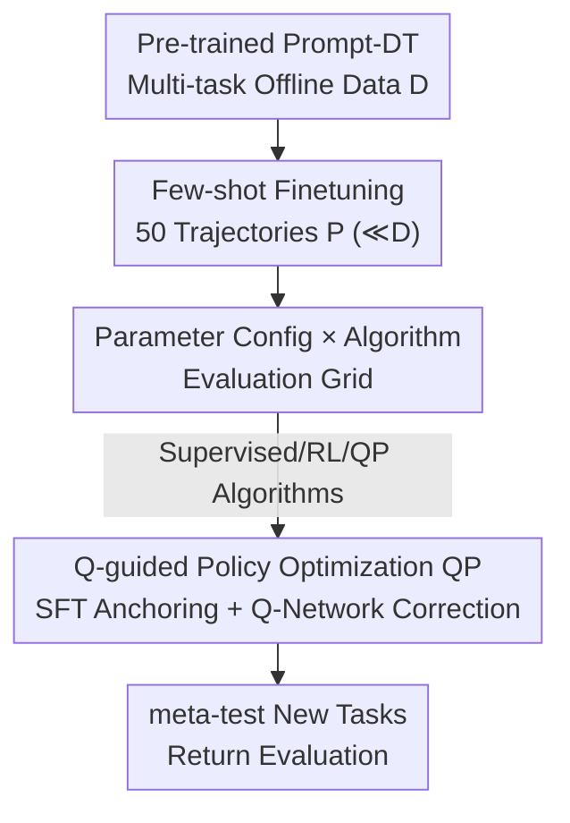

# The State of Reinforcement Finetuning for Transformer-based Agents

**Conference**: ICLR 2026  
**OpenReview**: [https://openreview.net/forum?id=Cbg9MR6dR7](https://openreview.net/forum?id=Cbg9MR6dR7)  
**Code**: None  
**Area**: Reinforcement Learning / Decision Transformer / meta-RL / Reinforcement Finetuning  
**Keywords**: Reinforcement Finetuning (RFT), Transformer Agent, meta-RL, Prompt-DT, Q-guided Policy Optimization

## TL;DR
This paper systematically introduces Reinforcement Finetuning (RFT) to the few-shot meta-RL adaptation of Transformer-based Agents (TA). Through a large-scale empirical comparison across two orthogonal axes: "Finetuning Parameter Configurations × Finetuning Algorithms," it finds that no single algorithm is universally optimal. Based on this, the authors propose QP (Q-guided Policy Optimization), a lightweight enhancement that combines the stability of SFT with the policy improvement capabilities of RL, consistently outperforming strong SFT/RFT baselines across all settings.

## Background & Motivation
**Background**: Large Reasoning Models (LRM), represented by OpenAI o1 and DeepSeek-R1, have established Reinforcement Finetuning (RFT) as a standard—leveraging small amounts of annotated data and iterative refinement to enhance reasoning, factuality, and alignment. Concurrently, Transformer-based Agents (TA, e.g., Decision Transformer, Prompt-DT, Gato) model decision-making as sequence modeling, utilizing auto-regressive decoders for multimodal, multi-task, and scalable general decision-making. These two paradigms are highly isomorphic in terms of "large-scale pre-training + few-shot adaptation."

**Limitations of Prior Work**: Despite the similarities between TA and LRM, TA adaptation to new tasks relies almost exclusively on Supervised Finetuning (SFT). SFT only imitates given trajectories and is restricted to actions within the data distribution, leading to limited generalization on new tasks. While RFT has proven advantageous in non-RL domains like language, math, and code, its effectiveness for TA in meta-RL has not been systematically verified.

**Key Challenge**: Purely supervised methods are stable but remain within the behavior distribution (in-distribution), often resulting in suboptimality. Pure RL methods (PPO, CQL) can break out of the distribution but suffer from unreliable Q-network estimates due to distribution shift and high gradient variance in strict offline, few-shot settings, leading to training instability or divergence. There is a direct conflict between stability and policy improvement capability.

**Goal**: To (1) systematically answer whether RFT can outperform SFT in few-shot meta-RL and under what conditions, and (2) provide a lightweight method that is both stable and capable of policy improvement.

**Key Insight**: Instead of comparing algorithms in isolation, one must jointly analyze "which parameters to update" and "which loss functions to use" as two orthogonal axes. Furthermore, conclusions should be derived by ablating over four variables: data quality, trajectory quantity, reward sparsity, and pre-trained model scale.

**Core Idea**: Use "Supervised Anchoring + Q-network Value Correction" to replace "pure imitation" or "pure RL," allowing the policy to stay close to the behavior distribution while performing small-step extrapolation toward high-reward actions.

## Method

### Overall Architecture
The work consists of two layers: an outer **evaluation framework**—fixing a pre-trained TA (Prompt-DT), using 50 few-shot trajectories (only 0.1%–1.1% of pre-training data) for finetuning on each new task, and comparing within a grid of "4 parameter configurations × 7 algorithms"; and an inner **new algorithm QP**, proposed as a lightweight enhancement to existing RFT. The workflow is: Pre-train Prompt-DT → Select a parameter configuration + algorithm for few-shot finetuning → Evaluate returns on meta-test tasks, where QP adds a Q-network value guidance term on top of the supervised loss.

### Key Designs

**1. 2D Evaluation Grid: Systematically scanning adaptation across orthogonal axes**

The authors argue that comparing loss functions alone is insufficient, as "which parameters to update" is equally critical. The parameter axis includes 4 levels: Prompt Tuning (0.76KB), Adaptor Tuning (LoRA-like modules in MLP layers, 0.19MB), Decorator Tuning (residual policy $\pi_{\text{base}}(s)+\pi_{\text{res}}(s)$ over a frozen base, 0.54MB), and Fullmodel Tuning (2.52MB). The algorithm axis covers 7 methods in 3 categories: Supervised (SFT, DPO), Online RL (GRPO, PPO), and Offline RL (CQL), plus the proposed QP-SFT / QP-DPO. Using identical pre-trained weights and data ensures fairness. A primary finding is that **no single algorithm is universally optimal**: supervised methods prefer Fullmodel tuning (stronger convergence as signals propagate through the entire network), while RL methods are more stable under parameter-efficient configurations (Adaptor/Decorator) because full-parameter updates oscillate due to noisy reward signals and accumulated errors over long horizons.

**2. QP (Q-guided Policy Optimization): Adding Q-network value correction to supervised loss**

This method addresses the "SFT is too conservative, RL is too unstable" conflict. QP introduces a Q-guided policy improvement term to standard supervised targets (SFT or DPO). For QP-SFT:

$$\mathcal{L}_{\text{QP-SFT}}(\theta) = \mathbb{E}_{(s,a)\sim P}\Big[\,|a-\pi_\theta(a|s)|^2 - \alpha\cdot Q_\phi(s,\pi_\theta(s))\,\Big]$$

The first term is a standard imitation loss that **anchors the updated policy within the behavior distribution**. The second term is a value correction that encourages the policy to select actions with higher predicted returns from $Q_\phi$, with $\alpha$ controlling the correction strength. QP-DPO follows the same logic, replacing the first term with the DPO preference log-likelihood. $Q_\phi$ is trained via TD loss with Double Q-learning, using $\hat Q_m = r + \gamma\min_{i=1,2}Q_{\phi'_i}(s',\hat a)$ to suppress overestimation, where $\hat a$ is provided by the target policy $\pi_{\theta'}$. This design ensures the imitation term prevents divergence while the value term enables small-step extrapolation toward high-reward regions.

**3. Four-factor Robustness Ablation: Characterizing the boundaries of RFT**

The authors ablate four variables to provide practical selection heuristics: (1) **Data Quality** (Medium vs. Expert)—RL methods show significant gains on Expert data (effective credit assignment), while supervised methods benefit relatively more from Medium data (providing a stable imitation floor from diverse suboptimal trajectories); (2) **Trajectory Quantity**—increased data generally improves performance, but QP remains stable under low-data regimes while pure supervised methods degrade faster; (3) **Reward Sparsity**—sparse rewards amplify algorithmic gaps; GRPO degrades significantly, whereas QP remains robust. Interestingly, sparse rewards sometimes outperform dense rewards in offline settings because dense TD propagates approximation errors from intermediate states, whereas sparse rewards concentrate returns at terminal steps, mimicking Monte-Carlo and reducing sensitivity to value estimation errors; (4) **Pre-training Scale**—most policies improve with model size, but Fullmodel tuning on large models with sparse data can lead to overfitting and performance plateaus.

### Loss & Training
The core training objective is defined by the QP formulas (Eq. 13/14), with the Q-network trained via Double Q TD loss (Eq. 15/16). The backbone is a Prompt-DT implementation based on minGPT, pre-trained using the MSE imitation loss for continuous actions: $\mathcal{L}_{DT}=\mathbb{E}[\frac{1}{K}\sum(a_{i,m}-\pi(\tau^*_i,\tau_{i,m}))^2]$. Data is collected by single-task policies trained via SAC for each task, categorized into Medium / Expert quality.

## Key Experimental Results

### Main Results
Environments: MuJoCo (AntDir, HalfCheetahDir, HalfCheetahVel) + MetaWorld (45 tasks pre-training, 5 tasks meta-test). 50 finetuning trajectories per method across 3 random seeds. The table shows average scores under Expert data (higher is better; for HalfCheetahVel, values closer to 0 are better).

| Config | Zero-shot | SFT | DPO | GRPO | PPO | CQL | QP-DPO | QP-SFT |
|--------|------|------|------|------|------|------|------|------|
| Prompt | 284.08 | 315.05 | 313.73 | 315.47 | 312.55 | 313.49 | **318.39** | 317.07 |
| Adaptor | 284.08 | 331.69 | 333.38 | 333.24 | 327.70 | 321.63 | **339.46** | 335.87 |
| Decorator | 284.08 | 321.73 | 314.66 | 313.04 | 323.03 | 322.83 | 330.08 | **334.16** |
| Fullmodel | 284.08 | 336.07 | 326.83 | 325.23 | 329.62 | 312.53 | 362.13 | **372.09** |

QP-SFT / QP-DPO achieve the highest or near-highest average scores in every configuration. In the Fullmodel configuration, QP-SFT averages 372.09, which is ~36 points higher than SFT (336.07) and ~60 points higher than pure RL CQL (312.53). In MetaWorld (Fullmodel), QP-SFT achieves 553.36, significantly outperforming SFT at 441.05.

### Ablation Study

| Factor | Key Observation | Explanation |
|------|---------|------|
| Config × Algo | Supervised prefers Fullmodel, RL prefers Adaptor/Decorator | Difference between signal propagation and noisy updates |
| Data Quality | RL benefits from Expert; Supervised benefits from Medium | RL relies on optimal trajectories for credit assignment |
| Reward Sparsity | GRPO degrades sharply; QP remains stable | TD errors do not propagate step-by-step under sparsity |
| Pre-training Scale | Fullmodel degrades with Large Models + Few Data | Rapidly increasing tunable parameters causes overfitting |

### Key Findings
- **Algorithm choice impact often ≥ parameter scale impact**: In MetaWorld + Adaptor, switching from Adaptor to Decorator gains ~3%, but switching to QP-DPO gains ~10%.
- **No universal configuration**: The same algorithm performs differently across environments/parameters, requiring adaptive finetuning strategies rather than a one-size-fits-all approach.
- **QP advantage is more prominent in sparse rewards**: The lead of QP over other methods is larger in sparse settings than dense ones, demonstrating the stability of "Imitation Anchoring + Value Correction" under weak feedback.

## Highlights & Insights
- **Decomposition into orthogonal axes**: While many works only compare loss functions, this paper insists on scanning "Parameter Config × Algorithm." This reveals learning-paradigm-specific preferences (e.g., supervised-Fullmodel vs. RL-PEFT), which is a highly transferable insight.
- **QP as a minimalist yet effective enhancement**: Without changing the architecture or adding new stages, simply adding a $-\alpha Q_\phi(s,\pi_\theta(s))$ term to the supervised loss marries SFT stability with RL extrapolation. This is nearly zero-cost to implement in existing SFT/DPO pipelines.
- **Counter-intuitive explanation for sparse rewards**: The authors clarify a specific failure mode in low-data offline settings: dense TD repeatedly back-propagates intermediate value approximation errors, while sparse rewards behave more like Monte-Carlo, which is enlightening for designing reward structures in offline RFT.

## Limitations & Future Work
- **TA limited to continuous control**: The TA in this work consumes structured states and outputs continuous actions; transferability to LLM-agents with linguistic actions is unverified.
- **Limited algorithm subset**: Due to compute constraints, only representative algorithms were chosen; the "no universal best" conclusion holds within this subset.
- **Q-network remains an offline estimate**: QP depends on $Q_\phi$. In extreme out-of-distribution or sparse coverage scenarios, Q-estimation bias might mislead the value term, and $\alpha$ selection still requires tuning.
- **Lack of online interaction baseline**: The study is strictly offline. On-policy methods like PPO are naturally at a disadvantage, a caveat that must be considered in their evaluation.

## Related Work & Insights
- **vs. Pure SFT for TA**: Existing TA adaptation almost exclusively uses SFT, which only imitates and stays in-distribution. Ours proves RFT/QP can consistently exceed SFT while retaining its stability.
- **vs. Pure RL (PPO/CQL/GRPO)**: Pure RL lacks the strong prior from imitation, leading to high variance and oscillation in few-shot offline settings. QP uses imitation to anchor the policy before value guidance, yielding better stability and average performance.
- **vs. RFT for LRM (o1/R1)**: While RFT is mature for LRM in the language domain, Ours systematically transfers this to TA in meta-RL, identifying unique phenomena in continuous control + few-shot offline settings (e.g., sparsity outperforming density).

## Rating
- Novelty: ⭐⭐⭐⭐ Systematically fills the gap of "RFT for TA," QP is simple but well-positioned; strong empirical study + lightweight method.
- Experimental Thoroughness: ⭐⭐⭐⭐⭐ 4 configs × 7 algos × multiple environments + 4-factor ablation; very comprehensive.
- Writing Quality: ⭐⭐⭐⭐ Clear conclusions, explicit takeaways, and mechanistic explanations for counter-intuitive results.
- Value: ⭐⭐⭐⭐ Provides practical selection heuristics for TA adaptation and a plug-and-play enhancement.

<!-- RELATED:START -->

## Related Papers

- [\[ICLR 2026\] Reinforcement Learning for Machine Learning Engineering Agents](reinforcement_learning_for_machine_learning_engineering_agents.md)
- [\[ICLR 2026\] Recurrent Action Transformer with Memory](recurrent_action_transformer_with_memory.md)
- [\[ICLR 2026\] Vintix II: Decision Pre-Trained Transformer is a Scalable In-Context Reinforcement Learner](vintix_ii_decision_pre-trained_transformer_is_a_scalable_in-context_reinforcemen.md)
- [\[ICLR 2026\] Probing in the Dark: State Entropy Maximization for POMDPs](probing_in_the_dark_state_entropy_maximization_for_pomdps.md)
- [\[ICLR 2026\] RLVER: Reinforcement Learning with Verifiable Emotion Rewards for Empathetic Agents](rlver_reinforcement_learning_with_verifiable_emotion_rewards_for_empathetic_agen.md)

<!-- RELATED:END -->
