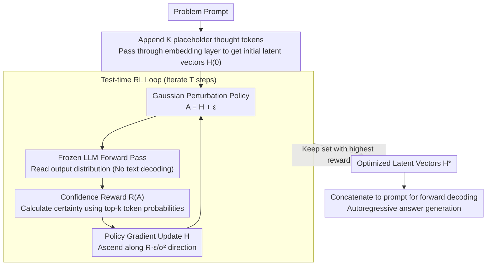

# Thinking on the Fly: Test-Time Reasoning Enhancement via Latent Thought Policy Optimization

**Conference**: ICLR 2026  
**arXiv**: [2510.04182](https://arxiv.org/abs/2510.04182)  
**Code**: None  
**Area**: Reinforcement Learning / LLM Reasoning  
**Keywords**: Latent Reasoning, Test-time Optimization, Policy Gradient, Confidence Reward, Chain-of-Thought

## TL;DR

This paper proposes Latent Thought Policy Optimization (LTPO), a test-time reasoning enhancement framework that does not require updating model parameters. By treating intermediate latent "thought" vectors as optimizable dynamic parameters, it utilizes online policy gradient methods and intrinsic confidence reward signals to enhance the reasoning capabilities of frozen LLMs.

## Background & Motivation

The reasoning capabilities of Large Language Models (LLMs) have recently undergone a significant shift: from **explicit Chain-of-Thought (CoT) reasoning** to more efficient **Latent Reasoning**. In explicit CoT, intermediate reasoning steps are generated as natural language text, which is computationally expensive and inefficient. In latent reasoning, intermediate thoughts are represented as vectors rather than text, significantly improving efficiency.

However, latent reasoning has a critical weakness: **fragile performance on challenging Out-of-Distribution (OOD) tasks**. When faced with difficult problems requiring robust reasoning (e.g., high-difficulty math competition problems), existing latent reasoning baselines often collapse to nearly zero accuracy.

The fundamental reasons for this dilemma are:

**Latent thought vectors are fixed at training time**: Once the model is trained, its latent representation method is fixed and cannot be adaptively adjusted for specific problem instances.

**Lack of test-time introspection mechanisms**: Unlike CoT, which can improve answers through multiple sampling and verification, latent reasoning lacks such self-correction capabilities.

**Difficult OOD generalization**: The generalization ability of latent representations is highly dependent on the training data distribution, leading to poor performance on unseen problem types.

The core motivation of LTPO is to retain the efficiency advantages of latent reasoning while endowing it with CoT-level reasoning robustness through test-time optimization.

## Method

### Overall Architecture

LTPO aims to solve the problem where latent reasoning is "fixed after training and collapses upon difficult problems" without touching the model weights—all actions occur at test time for a single problem. Given a frozen LLM and a new problem, it first appends $K$ placeholder "latent thought" tokens (e.g., `[THINK]`) to the original prompt. The vector sequence $H$ obtained by passing them through the embedding layer is treated as the only adjustable free variable. Then, it enters a test-time Reinforcement Learning (RL) loop: at each step, a Gaussian random perturbation is added to $H$ to obtain a candidate $A$. The frozen LLM performs a forward pass to read the output distribution and calculate a confidence reward. This reward is then used to estimate the gradient along the perturbation direction and update $H$. This process iterates for $T$ steps, and the set of vectors with the highest reward is recorded. Finally, the optimized $H^*$ is concatenated back to the prompt for a single forward decoding to generate the answer. Throughout this chain, the LLM parameters remain frozen; only these $K$ latent vectors are adjusted, effectively "searching" for a better reasoning path for each problem.

### Key Designs

**1. Latent Thought Vectors: Turning reasoning representations into test-time optimizable free parameters**

The root of latent reasoning's fragility is that intermediate representations are fixed after training. When encountering OOD difficulties, these fixed vectors cannot encode the information required for correct reasoning. Instead of modifying intermediate layers, LTPO appends $K$ placeholder tokens (e.g., `[THINK]`) to the original prompt. The vector sequence $H \in \mathbb{R}^{K\times d}$ obtained from the embedding layer is treated as the sole adjustable free variable, concatenated with the prompt embedding $E(x)$ as $E(x)\,\|\,H$, and fed into the frozen LLM. This way, each problem is optimized with its own set of $H$—transforming a fixed representation per problem into "on-the-fly searching for the most suitable latent thoughts for this problem." The key is that it neither updates model weights nor extracts hidden states from intermediate layers; it only tunes these few input-side vectors.

**2. Confidence Reward: Using the model's own certainty as a signal without labels or text decoding**

Since there are no ground-truth answers at test time and external verifiers are expensive, LTPO builds the reward directly on the frozen LLM's own output distribution. The intuition is: a good set of latent thoughts should make the model "more certain" about subsequent predictions. Specifically, candidate vectors are fed into the model to obtain the token distribution at each position. For a single latent vector, a confidence $C(a_i)$ is calculated based on the probabilities of the top-$k$ most likely tokens. The total reward is the average confidence of the $K$ vectors: $R(A)=\frac{1}{K}\sum_{i=1}^{K} C(a_i)$. Crucially, this reward can be calculated with a single fixed-length forward pass of "prompt + latent tokens," completely skipping text generation—no external verifiers, no actual decoding of reasoning. The signal is nearly free (ablation shows "low entropy = high certainty" is most effective).

**3. Gaussian Perturbation Policy Gradient: Turning representation search into zeroth-order search in latent space**

The reward $R(\cdot)$ is non-differentiable with respect to the input vectors, preventing direct backpropagation. Thus, LTPO treats $H$ as policy parameters and uses REINFORCE-style policy gradients for updates. Each step samples a candidate $A = H + \epsilon,\ \epsilon\sim\mathcal{N}(0,\sigma^2 I)$ from a Gaussian distribution centered at the current $H$ ($\sigma$ decays with iterations, favoring exploration followed by convergence). Then, a single-sample Monte Carlo estimate of the gradient is used for gradient ascent:

$$H^{(t+1)} = H^{(t)} + \eta\,\frac{R(H^{(t)}+\epsilon^{(t)})\,\epsilon^{(t)}}{\sigma^2}$$

Intuitively, this means "move in whichever perturbation direction brings a higher reward." Compared to PPO/GRPO, which optimize billions of parameters, this only searches $K$ vectors: the model remains static, optimization is per-problem, and no text is generated, making it more efficient than CoT. During the $T$ iterations, it records the set of vectors with the highest reward and finally uses $H^*$ to decode the answer.

### Loss & Training

Ours has no training phase. The "objective function" is the expected confidence reward to be maximized at test time: $J(H)=\mathbb{E}_{A\sim\pi(\cdot|H)}[R(A)]$. Optimization involves $T$ steps of gradient ascent on the $K$ latent vectors, with one forward pass per step and zero backward passes (gradients are estimated by perturbations), without modifying any weights. Key hyperparameters are perturbation variance $\sigma$ (decaying), learning rate $\eta$, number of latent tokens $K$, and optimization steps $T$.

## Key Experimental Results

### Main Results

Performance on five reasoning benchmarks:

| Benchmark | Metric | LTPO | Standard Latent Reasoning | CoT Baseline |
|---------|------|------|-------------|---------|
| GSM8K | Accuracy | Match/Exceed | Baseline | Strong Baseline |
| MATH | Accuracy | Match/Exceed | Baseline | Strong Baseline |
| AIME 2024 | Accuracy | **Significant Gain** | ~0% (Collapse) | Limited |
| AIME (Overall) | Accuracy | **Significant Gain** | ~0% (Collapse) | Limited |
| Other Reasoning | Accuracy | Match/Exceed | Baseline | Strong Baseline |

### Ablation Study

| Configuration | Key Metric | Description |
|------|---------|------|
| No Optimization (Baseline) | Baseline | Standard Latent Reasoning |
| Confidence Reward Only | Significant Gain | Core component effectiveness |
| Different Optimization Steps | Rise then Plateau | Existence of optimal steps |
| Different Confidence Measures | Entropy Optimal | Low entropy = High confidence works best |

### Key Findings

1.  **Par/Superior Performance on Standard Tasks**: On conventional reasoning tasks like GSM8K and MATH, LTPO is on par with or slightly better than strong baselines, indicating test-time optimization does not hurt normal performance.
2.  **Outstanding Performance on Difficult Tasks**: Most impressive is the performance on the AIME benchmark—these high-difficulty math competition problems cause existing latent reasoning baselines to collapse nearly completely (~0% accuracy), while LTPO achieves significant improvements.
3.  **Strong Robustness**: LTPO demonstrates a unique ability to work effectively where other methods fail. This suggests test-time optimization provides additional "reasoning resilience."
4.  **No External Supervision Required**: Guiding optimization solely through the model's own confidence signals allows LTPO to be applied to new tasks without labels.

## Highlights & Insights

1.  **Paradigm Innovation**: Proposes a new reasoning enhancement paradigm—neither traditional fine-tuning (modifying model parameters) nor sampling (multiple generation for the best), but rather optimization in the latent space at test time. This is a new category between training-time learning and inference-time sampling.
2.  **Elegant Self-Supervision**: The design utilizing the model's own confidence as a reward signal is elegant, avoiding dependence on external reward models or verifiers, while aligning with the intuition that good reasoning should lead to more certain answers.
3.  **Balance of Computational Efficiency and Performance**: Compared to CoT requiring massive intermediate text generation, LTPO only optimizes vector representations, making it more efficient. Compared to standard latent reasoning, LTPO adds a small computational overhead via optimization steps but significantly improves robustness.
4.  **Connecting RL and LLM Reasoning**: Naturally introduces policy optimization ideas from RL into the LLM reasoning process, providing a new perspective for cross-disciplinary research.

## Limitations & Future Work

1.  **Test-time Computational Overhead**: Although more efficient than CoT, each problem requires multi-step optimization, resulting in significantly higher latency than a standard single forward pass. It may not be suitable for latency-sensitive applications.
2.  **Reliability of Confidence Rewards**: High confidence does not necessarily equal a correct answer—models can be highly confident in wrong answers (hallucinations). When model calibration is poor, confidence rewards might mislead the optimization.
3.  **Selection of Optimization Steps**: The optimal number of steps may vary by task and problem; it currently requires manual setting. Adaptive step control remains an open problem.
4.  **Validation Limited to Reasoning (Math) Tasks**: Effectiveness hasn't been verified on other task types like commonsense reasoning, code generation, or creative writing.
5.  **Integration with Explicit CoT**: Can LTPO be combined with CoT to generate interpretable intermediate steps while optimizing in the latent space?

## Related Work & Insights

-   **Latent Reasoning Methods** (e.g., Coconut): LTPO adds a test-time optimization dimension on top of these.
-   **Test-Time Compute Scaling**: Complementary to methods like Best-of-N and Self-Consistency, LTPO achieves performance enhancement through a different mechanism.
-   **Policy Optimization in LLMs**: While methods like PPO/GRPO optimize model parameters, LTPO optimizes intermediate representations, serving as a more lightweight alternative.
-   **Insight**: This work suggests that LLM reasoning ability may depend not only on model parameters but also on the quality of intermediate representations during the reasoning process, which can be dynamically optimized at test time.

## Rating

-   Novelty: ⭐⭐⭐⭐⭐ (Paradigm innovation, introducing RL policy optimization to test-time reasoning)
-   Experimental Thoroughness: ⭐⭐⭐⭐ (Five benchmarks, highlighting robustness advantages on AIME)
-   Writing Quality: ⭐⭐⭐⭐ (Clear framework description)
-   Value: ⭐⭐⭐⭐⭐ (Opens a new direction for test-time latent reasoning optimization)

<!-- RELATED:START -->

## Related Papers

- [\[ICLR 2026\] Representation-Based Exploration for Language Models: From Test-Time to Post-Training](representation-based_exploration_for_language_models_from_test-time_to_post-trai.md)
- [\[ICLR 2026\] Single-stream Policy Optimization](single-stream_policy_optimization.md)
- [\[ICLR 2026\] AbstRaL: Augmenting LLMs' Reasoning by Reinforcing Abstract Thinking](abstral_augmenting_llms_reasoning_by_reinforcing_abstract_thinking.md)
- [\[AAAI 2026\] Aligning Machiavellian Agents: Behavior Steering via Test-Time Policy Shaping](../../AAAI2026/reinforcement_learning/aligning_machiavellian_agents_behavior_steering_via_test-tim.md)
- [\[ICLR 2026\] Self-Harmony: Learning to Harmonize Self-Supervision and Self-Play in Test-Time Reinforcement Learning](self-harmony_learning_to_harmonize_self-supervision_and_self-play_in_test-time_r.md)

<!-- RELATED:END -->
