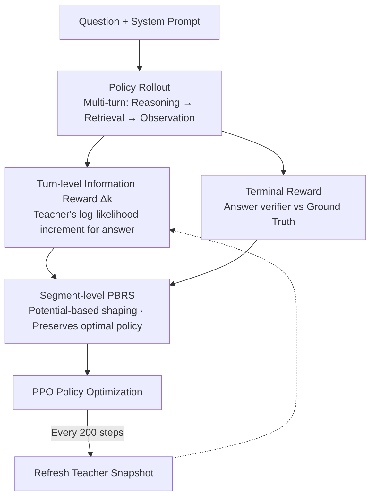

# TIPS: Turn-Level Information-Potential Reward Shaping for Search-Augmented LLMs

**Conference**: ICLR 2026  
**OpenReview**: [https://openreview.net/forum?id=eBMOr6a84z](https://openreview.net/forum?id=eBMOr6a84z)  
**Code**: https://github.com/ucsd-wang-lab-lm/tips  
**Area**: Alignment RLHF / Agent / LLM Reasoning  
**Keywords**: Reinforcement Learning, Reward Shaping, Search-Augmented LLM, Credit Assignment, Tool Use

## TL;DR
TIPS utilizes a "lagged copy of the policy itself" as a teacher to provide a dense reward for each "reasoning + retrieval" turn based on the incremental log-likelihood of the answer. This is formulated as Potential-Based Reward Shaping (PBRS) injected into PPO to solve the sparse reward and credit assignment challenges in multi-turn tool-use RL without training an additional reward model—achieving an average EM 11.8% higher and F1 13.6% higher than PPO on 7B models while significantly mitigating training collapse.

## Background & Motivation

**Background**: Search-augmented LLMs (QA agents that retrieve while reasoning) are currently mainstreamed using RL with verifiable rewards—comparing the final and reference answers at the end of a multi-step interaction to provide a terminal reward, then optimizing via PPO/GRPO. This paradigm is attractive because it only requires defining "correct/incorrect" at the end, allowing the model freedom to interweave reasoning, retrieval, and tool calls.

**Limitations of Prior Work**: However, "outcome-only rewards" are extremely fragile for training tool-using LLMs. A trajectory involves many reasoning and tool-calling steps, but the model only receives a scalar signal at the end, leading to severe **credit assignment** problems: it cannot judge which intermediate retrieval was truly helpful or redundant/misleading. Multi-turn tool use is harder than pure Chain-of-Thought because each tool call is a "discrete intervention" that changes the information state, and many different intermediate trajectories lead to the same final outcome (under-determined). A correct answer might be reached through redundant retrieval, while an incorrect one might stem from an early, irrecoverable error. This results in high-variance updates, policy drift late in training, or direct collapse.

**Key Challenge**: There are two traditional paths to densify supervision, both suboptimal. One is Process Reward Models (PRM)/Process Supervision, providing token-level or step-level rewards, but these require high-quality intermediate labels or training an independent reward model, and their supervision granularity (token/step) does not align with the semantic unit of tool use (a "reasoning + tool action + observation" turn). The other is turn-level rewards from environment feedback (e.g., MT-GRPO), but these are designed for single tool calls and become non-discriminative when extended to multiple calls, inheriting the instability of sparse reward baselines.

**Goal**: To find a turn-level feedback mechanism that is (i) discriminative, distinguishing useful from useless tool interactions; (ii) lightweight, requiring no token-level labels or additional reward models; and (iii) compatible with standard RL fine-tuning pipelines.

**Key Insight**: The authors observe that the essence of a "good turn" is that it makes the correct answer more predictable under the cumulative context; a "distracting turn" barely changes this predictability. Thus, the information contribution of each turn can be quantified directly using the model's own log-likelihood change for the "correct answer," eliminating the need for an external judge.

**Core Idea**: Use a "lagged frozen copy of the policy" as a teacher, define the reward for turn $k$ as the "incremental log-likelihood the teacher assigns to the correct answer after appending this turn" $\Delta_k$, and prove that it constitutes a Potential-Based Reward Shaping term. This densifies the signal without altering the optimal policy of the original task.

## Method

### Overall Architecture

The input to TIPS is a multi-turn interaction trajectory for search-augmented QA: system prompt + user question, after which the agent repeatedly performs "reasoning → issuing retrieval query → receiving retrieval result" turns until producing the final answer within `<answer>` tags. The output is a PPO update driven by the sum of two dense reward paths. Once the policy model rolls out a complete trajectory, the **terminal reward** is obtained by an answer verifier against the ground truth. Simultaneously, a teacher model measures the "increase in correct answer likelihood provided by this turn" to generate the **information reward** $\Delta_k$, injected at turn boundaries. These rewards are combined for PPO optimization. Crucially, the teacher is not an external model but a periodically refreshed frozen snapshot of the policy itself, requiring no independent reward models, verifiers, or manual process labels.

### Key Designs

**1. Turn-level Information Reward: Scoring each turn with teacher's log-likelihood increment**

Addressing the pain point where "terminal rewards cannot identify useful intermediate retrievals," TIPS decomposes interaction into a sequence of "reasoning blocks + tool calls + returned evidence" turns. It defines an **answer potential** for every context $S$—the log-probability of the teacher generating "any valid correct answer":

$$\Phi(S) := L(S; A) = \log \sum_{m=1}^{M} p_{\text{teach}}(A^{(m)} \mid S),$$

where $A=\{A^{(1)},\dots,A^{(M)}\}$ is the set of valid answers. The reward for turn $k$ is the difference in this potential:

$$\Delta_k = \alpha\,\big(\Phi(S_k) - \Phi(S_{k-1})\big),$$

where $S_k$ is the context up to turn $k$, and $\alpha>0$ is a scaling coefficient. Intuitively, turns retrieving highly relevant passages significantly increase teacher confidence ($\Delta_k>0$), while redundant or off-topic queries barely change belief or push probability toward wrong answers ($\Delta_k\le0$). The authors further note that $\Delta_k$ can be interpreted as a scaled Pointwise Mutual Information between "this turn's evidence" and "answer correctness"—measuring how much information the new observation contributes to the event of the answer falling within $A$.

**2. Segment-level Potential-Based Reward Shaping (PBRS): Densifying signals while preserving the optimal policy**

To avoid the risk of intermediate rewards biasing the model away from the original task goal, TIPS treats each turn as a "segment" between tokens and the entire turn as a single action in a segment-level MDP. When using the answer potential $\Phi(S)$ as the potential function, $\Delta_k=\alpha(\Phi(S_k)-\Phi(S_{k-1}))$ matches the standard form of PBRS (Ng et al., 1999). Under episodic returns ($\gamma=1$) and shaping occurring only at segment boundaries, the shaped Monte Carlo return for any token $t$ in turn $k$ satisfies:

$$G^{(R+I)}_t = G^{(R)}_t + \sum_{j=k}^{K}\Delta_j = G^{(R)}_t - \alpha\,\Phi(S_{k-1}),$$

(assuming $\Phi(S_K)=0$). Thus, the shaped return differs from the original return only by a constant that **depends solely on the segment boundary state $S_{k-1}$ and not on the action sequence within the turn**. Actions that were relatively better under the original terminal reward remain better after shaping—providing a clean explanation for TIPS as a variance-reduction tool that preserves policy invariance. Since every token within a turn receives an offset determined by the pre-turn state $S_{k-1}$, TIPS essentially calibrates the advantage baseline.

**3. Teacher as a "Lagged Self-Copy" with Periodic Refreshing: No external judge, no belief drift**

Using a strong external model as a teacher can lead to a mismatch where "what the teacher finds useful, the policy cannot learn." TIPS uses a lagged frozen copy of the current policy as the teacher. Their predictive distributions are kept close, meaning turns that increase teacher confidence are likely beneficial for the policy itself. Periodic refreshing (every 200 steps in experiments) prevents the teacher's beliefs from becoming stale. From a PBRS perspective, refreshing the teacher simply changes the potential function for subsequent rollouts, acting as a state-dependent baseline change while the true advantage function remains invariant. This mechanism avoids external judges and only increases FLOPs by ~12% by reusing the KV cache during the teacher's forward pass.

### Loss & Training

Shaped turn rewards are integrated into standard PPO (with GAE, $\lambda=1$, $\gamma=1$, KL penalty $\beta=0.001$, clip $\varepsilon=0.2$). The coefficient $\alpha$ is determined by running a short pilot to estimate the typical magnitude of $|\Delta_k|$, then fixing $\alpha$ such that $\mathbb{E}[|\alpha\Delta_k|]\approx 0.2$—ensuring the average turn information reward is significantly smaller than the terminal reward, typically falling in the range $\alpha\in[0.05,0.3]$. Retrieval uses E5 on 2018 Wikipedia with 3 passages per turn, max 4 turns, trained for 500 steps on NQ + HotpotQA.

## Key Experimental Results

### Main Results

Exact Match (EM) across 7 in-domain / out-of-domain QA benchmarks:

| Model | Method | NQ | HotpotQA | 2Wiki | MuSiQue | Bamboogle | Avg EM |
|------|------|------|------|------|------|------|------|
| Qwen2.5-7B | PPO | 41.95 | 34.46 | 32.94 | 8.94 | 35.40 | 37.28 |
| Qwen2.5-7B | GRPO | 37.15 | 26.54 | 19.41 | 7.20 | 16.00 | 28.54 |
| Qwen2.5-7B | MT-GRPO* | 37.17 | 29.28 | 22.62 | 7.99 | 19.20 | 30.42 |
| Qwen2.5-7B | **TIPS** | **43.38** | **42.95** | **42.96** | **17.05** | **36.80** | **41.71** |
| Qwen2.5-3B | PPO | 43.80 | 27.12 | 23.10 | 6.37 | 9.60 | 30.15 |
| Qwen2.5-3B | **TIPS** | 43.46 | **31.40** | **29.25** | **8.73** | **20.80** | **33.60** |

On 7B, **Ours** (TIPS) achieved an average EM of 41.71 vs Prev. SOTA (PPO) 37.28 (absolute +4.43, ~11.9% relative gain), and F1 average 51.24 vs 45.07 (+13.7% gain). Improvements are most significant in multi-hop OOD tasks (2Wiki, MuSiQue, Bamboogle) where outcome-only methods struggle.

Generalization across model families (EM / F1, relative gain vs PPO in parentheses):

| Model | EM | F1 | FLOPs Overhead |
|------|------|------|------|
| Qwen2.5-3B | 33.6 (+11.4%) | 41.1 (+10.2%) | 11.76% |
| Qwen3-4B | 48.4 (+7.3%) | 57.1 (+6.1%) | 11.85% |
| Qwen2.5-7B | 41.7 (+11.9%) | 51.2 (+13.7%) | 11.81% |
| Qwen2.5-14B | 45.4 (+12.7%) | 53.1 (+10.6%) | 11.81% |
| Llama3.1-8B | 40.3 (+34.0%) | 49.0 (+29.3%) | 11.66% |

### Ablation Study

Comparison of dense reward sources (7-task average):

| Method | EM | F1 | Description |
|------|------|------|------|
| PPO outcome-only | 37.28 | 45.07 | Terminal reward only |
| MT-PPO (Rule-based turn) | 29.49 | 36.57 | Rule-based signals degraded performance |
| **Turn-level Info Gain (TIPS)** | **40.93** | **49.49** | **Ours** |
| History-max Info Gain | 35.20 | 43.09 | Using historical max potential performed worse |
| GRPO outcome-only | 28.54 | 35.49 | |
| Rubric (LLM-judge turn) | 28.23 | 35.54 | LLM judges are too noisy, zero gain |

Teacher choice ablation (Fixed policy backbone, varying teacher):

| Policy | Frozen Self-Copy | Qwen3-4B-TIPS | Llama3.1-8B |
|------|------|------|------|
| Qwen2.5-7B | **41.7 (+11.9%)** | 30.0 (−19.5%) | 29.0 (−22.2%) |
| Qwen3-4B | **48.4 (+7.3%)** | 45.88 (+1.7%) | 43.0 (−4.7%) |

### Key Findings
- **Teacher must be a self-copy**: Replacing the teacher with a heterogeneous strong model caused performance to crash (−19.5% to −22.2% on 7B), confirming that distribution alignment between teacher and policy is the key mechanism, not teacher strength.
- **$\alpha$ has a clear sweet spot**: The middle range [0.05, 0.3] is stable with consistent gains; too small reduces to PPO, while too large causes the shaping term to conflict with the terminal reward, increasing gradient variance or leading to crash.
- **Not all dense signals work**: Rule-based (MT-PPO) and LLM-judge signals are noisy or unstable; only "Information Gain," directly linked to answer likelihood, provides stable improvements.
- **Stability from advantage distribution**: TIPS displays a clean bimodal distribution of advantages with positive mass concentration, whereas PPO is heavy-tailed with mass at zero, explaining its late-stage drift/collapse.
- **Refresh Interval**: $N=200$ is broadly optimal; $N=500$ is too sparse, but $N \in [100, 500]$ consistently outperforms PPO.

## Highlights & Insights
- **Strictly formulating "Information Gain" as PBRS**: The authors move beyond the intuition of using likelihood increments as rewards by proving the PBRS potential difference form, theoretically ensuring policy invariance.
- **Teacher = Lagged Self-Copy is efficient and correct**: It avoids the cost of independent reward models or manual labeling while ensuring teacher-policy alignment. KV cache reuse keeps overhead at ~12% FLOPs.
- **Transferable Insights**: Any multi-turn agent task with sparse outcome rewards and a verifiable target distribution (code execution, SQL, multi-tool planning) can adopt this "self-copy teacher + potential difference" shaping to densify signals without altering the objective.

## Limitations & Future Work
- **Dependency on enumerable answer sets**: For open-ended generation where answers cannot be represented as a small set $A$, the definition of $\Phi(S)$ fails.
- **Reward jitter from teacher refreshes**: Under an approximate critic, refreshing the teacher causes minor drifts in the original return.
- **$\alpha$ still requires pilot estimation**: While a sweet spot exists, the optimal $\alpha$ and refresh interval may require short calibration runs across different tasks.
- **Evaluation confined to search-augmented QA**: Effectiveness across other tool types (non-retrieval) or longer horizons (>4 turns) remains unverified.

## Related Work & Insights
- **vs PPO / GRPO (outcome-only)**: These rely on guess-work for credit assignment via a terminal scalar; TIPS injects info-gain rewards at turn boundaries, avoiding the collapse observed in GRPO (~320 steps) and the stagnation in PPO.
- **vs Process Reward Models (PRM)**: PRMs require expensive labels or offline model training; TIPS is training-free for the reward component and its turn-level granularity naturally matches tool-use semantics.
- **vs MT-GRPO / MT-PPO (Rule-based)**: Environment-based turn rewards often lose discriminative power across multiple calls; TIPS's information gain signal is more robust for multi-hop tasks.

## Rating
- Novelty: ⭐⭐⭐⭐⭐ Formulating self-copy teacher increments as PBRS is theoretically sound and original.
- Experimental Thoroughness: ⭐⭐⭐⭐⭐ Solid evidence across 7 benchmarks, 5 model families, and extensive ablations.
- Writing Quality: ⭐⭐⭐⭐ Clear motivation-theory-experiment chain; clean PBRS derivation.
- Value: ⭐⭐⭐⭐⭐ Lightweight, backbone-agnostic, and scalable; highly relevant for stabilizing multi-turn agent RL.

<!-- RELATED:START -->

## Related Papers

- [\[ICLR 2026\] Erase to Improve: Erasable Reinforcement Learning for Search-Augmented LLMs](erase_to_improve_erasable_reinforcement_learning_for_search-augmented_llms.md)
- [\[ICLR 2026\] Information Gain-based Policy Optimization: A Simple and Effective Approach for Multi-Turn Search Agents](information_gain-based_policy_optimization_a_simple_and_effective_approach_for_m.md)
- [\[ICLR 2026\] Occupancy Reward Shaping: Improving Credit Assignment for Offline Goal-Conditioned Reinforcement Learning](occupancy_reward_shaping_improving_credit_assignment_for_offline_goal-conditione.md)
- [\[ICLR 2026\] Learn to Reason Efficiently with Adaptive Length-based Reward Shaping](learn_to_reason_efficiently_with_adaptive_length-based_reward_shaping.md)
- [\[ICLR 2026\] Causally Robust Reward Learning from Reason-Augmented Preference Feedback](causally_robust_reward_learning_from_reason-augmented_preference_feedback.md)

<!-- RELATED:END -->
