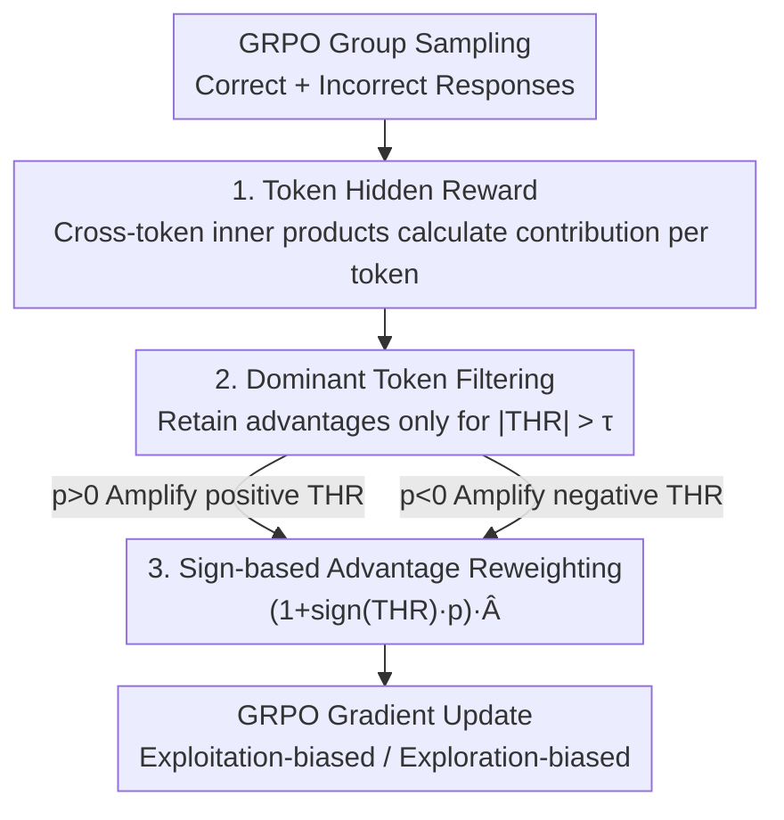

# Token Hidden Reward: Steering Exploration-Exploitation in Group Relative Deep Reinforcement Learning

**Conference**: ICLR 2026  
**OpenReview**: [https://openreview.net/forum?id=htQDmHvva6](https://openreview.net/forum?id=htQDmHvva6)  
**Code**: None  
**Area**: Reinforcement Learning / LLM Reasoning  
**Keywords**: GRPO, Exploration-Exploitation, Token-level Reweighting, Learning Dynamics, RLVR

## TL;DR
This paper proposes Token Hidden Reward (THR)—a token-level metric that quantifies each token's contribution to the "change in likelihood of correct responses." It finds that training dynamics are dominated by a small fraction of high |THR| tokens, and that the **sign** of THR corresponds exactly to exploration vs. exploitation. Based on this, a reweighting algorithm for GRPO advantages is designed using the sign of THR, where a single hyperparameter $p$ can explicitly steer training toward exploitation (increasing greedy decoding accuracy) or exploration (increasing Pass@K).

## Background & Motivation

**Background**: Reinforcement Learning with Verifiable Rewards (RLVR) has become a primary driver for improving large model reasoning capabilities. GRPO and its variants (e.g., GSPO) are widely adopted by models like DeepSeek-R1 and DeepSeek-Math because they eliminate the value network and calculate advantages using group relative rewards.

**Limitations of Prior Work**: The exploration-exploitation trade-off is unavoidable in RL training. Exploration (sampling uncertain actions to obtain new information) is critical for creative tasks and test-time scaling, while exploitation (making optimal decisions based on current knowledge) is suitable for scenarios requiring high confidence and low variance, such as medical diagnosis. However, **how to explicitly toggle the training objective between exploration and exploitation** remains an unresolved problem.

**Key Challenge**: Existing attempts remain at a "coarse-grained" level. Best-of-n training relies on external verifiers; Pass@K training only reweights based on problem hardness, which is **problem-level** and treats all tokens within a problem equally; entropy-based methods (such as COV-KL) only model a token's impact on **itself**. These methods ignore the fact that the actual signal driving training is token-level and arises from **interactions across tokens**.

**Key Insight**: The authors build upon the learning dynamics analysis of Deng et al. (2025), which uses an unconstrained feature framework to prove that the "rate of change of the correct response likelihood" is determined by the inner product terms of hidden representations of tokens in correct/incorrect responses (Theorem 3.1). The authors realized that this likelihood change can be decomposed into **individual tokens**, yielding the precise contribution of each token to the model's "belief in the correct answer."

**Core Idea**: Define token-level THR to measure each token's contribution to the correct response likelihood, and discover that "amplifying positive THR tokens → exploitation" and "amplifying negative THR tokens → exploration." Consequently, a unified sign-based reweighting mechanism can precisely control the exploration-exploitation trade-off.

## Method

### Overall Architecture

THR does not modify the sampling or reward process of GRPO. Instead, it inserts a token-level advantage reshaping layer **after calculating advantages and before backpropagating gradients**. The pipeline is as follows: first, for a set of GRPO rollouts (containing several correct responses $\{y_i^+\}$ and incorrect responses $\{y_i^-\}$), calculate the THR score for each token (derived from inner products of cross-token hidden representations, which can be positive or negative); next, retain only "dominant tokens" where $|\text{THR}|>\tau$, zeroing out the advantages of other tokens; finally, multiply the advantages of the retained tokens by a factor of $(1+\text{sign}(\text{THR})\cdot p)$ based on the **sign** of THR—where $p>0$ steers toward exploitation and $p<0$ steers toward exploration—before feeding them back into the GRPO objective function for training.

### Key Designs

**1. Token Hidden Reward: Decomposing "Likelihood Change" into Individual Tokens**

Deng et al. (2025) proved that the rate of change of the log-likelihood of a correct response $y_i^+$, $\frac{d}{dt}\ln\pi_{\theta(t)}(y_i^+\mid x)$, decreases as a specific quantity increases. This quantity consists of two inner product parts: the inner products between incorrect response tokens and correct response tokens (negative THR terms) minus the inner products between tokens within the correct response (positive THR terms). This paper attributes this global quantity precisely to **individual tokens**: for the $k'$-th token in response $y_j$, THR is defined as:

$$\text{THR}(y_i^+, y_j, k') = (2r_j-1)\cdot\sum_{k=1}^{|y_i^+|}\alpha_{k,k'}\cdot\langle h_{x,y_{i,<k}^+},\, h_{x,y_{j,<k'}}\rangle,$$

where $r_j\in\{0,1\}$ is the reward of the response (the prefix factor for incorrect responses $2r_j-1=-1$, reflecting GRPO's penalty), $\alpha_{k,k'}$ measures the similarity of prediction errors $e_z-\pi_\theta(\cdot)$ between two tokens, and the inner product term $\langle h,h\rangle$ characterizes the geometric proximity of hidden representations. Since a GRPO group may contain multiple correct responses, the group-level $\text{THR}_{j,k'}=\sum_i \frac{1}{|y_i^+|}\text{THR}(y_i^+,y_j,k')$ is obtained via length-normalized summation over all correct responses. Its **magnitude** indicates the strength of the token's influence on training, while its **sign** indicates whether it pushes the likelihood of the correct response up or down. Unlike methods that focus only on the token itself (e.g., entropy), the key distinction of THR is its explicit capture of **interactions across tokens**.

**2. Dominant Token Training: A Few High |THR| Tokens Decide Everything**

By plotting the density distribution of THR scores, the authors found that for both correct and incorrect responses, the THR of the vast majority of tokens clusters near 0, with only a small fraction of tokens having significantly large |THR|. In other words, training dynamics are monopolized by a few "dominant tokens." Based on this observation, a training objective that retains only dominant tokens is designed: a threshold $\tau$ is defined (following Deng et al. (2025), using "the average influence of one correct response token on the likelihood of other correct responses"), and the advantages of tokens below this threshold are zeroed out:

$$\hat{A}^{\text{THR}}_{i,k} = \mathbf{1}[|\text{THR}_{i,k}|>\tau]\cdot\hat{A}_{i,k}.$$

This is termed THR-only training. Its significance is confirmatory: experiments show that **training with only dominant tokens can match the performance of vanilla GRPO** using all tokens (in terms of both greedy accuracy and Pass@K), confirming the assertion that "a few high-impact tokens determine performance" and justifying intervening only on these tokens—focusing intervention where it truly matters while excluding noise tokens.

**3. Sign-based Advantage Reweighting: One Hyperparameter $p$ to Toggle Exploration and Exploitation**

This step converts the "sign ↔ exploration/exploitation" insight into an algorithm. The authors provide likelihood-based definitions for exploration and exploitation: **exploitation** is equivalent to increasing the likelihood of observed correct responses more (strengthening confidence in known correct answers); **exploration** is equivalent to increasing it less, thereby preserving probability mass for other candidate outputs. Since positive THR tokens push up the correct likelihood and negative THR tokens push it down, scaling advantages by sign allows adjustment of this trade-off:

$$\hat{A}^{\text{THR}(p)}_{i,k} = \mathbf{1}[|\text{THR}_{i,k}|>\tau]\cdot\big(1+\text{sign}(\text{THR}_{i,k})\cdot p\big)\cdot\hat{A}_{i,k}.$$

When $p>0$, positive THR tokens are amplified and negative THR tokens are suppressed, biasing training toward **exploitation** and increasing greedy decoding accuracy. When $p<0$, the opposite occurs: negative THR tokens are elevated, leaving probability mass for alternative outputs, biasing training toward **exploration** and improving Pass@K. Compared to **problem-level** reweighting like Pass@K training, which scales all tokens of a problem uniformly (using factors like $\sqrt{\binom{N^-}{K}/\binom{G}{K}}$), THR is **token-level**, treating different tokens within the same problem differently, thus providing finer and more targeted control.

### Loss & Training
The reweighted token advantages $\hat{A}^{\text{THR}(p)}_{i,k}$ directly replace $\hat{A}_{i,k}$ in the original GRPO objective. Others (likelihood ratio clipping $\varepsilon=0.2$, KL coefficient $10^{-4}$) remain unchanged. Training is conducted on MATH (levels 3–5) using 4×A100, prompt batch 256, 8 rollouts per prompt, sampling temperature 1.0, and learning rate $10^{-6}$, running for 40 steps (approx. 2 effective epochs) with dynamic sampling (discarding zero-advantage samples and re-sampling). This reweighting is plug-and-play for other group-relative objectives (e.g., GSPO-token).

## Key Experimental Results

### Main Results

**Exploitation (Greedy decoding accuracy, Table 1, Overall average %)**: $p>0$ is the strongest configuration for exploitation.

| Base Model | GRPO | THR ($p{=}0$) | THR ($p{=}{-}0.1$) | THR ($p{=}0.1$) |
|------------|------|------|------|------|
| Qwen2.5-Math-1.5B | 34.8 | 34.8 | 36.4 | 36.3 |
| Qwen2.5-Math-7B | 42.7 | 43.3 | 30.6→43.3* | **46.8** |
| Qwen2.5-0.5B-Ins | 10.0 | 10.9 | 12.1 | 11.8 |

\*For the 7B row, the overall average for $p{=}{-}0.1$ is 44.0. According to the paper: $p{=}0.1$ improves by +1.9%/+3.5% over vanilla THR on 1.5B/7B, and by +1.1%/+4.0% over GRPO.

**Exploration (Pass@K, Table 2, AIME24/25 + AMC23 average %)**: $p<0$ consistently achieves stronger Pass@K across model sizes.

| Method (Qwen2.5-Math-1.5B) | Pass@1 | Pass@128 | Pass@256 |
|------|------|------|------|
| GRPO | 21.3 | 67.3 | 72.5 |
| THR ($p{=}0$) | 20.3 | 67.5 | 72.5 |
| THR ($p{<}0$) | **21.9** | **69.7** | **76.7** |

According to the paper: On 1.5B, $p{<}0$ outperforms the best baseline by +2.4% on Pass@128 and +5.0% on Pass@256; on 7B, it consistently gains approx. +1% across all K. On difficult problems like AIME/AMC, $p<0$ on 1.5B even exceeds $p>0$, indicating that harder problems rely more on exploration.

### Ablation Study

| Aspect | Conclusion |
|------|------|
| THR-only (dominant tokens only) vs GRPO | Comparable → Performance is determined by a few dominant tokens |
| THR ($p{<}0$) token-level vs Pass@K-mixed problem-level | THR consistently leads by >1.1% across all K |
| Direct stacking of THR($p{<}0$)+Pass@K-mixed | **Becomes worse** (Pass@K gives too little weight to easy problems, weakening THR's token-level exploration) |
| THR($p{<}0$) vs COV-KL (Entropy regularization) | THR leads across all K → Cross-token interaction is more useful than single-token self-impact |
| Overlap between THR ↔ high-entropy tokens | Peak approx. **90%**, THR is strongly correlated with entropy but more granular |

### Key Findings
- **Sign is key**: The sign of THR directly corresponds to exploitation/exploration, and a single hyperparameter $p$ can continuously adjust the direction and intensity without changing loss functions or adding verifiers.
- **Intervention should focus on dominant tokens**: Since high |THR| tokens already monopolize training, reweighting them provides the most leverage; this also explains why training only on top high-entropy tokens (~90% overlap) can match GRPO.
- **Fine-grained beats coarse-grained**: Token-level (THR) is consistently superior to problem-level (Pass@K) and single-token entropy (COV-KL); however, they are not mutually exclusive—using static $\chi\cdot\text{Pass@K}+(1{-}\chi)\cdot\text{GRPO}$ ($\chi{=}0.2$ to retain weight for easy problems) can slightly outperform pure THR($p{<}0$) on 7B.
- **Generalization**: When applied to GSPO-token, $p{<}0$ improves over THR($p{=}0$)/GSPO by +0.9%/+1.4%; on Llama3.2-3B-Instruct (weaker at math), it still boosts Pass@K by up to 7% compared to GRPO.

## Highlights & Insights
- **"Inverse attribution" of a global dynamics theorem to individual tokens**: Precisely extracting each token's contribution from the inner product formula of the likelihood change rate is the foundation of this work. This approach of "theory first (learning dynamics), algorithm second" is highly reusable.
- **Sign as a knob**: After discovering the "positive/negative THR ↔ exploitation/exploration" mapping, the reweighting factor $(1+\text{sign}\cdot p)$ is simple enough to be integrated into any group relative objective at almost zero cost, offering high engineering friendliness.
- **Unification of three seemingly unrelated lines**: By comparing Pass@K training (problem-level), entropy regularization (single-token self-impact), and dynamics analysis (cross-token interaction) within the same framework, the paper shows they are different facets of the same dynamics—this "unified perspective" is valuable for understanding RLVR.
- **Transferability**: The THR paradigm—"cross-token hidden representation inner product → token contribution → sign-based reweighting"—can theoretically be moved to other RLVR domains like code generation or scientific reasoning, or even adaptively adjust $p$ based on training progress/problem difficulty.

## Limitations & Future Work
- **Validated only on mathematical reasoning**: Training and evaluation are limited to MATH and AIME/AMC; whether the sign-exploration mapping of THR is universal for tasks like code or open-domain remains unknown.
- **$p$ is a fixed hyperparameter**: Experiments use a constant $p$ (e.g., 0.1/−0.1). the authors themselves list "adaptive adjustment of $p$ based on training progress or problem difficulty" as future work—a fixed $p$ is not optimal across different difficulty levels.
- **Dependency on hidden representation and error vector calculations**: THR requires calculating cross-token $\langle h,h\rangle$ and $\alpha_{k,k'}$, which adds overhead compared to vanilla GRPO (though it overlaps ~90% with entropy and can be approximated); the paper lacks a systematic computational cost analysis.
- **Theory based on unconstrained feature framework**: The validity of Theorem 3.1 relies on this idealized assumption; the degree of approximation in real large model training is not fully discussed.

## Related Work & Insights
- **vs Deng et al. (2025) (Negative gradient analysis)**: The direct source of this work. That study only analyzed negative gradients and served exploitation (reducing penalties for tokens contributing to correct responses); THR extends the analysis to both sides, covering both exploration and exploitation.
- **vs Pass@K training (Chen et al. 2025, etc.)**: They perform **problem-level** reweighting based on problem hardness to encourage exploration; THR differentiates tokens within the same problem, providing finer **token-level** control, and consistently performs better in tests.
- **vs COV-KL (Cui et al. 2025, entropy regularization)**: Uses entropy to regulate exploration but only models a token's impact on itself; THR models cross-token interactions, leading in all Pass@K metrics, and finds approx. 90% overlap between high THR and high entropy tokens.
- **vs Best-of-n training (Chow et al. 2024)**: Relies on external verifiers to select the best candidate, which has poor scalability; THR does not require a verifier and relies purely on internal learning dynamic signals.

## Rating
- Novelty: ⭐⭐⭐⭐⭐ "Inverse attribution" of learning dynamics to the token level and unified exploration-exploitation control via sign is a fresh perspective with clean execution.
- Experimental Thoroughness: ⭐⭐⭐⭐ Extensive across three model sizes + GSPO + Llama + comparisons with entropy/Pass@K, though limited to the mathematical reasoning domain.
- Writing Quality: ⭐⭐⭐⭐ The chain of Theory → Insight → Algorithm → Experiment is clear, though notation is somewhat dense and requires cross-referencing formulas.
- Value: ⭐⭐⭐⭐⭐ Provides a plug-and-play, interpretable knob for exploration-exploitation in RLVR, offering high engineering value.

<!-- RELATED:START -->

## Related Papers

- [\[ICLR 2026\] Exploration vs Exploitation: Rethinking RLVR through Clipping, Entropy, and Spurious Reward](exploration_vs_exploitation_rethinking_rlvr_through_clipping_entropy_and_spuriou.md)
- [\[ICLR 2026\] LaSeR: Reinforcement Learning with Last-Token Self-Rewarding](laser_reinforcement_learning_with_last-token_self-rewarding.md)
- [\[ICLR 2026\] Spotlight on Token Perception for Multimodal Reinforcement Learning](spotlight_on_token_perception_for_multimodal_reinforcement_learning.md)
- [\[ACL 2026\] Semantic-Space Exploration and Exploitation in RLVR for LLM Reasoning](../../ACL2026/reinforcement_learning/semantic-space_exploration_and_exploitation_in_rlvr_for_llm_reasoning.md)
- [\[ICLR 2026\] Revisiting Group Relative Policy Optimization: Insights into On-Policy and Off-Policy Training](revisiting_group_relative_policy_optimization_insights_into_on-policy_and_off-po.md)

<!-- RELATED:END -->
