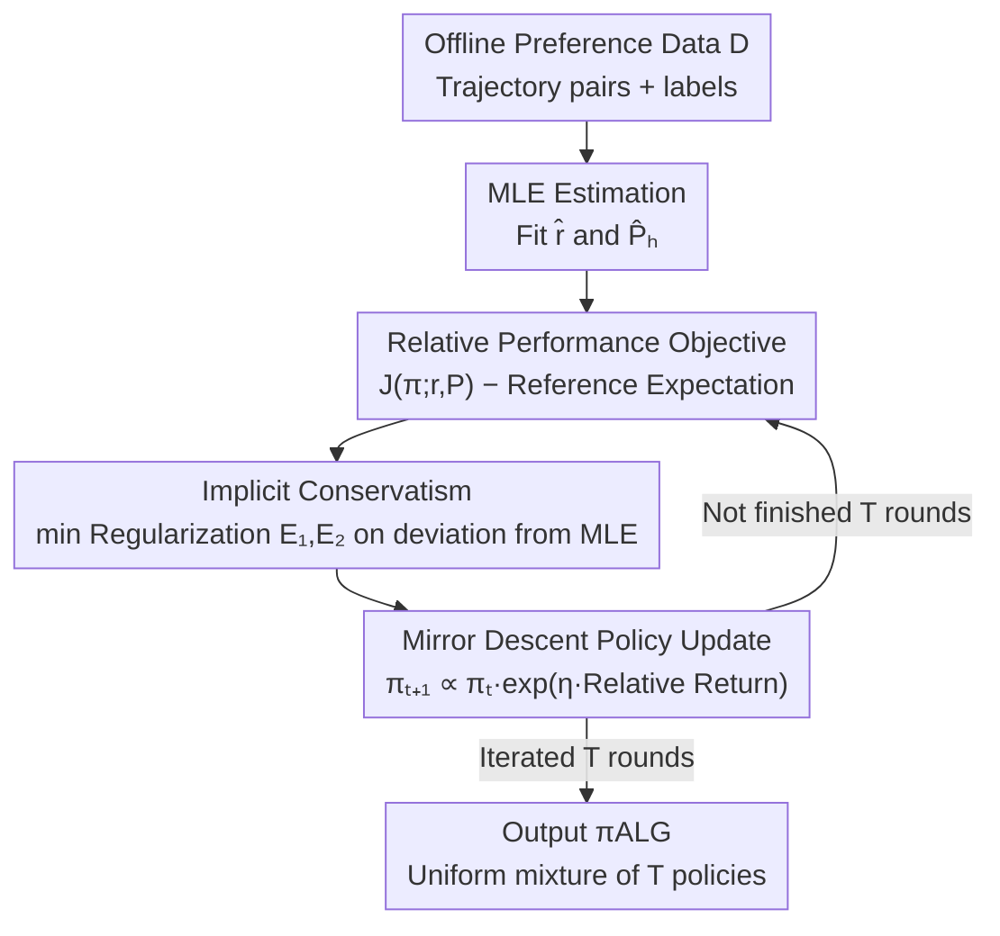

# Toward Conservative Planning from Human-AI Preferences in Reinforcement Learning

**Conference**: ICLR 2026  
**OpenReview**: [https://openreview.net/forum?id=yzHwT3gfaE](https://openreview.net/forum?id=yzHwT3gfaE)  
**Code**: https://github.com/Rshias/MCP (Available)  
**Area**: Reinforcement Learning / Preference-based RL / Offline RL  
**Keywords**: Preference-based RL, Offline RL, Conservative Planning, Partial Coverage, Sample Complexity

## TL;DR
This paper proposes MCP (Model-based Conservative Planning), a model-based offline preference reinforcement learning algorithm. By using the "performance difference relative to a reference policy" as the objective and "deviation regularization from the maximum likelihood model" to implicitly encode conservatism, it becomes the first to simultaneously achieve "provable sample efficiency" and "computational tractability" under conditions of **partial data coverage** and **unknown transition dynamics**. It performs comparably to or better than SOTA on Meta-World benchmarks with real human feedback.

## Background & Motivation
**Background**: Preference-based RL (PbRL) does not rely on step-by-step explicit rewards; instead, it uses relative preference labels on trajectory pairs provided by humans or LLMs to infer policies. This avoids the difficulties of reward function design and "reward hacking." Offline PbRL further utilizes pre-collected datasets of "trajectory pairs + preference labels," avoiding sampling costs and safety risks of online interaction, making it more practical for expensive interaction scenarios like healthcare and finance.

**Limitations of Prior Work**: Most existing offline PbRL methods assume **full coverage** of the trajectory distribution of all compared policies. When only **partial coverage** exists (where offline data only covers some but not all trajectory distributions induced by good policies), they struggle to learn near-optimal policies. Minority works addressing partial coverage have fatal flaws: Principled-RLHF only supports linear reward models; FREEHAND / Sim-OPRL achieve conservatism by explicitly constructing confidence sets, which are **computationally intractable** in practice; concurrent work APPO, while implementable, either assumes known transition dynamics or requires fitting an additional value function that depends on the learned model to "locally smooth" coverage gaps—requiring value function realizability and not guaranteeing near-optimal regret under partial coverage.

**Key Challenge**: There is a tension between "encoding conservatism" and maintaining "computational tractability + avoiding extra assumptions." Explicit confidence sets are thoroughly conservative but intractable, whereas value function smoothing is tractable but requires extra realizability assumptions and fails to guarantee regret under partial coverage.

**Goal**: To provide an offline PbRL algorithm that has PAC sample complexity guarantees and is practically implementable under general function approximation and **unknown transition dynamics**, while relaxing coverage conditions from "full coverage" to "covering only the trajectory distribution induced by the (optimal) comparator policy" (i.e., single-policy concentrability, the weakest condition for offline data coverage).

**Key Insight**: The authors adopt a **model-based** perspective and propose an **implicit** way to encode conservatism. Instead of explicitly characterizing the "width of confidence sets," they embed conservatism into the objective through "regularization of model deviation from the maximum likelihood estimate." Simultaneously, they use the "performance difference relative to a reference policy" as the planning objective to avoid unreliable absolute value estimation and eliminate additional value function modeling.

**Core Idea**: A combination of "deviation regularization from the MLE model (implicit conservatism) + performance difference relative to reference policy (model-based planning objective) + mirror descent policy updates" replaces "explicit confidence sets / extra value functions," becoming both provable and tractable under partial coverage.

## Method

### Overall Architecture
MCP aims to solve: given a dataset $D=\{(\tau^{n,0},\tau^{n,1},y^n)\}_{n=1}^N$ of trajectory pairs with preference labels (sampled from reference policy $\mu$, labels from Human/AI, preference probability determined by BTL model $P(y=1|\tau^0,\tau^1)=\Phi(r^\star(\tau^1)-r^\star(\tau^0))$), learn a policy capable of competing with the "best comparator policy within the data coverage" without knowing the true reward $r^\star$ and true transition $P^\star$.

The process follows an "estimate then iterative optimization" workflow: first, fit a reference reward model $\hat r$ and transition model $\hat P_h$ using MLE; then enter a cycle of $T$ rounds doing two things—pessimistically (min) selecting a set of reward/transition models from the model class that consistent with MLE to minimize current policy performance (implicit conservatism), then taking a **mirror descent** step to update the policy toward a direction "better than the reference policy" under these worst-case models; finally, output the **uniform mixture** of all policies from $T$ rounds. No explicit confidence sets, extra value functions, or explicit searches in the policy function class are required.

### Key Designs

**1. Relative Performance Objective: Anchoring with a reference policy to bypass unreliable absolute value estimation**

Offline PbRL can **overestimate** returns in unseen regions when directly using learned reward/transition models for optimization. MCP maximizes the **performance difference** relative to a reference distribution $\mu_{\text{ref}}$ (usually the distribution inducing the offline data) instead of maximizing absolute returns:

$$\max_{\pi} \; J(\pi; r, \{P_h\}) - \mathbb{E}_{\tau\sim\mu_{\text{ref}}}[r(\tau)].$$

This has two benefits: first, it replaces "absolute value estimation" with "improvement relative to reference," where the term $\mathbb{E}_{\tau\sim\mu_{\text{ref}}}[r(\tau)]$ is reliable within data coverage; thus, relative comparisons remain robust even if absolute estimates are biased. Second, this can be evaluated purely via model-based planning (rollouts in the model), **eliminating the need for a separate value function** and the associated realizability assumptions required by methods like APPO. This is the source of the "safe policy improvement" guarantee in Corollary 4.2.

**2. Implicit Conservatism: Using deviation regularization from MLE instead of intractable explicit confidence sets**

Existing provable methods rely on explicit confidence sets for conservatism, but these widths are immeasurable and optimization is intractable. MCP embeds conservatism **implicitly** into a minimax objective: taking the $\min$ over the reward $r$ and transitions $\{P_h\}$ (evaluating the policy under worst-case models) while using two regularizers to **prevent the models from deviating too far from the MLE**:

$$\max_{\pi}\min_{r,\{P_h\}} \; J(\pi; r, \{P_h\}) - \mathbb{E}_{\tau\sim\mu_{\text{ref}}}[r(\tau)] + \lambda_1 \mathcal{E}_1(r;D) + \lambda_2 \mathcal{E}_2(\{P_h\};D).$$

$\mathcal{E}_1$ penalizes the "preference difference" $r(\tau^{n,1})-r(\tau^{n,0})$ of the candidate reward from the MLE reward; $\mathcal{E}_2$ penalizes the candidate transition deviation from $\hat P_h$ in total-variation distance. $\lambda_1, \lambda_2$ are user-specified "conservatism strength" knobs. The inner $\min$ forces pessimism in regions with low data coverage, while regularization limits search to "credible models supported by data." This approach is **computationally tractable** as it uses measurable deviations from MLE.

**3. Pure Model-based Planning + Mirror Descent Policy Update: No value functions, no explicit policy search**

Once worst-case models $r^t, \{P_h^t\}$ are determined, MCP uses a multiplicative **mirror descent** update instead of an explicit search in policy class $\Pi$:

$$\pi^{t+1}(a|s) \;\propto\; \pi^{t}(a|s)\,\exp\!\Big(\eta\,\mathbb{E}_{d^{\pi^t}_{\{P_h^t\}}}\big[r^t(\tau)\,\big|\,s,a\big]\Big).$$

This bridges the policy space and model class: the update direction is directly determined by relative returns under the current worst-case model. All evaluations are done via model-based planning, avoiding bias from extra value function fitting. The output $\pi_{\text{ALG}}=\text{MixIter}(\{\pi^t\}_{t=1}^T)$ corresponds to an optimization error of $O(R_{\max}\sqrt{\log|A|/T})$, which vanishes as $T$ increases.

**4. Structured Dynamic Refinement: Guarding tighter regret with natural coverage metrics**

Under general function approximation, regret depends on "concentrability coefficients" $C_R(\pi), C_P(\pi)$. This paper further shows that for specific transition structures, these can be refined into smaller, more interpretable quantities. Two cases: **Kernelized Nonlinear Regressors (KNR)** assume transitions are linear transformations of nonlinear embeddings $\phi(s,a)$ plus noise; $C_P(\pi)$ is replaced by the relative condition number $C_P^K(\pi)$, where the bound depends on the rank of data covariance $\mathrm{rank}(\Sigma_\mu)$ rather than dimension $d$. **Factored Models** replace global density ratios with factor-wise local concentrability $C_P^F(\pi)$, allowing sample complexity to grow with factor size rather than exponentially with state dimension $d$.

### Loss & Training
- Reward/Transition MLE: $\hat r=\arg\max_r \sum_n \log P_r(o=o^n|\tau^{n,1},\tau^{n,0})$, $\hat P_h=\arg\max_{P_h}\sum_n\sum_i \log P_h(s^{n,i}_{h+1}|s^{n,i}_h,a^{n,i}_h)$.
- Learning rate $\eta=\sqrt{\log|A|/(2R_{\max}^2 T)}$; theoretical regularizers $\lambda_1=O(C_R(\pi))$, $\lambda_2=O(R_{\max}\sqrt{C_P(\pi)M_P})$.
- Main Theorem (Theorem 4.1): With probability at least $1-\delta$, $J(\pi)-J(\pi_{\text{ALG}})$ is upper bounded by "optimization error + reward statistical error + transition statistical error." Sample complexity is $O(\epsilon^{-2})$, which is superior to APPO's $O(\epsilon^{-4})$ and handles infinite function classes.

## Key Experimental Results

### Main Results
Evaluation on Meta-World medium-replay benchmarks with 500/1000 human preference samples across 8 tasks. Success rate (%) compared with Oracle (IQL with true rewards), MR, PT, DPPO, IPL, and APPO. Representative 1000-preference results:

| Task (1000 Pref) | MR | PT | DPPO | IPL | APPO | MCP |
|------|------|------|------|------|------|------|
| BPT | 8.48 | 18.27 | 3.20 | 36.67 | 59.04 | **62.93** |
| BPT-wall | 0.48 | 2.13 | 0.27 | 14.07 | 62.96 | **69.73** |
| drawer-open | 98.40 | 95.32 | 36.47 | 28.53 | 98.56 | **99.07** |
| lever-pull | 88.96 | 72.93 | 8.53 | 40.40 | 76.96 | **83.33** |
| sweep-into | 26.00 | 20.27 | 23.33 | 30.40 | 18.16 | **34.13** |
| Avg Rank(500/1000/Total) | 3.00/2.75/2.88 | 3.50/4.13/3.81 | 5.25/5.38/5.31 | 4.00/3.88/3.94 | 2.88/2.75/2.81 | **2.38/2.13/2.25** |

MCP achieves the best overall average rank (2.25). While it outperforms APPO in most tasks (attributed to APPO's reliance on value function smoothing), it lags in specific tasks like dial-turn, where APPO or MR perform significantly better.

### Ablation Study
On lever-pull-1000, components were removed (Figure 2a):

| Configuration | Performance | Explanation |
|------|------|------|
| Full MCP | Fast convergence to high success | Complete model |
| No reward reg ($\lambda_1=0$) | Nearly no progress | Missing conservatism -> Over-optimism/Instability |
| No transition reg ($\lambda_2=0$) | Nearly no progress | Same as above |
| No Relative Performance | High variance, unstable | Loss of safe policy improvement guarantee |
| Value-based MCP | Early rise, later collapse | Pure value updates introduce model bias |

### Key Findings
- **Conservative regularizers ($\lambda_1, \lambda_2$) are vital**: Removing either prevents progress, validating the "implicit conservatism" design.
- **Relative performance objective ensures stability**: Its removal leads to high variance and instability.
- **Robustness to small data**: MCP maintains high success rates even with $N=100$ preference samples.
- **Robustness to label noise**: MCP success rate decays slower than MR as label flipping probability increases.
- **Hyperparameter insensitivity**: Success rates only fluctuate mildly as $\lambda_1, \lambda_2$ change across several orders of magnitude.

## Highlights & Insights
- **Elegance of Implicit Conservatism**: Rewriting conservatism from "immeasurable confidence set widths" into "measurable deviation regularizers from the MLE model" solves the "provable vs. tractable" tension in offline PbRL.
- **Relative Objective Synergy**: Using "improvement relative to reference" as an objective eliminates value functions, avoids overestimation, and provides safety guarantees ("not worse than behavior policy") in one stroke.
- **Transferable logic**: The trick of using MLE deviation for implicit pessimism is transferable to other offline learning problems requiring conservatism (e.g., offline RLHF, offline IL).
- **Structure breaking dimensionality curse**: Bounds for KNR and Factored models suggest algorithm can actively exploit low-dimensional or factorized structures in data.

## Limitations & Future Work
- **Preference model restricted to BTL**: The method defaults to the BTL sigmoid link. Extending to Thurstone models remains future work.
- **Experimental scope**: Evaluation is limited to 8 Meta-World tasks; MCP lags in specific tasks (box-close, dial-turn), requiring careful interpretation of average ranks.
- **Theoretical-Practical Gap**: Theory assumes realizability ($r^\star\in R, P_h^\star\in P_h$); theoretical values for $\lambda$ depend on unknown concentrability coefficients, requiring tuning in practice.

## Related Work & Insights
- **vs Principled-RLHF**: Both handle partial coverage and are tractable, but the former is restricted to linear reward models; MCP utilizes general function approximation.
- **vs FREEHAND / Sim-OPRL**: Both are provable under general approximation but rely on intractable explicit confidence sets.
- **vs APPO**: Both are model-based and tractable. APPO requires value function smoothing (realizability dependent) and has $O(\epsilon^{-4})$ complexity; MCP is $O(\epsilon^{-2})$ and avoids extra value functions.
- **vs OPRL / IPL**: These require full coverage and provide no sample efficiency guarantees for partial coverage.

## Rating
- Novelty: ⭐⭐⭐⭐⭐ First offline PbRL algorithm to be both provably sample-efficient and computationally tractable under partial coverage and unknown dynamics.
- Experimental Thoroughness: ⭐⭐⭐⭐ Extensive multi-dimensional analysis, though task domains are relatively narrow.
- Writing Quality: ⭐⭐⭐⭐ Clear motivation linking theory to algorithm.
- Value: ⭐⭐⭐⭐⭐ Solid theoretical contribution resolving the "provable vs. tractable" tension.

<!-- RELATED:START -->

## Related Papers

- [\[ICLR 2026\] Improving Human-AI Coordination through Online Adversarial Training and Generative Models](improving_human-ai_coordination_through_online_adversarial_training_and_generati.md)
- [\[ICLR 2026\] Trajectory Generation with Conservative Value Guidance for Offline Reinforcement Learning](trajectory_generation_with_conservative_value_guidance_for_offline_reinforcement.md)
- [\[ICLR 2026\] Peng's Q($\lambda$) for Conservative Value Estimation in Offline Reinforcement Learning](pengs_qlambda_for_conservative_value_estimation_in_offline_reinforcement_learnin.md)
- [\[ICLR 2026\] Using Reinforcement Learning to Train Large Language Models to Explain Human Decisions](using_reinforcement_learning_to_train_large_language_models_to_explain_human_dec.md)
- [\[ICLR 2026\] Benefits and Pitfalls of Reinforcement Learning for Language Model Planning: A Theoretical Perspective](benefits_and_pitfalls_of_reinforcement_learning_for_language_model_planning_a_th.md)

<!-- RELATED:END -->
