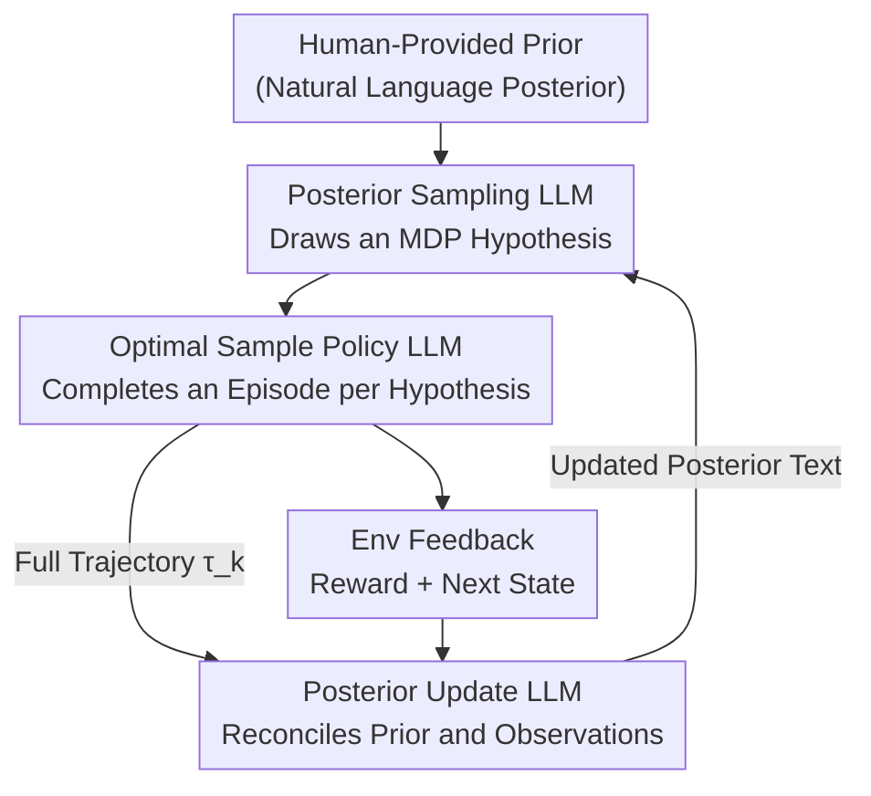

# Toward Efficient Exploration by Large Language Model Agents

**Conference**: ICLR 2026  
**OpenReview**: [https://openreview.net/forum?id=M3vwnscpL2](https://openreview.net/forum?id=M3vwnscpL2)  
**Area**: Reinforcement Learning / LLM Agent  
**Keywords**: Efficient Exploration, Posterior Sampling, Thompson Sampling, PSRL, LLM Agent

## TL;DR
Instead of designing new LLM agent architectures to hope for "emergent" exploration capabilities, this paper advocates for the explicit implementation of Posterior Sampling Reinforcement Learning (PSRL)—a classical RL algorithm with proven exploration efficiency—using LLMs. By outsourcing the three core steps of PSRL to three distinct LLMs, the authors achieve cumulative regret curves that significantly outperform mainstream LLM agent baselines on bandits, tabular MDPs, and pure natural language tasks like Wordle and Combination Locks.

## Background & Motivation

**Background**: Constructing sequential decision-making agents based on Large Language Models (LLM agents) is a major trend in RL. The mainstream approach involves "stacking architectures"—using one or multiple LLMs to collaborate (e.g., ReAct, Reflexion, In-Context RL, In-Context Policy Iteration). These rely on in-context learning or self-reflection to let agents "implicitly" learn optimal behavior through trial-and-error interactions with the environment.

**Limitations of Prior Work**: These agents essentially operate within classical RL settings and must face the three fundamental barriers to data efficiency: generalization, exploration, and credit assignment. This paper demonstrates through experiments that on simple natural language tasks where exploration is critical for success, these trendy agent designs generally explore poorly. They either leave the "how to explore" entirely to the LLM's live performance or expect in-context learning to mimic the exploratory behavior of some RL/bandit algorithm, which current LLMs struggle to achieve.

**Key Challenge**: The RL literature has long established classical algorithms (like PSRL) that handle exploration elegantly with provable statistical efficiency guarantees. However, these algorithms require maintaining a Bayesian posterior over the environment (the transition/reward functions of the MDP) and solving for an optimal policy relative to posterior samples. This machinery is almost impossible to operate in pure natural language environments: the epistemic state space of high-dimensional MDPs expands exponentially with the horizon, conjugate priors only cover a few statistical distributions, and approximation methods like Langevin dynamics are difficult to graft onto LLMs. This results in a disconnect: good algorithms cannot be used for language tasks, and language agents cannot explore.

**Goal**: Rather than inventing new algorithms, the goal is to revisit existing RL algorithms and ask: "Can LLMs implement them, thereby extending the footprint of these algorithms to natural language environments they originally could not reach?"

**Key Insight**: Abstractly, an RL algorithm is nothing more than "specified inputs + a sequence of deterministic steps." The advent of LLMs should not change the fundamental principles of agent design. The authors observe that each step of PSRL (sampling a posterior, finding the optimal behavior for that sample, updating the posterior) can be decomposed into "atomic functions" that LLMs excel at, using natural language to represent what originally required precise statistical distributions.

**Core Idea**: Explicitly "implement" a known efficient RL algorithm (PSRL) using LLMs, rather than using LLM architectures to "implicitly" replace it. The former inherits decades of thoroughly researched exploration guarantees from Thompson Sampling, while the latter can only pray for exploration capabilities to emerge autonomously.

## Method

### Overall Architecture

The paper aims to solve "statistically efficient exploration in natural language tasks." The overall approach is to port the classical PSRL algorithm into the LLM context. In classical PSRL, uncertainty about the true MDP $M$ is modeled as a posterior distribution $P(M\mid H_k)$. At the start of each episode, a "statistically plausible" MDP hypothesis is drawn from the posterior using Thompson Sampling. An optimal policy is then solved for this sampled MDP and executed for the entire episode. The posterior is updated once at the end using the full trajectory $\tau_k$. Its elegance lies in the fact that the posterior is fixed within an episode and only updated at the end, yet it is sufficient to drive directed exploration (constantly reducing epistemic uncertainty) and satisfies Bayesian regret bounds for problem classes like tabular MDPs.

The core contribution is outsourcing the three steps of the PSRL algorithm to three independent LLMs, letting the PSRL "algorithmic skeleton" orchestrate the LLM outputs. The pipeline is as follows: A human provides a prior (initial "posterior" text) in natural language. The **Posterior Sampling LLM** generates a reasonable hypothesis about how transitions/rewards unfold. The **Optimal Sample Policy LLM** selects actions step-by-step within this hypothesis to complete an episode. The **Posterior Update LLM** takes the full trajectory to reconcile the prior with observations and outputs a new posterior text.

The key to this design is that each of the three LLMs is only responsible for one "atomic function"; none are prompted to "encourage exploration." Exploratory behavior arises naturally from the PSRL algorithmic skeleton, not from the LLM's improvisation.

### Key Designs

**1. Design Principle: Explicitly "Implement" Classical RL Algorithms rather than Implicitly "Replacing" them with LLM Architectures**

This is the meta-level contribution of the paper and the fundamental distinction from all baselines. Existing LLM agents (ICPI, ICRL, Reflexion, etc.) focus on "combining multiple LLMs and hoping for emergent exploration." This paper does the opposite: since an RL algorithm is just "inputs + a sequence of steps," it treats those steps as fixed and uses LLMs to fill the gaps. The immediate benefit is that PSRL’s decades of theoretical exploration guarantees (Bayesian regret bounds for Thompson Sampling) are inherited intact. Even if every step implemented by the LLM is "imprecise," classical PSRL still maintains regret bounds when policies are only approximately optimal (Osband 2016a, §5.4), providing a reason to expect similar robustness in the LLM version. The authors emphasize the distinction: "LLMs implementing an RL algorithm" vs. "an RL algorithm being implemented by LLMs." The former expands classical algorithms into natural language domains, while the latter (mimicking RL outputs) remains confined to traditional problem classes.

**2. Three LLM Sub-routines Orchestrate the PSRL Cycle**

PSRL requires three things: sampling from the posterior, solving for the optimal policy on the sample, and updating the posterior with trajectories. **Posterior Sampling LLM**: Given the current posterior text, it generates a plausible hypothesis of transitions and rewards. In tabular MDPs, this could be a list of rewards and transitions for each state-action pair; in practical tasks, it describes key information sufficient to determine (near-)optimal behavior. **Optimal Sample Policy LLM**: Given the sampled hypothesis and the current state, it selects the action that would be optimal *if* the hypothesis were true. For simple tasks, it is asked directly; for complex tasks, Chain-of-Thought prompting is used. **Posterior Update LLM**: At the end of an episode, it takes the trajectory of $H$ state-action pairs and reconciles the "prior knowledge at the start of the episode" with the "observed interactions" to produce an updated posterior. Once these three components are in place, the PSRL loop runs. Interestingly, the sampling temperature $\kappa_{\text{sampling}}$ for the Posterior Sampling LLM is found to significantly impact exploration quality.

**3. Textual Epistemic States + Environment Proxies: Making "Posterior Maintenance" Viable in Language**

The biggest obstacle for classical PSRL beyond tabular settings is the inability to represent uncertainty about the MDP in high-dimensional environments. The solution here is to write the posterior directly as **natural language text**. It summarizes the "known" and "uncertain" parts of the transitions/rewards and explicitly expresses how much uncertainty remains—this text serves as the epistemic state representation for the PSRL agent. This offers two advantages: first, designers can use the full expressive power of language to inject prior knowledge without being restricted to conjugate priors. For instance, describing a transition distribution as a Dirichlet distribution in language naturally induces the LLM to maintain visit counts. Second, it introduces **environment proxies**: for many tasks, it is unnecessary to maintain statistics for every state-action pair; one only needs to track a "sufficient statistic." For example, in Wordle, the MDP is determined by an unknown five-letter target word. That target word is the environment proxy. The LLM-based PSRL only needs to maintain uncertainty regarding the "target word." This compresses the cost of maintaining the posterior from exponential to a manageable range.

## Key Experimental Results

Experiments select tasks where "exploration is the unique or primary bottleneck to data efficiency," specifically stripping away interference from generalization and credit assignment. The evaluation metric is the cumulative regret curve (lower and flatter is better). All LLMs use GPT-4o unless otherwise specified.

### Main Results

| Task | Type | Performance of Ours (LLM-PSRL) | Comparison |
|------|------|-------------------------------|------------|
| 5-arm Bernoulli bandit | Bandit | Cumulative regret better than classical TS at $\kappa_{\text{sampling}}=1.2$ ($T=100$) | Classical Thompson Sampling |
| Customer Service bandit (Real data, large action space) | NL Bandit | Far outperforms all baselines under well-specified prior | ICPI / ICRL / Reflexion |
| RiverSwim (3 states, $H=6$) | Tabular MDP | Achieves sublinear regret with o1-mini, comparable to vanilla PSRL | Vanilla PSRL / Reflexion / ICRL |
| Combination Lock ($H=3$ digits, $K=8$, random code prob <0.14%) | NL MDP | Best exploration efficiency, approaches Bayesian optimal policy | ICPI / ICRL / Reflexion |
| Wordle ($K=6, H=5$) | NL MDP | Outperforms all baselines even with standard GPT-4o | ICPI / ICRL / Reflexion |

### Ablation Study

| Configuration | Key Phenomenon | Explanation |
|------|---------|------|
| Sampling Temp $\kappa_{\text{sampling}}$ | 1.2 > 1.0 or lower | At Temp ≤ 1, samples bias toward "most successful arm so far," degrading to greedy; >1 approaches asymptotic TS exploration. |
| RiverSwim: GPT-4o → o1-mini | From linear to sublinear regret | Stronger models allow LLM-PSRL to "scale gracefully" under stochastic transitions. |
| Same upgrade for Reflexion/ICRL | Minimal improvement, ICRL worsened | Exploration comes from the PSRL skeleton, not model strength. ICRL's failure likely due to mismatch between ICL and o1-mini reasoning in stochastic settings. |
| Wordle: GPT-4o → DeepSeek-R1 | All agents improve, but baselines with R1 still fail to beat LLM-PSRL with GPT-4o | Strong reasoning cannot substitute for algorithmic exploration structures. |

### Key Findings
- **Exploration comes from the skeleton, not prompts**: None of the three LLMs are prompted to "encourage exploration," yet efficient exploration emerges from their arrangement within PSRL—a fundamental difference from baselines relying on prompt-induced exploration.
- **Model capability and algorithmic structure are orthogonal/complementary**: Upgrading to a stronger LLM allows PSRL to cross from "linear" to "sublinear" regret in stochastic environments, whereas the same upgrade is useless or harmful for baselines. This suggests that the required missing piece is "structure," while model strength is a supplementary benefit.
- **Prior misspecification is a weakness and a point of honesty**: In the customer service task, when GPT-4o provides a prior, the true solution might not be in the support (misspecification), which PSRL does not inherently handle. However, even then, baselines do not significantly beat it, and the advantage expands once the prior is corrected.
- **Stochastic transitions + Large state spaces are current boundaries**: When RiverSwim is scaled up, the LLM's weakness in planning re-emerges. This is the primary failure mode of the current method.

## Highlights & Insights
- **"Implement vs. Replace" is a transferable design philosophy**: Instead of reinventing RL algorithms for LLMs, treat the LLM as an executor for sub-routines needed by classical algorithms. This perspective extends beyond PSRL to any algorithm with clear steps and theoretical guarantees (e.g., UCB, Information-Directed Sampling - IDS).
- **Textual epistemic states** are the key trick to porting Bayesian methods to language tasks. Representing the "posterior" as text expressing both knowledge and uncertainty bypasses conjugate prior limitations and allows for flexible prior injection.
- **Environment proxies** compress the cost of "maintaining a posterior over the whole MDP" into "maintaining uncertainty over a sufficient statistic," making the method viable for combinatorially explosive tasks like Wordle.
- A counter-intuitive "Aha!" moment: Baselines using stronger reasoning models (DeepSeek-R1) still fail to catch up to PSRL using a weaker model—proving exploration is a structural problem, not just a matter of compute power.

## Limitations & Future Work
- **LLM planning capacity is a bottleneck under stochasticity**: The authors admit performance degrades as state-action spaces grow in stochastic environments due to poor LLM planning. Future work may explore regularization methods (Jiang 2015, Arumugam 2018) that tolerate imprecise transition models.
- **No explicit mechanism for prior misspecification**: PSRL assumes a well-specified prior. If the truth is outside the support, there is no built-in remedy; the paper currently circumvents this by adjusting how priors are generated.
- **Evaluated tasks are relatively simple**: To isolate exploration, tasks provided immediate step-by-step feedback and small state spaces. Compatibility with complex tasks involving joint generalization and credit assignment challenges is unverified.
- **Cost**: High dependency on LLM APIs makes it expensive; ICPI only ran 10 trials due to cost. Only rough estimates of tokens/dollars are provided.

## Related Work & Insights
- **vs. ICPI (In-Context Policy Iteration)**: Both use three LLMs, but ICPI implements policy iteration and assumes data is pre-sampled, relying on ICL to balance datasets. In exploration-heavy tasks, it never observes non-zero rewards and collapses to a random policy. Ours implements PSRL, making exploration endogenous.
- **vs. ICRL (In-Context RL)**: ICRL relies on sampling noise (Bernoulli($p$) for episode replay) to explore; this paper uses the guaranteed mechanism of Thompson Sampling.
- **vs. Reflexion**: Reflexion relies on self-reflection for verbal guidance, which initially only "encourages trying new options" vaguely; Ours does not rely on the premise that the LLM already knows "how" to explore.
- **vs. Classical PSRL / Vanilla TS**: Clinical versions are limited to tabular or small-scale domains with conjugate priors. This paper extends them to natural language tasks and provides rare empirical support for PSRL's regret curves in an expanded setting.

## Rating
- Novelty: ⭐⭐⭐⭐⭐ The "implement rather than replace" philosophy is clear and transferable.
- Experimental Thoroughness: ⭐⭐⭐⭐ Covers bandit to natural language tasks with three baselines, though task scale is small to isolate exploration.
- Writing Quality: ⭐⭐⭐⭐⭐ Motivations, algorithmic mappings, and failure boundaries are presented clearly and honestly.
- Value: ⭐⭐⭐⭐⭐ Provides a structural solution to "LLM agent exploration failure" and bridges classical RL theory with language tasks.

<!-- RELATED:START -->

## Related Papers

- [\[ICLR 2026\] CDE: Curiosity-Driven Exploration for Efficient Reinforcement Learning in Large Language Models](cde_curiosity-driven_exploration_for_efficient_reinforcement_learning_in_large_l.md)
- [\[ICLR 2026\] Squeeze the Soaked Sponge: Efficient Off-Policy RFT for Large Language Model](squeeze_the_soaked_sponge_efficient_off-policy_rft_for_large_language_model.md)
- [\[ICLR 2026\] Structured In-context Environment Scaling for Large Language Model Reasoning](structured_in-context_environment_scaling_for_large_language_model_reasoning.md)
- [\[ICLR 2026\] Risk-Sensitive Reinforcement Learning for Alleviating Exploration Dilemmas in Large Language Models](risk-sensitive_reinforcement_learning_for_alleviating_exploration_dilemmas_in_la.md)
- [\[ICLR 2026\] Learning to Orchestrate Agents in Natural Language with the Conductor](learning_to_orchestrate_agents_in_natural_language_with_the_conductor.md)

<!-- RELATED:END -->
