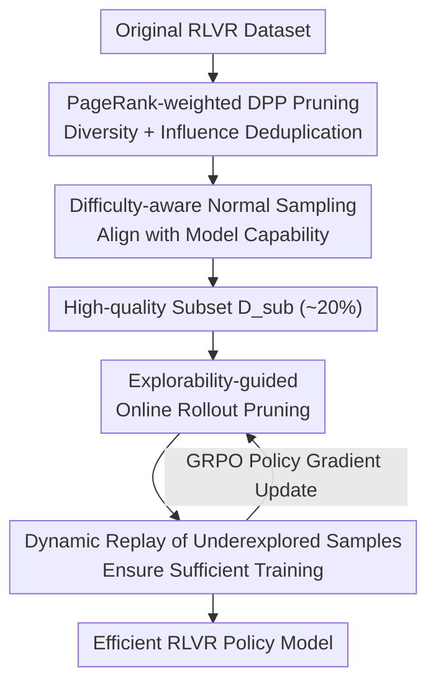

# Towards High Data Efficiency in Reinforcement Learning with Verifiable Reward

**Conference**: ICLR 2026  
**OpenReview**: [https://openreview.net/forum?id=sruA4AZmZI](https://openreview.net/forum?id=sruA4AZmZI)  
**Code**: https://github.com/RUCAIBox/DEPO  
**Area**: Reinforcement Learning / RLVR / LLM Reasoning  
**Keywords**: RLVR, Data Efficiency, Data Selection, Explorability, GRPO

## TL;DR
DEPO integrates "offline data curation" and "online rollout pruning" into a unified RLVR workflow for the first time. Off-line, it employs PageRank-weighted DPP and difficulty-aware normal sampling to select a diverse, influential, and moderately difficult subset. Online, it utilizes a sample-level explorability metric to skip rollouts of low-potential samples and replay underexplored ones. Consequently, it achieves performance comparable to full GRPO on AIME24/25 using only 20% of the data and 40% of the rollouts, accelerating training by approximately 1.6–1.85 times.

## Background & Motivation

**Background**: Reinforcement Learning with Verifiable Reward (RLVR, such as DeepSeek-R1's GRPO) is currently the mainstream approach for enhancing LLM reasoning capabilities. The model samples multiple rollouts for a given problem and receives binary rewards based on answer correctness, iteratively refining the reasoning strategy. The standard approach to improving RLVR performance is "more data + more rollouts."

**Limitations of Prior Work**: This scaling strategy is extremely costly. First, the size of training data and the number of rollouts significantly increase computational costs. Second, data efficiency is low—many samples are either too simple or too difficult to provide learning signals, yet they still consume the rollout budget. Existing efficiency-boosting research follows two paths: offline methods (e.g., LIMR, Learnalign) rely on single metrics (reward trends, reward variance, gradient alignment) for data selection and often require training the dataset for several epochs first, which is expensive; online methods (e.g., GRESO) only filter samples with "zero historical reward variance," treating all non-zero variance samples equally and lacking fine-grained potential assessment.

**Key Challenge**: Existing methods save data from either an offline or online perspective alone, leading to suboptimal data efficiency. Furthermore, single-metric offline selection fails to capture complex characteristics (diversity, representativeness, and difficulty often need to be considered concurrently).

**Goal**: To achieve comparable performance with less data and fewer rollouts without modifying or augmenting the original dataset. This requires solving two sub-problems simultaneously: (a) how to select high-quality subsets offline; (b) how to allocate online rollout computation to samples with genuine exploration value.

**Key Insight**: The authors observe that rollout generation is the true bottleneck in RLVR training speed, and sample value changes dynamically during training—a sample with low value now might become useful later. Thus, data efficiency is decomposed into a one-time offline pruning for redundancy and difficulty alignment, followed by dynamic online rollout allocation based on real-time training dynamics.

**Core Idea**: This work is the first to integrate offline data curation and online rollout pruning end-to-end into a single RLVR workflow. Multi-dimensional offline curation ensures "choosing the right data," while sample-level explorability ensures "spending the rollouts correctly."

## Method

### Overall Architecture

DEPO (Data-Efficient Policy Optimization) is a two-stage data efficiency framework built on top of standard GRPO. The input is a complete RLVR dataset, and the output is a strong reasoning policy model trained with minimal data and rollout budgets.

The first stage is **offline curation**: original data is represented as a graph, redundant samples are pruned using PageRank-weighted DPP, and a "nutritionally balanced" subset $D_{sub}$ (set to 20% in the paper) is obtained through difficulty-aware normal sampling. The second stage is **online rollout pruning**: during GRPO training on $D_{sub}$, samples in each batch are ranked by a sample-level explorability metric. Rollouts are generated and parameters updated only for high-potential samples, while underexplored samples are replayed to ensure convergence quality. These two stages form an end-to-end process.

### Key Designs

**1. PageRank-weighted DPP Data Pruning: Eliminating Redundancy via Diversity + Influence**

This addresses the issue of "offline single-metric inaccuracy and massive redundancy." The authors use the embedding of the last token from the model's final layer as the representation for each sample, constructing a graph $G=(V,E,P)$, where $P$ is the pairwise similarity matrix. Two objectives are optimized simultaneously: **Diversity** is managed via a Determinantal Point Process (DPP), maximizing the determinant $\det(Y)$ of the similarity sub-matrix—a larger determinant indicates samples that span a larger volume in the feature space and are less redundant. **Influence** is calculated using PageRank weights $w_i$ to characterize representativeness. These are unified into a kernel matrix:

$$\max_{Y\subseteq P}\left(\det(Y)\cdot\prod_{i\in Y}w_i\right)=\max_{Y\subseteq P}\det\left(\mathrm{diag}(w_Y^{1/2})\cdot Y\cdot\mathrm{diag}(w_Y^{1/2})\right)$$

As this is NP-hard, a greedy algorithm is used for approximation. Unlike old methods looking only at reward variance/gradients, this manages "non-redundancy" and "representativeness" in one objective without requiring pre-training.

**2. Difficulty-aware Normal Sampling: Aligning Training Difficulty with Model Capability**

The pruned subset $Y$ may still contain problems that are "too easy" or "too hard" for the current model. The authors generate $G$ trajectories for each sample using the current policy $\pi_\theta$ and use a validator $V$ to calculate accuracy as a difficulty score: $Acc_i=\mathbb{E}_{\{o_j\}\sim\pi_\theta}[V(o_j,a_i)]$. Instead of taking the median, they sample according to a normal distribution $\mathcal{N}(\mu,\sigma^2)$, where the sampling probability is proportional to the standard normal density:

$$p_i=\frac{\phi\!\left(\frac{Acc_i-\mu}{\sigma}\right)}{\sum_{k\in Y}\phi\!\left(\frac{Acc_k-\mu}{\sigma}\right)},\qquad \phi(x)=\frac{1}{\sqrt{2\pi}}e^{-x^2/2}$$

The resulting subset $D_{sub}$ is dominated by medium-difficulty tasks while retaining a few hard ones. Ablations show medium-difficulty tasks accelerate early learning, while challenging tasks are crucial for peak convergence.

**3. Explorability-guided Online Rollout Pruning: Allocating Rollout Budget to High-Potential Samples**

Rollout generation is the primary bottleneck. The authors define sample-level **explorability** to quantify if a sample is "worth exploring." High-entropy rollouts encourage exploration, whereas low entropy implies overfitting. However, extremely high-entropy incorrect rollouts (pathological trajectories) introduce noise and are filtered by a threshold $\lambda$. Explorability for a single rollout is weighted by absolute advantage $|\hat A_i|$:

$$E(q,a,o_i^t)=|\hat A_i|\cdot e(o_i^t)\cdot I(q,a,o_i^t),\qquad \hat A_i=\frac{r_i-\mathrm{mean}(\{r_i\})}{\mathrm{std}(\{r_i\})}$$

This couples entropy (exploration potential) with absolute advantage (difficulty; samples that are all correct/incorrect naturally have zero advantage and are filtered). Explorability $E$ is averaged over a sliding window of $s$ epochs. Training skips low-potential samples, providing finer granularity than GRESO.

**4. Dynamic Replay of Underexplored Samples: Preventing Permanent Neglect**

Ranking by explorability might cause samples that are "temporarily low potential" to be ignored forever. Each pruned batch $B_{Pruned}$ consists of two parts: the top-$\alpha_e\%$ by explorability and the bottom-$\rho\%$ by "historical exploration frequency." The high-explorability quota follows a linear decay $\alpha_e=\alpha_0-d\cdot e$, shifting the focus from "broad exploration" to "specialized refinement."

### Loss & Training

The underlying algorithm is GRPO. DEPO's objective function applies a batch-level indicator function $\mathbb{I}[\cdot]$ to the standard clip-ratio and KL regularization terms to determine rollout inclusion. Training utilizes the DAPO-Math dataset with DeepSeek-R1-Distill-Qwen-7B / Llama-8B and Qwen2.5-Math-7B.

## Key Experimental Results

### Main Results

Average accuracy (mean of 32 passes) across five reasoning benchmarks using DeepSeek-R1-Distill-Qwen-7B:

| Method | Data Ratio | Rollout Ratio | Training Time | Avg Accuracy |
|------|--------|-----------|---------|-----------|
| Full (Full GRPO) | 100% | 100% | 100% | 61.7 |
| LIMR (Offline) | 20% | 100% | 99% | 58.2 |
| Learnalign (Offline) | 20% | 100% | 102% | 58.7 |
| **DEPO-Offline** | 20% | 100% | 99% | **61.4** |
| + GRESO (Online) | 20% | 40% | 55% | 58.1 |
| **+ DEPO (Online)*** | 20% | 40% | 57% | **61.1** |

With 20% data, **DEPO-Offline** (61.4) nearly matches full GRPO (61.7). With online pruning added, it maintains 61.1 accuracy using only 40% of the rollouts and 57% of the training time. Speedups of ~1.85x on AIME24 and ~1.66x on AIME25 were observed.

### Ablation Study

DeepSeek-R1-Distill-Qwen-7B (AIME24 / AIME25 / MATH500):

| Configuration | AIME24 | AIME25 | MATH500 | Note |
|------|--------|--------|---------|------|
| DEPO (Full) | 62.8 | 50.9 | 95.9 | — |
| w/o PageRank-DPP | 62.1 | 50.0 | 95.6 | Remove deduplication |
| w/o Diff-aware Sampling | 60.3 | 47.8 | 95.1 | Most offline drop |
| w/o Explorability Metric | 58.7 | 45.3 | 93.1 | Most online drop |
| w/o Absolute Advantage | 61.9 | 49.5 | 95.5 | Missing difficulty term |
| w/o Entropy | 60.6 | 48.4 | 94.6 | Missing exploration term |
| w/o Underexplored Replay| 62.3 | 48.4 | 95.2 | Hard task (AIME25) drop |

### Key Findings
- **Difficulty-aware sampling is the most critical offline component**: Removal drops AIME24 from 62.8 to 60.3, showing difficulty alignment is more important than simple deduplication.
- **Explorability is the most critical online component**: Replacing it with random filtering drops AIME24 to 58.7.
- **Replay handles hard problems**: Removing replay drops AIME25 (hard) from 50.9 to 48.4, while MATH500 (simple) is unaffected.
- **20% is the sweet spot**: Performance plateaus after 20% sampling, indicating significant redundancy in the dataset.
- **Difficulty distribution matters**: A mean biased toward easy tasks ($\mu=0.75$) results in low convergence; biased toward hard tasks ($\mu=0.25$) yields better final results but slower learning.
- **Quality > Quantity**: On the HARP/DAPO/Open-R1 datasets, DAPO (the smallest but highest quality) performed best.

## Highlights & Insights
- **First End-to-End Offline + Online Integration**: Unlike prior single-perspective works, DEPO unifies "which problems to choose" and "which rollouts to spend," allowing budget compression to 20% data and 40% rollouts.
- **Explorability Couples Entropy and Advantage**: The metric $|\hat A|\cdot e(o)\cdot I$ captures exploration potential and difficulty simultaneously. This can be migrated to any GRPO-style training for rollout scheduling.
- **Normal Distribution Sampling vs. Curriculum Learning**: Instead of manual "easy-to-hard" schedules, a normal distribution centered on medium difficulty ensures both early speed and late peaks.
- **Dynamic $\alpha_e$ Decay**: The linear reduction of the high-explorability quota naturally transitions from "broad exploration" to "exploitation" without complex schedulers.

## Limitations & Future Work
- **Cost of Difficulty Sampling**: Difficulty-aware sampling is computationally intensive offline (e.g., 44.33 hours vs. DPP's negligible time), appearing as a primary bottleneck in the offline phase.
- **Hyperparameter Sensitivity**: Parameters like $\lambda, \mu, \sigma, \alpha_0, d, \rho, s$ require tuning; robustness across datasets was only tested on three models.
- **Representation Quality Dependency**: DPP relies on embeddings from the final layer. If these embeddings fail to characterize certain tasks, deduplication may be less effective.
- **Verifiable Reward Limitation**: The method is tied to binary correctness rewards; applicability to open-ended generation without clear verifiers remains unknown.

## Related Work & Insights
- **vs. LIMR / Learnalign (Offline Single Metric)**: These rely on post-training metrics; DEPO uses diversity, influence, and difficulty without requiring pre-training.
- **vs. GRESO (Online Zero-Variance Filtering)**: GRESO is binary; DEPO uses a continuous explorability rank, proving more stable when zero-variance samples are scarce.
- **vs. PPL-Top / Middle (SFT Perplexity)**: SFT perplexity matches RL poorly; DEPO’s accuracy-based difficulty alignment is superior.

## Rating
- Novelty: ⭐⭐⭐⭐ First to integrate offline curation and online pruning; novel explorability metric.
- Experimental Thoroughness: ⭐⭐⭐⭐⭐ 5 benchmarks × 3 models × multiple datasets + extensive ablations.
- Writing Quality: ⭐⭐⭐⭐ Clear structure and diagrams, though the high cost of difficulty sampling is only briefly mentioned.
- Value: ⭐⭐⭐⭐⭐ 1.6–1.85x speedup while maintaining performance is highly practical for reducing RLVR costs.

<!-- RELATED:START -->

## Related Papers

- [\[ICLR 2026\] From Verifiable Dot to Reward Chain: Harnessing Verifiable Reference-based Rewards for RL of Open-ended Generation](from_verifiable_dot_to_reward_chain_harnessing_verifiable_reference-based_reward.md)
- [\[ICLR 2026\] Rubrics as Rewards: Reinforcement Learning Beyond Verifiable Domains](rubrics_as_rewards_reinforcement_learning_beyond_verifiable_domains.md)
- [\[ICLR 2026\] The Choice of Divergence: A Neglected Key to Mitigating Diversity Collapse in Reinforcement Learning with Verifiable Reward](the_choice_of_divergence_a_neglected_key_to_mitigating_diversity_collapse_in_rei.md)
- [\[ICLR 2026\] Reinforcement Learning with Verifiable Rewards Implicitly Incentivizes Correct Reasoning in Base LLMs](reinforcement_learning_with_verifiable_rewards_implicitly_incentivizes_correct_r.md)
- [\[ICLR 2026\] LongRLVR: Long-Context Reinforcement Learning Requires Verifiable Context Rewards](longrlvr_long-context_reinforcement_learning_requires_verifiable_context_rewards.md)

<!-- RELATED:END -->
