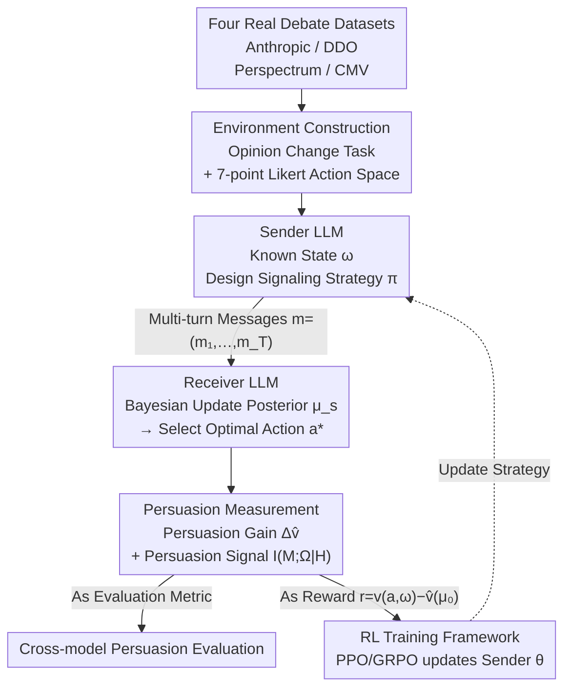

# Towards Strategic Persuasion with Language Models

**Conference**: ICLR 2026  
**arXiv**: [2509.22989](https://arxiv.org/abs/2509.22989)  
**Code**: None  
**Area**: Reinforcement Learning / LLM Capability Evaluation  
**Keywords**: Bayesian Persuasion, Large Language Models, Strategic Persuasion, Information Design, Reinforcement Learning Training

## TL;DR

Based on the Bayesian Persuasion framework, this study proposes a systematic methodology to evaluate and train the strategic persuasion capabilities of LLMs. It reveals that frontier models already possess significant strategic persuasion skills, and even small LLMs can substantially enhance their persuasive effectiveness through reinforcement learning.

## Background & Motivation

Large Language Models have demonstrated persuasive powers comparable to humans, offering both significant opportunities (e.g., health promotion, education) and risks (e.g., manipulation, misinformation). However, **systematically evaluating the persuasion capabilities of LLMs** faces a core challenge: persuasion effectiveness is highly heterogeneous among humans—an advertisement might influence inexperienced consumers but prove ineffective against veterans.

**Limitations of Prior Work**:

*   **Lack of theoretical foundation**: Most work relies on human evaluation or automated scoring to measure persuasiveness, but varying assessment settings and metrics lead to inconsistent or contradictory results (Bozdag et al., 2025b).
*   **Poor scalability**: Human evaluation is costly and highly subjective. Durmus et al. (2024) found a weak correlation between model-generated persuasion scores and human judgment.
*   **Lack of training methods**: There is a lack of principled approaches to enhance the persuasion capabilities of LLMs.

**Novelty**: This work introduces the **Bayesian Persuasion** framework from game theory, defining persuasiveness as **the sender's ability to induce receivers to update their beliefs through strategic information disclosure**, thereby obtaining conceptually clear, quantifiable, and scalable evaluation criteria.

## Method

### Overall Architecture

Ours aims to address two issues: how to **theoretically measure** the strategic persuasion capability of LLMs and how to **systematically enhance** it. The approach adapts Bayesian Persuasion from game theory to LLM interactions: first, an "opinion change" environment is established using real debate data, where one LLM acts as the Sender and another as the Receiver; the Sender knows the true state of the issue and influences the Receiver through multi-turn messages, while the Receiver performs Bayesian-style belief updates and selects a stance. Two quantifiable metrics are then used to measure the persuasion occurring in this game, with the "persuasion gain" serving directly as a reward for training the Sender via reinforcement learning. This ensures the evaluation and training share a consistent metric in a self-contained loop.

The underlying **Bayesian Persuasion** classic setup is as follows:

*   **Sender**: Knows the true state of the world $\omega \in \Omega$ and designs a signaling strategy $\pi: \Omega \to \Delta(S)$.
*   **Receiver**: Observes signal $s$, updates the posterior $\mu_s(\omega)$ via Bayes' rule, and chooses the optimal action $a^*(\mu_s) \in \arg\max_{a} \mathbb{E}_{\omega \sim \mu_s}[u(a,\omega)]$.
*   **Key Theory**: Kamenica & Gentzkow (2011) proved that the Sender's optimal value equals the concave closure of their utility function evaluated at the prior.

### Key Designs

**1. Environment Construction: Utilizing real human debate data to ground the abstract Sender-Receiver game on concrete topics.**

Bayesian persuasion is an abstract game-theoretic framework; to evaluate LLMs, it requires specific topics, stances, and computable "actions." Ours reuses four human persuasion datasets to build an opinion change environment: the Anthropic dataset (Durmus et al., 2024) provides pro/con arguments on controversial topics; the DDO dataset (Durmus & Cardie, 2019) comes from debate.org; Perspectrum (Chen et al., 2019) aggregates claims, perspectives, and evidence from online debate sites; and CMV (Tan et al., 2016) is sourced from Reddit r/ChangeMyView. The Receiver's action space is defined using a 7-point Likert scale (from "Strongly Disagree" to "Strongly Support"), mapped to computable utility via $g(a_i) = i$. Thus, the Receiver's choice directly translates into Sender utility. To confirm that LLM Receiver belief updates are not arbitrary, 45 participants were recruited via Prolific for human verification: results showed that the update direction accuracy was 77–85% with a rationality score of approximately 5/7, validating that the LLM Receiver's attitude shifts are credible.

**2. Persuasion Measurement: Using dual quantifiable metrics to transform "persuasion" from vague scores into computable quantities.**

With the environment established, the core question is how much "persuasion" occurred. While previous work relied on human or automated scoring—often leading to contradictions due to different settings—this work defines two complementary metrics based on Bayesian persuasion. **Persuasion Gains** $\Delta\hat{v}(\mu_0) = \hat{v}(\mu) - \hat{v}(\mu_0)$ measure the increase in Sender utility brought by the induced posterior relative to the prior, directly reflecting the economic effect of persuasion—the more the posterior favors the Sender's desired action, the higher the gain. **Persuasion Signals** use conditional mutual information $I(M_t; \Omega_t | \mathcal{H}_{t-1})$ to measure how much information related to the true state the model discloses at each step: a high value indicates adaptive, context-adjusted signaling, while a low value suggests intentional concealment. One measures outcomes and the other measures processes; the former answers "was persuasion successful?" while the latter answers "is the model performing strategic information control?"

**3. RL Training Framework: Using persuasion gain as a reward to enable small models to learn strategic persuasion.**

With quantifiable reward signals, improving persuasion naturally becomes an RL problem. The state is the persuasion context $(\mu_0, u, v, A, \omega)$, the action is the sequence of messages $m = (m_1, \ldots, m_T)$ generated by the Sender LLM, and the reward $r(\omega, m, a) = v(a, \omega) - \hat{v}(\mu_0)$ is taken from the persuasion gain. Training updates only the Sender parameters $\theta$ while the Receiver parameters $\phi$ remain fixed, decoupling "learning to persuade" from "the persuaded party is changing" to prevent reward signal contamination. PPO and GRPO algorithms are implemented using the verl framework, training Llama-3.2-3B-Instruct as the Sender with Llama-3.1-8B-Instruct as the Receiver, verifying that even a 3B model can significantly improve persuasion effectiveness through RL.

### Loss & Training

Training Objective: $$J(\theta) = \mathbb{E}_{s_0 \sim \mathcal{D}, m \sim \pi_\theta(\cdot|s_0), a \sim \rho(\cdot|m, s_0)}[R(s_0, m, a)]$$

Hyperparameters: Learning rate $5 \times 10^{-7}$, batch size 4, KL coefficient 0.001, Adam optimizer, approximately 2700 training instances, 4 NVIDIA A6000 GPUs.

## Key Experimental Results

### Main Results

Persuasion gains for different Sender models (Receiver: Llama-3.1-8B-Instruct):

| Sender Model | Static Mean | Dynamic Mean | Static Best | Dynamic Best |
| :--- | :--- | :--- | :--- | :--- |
| Llama-3.1-8B | 0.04 | 0.42 | 0.12 | 0.47 |
| Mistral-7B | 0.01 | 0.31 | 0.11 | 0.60 |
| Qwen2.5-7B | 0.02 | 0.23 | 0.08 | 0.51 |
| Llama-3.3-70B | 0.06 | 0.44 | 0.11 | 0.61 |
| GPT-4o | 0.06 | 0.62 | 0.15 | 0.75 |
| Claude 3.7 Sonnet | 0.14 | 1.04 | 0.28 | 1.30 |
| **DeepSeek-R1** | **0.23** | **1.27** | **0.29** | **1.53** |

### Persuasion Gains Before and After RL Training

Llama-3.2-3B-Instruct persuasion gains (Receiver: Llama-3.1-8B-Instruct):

| Configuration | Static Mean | Dynamic Mean |
| :--- | :--- | :--- |
| Base (3B) | -0.01 | 0.21 |
| + PPO | 0.03 | 0.38 |
| + GRPO | 0.03 | 0.38 |

For Mistral-7B Receiver: PPO improved the mean from 1.21 to 1.45, and GRPO to 1.37.

### Key Findings

1.  **Positive correlation with model scale**: Larger models (DeepSeek-R1, Claude 3.7 Sonnet) significantly outperform smaller models in persuasion tasks; DeepSeek-R1 achieved an average gain of 1.27 in the dynamic setting (18.14% of the utility scale).
2.  **Dynamic significantly outperforms static**: Models are much more persuasive in multi-turn interactions than in single turns. This is not just a function of model quality but also a function of the **interaction structure**—the capacity for adaptive strategy deployment is key.
3.  **RL training effectiveness**: Even 3B small models can achieve persuasion results close to large models after RL training, showing good **transferability**—strategies trained on Llama-8B were equally effective against Mistral-7B and Qwen2.5-7B.
4.  **Strategic information disclosure**: Stronger models show lower semantic similarity (greater differences between messages), suggesting they can adaptively adjust information strategies based on context, aligning with Bayesian Persuasion theory.
5.  **Primary strategy types**: Evidence, credibility, and impact are the most frequently used strategies, consistent with theoretical expectations for information revelation strategies.

## Highlights & Insights

1.  **Theory-Practice Bridge**: This is the first systematic application of the classical Bayesian Persuasion game-theoretic framework to LLM capability evaluation, providing conceptually clear and quantifiable measures.
2.  **Evidence of Strategic Behavior Emergence**: Frontier models not only "know how to speak" but also demonstrate complex strategic behaviors predicted by theory (e.g., adaptive information disclosure, prior-based strategy adjustment), which has significant implications for AI safety.
3.  **Universal Effectiveness of RL**: Persuasion capability can be systematically enhanced via RL and exhibits transferability across receiver architectures, indicating the model learns genuine strategies rather than over-fitting to specific architectures.
4.  **Thorough Ethical Consideration**: The paper emphasizes that the framework focuses on truthful information disclosure (non-deceptive) and discusses safeguards, demonstrating a responsible research approach.

## Limitations & Future Work

1.  **Focus on Opinion Change Tasks**: The Bayesian persuasion framework is far broader—variants like multiple receivers, multiple senders, and dynamic environments remain unexplored.
2.  **Limitations of LLM Receivers**: LLMs are not perfect Bayesian updaters; their belief updates may systematically deviate from humans.
3.  **Realism of Evaluation Environment**: Although human verification confirmed the direction of belief updates, the dynamics of LLM-LLM interaction may differ qualitatively from human-LLM interaction.
4.  **Limited Training Scale**: Only 3B models were trained; the effectiveness of RL training for larger models remains unknown.
5.  **Safety Implications**: Technologies that enhance LLM persuasion could be misused for manipulation and information warfare.

## Related Work & Insights

*   **Theoretical Foundations of Bayesian Persuasion** (Kamenica & Gentzkow, 2011): Source of the core framework; the concavification theorem provides the theoretical upper bound.
*   **LLM Persuasion Evaluation** (Durmus et al., 2024; Salvi et al., 2024): Ours builds upon these works by providing a more theoretically grounded systematic evaluation.
*   **Strategic Reasoning in LLMs** (Xu et al., 2024; Zhang et al., 2025): This work extends the scope of LLM strategic reasoning evaluation.
*   **Insights for AI Safety**: Persuasion capability is a crucial dimension of potential LLM risk; the framework provided here can be used to systematically monitor and evaluate this risk.

## Rating

*   Novelty: ⭐⭐⭐⭐⭐ (Innovative intersection of game theory and LLMs)
*   Experimental Thoroughness: ⭐⭐⭐⭐ (Multiple models, multiple datasets, RL training, human validation)
*   Writing Quality: ⭐⭐⭐⭐ (Clear theoretical framework, well-organized experiments)
*   Value: ⭐⭐⭐⭐⭐ (Significant for both LLM evaluation and AI safety)

<!-- RELATED:START -->

## Related Papers

- [\[ICLR 2026\] ReTool: Reinforcement Learning for Strategic Tool Use in LLMs](retool_reinforcement_learning_for_strategic_tool_use_in_llms.md)
- [\[ICLR 2026\] On Predictability of Reinforcement Learning Dynamics for Large Language Models](on_predictability_of_reinforcement_learning_dynamics_for_large_language_models.md)
- [\[ICLR 2026\] AWM: Accurate Weight-Matrix Fingerprint for Large Language Models](awm_accurate_weight-matrix_fingerprint_for_large_language_models.md)
- [\[ICLR 2026\] Representation-Based Exploration for Language Models: From Test-Time to Post-Training](representation-based_exploration_for_language_models_from_test-time_to_post-trai.md)
- [\[ICLR 2026\] VerifyBench: Benchmarking Reference-based Reward Systems for Large Language Models](verifybench_benchmarking_reference-based_reward_systems_for_large_language_model.md)

<!-- RELATED:END -->
