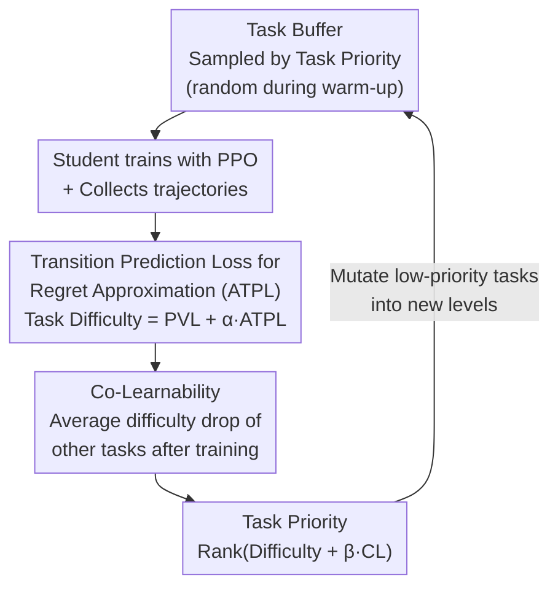

# TRACED: Transition-aware Regret Approximation with Co-learnability for Environment Design

**Conference**: ICLR 2026  
**arXiv**: [2506.19997](https://arxiv.org/abs/2506.19997)  
**Code**: [https://github.com/Cho-Geonwoo/TRACED](https://github.com/Cho-Geonwoo/TRACED)  
**Area**: Reinforcement Learning  
**Keywords**: Unsupervised Environment Design, Curriculum Learning, Regret Approximation, Transition Prediction Error, Co-Learnability, Zero-shot Transfer

## TL;DR
TRACED improves regret approximation in Unsupervised Environment Design (UED) by incorporating transition prediction error (ATPL) alongside traditional PVL to capture dynamics model mismatch, and introduces Co-Learnability to measure transfer benefits between tasks. It outperforms all baselines at 10k updates compared to their 20k performance on MiniGrid and BipedalWalker.

## Background & Motivation

**Background**: UED is a co-evolutionary framework where a teacher adaptively generates tasks with high learning potential, and a student learns robust policies. Existing methods (PLR⟂, ACCEL, etc.) measure learning potential via regret, but since the true optimal policy $\pi^*$ is unknown, they rely on coarse proxies (PVL, MaxMC).

**Limitations of Prior Work**: (1) PVL only approximates regret through value function error, ignoring the impact of dynamics model mismatch on future rewards; (2) existing methods handle tasks independently, disregarding how training on one task affects performance on others.

**Key Challenge**: $\text{Regret} = \text{Optimal Return} - \text{Current Return}$, but the optimal return is unobservable. PVL, as a proxy, primarily reflects value estimation error and fails to capture the contribution of transition prediction error to regret.

**Goal**: (1) Provide more precise regret approximation; (2) model the transfer relationships between tasks for curriculum optimization.

**Key Insight**: Starting from the decomposition of regret, identified the dynamics component in the future value gap not covered by PVL, and supplemented it with transition prediction loss (ATPL). Simultaneously introduced Co-Learnability to utilize the correlation of regret changes across tasks.

**Core Idea**: Incorporate ATPL into PVL to capture dynamics uncertainty and use Co-Learnability to measure transfer benefits between tasks, forming a unified Task Priority score to guide curriculum design.

## Method

### Overall Architecture
TRACED addresses the "task scoring" component within UED. It fully adopts the co-evolutionary loop of ACCEL—where the teacher maintains a task buffer, samples tasks for student training, and replays high-value tasks—with the sole modification being the replacement of the scoring function from PVL to the more precise Task Priority. When a task enters, TRACED first calculates its Task Difficulty (PVL plus the dynamics mismatch term ATPL) and then its Co-Learnability (how much other tasks simplified after training on it). These are weighted to synthesize Task Priority. The teacher prioritizes tasks with high scores for sampling and mutates low-priority tasks into new levels to write back to the buffer. This loop is nearly zero-intrusive compared to ACCEL, allowing the method to be directly grafted onto existing UED frameworks.

### Key Designs

**1. Transition Prediction Loss for Regret Approximation (ATPL): Supplementing the value-only PVL with dynamics mismatch**

Regret is defined as the "optimal return minus current return," but since the optimal policy $\pi^*$ is unknown, practitioners use proxies like PVL. TRACED starts by decomposing one-step regret to identify what PVL misses:

$$\text{Regret}(s,a) = \underbrace{V^*(s) - \hat{V}^*(s)}_{\text{(i) value error}} + \underbrace{r(s,a^*) - r(s,a)}_{\text{(ii) reward gap}} + \gamma \underbrace{(\mathbb{E}[\hat{V}^*(s'')] - \mathbb{E}[V^\pi(s')])}_{\text{(iii) future value gap}}$$

PVL corresponds to the value estimation error in term (i), while the "future value gap" in term (iii) depends on the mismatch between the learned transition model $\hat{P}$ and the true transition $P$—a blind spot for PVL. TRACED measures this mismatch using the average transition prediction loss along a trajectory, defining ATPL as $\text{ATPL}(\tau) = \frac{1}{T}\sum_{t=0}^T L_{\text{trans}}(s_t, a_t)$. By weighting and integrating it with PVL, the combined approximation is $\widehat{\text{Regret}}(\tau) = \text{PVL}(\tau) + \alpha \cdot \text{ATPL}(\tau)$. The paper further proves in the appendix that ATPL is an upper bound for the dynamics component in term (iii), providing theoretical support for this inclusion.

**2. Co-Learnability: Explicitly including transfer benefits between tasks in scoring**

Existing methods score each task independently, ignoring positive transfers like "training on task A might make task B easier." Co-Learnability quantifies this: after training on task $i$ and entering the next round $k+1$, it observes the average difficulty drop across other replayed tasks,

$$\text{CoLearnability}_i(k) = \frac{1}{|\mathcal{T}_{k+1}|}\sum_{j \in \mathcal{T}_{k+1}}[\text{TaskDifficulty}(j,k) - \text{TaskDifficulty}(j,k+1)]$$

A positive value indicates that training on $i$ reduced the difficulty of other tasks, showing positive transfer. For instance, Spanish $\rightarrow$ English shares roots and has high transfer (high CL), while Japanese $\rightarrow$ English has low transfer (low CL). This metric prevents the system from focusing solely on the most difficult tasks while ignoring "leveraged tasks" that simplify a broad set of other tasks.

**3. Task Priority: Combining difficulty and transfer benefits for the final sampling basis**

The final score used by the teacher weights the first two terms and applies a Rank transformation:

$$\text{TaskPriority}(i,t) = \text{Rank}(\text{TaskDifficulty}(i,t) + \beta \cdot \text{CoLearnability}(i,t))$$

Since Task Difficulty and Co-Learnability have different units and scales, the Rank transformation discards absolute values for relative ordering, making the system robust to outliers. Sampling follows $p(i|t) \propto 1/\text{TaskPriority}(i,t)$, giving high-priority (top rank) tasks a higher probability of selection.

### Loss & Training
The student uses PPO. The transition model $f_\phi$ is a recurrent network trained synchronously during agent training. MiniGrid uses 16 workers, and BipedalWalker uses 4 workers.

## Key Experimental Results

### MiniGrid Zero-shot Transfer

| Method | 10k updates IQM | 20k updates IQM | Wall-clock (h) |
|------|-----------------|-----------------|----------------|
| DR | Low | Low | 5.82±0.12 |
| PLR⟂ | Mid | Mid | 14.87±0.62 |
| ADD | Mid | Mid | 22.48±0.27 |
| ACCEL | Mid | Mid | 12.94±0.66 |
| **TRACED** | **Highest** | **-** | **13.78±0.36** |

TRACED at 10k updates outperforms all baselines at 20k updates, effectively halving the wall-clock time.

### BipedalWalker Zero-shot Transfer
- TRACED 10k > ACCEL-CENIE 20k across all metrics (median, IQM, mean, optimality gap).
- Maintains a consistent lead across all 6 terrains.

### PerfectMaze Extreme Testing
- PerfectMazeLarge (51×51): TRACED 10k solved rate 27%±23% > ACCEL 20k 20%±25%.
- PerfectMazeXL (100×100): TRACED 10k at 10%±14% is close to ACCEL 20k 12%±28%.

### Ablation Study

| Configuration | MiniGrid IQM | Note |
|------|-------------|------|
| TRACED (full) | Highest | ATPL + CL |
| TRACED - CL | Second Highest | ATPL only, still stronger than baselines |
| TRACED - ATPL | Lowest | CL only, limited improvement |

ATPL is the primary driver, while CL provides additional gains when combined with ATPL.

### Key Findings
- The growth rate of shortest path length and obstacle counts under TRACED is significantly faster than in ACCEL.
- The progression from easy $\rightarrow$ moderate $\rightarrow$ challenging is notably more efficient than baselines.

## Highlights & Insights
- **Theoretical Contribution to Regret Decomposition**: Specifically identified the deficiency of PVL as a regret proxy—the lack of a dynamics mismatch term. This insight is transferable to any UED method using regret.
- **Dual Effects of ATPL**: Improves regret estimation accuracy and accelerates curriculum complexity ramp-up (as tasks with high dynamics uncertainty are naturally more challenging).
- **Doubled Sample Efficiency**: Achieves 20k baseline performance in 10k updates, nearly halving wall-clock time.
- **Lightweight Co-Learnability**: Utilizes existing difficulty change information without additional modeling overhead.

## Limitations & Future Work
- Co-Learnability uses simple difficulty differences instead of Shapley values, which may lack precision.
- The transition model $f_\phi$ requires extra training, adding a 6% computational overhead.
- Experimental environments (MiniGrid/BipedalWalker) are limited in scale; more complex 3D environments remain to be validated.
- Sensitivity analysis for $\alpha$ and $\beta$ is in the appendix, but adaptive tuning schemes could be explored.

## Related Work & Insights
- **vs ACCEL**: TRACED is built directly on ACCEL, replacing only the scoring function. The improvements are orthogonal.
- **vs CENIE**: CENIE uses environment novelty for scoring; TRACED implicitly captures novelty through ATPL.
- **vs PLR⟂**: PLR⟂ uses PVL/MaxMC; TRACED demonstrates that these proxies are insufficiently precise.

## Rating
- Novelty: ⭐⭐⭐⭐ Regret decomposition identifying PVL gaps, ATPL supplement, and CL transfer metrics represent a combined innovation.
- Experimental Thoroughness: ⭐⭐⭐⭐⭐ Dual environments, ablations, curriculum analysis, extreme tests, and statistical significance.
- Writing Quality: ⭐⭐⭐⭐ Clear structure, good integration of theory and experiments, standard notation.
- Value: ⭐⭐⭐⭐ Clear improvement for the UED field; method is concise and easy to integrate into existing frameworks.

## Related Papers

- [\[ICLR 2026\] Efficient Morphology-Control Co-Design via Stackelberg Proximal Policy Optimization](efficient_morphology-control_co-design_via_stackelberg_proximal_policy_optimizat.md)
- [\[ICLR 2026\] Don't Just Fine-tune the Agent, Tune the Environment](dont_just_fine-tune_the_agent_tune_the_environment.md)
- [\[NeurIPS 2025\] Scalable Neural Incentive Design with Parameterized Mean-Field Approximation](../../NeurIPS2025/reinforcement_learning/scalable_neural_incentive_design_with_parameterized_mean-field_approximation.md)
- [\[ICLR 2026\] Replicable Reinforcement Learning with Linear Function Approximation](replicable_reinforcement_learning_with_linear_function_approximation.md)
- [\[ICLR 2026\] Structured In-context Environment Scaling for Large Language Model Reasoning](structured_in-context_environment_scaling_for_large_language_model_reasoning.md)

<!-- RELATED:END -->

<!-- RELATED:START -->

## Related Papers

- [\[ICLR 2026\] Efficient Morphology-Control Co-Design via Stackelberg Proximal Policy Optimization](efficient_morphology-control_co-design_via_stackelberg_proximal_policy_optimizat.md)
- [\[ICLR 2026\] Replicable Reinforcement Learning with Linear Function Approximation](replicable_reinforcement_learning_with_linear_function_approximation.md)
- [\[ICLR 2026\] Structured In-context Environment Scaling for Large Language Model Reasoning](structured_in-context_environment_scaling_for_large_language_model_reasoning.md)
- [\[ICLR 2026\] BoreaRL: A Multi-Objective Reinforcement Learning Environment for Climate-Adaptive Boreal Forest Management](borearl_a_multi-objective_reinforcement_learning_environment_for_climate-adaptiv.md)
- [\[ICLR 2026\] Online Prediction of Stochastic Sequences with High Probability Regret Bounds](online_prediction_of_stochastic_sequences_with_high_probability_regret_bounds.md)

<!-- RELATED:END -->
