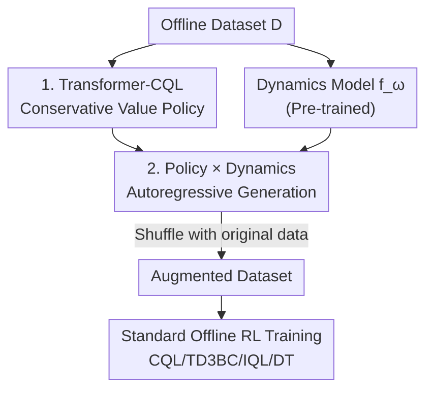

# Trajectory Generation with Conservative Value Guidance for Offline Reinforcement Learning

**Conference**: ICLR 2026  
**OpenReview**: [https://openreview.net/forum?id=eTThjhjzwZ](https://openreview.net/forum?id=eTThjhjzwZ)  
**Code**: https://github.com/wangtieru2/TGCVG  
**Area**: Offline Reinforcement Learning / Data Augmentation / Trajectory Generation  
**Keywords**: Offline RL, Data Augmentation, Conservative Q-Learning, Transformer Policy, Dynamics Model

## TL;DR
A Transformer policy trained with Conservative Q-Learning (CQL) interacts with a pre-trained dynamics model to autoregressively "sample" synthetic trajectories, which are then merged into the original dataset to train standard offline RL algorithms. Conservative value penalties ensure generated samples do not deviate from the data distribution, resulting in higher quality than diffusion-based data augmentation (GTA) while significantly cutting training and generation time.

## Background & Motivation
**Background**: Offline RL learns policies from a fixed dataset without the ability to interact with the environment. High-performing methods in recent years have become increasingly complex, stacking powerful generative architectures like Diffusion or Decision Transformers. While benchmark scores are impressive, they suffer from high inference costs and are difficult to deploy. Consequently, another path has emerged: **Data Augmentation**. This shifts the computational burden from "online decision-making" to "offline data preparation" by expanding the dataset first and then training with simple offline RL algorithms (CQL/TD3BC/IQL).

**Limitations of Prior Work**: Early data augmentation merely added noise to states (S4RL), providing limited diversity. Recent mainstream approaches use Diffusion to synthesize "dynamics-consistent" transitions (SynthER, GTA). However, Diffusion has two major flaws: expensive training and extremely slow generation due to multi-step denoising. Furthermore, it often **lacks explicit guidance toward high-value regions**, leading to limited improvements in synthetic data quality and minor gains for downstream policies.

**Key Challenge**: There is an inherent tension between making synthetic trajectories "high quality" and "close to the original distribution." Pursuit of high returns can push samples into regions not covered by the dataset (OOD), causing distribution shift and extrapolation errors that toxify downstream training. Conversely, excessive conservatism fails to generate useful new data. Diffusion-based return-amplification guidance (GTA) tends toward the former, often crossing boundaries.

**Goal**: ① Identify a sequence generator more lightweight than Diffusion; ② Add explicit constraints to the generation process that are "both toward high value and within distribution."

**Key Insight**: The authors observe that offline data is essentially "sampled by the interaction between an online policy and the environment." It is thus better to **imitate this collection process**: use a learned policy to interact with a learned dynamics model and rollout $(s,a,r,s')$ step-by-step. The key is that the policy must be "conservative"—the value penalty of CQL naturally suppresses Q-values for OOD actions, effectively constraining each step of the action within the data distribution.

**Core Idea**: Replace Diffusion with the **autoregressive interaction of a Transformer-CQL policy and a dynamics model** to synthesize trajectories, using **Conservative Value Guidance (CQL penalty)** to restrict OOD risk to a single step and prevent it from accumulating along the rollout.

## Method

### Overall Architecture
TGCVG consists of two stages. **Stage 1 (Model Training)**: Progressively train two components—a Transformer-CQL policy network (responsible for generating high-quality actions) and a dynamics model $f_\omega$ (reusing the pre-trained dynamics model from Lin et al. 2024, responsible for predicting rewards and next states). **Stage 2 (Trajectory Generation)**: Let the policy and dynamics model interact to mimic the online collection process—the policy outputs actions for the current state sequence, the dynamics model predicts the next state and reward, and the new state is appended back to the sequence to autoregressively rollout the entire trajectory. Finally, the generated trajectories are shuffled with the original data into an augmented dataset to train any standard offline RL algorithm (CQL/TD3BC/IQL/DT).

The pipeline is clear and unidirectional, as shown in the framework diagram:

### Key Designs

**1. Transformer-CQL: Embedding Conservative Value Guidance into Sequence Policies**

To ensure generated actions are "above the dataset average yet within distribution," the authors train a Transformer as an action synthesizer instead of using Diffusion and embed CQL's conservative value estimation. Unlike Decision Transformers, **only state tokens are kept**: based on DD and appendix ablations, action tokens and return-to-go (RTG) tokens are removed because the RTG becomes redundant once Q-value regularization is applied. The trajectory representation is simplified to $\tau_t=(s_{t-L+1},\cdots,s_{t-1},s_t)$.

The value side uses a quintet of networks (two Q-networks $Q_{\phi_1},Q_{\phi_2}$, two target networks, and one policy $\pi_\theta$). The primary objective in Q-network training is the CQL conservative penalty—lowering Q-values for OOD state-action pairs while preserving values for in-distribution samples:

$$\min_\phi \lambda\,\mathbb{E}_{s_i\sim D,a_i\sim\mu}\Big[\log\textstyle\sum_{a_i}\exp(Q_{\phi_i}(s_i,a_i))-\mathbb{E}_{a_i\sim\hat\pi_\beta}[Q_{\phi_i}(s_i,a_i)]\Big]+\tfrac12\,\mathbb{E}\big[(\hat Q_m-Q_{\phi_i})^2\big]$$

The TD target uses an **n-step Bellman backup** $\hat Q_m=\sum_{j=m}^{t}\gamma^{j-m}r_j+\gamma^{t+1-m}\min_{i}Q_{\phi'_i}(s_{t+1},\hat a_{t+1})$, which is more accurate than 1-step (following Hu et al. 2024). The policy side uses the SAC framework objective $L(\theta)=\mathbb{E}[\alpha\log\pi_\theta(\hat a_i|s_i)-\min_i Q_{\phi_i}(s_i,\hat a_i)]$, with an automatically adjusted temperature $\alpha$ to balance improvement and exploration. The resulting policy selects high-Q actions (moving toward high returns) but avoids OOD actions due to the CQL penalty (staying within distribution), reconciling high quality with distribution adherence at the policy level.

**2. Autoregressive Interaction of Policy and Dynamics Model to Rollout Trajectories**

With the conservative policy, the generation phase purely mimics online collection. A sequence of states of length $K$ is sampled from the original dataset as a seed $\tilde\tau=(s_{t-K+1},\cdots,s_t)$. The first $L$ states are fed into the policy to obtain action $\hat a_{t-K+L}$, which is then passed to the dynamics model for a one-step prediction:

$$\hat s_{t-K+L+1},\,\hat r_{t-K+L}=f_\omega(s_{t-K+L},\hat a_{t-K+L})$$

The predicted new state $\hat s$ is appended to the sequence, the window slides, and the policy is fed again—this autoregressive cycle continues until a complete generated trajectory $\hat\tau$ is formed. Auxiliary information like termination flags is directly inherited from the original sequence's corresponding timesteps.

The value of this step lies in "slicing" OOD risk: since the policy only takes one step at a time constrained by the conservative policy, **the OOD risk of a single interaction is limited to that step and does not accumulate over the rollout**—circumventing the "compounding error" that often plagues model-based methods. Simultaneously, using Transformer autoregression instead of Diffusion's multi-step denoising makes generation significantly faster.

**3. Value Penalty vs. Policy Constraint: Why Transformer-CQL Instead of Transformer-TD3BC**

"Conservatism" can be implemented via two routes, and the authors demonstrate why the CQL route is necessary. The first is **Value Penalty** (CQL, adopted here), which directly suppresses OOD action Q-values. The second is **Policy Constraint** (TD3BC, used as a contrast in Transformer-TD3BC), which pulls the policy toward the behavior policy via behavior cloning. Experiments found that data generated by Transformer-CQL is stable for training both CQL and TD3BC; however, data generated by Transformer-TD3BC works for TD3BC but **causes CQL to collapse**.

t-SNE visualization reveals the root cause: TD3BC has weaker Q-value constraints and generates clusters of outliers outside the original distribution support. During downstream CQL training, these **dense outlier clusters are misidentified as in-distribution data** due to CQL's conservatism, while the originally sparse real samples are penalized as OOD. This leads to misaligned value estimation and performance collapse. CQL's value penalty keeps generated samples strictly within the original distribution, avoiding these "fake high-density" traps.

### Loss & Training
The Q-network is optimized according to Eq. (2) (CQL penalty + n-step Bellman regression); the policy is optimized using the SAC objective in Eq. (3) with adaptive temperature $\alpha$ and target entropy $H_{target}$ preset by the action space; target networks are updated softly $\phi'_i=\rho\phi'_i+(1-\rho)\phi_i$. The dynamics model and policy are **trained in parallel**, which is key to accelerating the generation phase.

## Key Experimental Results

### Main Results
On D4RL, TGCVG is compared against S4RL (noise), SynthER (Diffusion), and GTA (return-guided Diffusion), using normalized scores (average of 5 seeds).

**MuJoCo Gym Domain (Average of 9 tasks)**:

| Offline Alg | None | GTA (Prev. SOTA) | TGCVG | Gain |
| :--- | :--- | :--- | :--- | :--- |
| TD3BC | 76.92 | 84.63 | **89.30** | +4.67 vs GTA |
| CQL | 78.55 | 85.27 | **90.50** | +5.23 vs GTA |
| IQL | 78.52 | 86.11 | **87.09** | +0.98 vs GTA |
| DT | 74.47 | 75.36 | **78.09** | +2.73 vs GTA |

The improvement is most significant on suboptimal datasets (medium, medium-replay)—scenarios where "stitching" trajectories is most needed, validating the advantage of Transformer-CQL under imperfect data.

**Maze2D + AntMaze Domain (IQL, Average of 9 tasks)**:

| Aug. | Average Score |
| :--- | :--- |
| None | 52.04 |
| GTA | 59.17 |
| **TGCVG** | **64.97** |

On AntMaze with sparse rewards and high-dimensional states, TGCVG still makes model-free algorithms competitive. The authors suggest that "focusing on policy learning may be more cost-effective than purely refining dynamics models."

### Ablation Study

| Config | hopper-m | walker2d-m | halfcheetah-m | Description |
| :--- | :--- | :--- | :--- | :--- |
| Action Synthesizer = Original CQL (MLP) | 60.66 | 84.98 | 48.43 | MLP Policy |
| Action Synthesizer = Transformer-CQL | **90.47** | **87.50** | **68.14** | Shifting to Transformer yields huge gains |

(Scores after training TD3BC on augmented data). Other analyses include Transformer-CQL vs. Transformer-TD3BC, $\lambda$ sensitivity, data quality (novelty/optimality/dynamic MSE), and time overhead.

### Key Findings
- **Transformer backbone is the primary driver of gains**: Switching to Transformer-CQL boosted hopper-medium from 60.66 to 90.47, thanks to the Transformer's superior representation capabilities.
- **Value-penalty conservatism is irreplaceable**: Data from Transformer-TD3BC causes CQL to collapse because outlier clusters are misjudged as in-distribution (see Key Design 3).
- **Smaller $\lambda$ (lower conservatism) often leads to better downstream results**, though the effect varies by task (walker-medium is nearly insensitive, while hopper-medium is highly sensitive). The role of $\lambda$ is to indirectly determine synthetic data quality by affecting Transformer-CQL's decision-making—**training a stronger policy early leads to higher quality generated data**.
- **Dynamic Consistency > Return Magnitude**: Compared to GTA, TGCVG achieves better dynamic MSE (synthetic states are closer to real dynamics). Even with slightly lower optimality, overall data quality is superior, and novelty is non-zero, indicating generated samples are not mere replicas.
- **Significant Time Reduction**: On halfcheetah-medium-v2 with $2\times10^5$ steps and $5\times10^6$ synthetic samples on a single RTX TITAN, TGCVG's training and generation times are far lower than GTA due to parallel training and lack of multi-step denoising.

## Highlights & Insights
- **The "Imitating Data Collection" perspective is intuitive**: Reinterpreting data augmentation as "re-running the online collection process with a learned policy and dynamics model" is more logical and easier to guide than Diffusion's "modeling transfer distributions from scratch."
- **Dual-Purpose Conservatism**: CQL's conservative penalty serves both as a standard tool for policy training and as a guardrail against OOD samples during generation—a single mechanism serving two purposes, eliminating the need for extra guidance designs like those in Diffusion.
- **Step-wise OOD Slicing**: By taking only one step at a time constrained by a conservative policy, compounding errors in model-based rollouts are compressed into single-step errors. This can be transferred to any "policy × model autoregressive generation" scenario.
- **Value Penalty vs. Policy Constraint Analysis**: The t-SNE analysis of the failure mechanism (outlier clusters misjudged as in-distribution) is a rare distribution-level insight into synthesizer selection, providing significant value for practitioners in data augmentation.

## Limitations & Future Work
- **Dependency on existing dynamics models**: TGCVG reuses the pre-trained dynamics model from Lin et al. 2024; the上限 of the dynamics model itself is not addressed, and model errors may still propagate in high-dimensional or complex dynamics.
- **Task-specific $\lambda$ tuning**: $\lambda$ sensitivity varies across datasets, and the lack of an automatic selection mechanism means hyperparameter tuning is still required.
- **Limited gains for DT**: The improvement when using DT as the downstream algorithm is relatively small (75.36→78.09), and TGCVG underperforms GTA on AntMaze-umaze (41.20 vs 66.50), suggesting conservative constraints might be too tight for certain sparse or structured tasks.
- **Generation quality capped by policy capability**: The authors note that synthetic data quality highly depends on the action synthesizer's decision-making ability, implying limited gains if the policy is poorly trained.

## Related Work & Insights
- **vs. GTA (Diffusion + Return Guidance)**: GTA uses Diffusion's partial noise-denoise process + return signals to generate high-return trajectories. It is powerful but expensive, and return guidance can push samples OOD. TGCVG replaces Diffusion with lightweight Transformer autoregression and return amplification with CQL value penalties, ensuring high returns while keeping samples in-distribution, with superior speed and dynamic consistency.
- **vs. SynthER (Diffusion for Transfer Distributions)**: SynthER lacks explicit high-value guidance, leading to limited gains; TGCVG explicitly moves toward high-Q regions without crossing boundaries.
- **vs. S4RL (State Noise)**: S4RL's diversity is limited by the perturbation range (novelty ≈ 0); TGCVG achieves true new state-action pairs via policy-model interaction.
- **vs. Model-based Offline RL (MOPO/Lin et al., etc.)**: Traditional model-based methods couple data generation with policy learning and are prone to compounding errors. TGCVG decouples generation from learning, allowing synthetic data to be reused by any model-free algorithm for better generalization and scalability.

## Rating
- Novelty: ⭐⭐⭐⭐ Uses Transformer-CQL instead of Diffusion for trajectory-level augmentation and utilizes CQL conservatism as a guardrail; the combination is clear though the components are largely existing.
- Experimental Thoroughness: ⭐⭐⭐⭐ Three domains × four downstream algorithms + multi-dimensional ablations on quality/time/$\lambda$; the CQL-vs-TD3BC collapse analysis is particularly solid.
- Writing Quality: ⭐⭐⭐⭐ Logical flow from motivation to method to failure analysis; both stages of the framework are well-articulated.
- Value: ⭐⭐⭐⭐ Significant for "low-cost deployment of offline RL" due to performance gains and massive time savings.

<!-- RELATED:START -->

## Related Papers

- [\[ICLR 2026\] Peng's Q($\lambda$) for Conservative Value Estimation in Offline Reinforcement Learning](pengs_qlambda_for_conservative_value_estimation_in_offline_reinforcement_learnin.md)
- [\[ICLR 2026\] Offline Reinforcement Learning with Adaptive Feature Fusion](offline_reinforcement_learning_with_adaptive_feature_fusion.md)
- [\[ICLR 2026\] Toward Conservative Planning from Human-AI Preferences in Reinforcement Learning](toward_conservative_planning_from_human-ai_preferences_in_reinforcement_learning.md)
- [\[ICML 2026\] Counterfactual Transport Flows for Offline Conservative Trajectory Refinement](../../ICML2026/reinforcement_learning/counterfactual_transport_flows_for_offline_conservative_trajectory_refinement.md)
- [\[ICLR 2026\] MAGE: Multi-scale Autoregressive Generation for Offline Reinforcement Learning](mage_multi-scale_autoregressive_generation_for_offline_reinforcement_learning.md)

<!-- RELATED:END -->
