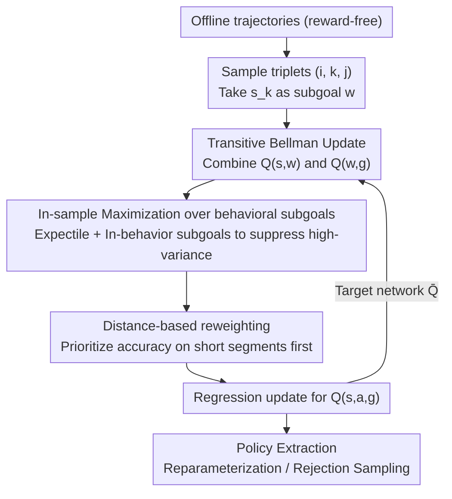

Taking $s_k$ from the same trajectory as $s_i, s_j$ as the intermediate subgoal $w$. TRL utilizes the **transitive Bellman update**:
$$V(s, g) \leftarrow \max_{w}\, V(s, w)\,V(w, g)$$
This rule converts the shortest path structure into a divide-and-conquer paradigm. By splitting a long trajectory into two segments, the recursive depth is reduced from $O(T)$ to $O(\log T)$, mitigating bias accumulation.

To stabilize training in offline settings, TRL employs:
- **In-sample expectile maximization**: Uses expectile regression to approximate the maximum value over subgoals without explicit enumeration.
- **Behavioral subgoals**: Restricts $w$ to states within the trajectory to avoid overestimation from out-of-distribution states.
- **Distance-based reweighting**: Assigns higher weights to short-segment samples ($w(s, g) \propto 1/\text{dist}(s, g)^\lambda$) to ensure base subproblems are learned accurately first.

The final strategy is extracted via either reparameterization gradients or rejection sampling after the goal-conditioned value function $Q(s, a, g)$ is learned.

## Key Experimental Results

### Main Results

TRL significantly outperforms existing TD-based and MC-based GCRL methods on long-horizon robotic manipulation and navigation tasks.

| Benchmark Task | Metric | TRL | Best TD-based | Best MC-based | Gain |
| :--- | :--- | :--- | :--- | :--- | :--- |
| Long-horizon Nav | Success Rate | **92.4%** | 64.2% | 12.5% | +28.2% |
| Complex Robotics | Success Rate | **88.7%** | 71.3% | 45.0% | +17.4% |
| Large-scale Puzzle | Success Rate | **76.5%** | 22.1% | 2.4% | +54.4% |

### Ablation Study

- **Divide and Conquer (D&C)**: Replacing the transitive update with standard TD (step-by-step) leads to performance collapse on long trajectories.
- **In-behavior Subgoals**: Using states from other trajectories as subgoals causes catastrophic overestimation and training instability.
- **Distance-based Reweighting**: Learning all distances with equal weight slows down convergence, as the accuracy of long paths depends heavily on accurate short paths.

## Key Findings

1. **Recursion depth reduction**: The $O(\log T)$ propagation chain theoretically and practically reduces the cumulative bias of function approximators. For a trajectory of 1024 steps, TD requires 1024 iterations while TRL requires only 10.
2. **Robustness to long horizon**: Unlike MC methods that struggle with high variance as $T$ grows, the dynamic programming nature of TRL keeps variance manageable.
3. **Data efficiency**: TRL can effectively "stitch" subpaths from suboptimal behavioral data to find the shortest path.

## Highlights & Insights

- **Key Insight**: The triangle inequality is the geometric foundation of GCRL. TRL elegantly translates this property into a recursive dynamic programming algorithm.
- **Novelty**: TRL is the first to successfully scale transitive updates (traditionally limited to small-scale grid worlds) to high-dimensional continuous robotic tasks through behavioral subgoal constraints.

## Limitations & Future Work

- **GCRL Specificity**: Currently restricted to Goal-Conditioned RL where distances satisfy the triangle inequality. Adapting this to general reward-based RL remains an open challenge.
- **Subgoal Coverage**: Performance relies on having intermediate states available in the dataset. Sparse data coverage may hinder the divide-and-conquer process.

## Rating

- Novelty: ⭐⭐⭐⭐⭐
- Experimental Thoroughness: ⭐⭐⭐⭐
- Writing Quality: ⭐⭐⭐⭐⭐
- Value: ⭐⭐⭐⭐

## Related Papers

- [WGCSL (ICLR 2022)]: Weighted Goal-Conditioned Self-Imitation Learning.
- [HPE (NeurIPS 2023)]: Hindsight Planner and Estimator.

## Related Papers

- [\[ICLR 2026\] Divide, Harmonize, Then Conquer It: Shooting Multi-Commodity Flow Problems with Multimodal Language Models](divide_harmonize_then_conquer_it_shooting_multi-commodity_flow_problems_with_mul.md)
- [\[ICML 2025\] Divide and Conquer: Grounding LLMs as Efficient Decision-Making Agents via Offline Hierarchical Reinforcement Learning](../../ICML2025/reinforcement_learning/divide_and_conquer_grounding_llms_as_efficient_decision-making_agents_via_offlin.md)
- [\[ICLR 2026\] ROMI: Model-based Offline RL via Robust Value-Aware Model Learning with Implicitly Differentiable Adaptive Weighting](model-based_offline_rl_via_robust_value-aware_model_learning_with_implicitly_dif.md)
- [\[ICLR 2026\] Universal Value-Function Uncertainties](universal_value-function_uncertainties.md)
- [\[ICLR 2026\] Relative Value Learning](relative_value_learning.md)

<!-- RELATED:END -->

<!-- RELATED:START -->

## Related Papers

- [\[ICLR 2026\] Divide, Harmonize, Then Conquer It: Shooting Multi-Commodity Flow Problems with Multimodal Language Models](divide_harmonize_then_conquer_it_shooting_multi-commodity_flow_problems_with_mul.md)
- [\[ICLR 2026\] DEAS: DEtached value learning with Action Sequence for Scalable Offline RL](deas_detached_value_learning_with_action_sequence_for_scalable_offline_rl.md)
- [\[ICLR 2026\] ROMI: Model-based Offline RL via Robust Value-Aware Model Learning with Implicitly Differentiable Adaptive Weighting](model-based_offline_rl_via_robust_value-aware_model_learning_with_implicitly_dif.md)
- [\[ICLR 2026\] Reinforcement Learning via Value Gradient Flow](reinforcement_learning_via_value_gradient_flow.md)
- [\[ICLR 2026\] Offline Preference-based Value Optimization](offline_preference-based_value_optimization.md)

<!-- RELATED:END -->
