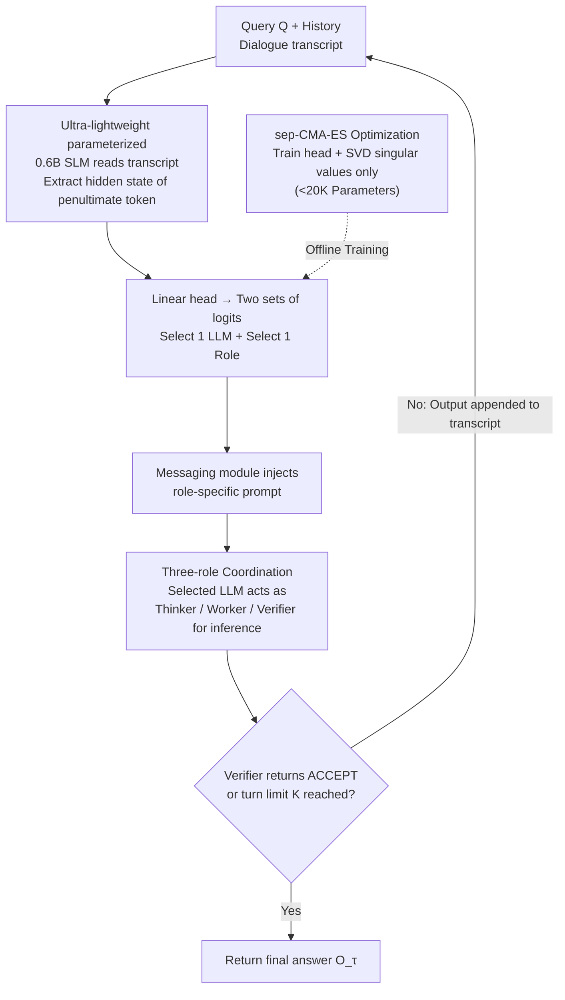

# Trinity: An Evolved LLM Coordinator

**Conference**: ICLR 2026  
**arXiv**: [2512.04695](https://arxiv.org/abs/2512.04695)  
**Code**: None (Sakana AI)  
**Area**: Reinforcement Learning / LLM Collaboration  
**Keywords**: LLM Coordination, Model Composition, Evolutionary Strategy, CMA-ES, Multi-role Collaboration, test-time composition

## TL;DR
Trinity designs a lightweight coordinator (0.6B SLM + ~10K trainable parameters in the head) optimized via sep-CMA-ES. In multi-turn dialogues, it assigns queries to different LLMs and designates them as Thinker, Worker, or Verifier. It achieves a SOTA 86.2% pass@1 on LiveCodeBench and consistently outperforms all single-model and multi-agent baselines across four in-distribution and four out-of-distribution tasks.

## Background & Motivation

**Background**: While LLM scaling laws are effective, they are costly and face diminishing returns. Model merging is limited by architectural incompatibility and closed-source APIs. Macro-level test-time model coordination is a promising alternative.

**Limitations of Prior Work**: (1) Existing routing/coordination methods (MasRouter, RouterDC, Smoothie, etc.) fail to effectively leverage the complementary strengths of diverse models, with some methods even performing worse than random selection; (2) There is a lack of rich contextual understanding of input queries to make effective delegation decisions.

**Key Challenge**: The coordinator needs sufficient semantic understanding to assign tasks correctly but does not need (and should not be) as powerful as the underlying agents. How can the most effective coordination strategy be learned with minimal parameters?

**Goal**: (1) How to extract sufficient semantic signals from small model internal representations for coordination? (2) How to optimize coordination strategies under an extreme parameter budget (~10K)? (3) How to design effective multi-turn collaboration patterns?

**Key Insight**: Utilize SLM hidden states (rather than generated text) as contextual representations, use an ultra-lightweight head for routing decisions, and optimize via evolutionary strategies instead of RL.

**Core Idea**: The hidden states of small models contain sufficient semantic signals; a head with <20K parameters can coordinate multiple top-tier LLMs to outperform any single model.

## Method

### Overall Architecture
Trinity delegates the decision of "which LLM to use and what role it should play" to an ultra-lightweight coordinator, while the coordinated top-tier LLMs remain unchanged. The coordinator is a Qwen3-0.6B small language model (SLM) equipped with an external linear head. In each turn, the full dialogue transcript to date is fed into the SLM. Two sets of logits are read from the hidden state of the second-to-last token: one to select one of $L$ candidate LLMs, and another to select one of three roles (Thinker/Worker/Verifier). Once selected, a messaging module injects the role-specific prompt into the LLM and retrieves the output. This output is appended to the transcript for the next turn until the Verifier declares an `ACCEPT` or the turn limit $K$ is reached. The parameters of the coordinator's head are trained offline using the sep-CMA-ES evolutionary strategy.

### Key Designs

**1. Ultra-lightweight Parameterization: Focusing the Coordinator on Allocation Rather than Language Mastery**

The coordinator must have enough semantic insight to assign tasks correctly without being as expensive as the underlying agents. Trinity compresses the trainable portion to under 20K parameters (orders of magnitude smaller than standard fine-tuning) by intervening in only two places. First is the head itself, a linear mapping projecting the hidden state $h \in \mathbb{R}^d$ to logits in $\mathbb{R}^{L+3}$ ($L$ LLMs plus 3 roles) without extra structures. Second, it applies SVD decomposition to the SLM weight matrices and learns only the scaling of singular values while fixing the orthogonal bases, providing minimal degrees of freedom to refine task-specific representations. A key insight is that since the coordinator's generated text is discarded, only the logits derived from hidden states matter. Decisions can be made using hidden states from early tokens (rather than waiting for generation to finish), further reducing overhead.

**2. Three-role Coordination: Offloading Complex Capabilities to Underlying LLMs**

If the coordinator had to plan, solve, and verify on its own, it could not function with only ten thousand parameters. Trinity solves this by assigning a clear responsibility to the LLM selected each turn. The **Thinker** handles strategic planning, analyzing the current state and providing high-level guidance like plans, decompositions, or critiques of partial solutions. The **Worker** handles specific execution, producing actionable content like code, derivations, or numerical results. The **Verifier** handles quality assessment, outputting a judgment $u_k \in \{\texttt{ACCEPT}, \texttt{REVISE}\}$ potentially with a diagnosis $\delta_k$. The termination step is defined as $\tau = \min\{k \le K : R_k = \mathrm{V}\ \text{and}\ u_k = \texttt{ACCEPT}\}$. If no one accepts, it runs for $K$ turns and returns $O_\tau$. This division offloads "complex skill acquisition" to strong underlying models, leaving the coordinator with only the lightweight "who and what" decisions.

**3. sep-CMA-ES Optimization: Replacing RL with Evolutionary Strategies under High-Dimensional Sparse Rewards**

This optimization problem features several difficult traits: high parameter dimensionality (~10K), weak coupling between parameter blocks, and high single-step costs as each step requires real inference from agents. The reward is a binary terminal signal $R(\tau) \in \{0,1\}$ based on answer correctness, with the objective $J(\theta) = \mathbb{E}_{\tau \sim \pi_\theta}[R(\tau)]$. Direct RL struggles here: REINFORCE has a very low signal-to-noise ratio for per-parameter gradients, and weak coupling leads to ill-conditioned gradients and poor credit assignment. Trinity uses sep-CMA-ES, which maintains only a diagonal covariance matrix—naturally fitting this block-diagonal optimization landscape. In settings where the evaluation budget is strictly limited (1.5K–40K evaluations for a 10K-dimensional problem), it is more stable than RL, imitation learning, or random search. Proposition 1 in the paper provides theoretical support: in the regime of small iteration counts $T$, the improvement of sep-CMA-ES grows approximately linearly, whereas random search grows only logarithmically.

## Key Experimental Results

### Main Results (4 in-distribution benchmarks)

| Method | MATH500 | MMLU | RLPR | LiveCodeBench v6 |
|------|---------|------|------|------------------|
| GPT-5 (4K) | 0.91 | 0.92 | 0.34 | 0.56 |
| Gemini-2.5-pro (4K) | 0.92 | 0.91 | 0.41 | 0.47 |
| Claude-4-Sonnet (4K) | 0.90 | 0.89 | 0.37 | 0.51 |
| MoA | 0.83 | - | 0.38 | 0.39 |
| **Ours** (Trinity) | **0.95** | **0.94** | **0.44** | **0.61** |

Trinity leads consistently across all 4 tasks. On MATH500, it achieves an 11.76% relative error reduction (vs. Gemini-2.5-pro 5x CTX).
LiveCodeBench SOTA: **86.2% pass@1** (V1 train → V6 test).

### Key Experimental Results (4 zero-shot unseen tasks)

| Model | AIME | BigCodeBench | MT-Bench | GPQA-D | Average |
|------|------|-------------|----------|--------|---------|
| Gemini Pro 2.5 | 46.67 | 35.10 | 9.37 | 75.25 | 52.34 |
| GPT-5 | 46.67 | 33.80 | 9.35 | 72.73 | 51.07 |
| **Ours** (Trinity) | **50.00** | **35.80** | **9.60** | **76.82** | **54.21** |

Trinity outperforms every single model on all 4 unseen tasks, demonstrating generalization capability.

### Key Findings
- Average relative error reduction of 21.9% (vs. second-best method).
- Some baseline methods performed worse than random (e.g., RouterDC on RLPR 0.28 < random 0.32), highlighting the difficulty of effective coordination.
- Trinity approaches the "Per-Question-Best" upper bound on 3/4 tasks.
- Emergent task-aware strategies: Different task types exhibit distinct T/W/V selection patterns.

## Ablation Study
- Head Architecture: A block-diagonal-10 setup (minimal parameters) still retains most performance → confirms block-$\varepsilon$-separability.
- SVD Tuning vs. No Tuning: Tuning provides additional representation improvements.
- sep-CMA-ES vs. REINFORCE vs. random search vs. imitation learning: CMA-ES leads significantly in this regime.

## Highlights & Insights
- **Extreme Parameter Efficiency**: Coordinating 7 top-tier LLMs (including GPT-5, Claude-4-Sonnet) with <20K trainable parameters is remarkable.
- **Semantic Density of Hidden States**: Proves that even a 0.6B SLM's internal representations provide rich contextual signals for coordination.
- **The Niche of Evolutionary Strategies vs. RL**: In specific regimes of high-dimensionality, weak coupling, sparse rewards, and high per-step costs, CMA-ES is theoretically and empirically superior to policy gradients—breaking the "RL is universal" mindset.
- **Elegance of the Three-role Design**: T/W/V division liberates the coordinator from complex skill acquisition, focusing it solely on assignment.

## Limitations & Future Work
- Dependence on closed-source API pools makes cost and latency practical deployment bottlenecks.
- The coordinator's SLM still needs to process the full transcript each turn, which may pose efficiency issues for very long dialogues.
- Role prompt designs are hand-crafted; automated role discovery is worth exploring.
- Small training set size (400 LiveCodeBench samples); effects of larger-scale training remain to be verified.

## Related Work & Insights
- **vs. MoA/LLM-Blender**: Simple mixture/fusion methods are insufficient—effective coordination requires query-level contextual understanding.
- **vs. RouterDC/MasRouter**: Existing routing methods lack multi-turn reasoning and role assignment capabilities.
- **vs. Model Merging**: Trinity does not modify underlying model weights, making it compatible with closed-source and heterogeneous models.
- **vs. Self-reflection**: Single-model self-reflection (5x SR) is still inferior to Trinity as it cannot perform inter-model complementation.

## Rating
- Novelty: ⭐⭐⭐⭐⭐ The combination of SLM hidden states + ultra-lightweight head + CMA-ES is highly innovative.
- Experimental Thoroughness: ⭐⭐⭐⭐⭐ 8 benchmarks (4 in-dist + 4 zero-shot), comprehensive ablation, and theoretical analysis.
- Writing Quality: ⭐⭐⭐⭐⭐ Precise problem definition, solid theoretical analysis, and clear experimental presentation.
- Value: ⭐⭐⭐⭐⭐ Sets a SOTA on LiveCodeBench, pioneering a new paradigm for ultra-lightweight coordination.

<!-- RELATED:START -->

## Related Papers

- [\[ICLR 2026\] References Improve LLM Alignment in Non-Verifiable Domains](references_improve_llm_alignment_in_non-verifiable_domains.md)
- [\[ICLR 2026\] J1: Incentivizing Thinking in LLM-as-a-Judge via Reinforcement Learning](j1_incentivizing_thinking_in_llm-as-a-judge_via_reinforcement_learning.md)
- [\[ICLR 2026\] Scheduling Your LLM Reinforcement Learning with Reasoning Trees](scheduling_your_llm_reinforcement_learning_with_reasoning_trees.md)
- [\[ICLR 2026\] Prompt Curriculum Learning for Efficient LLM Post-Training](prompt_curriculum_learning_for_efficient_llm_post-training.md)
- [\[ICLR 2026\] R-Zero: Self-Evolving Reasoning LLM from Zero Data](r-zero_self-evolving_reasoning_llm_from_zero_data.md)

<!-- RELATED:END -->
