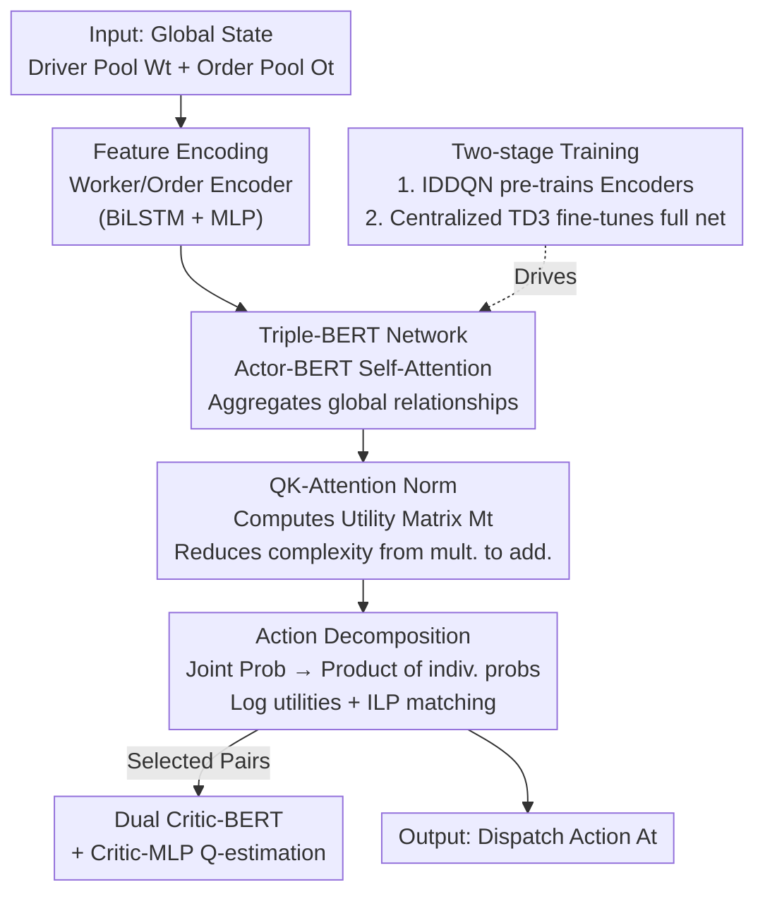

# Triple-BERT: Do We Really Need MARL for Ride-hailing Dispatching?

**Conference**: ICLR 2026  
**OpenReview**: [https://openreview.net/forum?id=symgW6FhA6](https://openreview.net/forum?id=symgW6FhA6)  
**Code**: https://github.com/RS2002/Triple-BERT (Available)  
**Area**: Reinforcement Learning  
**Keywords**: Ride-hailing Dispatching, Single-Agent Reinforcement Learning, Action Decomposition, BERT, TD3

## TL;DR
Addressing real-time ride-hailing dispatching—a task that is "essentially centralized but has long been hard-solved as a multi-agent problem"—this paper replaces mainstream MARL with a centralized single-agent reinforcement learning (SARL) framework, Triple-BERT (a variant of TD3 + action decomposition + BERT network + two-stage training). It achieves an overall improvement of approximately 11.95% over state-of-the-art methods on real Manhattan taxi data, with +4.26% served orders and -22.25% pickup time.

## Background & Motivation
**Background**: On-demand ride-hailing platforms like Uber and Lyft must bundle (pool) and match a batch of passenger orders with varying origins and destinations to available drivers at each time step. Due to the massive number of drivers and orders, the observation and action spaces are extremely large. Mainstream approaches almost exclusively utilize Multi-Agent Reinforcement Learning (MARL), decomposing the dispatching problem into small sub-problems where each driver is an agent.

**Limitations of Prior Work**: Existing MARL approaches have two typical configurations, both with significant flaws. Independent MARL (e.g., Independent Double DQN, Independent SAC) is computationally inexpensive but faces poor driver coordination as each agent lacks global information; GNNs providing neighborhood views only partially mitigate this. Centralized Training Decentralized Execution (CTDE, e.g., QMIX, CoPO) attempts to incorporate global information but collapses under the "Curse of Dimensionality" in large-scale scenarios with thousands of agents, leading to slow convergence and poor performance.

**Key Challenge**: Dispatching is "essentially a centralized task"—the platform holds global information on all drivers and orders, and the optimal solution requires global coordination. However, because of the massive observation/action spaces, researchers have been forced to use multi-agent frameworks to bypass complexity, sacrificing global coordination capacity. In other words, the problem was multi-agentized to cope with space complexity, rather than because the problem itself required multi-agent logic.

**Goal**: To utilize a centralized single-agent RL (SARL) for dispatching to fully exploit global information for driver coordination. This requires overcoming three engineering hurdles: the massive joint action space (approx. $10^{30}$ for 1,000 drivers and 10 orders), the observation space explosion as the number of entities grows, and the sample scarcity inherent to SARL (where records for multiple drivers are merged into a single training stream, drastically reducing samples).

**Key Insight**: Since dispatching is inherently centralized, it should be approached directly. The authors observed that the massive "joint action" probability can be structurally decomposed into the product of independent probabilities of "which order each driver chooses," combined with Integer Linear Programming (ILP) for global optimal matching. This maintains a centralized global perspective while making the non-enumerable action space computable.

**Core Idea**: Replace MARL with "Centralized SARL + Action Decomposition" for global dispatching, coupled with a parameter-shared BERT network to handle large observation spaces and a MARL-based pre-training stage to warm-start SARL and compensate for sample scarcity. The title answers its own question: "Do we really need MARL? — No (for inference/decision-making), but yes (as a foundation for pre-training)."

## Method

### Overall Architecture
Triple-BERT is a centralized actor-critic framework based on a variant of TD3. At each time step, the platform takes all driver states $W_t$ and order states $O_t$ as input. A Worker Encoder and Order Encoder first map drivers and orders into a shared feature space (using BiLSTM for driver order sequences and MLP for other features). These are concatenated into a sequence for the **Actor-BERT**, which aggregates global relationships between all drivers and orders via bidirectional self-attention. **QK-Attention** then computes a utility matrix $M_t \in \mathbb{R}^{n \times m_t}$ representing the preference of each driver for each order. Based on this matrix, **Action Decomposition** formulates the joint policy as the product of individual choice probabilities. During inference, log-utilities are used to construct a graph for ILP to find the maximum weight global matching. The selected driver-order pair features are then fed into two **Critic-BERTs** (required by TD3) to estimate Q-values. **Two-stage training** is employed: pre-training the encoders with a simple MARL (IDDQN), followed by centralized TD3 fine-tuning.

"Triple" refers to the three-BERT structure consisting of one Actor-BERT and two Critic-BERTs. The data flow from state to action and value evaluation is shown below:

### Key Designs

**1. Action Decomposition: Decomposing non-enumerable joint actions into independent choice probabilities**

Dispatching is difficult because the action space dynamically changes with the number of orders $m_t$ and is too large (approx. $10^{30}$) for sampling. Furthermore, driver actions are dependent (one order cannot be assigned to two drivers). The solution imposes a structural assumption on the policy: define $P_{i,j,t}$ as the probability of driver $i$ picking order $j$ at time $t$ (derived from the utility matrix via Softmax, including a "no-order" utility $N_t$), and assume the joint policy is proportional to the product: $\pi^{T}_{\Theta}(A_t|S_t) = z\!\left(\prod_{i,j \in h(A_t)} P_{i,j,t}\right)$, where $z(\cdot)$ is an increasing function and $h(A_t)$ is the set of selected driver-order pairs.

This product structure enables a key convenience: maximizing the joint probability is equivalent to maximizing $\sum_{i,j} \log P_{i,j,t}$ since $z(\cdot)$ and $\log(\cdot)$ are monotonic. The problem becomes a maximum weight bipartite matching problem solvable via ILP. During training, noise is injected into the probability matrix for exploration. This maintains centralized coordination while reducing an astronomical action space into a solvable matching problem. The author notes that $P$ is a "virtual quantity" used to bridge the network output $M_t$ to the policy, effectively constraining the policy space.

**2. Triple-BERT Network: Handling expanding observation spaces with parameter-shared self-attention**

Observation spaces expand with the number of drivers/orders, making traditional MLP encoders with fixed input dimensions infeasible. Triple-BERT encodes drivers and orders into a sequence for the Actor-BERT with bidirectional self-attention. Parameter reuse ensures the model size does not scale with the number of entities, while self-attention captures complex relationships between drivers, between orders, and across both. This fills the gap in traditional dispatching, which often ignores relationship between orders by using pair-wise evaluation. Positional encodings are omitted to maintain permutation invariance.

**3. QK-Attention Positive Normalization: Reducing complexity and fixing parameter redundancy**

Evaluating driver-order pairs is $O(|F| \cdot n \cdot m_t)$, which is computationally expensive. Borrowing from LoRA's logic, QK-Attention is introduced: $\text{QK-Attention}(w_{i,t}, o_{j,t}) := f(w_{i,t}) \cdot g(o_{j,t})^{T} \approx F(w_{i,t}, o_{j,t})$. Computing $f$ and $g$ separately before the dot product reduces complexity to $O(|f|\cdot n + |g|\cdot m_t + d\cdot n\cdot m_t)$, changing complexity from "multiplicative" to "additive."

To address parameter redundancy where $f' = \alpha f,\ g' = g/\alpha$ produces infinite solutions and unstable training, a positive normalization is added: $\text{QK-Attention-Norm}(w_{i,t}, o_{j,t}) := f(w_{i,t}) \cdot \dfrac{\text{Softplus}(g(o_{j,t}))^{T}}{\lVert \text{Softplus}(g(o_{j,t}))\rVert_2}$. Softplus ensures order-side vectors are non-negative, and L2 normalization stabilizes training. Ablation studies show that removing this normalization leads to performance worse than all baseline methods due to high variance.

**4. Two-stage Training: Warm-starting with MARL to solve SARL sample scarcity**

SARL faces a unique challenge in dispatching: merging driver records into a single stream drastically reduces sample volume, leading to non-convergence. The **first stage** treats dispatching as a multi-agent scenario with shared policy weights, allowing driver records to populate a large experience replay buffer. A simple IDDQN pre-trains the Worker/Order Encoders for general feature extraction. Although the independence assumption in IDDQN is flawed (the reason for MARL's poor performance), it provides a stable starting point. The **second stage** fine-tunes the entire network using centralized TD3, relying on global information for true collaboration without the independence assumption.

### Loss & Training
The second stage uses a modified TD3. Since the action space is dynamic and non-differentiable, approximate policy gradients are used: $\nabla_{\Theta} J(\Theta) \propto \mathbb{E}\big[(Q^{TD3}(S_t, A_t) - B)\,\nabla_{\Theta} \sum_{i,j \in h(A_t)} \log P_{i,j,t}\big]$, with baseline $B=0$. The Critic loss follows TD3: $L_C = \sum_{i=1,2}\mathbb{E}\big[Q^{TD3}_{\Theta^-}(S_{t+1}, R_{t+1}) - Q^{TD3}_{\Theta,i}(S_t, A_t)\big]$, utilizing target networks and noise for stability. The reward function combines platform revenue $p^{in}$, driver compensation $p^{out}$, expired orders $\chi$, and extra travel time $\rho$.

## Key Experimental Results

The dataset includes real Manhattan yellow taxi records (training) and FHV (High Volume For-Hire Vehicle) data from 2024-07-18 for cross-distribution testing. Baselines include five MARL categories across independent, CTDE, and centralized paradigms.

### Main Results

| Method | Type | Backbone | Model Size | Avg. Reward ($10^3$) |
|------|------|---------|---------|------|
| DeepPool | Independent MARL | MLP | 20K | 12.72 |
| BMG-Q | Independent MARL | GAT | 117K | 13.04 |
| HIVES | CTDE (QMIX) | GRU | 16M | 12.37 |
| Enders et al. | Indep. MARL (MASAC) | MLP+Attn | 118K | 12.04 |
| CEVD | Centralized (VD2) | MLP | 23K | 13.16 |
| **Triple-BERT** | **Centralized SARL** | **BERT** | 16M | **14.73** |

Compared to the strongest baseline, CEVD (13.16), Triple-BERT's reward of 14.73 represents an **11.95%** improvement. Service rate increased by +4.26%, and pickup time decreased by -22.25%.

FHV Cross-distribution Generalization (30 min episodes, order volume 734–5,989):

| Method | Reward | Service Rate | Pickup Time | Confirm Time |
|------|------|-------|---------|---------|
| CEVD | 12,556.74 | 0.80 | 8.02 | 0.09 |
| **Triple-BERT** | **14,329.74** | **0.88** | **7.02** | 0.34 |

Triple-BERT primarily improves the service rate from 0.80 to 0.88 by optimizing pickup time, albeit with slightly higher confirm/detour times due to increased pooling. Its advantage is most pronounced in high-demand scenarios.

### Ablation Study

| Config | Phenomenon | Explanation |
|------|------|------|
| Full model | Stable convergence, optimal | Complete Triple-BERT |
| w/o Stage 1 Pre-training | Non-convergence, reward drop | Sample scarcity causes instability |
| w/o QK-Attention Norm | Worse than all baselines | Parameter redundancy prevents learning |

### Key Findings
- **Stage 1 MARL pre-training is essential**: Without it, the model fails to converge due to limited centralized samples. MARL is necessary for "foundation," but not for "decision."
- **Normalization is the prerequisite for QK-Attention**: Removing it leads to non-unique solutions and training volatility, resulting in the worst performance.
- **Centralized global perspective enables true coordination**: Triple-BERT’s advantages over MARL are most apparent in congested scenarios where driver synergy is required for efficient pooling.

## Highlights & Insights
- **Rethinking the "MARL Habit"**: The paper identifies and challenges the research inertia of using MARL for tasks that are inherently centralized, returning to the essence of the problem with SARL.
- **Action Decomposition + ILP**: Converting a $10^{30}$ joint action space into a solvable matching problem via "Log Probs + ILP" is an elegant way to handle astronomical spaces and hard constraints (one order per person).
- **Complexity Reduction via QK-Attention**: Turning multiplicative complexity into additive complexity using LoRA-style decomposition is a generic trick for high-volume pairing tasks.
- **Warm-starting Centralized Models with MARL**: Treating centralized training as a fine-tuning stage for a multi-agent pre-trained backbone is a practical paradigm for mitigating sample scarcity in SARL.

## Limitations & Future Work
- **Sensitivity to Single-Point Failures**: Centralized paradigms are more vulnerable to corrupted or missing data from any entity compared to decentralized MARL.
- **Persistence of MARL dependency**: The "No MARL" claim only holds for the inference/decision phase; the system still requires IDDQN for pre-training.
- **Structural assumptions on joint policy**: The product assumption on probabilities $P$ is a heuristic constraint; its impact on optimality versus more flexible policies remains unquantified.
- **Scale and Diversity**: Testing was limited to Manhattan. Future work should address cross-city generalization and more robust off-policy gradients.

## Related Work & Insights
- **vs. Independent MARL**: Triple-BERT uses global self-attention to aggregate information, whereas independent methods only see local states or neighbors.
- **vs. CTDE/Value Decomposition**: CTDE methods suffer from scalability issues with thousands of agents; Triple-BERT bypasses this by treating the entire system as one agent and using ILP for decomposition.
- **vs. Traditional Pair-wise Dispatching**: Unlike methods that only evaluate driver-order pairs in isolation, Triple-BERT models dependencies between orders, leading to more efficient pooling.

## Rating
- Novelty: ⭐⭐⭐⭐⭐ Reframing dispatching as SARL with Action Decomposition + ILP is a genuine paradigm shift.
- Experimental Thoroughness: ⭐⭐⭐⭐ Real taxi data and cross-distribution tests are strong, though limited to one city.
- Writing Quality: ⭐⭐⭐⭐ Clear motivation and catchy title, though some derivations are dense.
- Value: ⭐⭐⭐⭐⭐ High practical utility for large-scale assignment RL problems like food delivery or resource allocation.

<!-- RELATED:START -->

## Related Papers

- [\[ICLR 2026\] Who Matters Matters: Agent-Specific Conservative Offline MARL](who_matters_matters_agent-specific_conservative_offline_marl.md)
- [\[AAAI 2026\] Partial Action Replacement: Tackling Distribution Shift in Offline MARL](../../AAAI2026/reinforcement_learning/partial_action_replacement_tackling_distribution_shift_in_offline_marl.md)
- [\[NeurIPS 2025\] Oryx: a Scalable Sequence Model for Many-Agent Coordination in Offline MARL](../../NeurIPS2025/reinforcement_learning/oryx_a_scalable_sequence_model_for_many-agent_coordination_in_offline_marl.md)
- [\[ICLR 2026\] Solving General-Utility Markov Decision Processes in the Single-Trial Regime with Online Planning](solving_general-utility_markov_decision_processes_in_the_single-trial_regime_wit.md)
- [\[ICLR 2026\] RLP: Reinforcement as a Pretraining Objective](rlp_reinforcement_as_a_pretraining_objective.md)

<!-- RELATED:END -->
