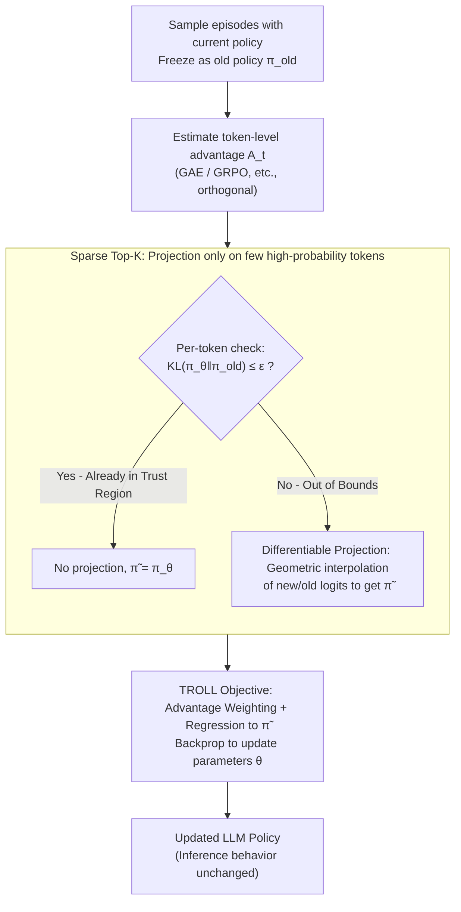

# TROLL: Trust Regions improve Reinforcement Learning for Large Language Models

**Conference**: ICLR 2026  
**arXiv**: [2510.03817](https://arxiv.org/abs/2510.03817)  
**Code**: None  
**Area**: Reinforcement Learning / LLM Fine-tuning  
**Keywords**: Trust Region, PPO, Policy Clipping, KL Constraint, LLM Reinforcement Learning, Token-level Optimization

## TL;DR

This paper proposes TROLL (Trust Region Optimization for Large Language models), which replaces the clipping mechanism in PPO with a differentiable discrete trust region projection. It implements token-level policy updates based on principled KL constraints, consistently outperforming PPO-clip in mathematical reasoning and code generation tasks.

## Background & Motivation

Clipping objectives based on Proximal Policy Optimization (PPO) have become the standard choice for reward-based reinforcement learning fine-tuning of LLMs. From RLHF (Reinforcement Learning from Human Feedback) to mathematical reasoning training, PPO-clip is ubiquitous. However, the clipping mechanism itself has fundamental issues:

**The gap between the original intent of PPO clipping and its actual effect**:

**Historical Background**: Clipping was originally introduced as a **simple approximation** of the KL-divergence-based trust region constraint in TRPO (Trust Region Policy Optimization). TRPO guarantees that each policy update does not exceed a threshold in the sense of KL divergence, but it is computationally expensive. PPO uses the clipping ratio $\text{clip}(\frac{\pi_\theta}{\pi_{old}}, 1-\epsilon, 1+\epsilon)$ to approximate this effect.

**Clipping is a rough approximation**: The clipping operation simply truncates the probability ratio, but its relationship with KL constraints is not precise. Specifically:
   - Clipping only constrains the range of the probability ratio, not directly the KL divergence.
   - Clipping yields zero gradients at the boundaries, leading to information loss.
   - Clipping treats all tokens equally, failing to reflect the differences in importance among tokens.

**Actual Consequences**: Clipping often leads to **unstable updates** and **suboptimal performance**. Particularly in LLM scenarios, where each episode involves a joint policy across hundreds of tokens, the coarseness of clipping is magnified.

Despite recent work exploring improved advantage estimation methods (e.g., GRPO, DAPO) and normalization techniques, the **clipping mechanism itself has rarely been questioned or replaced**.

The core contribution of this paper is to return to the fundamental principles of trust regions by directly replacing the clipping operation with a differentiable, principled trust region projection.

## Method

### Overall Architecture

TROLL addresses a specific problem: the seemingly minor clipping operation in PPO training is actually a crude substitute for the TRPO trust region constraint, which subtly hinders training. TROLL removes clipping entirely and replaces it with a **discrete differentiable trust region projection**. This imposes precise KL divergence constraints at each token position, ensuring that the updated distribution moves in the direction of increasing advantage without deviating too far from the old policy used to collect the current batch of data.

The update process is as follows: Sample a batch of episodes using the current LLM policy and freeze it as the old policy $\pi_{old}$; estimate the advantage $A_t$ for each token using any standard method (GAE, GRPO, etc.); check token-by-token if the current policy $\pi_\theta$ has deviated from $\pi_{old}$ beyond the KL threshold $\epsilon$. Tokens within the bounds are left unchanged, while tokens exceeding the bounds undergo differentiable projection to pull them back into the trust region. Finally, parameters are updated via backpropagation using an objective that combines "advantage weighting" and "regression to the projection result." To ensure scalability on LLMs with vocabularies in the hundreds of thousands, all projections are performed only on the Top-K high-probability subset for each token.

Since TROLL only modifies the update method during the training phase and does not change the sampling behavior during inference, it can be integrated into any existing PPO-clip pipeline with zero cost. Furthermore, because constraint application and advantage estimation are independent dimensions, TROLL is naturally orthogonal to and can be combined with various advantage estimation methods like GAE and GRPO.

### Key Designs

**1. Token-level KL Trust Region Constraint: Replacing "Probability Ratio Limits" with "Distribution Distance Limits"**

PPO's clipping operates in the probability ratio space, truncating the range of $\frac{\pi_\theta}{\pi_{old}}$, but stabilizing the ratio does not equate to the distributions being genuinely close. TROLL instead imposes constraints directly in the **probability distribution space**: for each token position $t$, it requires that the KL divergence between the updated distribution and the old policy $\pi_{old}$ does not exceed a threshold $\epsilon$. Specifically, it solves a convex projection—finding a distribution $\tilde\pi$ that is closest to the current policy $\pi_\theta$ while remaining within the $\epsilon$-trust region of $\pi_{old}$:

$$\tilde\pi(o_t) = \arg\min_{\hat\pi}\, KL\big(\hat\pi \,\|\, \pi_\theta(o_t)\big)\quad \text{s.t.}\quad KL\big(\hat\pi \,\|\, \pi_{old}(o_t)\big) \leq \epsilon$$

This is exactly the type of constraint required by TRPO's performance improvement guarantee—trust region theory demands a KL upper bound, not a probability ratio upper bound. Clipping was merely an approximation made for engineering simplicity; TROLL makes this theoretical constraint directly operational again, and the constraint granularity returns from a single ratio to the entire distribution. Note that what is constrained is the "new policy vs. old policy" rather than a fixed reference policy; the goal is to stabilize on-policy stepwise updates, rather than anchoring the model near an SFT model as in RLHF.

**2. Closed-form Differentiable Projection + Regression Objective: Enabling Backpropagation for KL Projection**

The difficulty in applying direct KL constraints is that projection onto a constraint set is typically non-differentiable. Once non-differentiable, gradients cannot be passed back to the network—this was the engineering bottleneck that prevented TRPO from being implemented on large models. TROLL's key discovery is that the convex projection mentioned above has a **closed-form solution**, and this solution is a geometric interpolation of the new and old sets of logits:

$$\tilde\pi(o_t) \propto \exp\!\left(\frac{\log \pi_{old}(o_t) + \eta\,\log \pi_\theta(o_t)}{\eta + 1}\right)$$

The step size $\eta$ controls how much the new policy is pulled back toward the old policy, and the corresponding convex dual (a scalar problem) can be solved per token using a few iterations of ternary/n-ary search. Since this is an elementary differentiable operation, gradients can pass through the projection back to the parameters. One remaining issue after projection is that the original network output $\pi_\theta$ could still be arbitrarily far from $\pi_{old}$. Therefore, TROLL adds a term to the objective to regress $\pi_\theta$ toward the (gradient-stopped) projection result $\tilde\pi$. This uses $\tilde\pi$ both to calculate the importance ratio and as a regression target, thereby ensuring the actual network output is constrained within the trust region.

**3. Sparse Top-K Projection: Projecting Only on High-Probability Tokens**

LLM vocabularies often exceed 100,000 (e.g., Qwen3 has 151,936). Performing a KL projection for every token across the full vocabulary would consume all the benefits of trust regions. The key to TROLL's efficiency is: for each token, greedily select the Top-K tokens that cumulatively cover almost all probability mass (while always retaining the actually sampled token to ensure it has a gradient), and calculate the projection only on this subset, leaving the remaining long-tail tokens unchanged. Furthermore, projection is only necessary when a token actually violates the trust region constraint, which only occurs for a few highly correlated tokens/dimensions; others can be skipped during the filtering stage. This is viable because pre-trained LLMs have low perplexity and highly long-tailed output distributions—the paper reports that using $K=64$ and $\epsilon=10^{-5}$ typically retains 99.999% of the probability mass, making the trust region approach practical at LLM scale.

### Loss & Training

The TROLL objective function combines "advantage weighting" and "regression to the projected distribution." It remains structurally similar to standard PPO but replaces clipping with the trust region projection $\tilde\pi$:

$$J_{TROLL}(\theta) = \mathbb{E}_{o\sim\pi_{old}}\!\left[\frac{1}{|o|}\sum_t \frac{\tilde\pi(o_t)}{\pi_{old}(o_t)}\,A_t \;-\; \alpha\,KL\big(\pi_\theta(o_t)\,\|\,\lfloor\tilde\pi(o_t)\rfloor\big)\right]$$

Where $\lfloor\cdot\rfloor$ denotes the stop-gradient operator, and $\alpha$ is the regression weight. The projected distribution $\tilde\pi$ plays two roles: calculating the importance ratio $\tilde\pi/\pi_{old}$, and serving as the regression target for the raw network output $\pi_\theta$. The process is outlined in Algorithm 1: reset $\pi_{old}$ every step, sparsify logits, estimate advantages, and then for each token: "Check KL → (if exceeded) Project → Update."

Comparison with PPO-clip:

| Component | PPO-clip | TROLL |
|------|---------|-------|
| Constraint Target | Probability ratio $\frac{\pi_\theta}{\pi_{old}}$ | Distribution distance to old policy |
| Constraint Method | Ratio clipping $[1-\epsilon, 1+\epsilon]$ | KL projection $KL(\cdot\|\pi_{old}) \leq \epsilon$ |
| Constraint Granularity | Single scalar ratio | Entire token distribution |
| Theoretical Guarantee | None direct | KL divergence upper bound (Trust Region) |
| Boundary Gradient | Zero (Information loss) | Non-zero (Maintains gradient flow) |
| Computational Overhead | Extremely low | Slightly higher (Manageable with Top-K) |

## Key Experimental Results

### Main Results

Consistent advantages across model families and tasks:

| Task | Model | Metric | TROLL | PPO-clip | Gain |
|------|------|------|-------|---------|------|
| Math Reasoning (MATH) | Qwen-2.5 series | Success Rate | Higher | Baseline | Faster training speed |
| Math Reasoning (GSM8K) | Llama series | Success Rate | Higher | Baseline | Better stability |
| Code Generation | Multiple families | Pass@1 | Higher | Baseline | Superior final performance |

### Ablation Study

| Configuration | Training Stability | Final Performance | Explanation |
|------|----------|---------|------|
| PPO-clip (Baseline) | High fluctuation | Baseline | Inherent instability of clipping |
| TROLL (Full) | **Significantly more stable** | **Optimal** | Effect of precise KL constraints |
| TROLL + GAE | Stable | High | Compatible with standard advantage estimation |
| TROLL + GRPO | **Most stable** | **Highest** | Complementary with advanced advantage estimation |
| Different Sparsity K | Degrades if K too small | Optimal with moderate K | Selection of Top-K requires tuning |
| Different KL Threshold δ | Too conservative if δ small | Optimal with moderate δ | Similar to tuning ε in PPO |

### Key Findings

1. **Faster Training Speed**: TROLL requires significantly fewer training steps than PPO-clip to reach the same performance, indicating more efficient updates per step. This is attributed to the trust region projection avoiding the gradient information loss caused by clipping.

2. **Better Training Stability**: PPO-clip training curves often show oscillations and sudden jumps, while TROLL's training curves are much smoother. This is because precise KL constraints provide more reliable control over policy updates than clipping.

3. **Superior Final Performance**: After sufficient training, TROLL's final success/pass rates are consistently higher than those of PPO-clip. This suggests that the crude approximation of clipping indeed leads to suboptimal solutions.

4. **Consistency Across Models and Tasks**: The advantage is not limited to specific models or tasks, indicating a general improvement rather than scene-specific optimization.

5. **Orthogonality with Advantage Estimation**: TROLL provides improvements regardless of whether GAE or GRPO is used for advantage estimation, demonstrating that the constraint mechanism and advantage estimation are independent dimensions of improvement.

## Highlights & Insights

1. **Revisiting the "Neglected Constant"**: PPO-clip has become such a standard choice that the clipping mechanism itself is rarely questioned. TROLL's contribution lies in challenging this default assumption, proving that "better approximation = better performance."

2. **Unification of Theory and Practice**: The theoretical advantages of trust region methods (such as performance improvement guarantees) have long been unachievable in LLMs due to computational difficulties. TROLL resolves this engineering bottleneck through sparsification and differentiable projection, translating theoretical advantages into practical gains.

3. **Plug-and-Play Design**: TROLL does not change inference behavior and does not introduce new types of hyperparameters (the KL threshold $\delta$ corresponds to PPO's clipping range $\epsilon$), allowing it to replace existing PPO training pipelines without obstacles.

4. **Intuition Behind Sparsification**: The design of performing projection only on Top-K tokens not only saves computation but also implies a deep insight—the most important information for policy updates is concentrated in the distributional changes of high-probability tokens.

## Limitations & Future Work

1. **Slight Increase in Computational Overhead**: Although sparsification reduces projection costs, TROLL still involves extra overhead compared to the extremely simple clipping operation. This difference might become significant in extreme-scale training (hundreds of GPUs).

2. **Choice of Top-K Size**: The sparsity K needs tuning. A K that is too small might fail to sufficiently constrain distribution changes, while a K that is too large loses efficiency. Adaptive selection of K could be a future direction.

3. **Validation Only on Math and Code**: It has not yet been validated on more diverse LLM tasks such as general dialogue or creative generation. Different tasks may require different trust region sizes.

4. **Lack of Comparison with New Methods like DPO**: Current RL-based LLM training is competing with methods like DPO (Direct Preference Optimization) that do not require online RL. TROLL's positioning in this broader context needs further clarification.

5. **Choice of KL Direction**: The projection constraint is written as $KL(\tilde\pi \| \pi_{old})$. Reverse KL might be more appropriate in certain scenarios. The impact of this design choice warrants further exploration.

6. **Comparison with Other Trust Region Methods**: How do TRPO or Natural Policy Gradient perform in LLM scenarios? Is TROLL's improvement derived from the trust region itself or its specific implementation?

## Related Work & Insights

- **TRPO (Schulman et al., 2015)**: The theoretical origin of TROLL; TRPO uses precise KL constraints but is computationally expensive.
- **PPO (Schulman et al., 2017)**: The direct target of improvement for TROLL; PPO uses clipping to approximate TRPO's KL constraints.
- **RLHF Pipelines** (e.g., InstructGPT, OpenAI o-series): TROLL can be directly integrated into these pipelines.
- **GRPO/DAPO, etc.**: Orthogonal to improvements in advantage estimation; combining them yields better results.
- **Insights**: This work reminds us that in rapidly evolving fields, approximations made early on for "engineering simplicity" (like clipping) may no longer be optimal. As problem scale and task complexity grow, returning to fundamental principles (like trust regions) can bring significant gains.

## Rating

- Novelty: ⭐⭐⭐⭐ (Principled replacement for classic methods; technical innovation in sparse projection)
- Experimental Thoroughness: ⭐⭐⭐⭐ (Systematic validation across multiple models, tasks, and advantage estimation methods)
- Writing Quality: ⭐⭐⭐⭐ (Clear motivation, effective comparison with PPO)
- Value: ⭐⭐⭐⭐⭐ (Direct replacement for PPO-clip with broad impact)

<!-- RELATED:START -->

## Related Papers

- [\[ICLR 2026\] On Predictability of Reinforcement Learning Dynamics for Large Language Models](on_predictability_of_reinforcement_learning_dynamics_for_large_language_models.md)
- [\[ICLR 2026\] Revolutionizing Reinforcement Learning Framework for Diffusion Large Language Models](revolutionizing_reinforcement_learning_framework_for_diffusion_large_language_mo.md)
- [\[ICLR 2026\] Using Reinforcement Learning to Train Large Language Models to Explain Human Decisions](using_reinforcement_learning_to_train_large_language_models_to_explain_human_dec.md)
- [\[ICLR 2026\] Risk-Sensitive Reinforcement Learning for Alleviating Exploration Dilemmas in Large Language Models](risk-sensitive_reinforcement_learning_for_alleviating_exploration_dilemmas_in_la.md)
- [\[ICLR 2026\] CDE: Curiosity-Driven Exploration for Efficient Reinforcement Learning in Large Language Models](cde_curiosity-driven_exploration_for_efficient_reinforcement_learning_in_large_l.md)

<!-- RELATED:END -->
