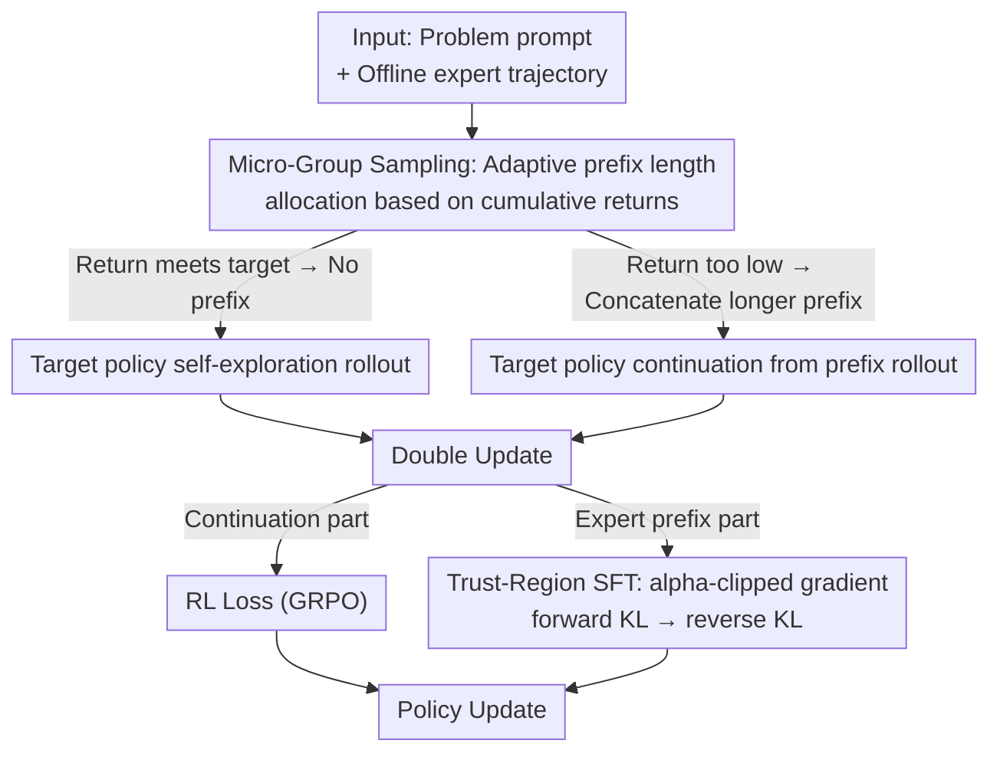

# TRAPO: Trust-Region Adaptive Policy Optimization

**Conference**: ICLR 2026  
**OpenReview**: [https://openreview.net/forum?id=oXlSEcxD6N](https://openreview.net/forum?id=oXlSEcxD6N)  
**Code**: https://github.com/Su-my/TRAPO  
**Area**: LLM Reasoning / Reinforcement Learning / Post-training  
**Keywords**: Post-training, SFT-RL Fusion, Trust Region, Adaptive Expert Guidance, Mathematical Reasoning

## TL;DR
TRAPO decouples the traditional "SFT followed by RL" two-stage serial pipeline into an interleaved process **within each individual sample**. Expert trajectory prefixes are learned via SFT, while the model-generated continuations are learned via RL. By utilizing a Trust-Region version of SFT (TrSFT) to shift forward KL toward reverse KL for stable training, and employing adaptive prefix lengths to provide guidance based on problem difficulty, TRAPO achieves an average score of 56.6 across five mathematical reasoning benchmarks, outperforming SFT, pure RL, and SFT-then-RL.

## Background & Motivation

**Background**: The current mainstream post-training pipeline for enhancing complex reasoning in LLMs is a two-stage serial "SFT → RL" process: first, supervised fine-tuning on curated expert demonstrations to teach the model to imitate, followed by RL to refine reasoning through trial and error. Representative works like DeepSeek-R1 and OpenAI-o1 follow this paradigm.

**Limitations of Prior Work**: This serial design contains a fundamental contradiction. On one hand, SFT locks the model into rigid imitation modes, suppressing the exploration capabilities critically needed during the RL stage. On the other hand, SFT is prone to catastrophic forgetting, preventing the RL stage from effectively invoking knowledge accumulated during pre-training. Crucially, a lower SFT loss does not necessarily translate to a better starting point for subsequent RL—excessive SFT can push the model out of regions suitable for RL, and **currently, there is no signal to measure this in real-time**.

**Key Challenge**: There exists a trade-off between the "knowledge distillation gains" of SFT and the "exploration capability + pre-training knowledge" of RL. The two-stage serial approach pushes this trade-off to an extreme: once SFT is completed, the damage is solidified, leaving RL with no way to recover.

**Goal**: How to integrate the expert knowledge distillation gains of SFT into RL without sacrificing exploration and pre-training knowledge? This requires solving two sub-problems: (1) Guidance internalization—how to effectively learn from expert prefixes; (2) Guidance selection—how much expert prefix length should be provided for each problem.

**Key Insight**: The authors conducted an observation experiment (Figure 2) feeding varying lengths of DeepSeek-R1 prefixes to Qwen2.5-3B. They found that longer prefixes led to higher accuracy in completing subsequent reasoning and more frequent advanced behaviors like "backtracking" and "reverse-chaining." This suggests that expert prefixes can both provide immediate exploration guidance and internalize reasoning skills; the key is how to combine them with RL at the **finest granularity**.

**Core Idea**: Interleave SFT and RL within each sample—apply SFT only on the expert trajectory prefix and RL on the part continued by the model. Then, transform the SFT gradient using a Trust-Region approach to shift from "mode-covering" to "mode-seeking," and use adaptive prefix lengths based on problem difficulty.

## Method

### Overall Architecture

The overall goal of TRAPO is to implement a "learn-while-practicing" post-training paradigm: for each training problem, the model first attempts **unguided** self-exploration. If it fails, expert prefixes are incrementally provided as context. Once the continuation is completed, a "double update" is performed—the continued part follows standard RL (GRPO), while the expert prefix part follows TrSFT supervision. In this way, expert demonstrations serve both as "in-context demonstrations" to guide exploration and as "direct supervision signals" to internalize skills, fused within each trajectory.

The pipeline is supported by two core components: **Micro-Group Sampling** adaptively decides the prefix length based on difficulty, and **Trust-Region SFT (TrSFT)** ensures stable supervision without damaging RL.

### Key Designs

**1. Interleaved SFT and RL within each sample: Fine-grained hybrid of two stages**

Addressing the fundamental pain point where SFT's damage cannot be recovered by RL in a two-stage serial pipeline, TRAPO no longer lets SFT lead entirely. Instead, it performs two tasks simultaneously for **every training sample**: it takes a prefix $y_{\le n}$ of an offline expert trajectory for supervised learning, and lets the target policy continue from the end of the prefix to generate $y_{>n}$ for RL. The expert prefix serves a dual purpose—it is a "demonstration" in the context guiding the model toward high-return reasoning paths, and it is "direct supervision" for internalizing expert skills into the parameters.

The benefit is that SFT and RL are no longer isolated: supervision and self-exploration signals fuse within the same trajectory and backward pass. The model practices its own high-probability reasoning paths while internalizing low-probability but valuable expert skills. The authors note that **naively** adding standard SFT loss and RL loss is disastrous—experimental results show this naive combination performs over 18 points worse than pure RL, justifying the following two designs.

**2. Trust-Region SFT (TrSFT): Shifting forward KL to reverse KL**

The root cause of the naive combination's failure lies in the gradient of standard SFT. Standard SFT is equivalent to minimizing token-wise forward KL divergence, with the gradient:

$$\nabla_\theta L_{\text{SFT}} = -\frac{1}{N}\sum_{i=1}^{N}\sum_{n=1}^{|y_i|} \frac{1}{p_\theta^T(y_{in}|x_i, y_{<n}^i)} \nabla_\theta p_\theta^T(y_n^i|x_i, y_{<n}^i).$$

The weight term $\frac{1}{p_\theta^T}$ becomes extremely large when a token comes from an expert mode far from the current policy, pushing policy probabilities into "void regions" supported by neither, leading to degraded outputs like repetition or incorrect decoding. While standard SFT can eventually fix this "distribution-blending" with enough training, in TRAPO's interleaved setup, **any probability allocated to void regions immediately causes degraded rollouts**. Thus, the SFT objective must be modified.

TrSFT introduces a trust-region lower bound $\alpha \in [0,1]$ to the gradient weight:

$$\nabla_\theta L_{\text{TrSFT}}^\alpha = -\frac{1}{N}\sum_{i=1}^{N}\sum_{n=1}^{|y_i|} \frac{1}{\max\big(p_\theta^T(y_{in}|x_i, y_{<n}^i),\ \alpha\big)} \nabla_\theta p_\theta^T(y_n^i|x_i, y_{<n}^i).$$

Within the trust region ($p_\theta^T \ge \alpha$, tokens the target policy also approves), the weight remains normal to imitate the expert. Outside ($p_\theta^T < \alpha$), the weight is clamped by $1/\alpha$, significantly weakening brute-force gradients pushing toward distant expert modes. Proposition 1 shows the optimal solution for this gradient prunes low-probability expert regions ($p_T^*(c)=0$) and rescales the main mode by $p_E(c)/\lambda$, effectively **transforming the objective from forward KL mode-covering to reverse KL mode-seeking**. It focuses on the most significant expert mode when it differs from the current policy rather than blindly covering the space, providing a stable starting point for RL.

**3. Micro-Group Sampling: Adaptive expert guidance based on returns**

Using a fixed prefix length leads to over-guidance on simple problems (stifling exploration) or under-guidance on hard problems (causing rollout failure). Micro-group sampling uses a "scaffolding" approach: each problem is split into $N$ micro-groups $g_i$, characterized by three hyperparameters: prefix length ratio $L_i$, return threshold $t_i$, and sampling budget $n_i$. When processing $g_i$, the average return of all prior micro-groups is calculated; if it is below $t_i$, an expert prefix of length $L_i$ is provided for $n_i$ continuations. Otherwise, $n_i$ self-exploration rollouts are sampled without a prefix.

The authors set $0 = L_1 < L_2 < \cdots < L_N = 1$: $L_1=0$ ensures every problem starts with **unguided self-exploration RL**, while $L_N=1$ provides the full expert reasoning path for the hardest cases. Increasing $L_i$ means "guidance is only provided when shorter prefixes prove insufficient," concentrating expert guidance where it is most needed and achieving a dynamic balance between self-exploration and expert assistance. In implementation, the total group size is 8, split into $\{4,2,1,1\}$ micro-groups with prefix ratios $(0, 0.2, 0.5, 1.0)$ and thresholds $(-1, 0.5, 0.7, 0.9)$, where $t_1=-1$ ensures the first micro-group is always unguided.

### Loss & Training
The RL component utilizes GRPO without KL penalties (Dr.GRPO style), with a batch size of 128 and a constant learning rate of $5\times10^{-6}$. The TrSFT trust-region parameter $\alpha=0.1$. The base model is Qwen2.5-Math-7B, and training data consists of OpenR1-Math-46k-8192 (verified reasoning trajectories generated by DeepSeek-R1), supplemented by OpenR1-Math-200k for guidance diversity. Note that reward statistics and generation lengths exclude trajectories guided by expert prefixes for fair comparison.

## Key Experimental Results

### Main Results

| Dataset | Metric | TRAPO | Prev. SOTA | Gain |
|--------|------|-------|----------|------|
| Five-Math Avg. | avg | **56.6** | 55.5 (LUFFY) | +1.1 |
| vs SFT | avg | 56.6 | 50.3 | +6.3 |
| vs GRPO (Pure RL) | avg | 56.6 | 50.4 | +6.2 |
| vs SFT-then-RL | avg | 56.6 | 54.3 | +2.3 |
| MATH-500 | pass@1 | **89.2** | 88.4 (LUFFY) | +0.8 |
| OlympiadBench | pass@1 | **57.6** | 56.0 (LUFFY) | +1.6 |
| General Domain Avg. (ARC-c + MMLU-Pro) | pass@1 | **68.3** | 66.7 (LUFFY) | +1.6 |

TRAPO leads across all five math reasoning benchmarks with a 56.6 average. Furthermore, its general domain average of 68.3 outperforms all baselines, suggesting that TRAPO **avoids trapping the model in rigid reasoning patterns** while leveraging external guidance, leading to better generalization (in contrast, SFT and SFT-then-RL drop significantly in general domains to 42.3 and 44.5, respectively).

### Ablation Study

| Configuration | Five-Math Avg. | Description |
|------|-----------|------|
| GRPO (Baseline) | 50.4 | Pure RL starting point |
| + Micro-Group Sampling | 52.7 | Adaptive prefix length alone, +2.3 |
| + Micro-Group Sampling + Standard SFT Loss | **32.3** | Naive combination collapses, -18 pts vs baseline |
| + Micro-Group Sampling + LUFFY Loss | 53.6 | Offline RL loss, limited improvement |
| + Micro-Group Sampling + TrSFT Loss (Full) | **56.6** | Full model |

### Key Findings
- **TrSFT is critical for stable fusion**: Micro-group sampling alone brings a +2.3 improvement to GRPO (enhancing reward density via adaptive prefix allocation). However, replacing it with standard SFT loss causes performance to plummet from 50.4 to 32.3, validating the hypothesis that "naive addition collapses due to distribution-blending." Only TrSFT successfully internalizes expert prefixes to reach 56.6.
- **TRAPO expands the solution space rather than just re-ranking existing knowledge**: Pass@k analysis shows that pure GRPO is eventually overtaken by the base model as $k$ increases, indicating standard RL merely selects better solutions from existing knowledge without expanding capabilities. TRAPO and SFT-based methods scale steadily with $k$, with TRAPO performing best, proving it successfully internalizes external knowledge from expert trajectories.
- **Three advantages in training dynamics**: Compared to GRPO, TRAPO maintains higher rewards throughout and converges to a higher level. It rapidly increases output length early on (internalizing long expert reasoning patterns, which GRPO struggles to generate), and maintains higher policy entropy, reflecting its ability to refine its own high-probability paths while remaining open to low-probability expert guidance.
- **Generalization to general LLMs**: On Qwen2.5-7B-Instruct, TRAPO (avg 45.2) still outperforms Base (39.7), SFT (33.0), and GRPO (40.6), showing the method is not tied to math-specific base models.

## Highlights & Insights
- **The "SFT as forward KL shifted toward reverse KL" perspective is ingenious**: The authors did not invent a completely new loss but instead intervened at the $1/p_\theta^T$ weight in the SFT gradient. Using a simple $\max(\cdot,\alpha)$ clamp transforms mode-covering into mode-seeking, supported by Proposition 1's closed-form optimal solution. This minimal engineering/theoretical change directly addresses the "void region degradation" problem.
- **"Mock exams first, hints if failed" scaffolding curriculum**: Micro-group sampling binds prefix length to return thresholds, essentially creating an instance-level dynamic difficulty schedule. It saves guidance budgets for exploration on easy problems and gradually increases support for hard problems, a paradigm transferable to any hybrid "demonstration + self-exploration" scenario.
- **The most striking "Aha!" moment**: The fact that the naive SFT+RL combination isn't just "slightly worse" but collapses by 18 points is the most powerful evidence for TrSFT. It demonstrates that the real challenge of fusing SFT and RL isn't "whether to fuse," but "how to fuse without mutual destruction."

## Limitations & Future Work
- Experiments are concentrated on **mathematical reasoning** and a few general reasoning benchmarks; effectiveness in other domains like code generation or multi-step decision-making is not fully verified.
- Micro-group sampling introduces several hyperparameters (prefix ratios $L_i$, thresholds $t_i$, budgets $n_i$). The paper uses manually set fixed levels (e.g., $(0, 0.2, 0.5, 1.0)$); their optimality and transfer cost to new tasks are not deeply discussed.
- The method relies on **high-quality offline expert trajectories** (generated by DeepSeek-R1). In scenarios without strong experts to distill from, the benefits of TrSFT for mode-seeking might diminish.
- While the sensitivity of the trust-region parameter $\alpha=0.1$ is analyzed in the appendix, the main text does not provide a robust interval across different tasks, implying empirical tuning may be necessary.

## Related Work & Insights
- **vs SFT-then-RL (Two-stage serial)**: The standard pipeline does SFT before RL; damage caused by SFT is permanent. TRAPO interleaves them within each sample, and the +2.3 gain proves fine-grained fusion is superior to isolated stages.
- **vs LUFFY**: LUFFY adds one expert trajectory per group of 8 rollouts for offline RL, with fixed prefix lengths and structure. TRAPO uses adaptive micro-group sampling and internalizes via TrSFT rather than offline RL loss; TrSFT (56.6) significantly outperforms LUFFY loss (53.6) in ablations.
- **vs ReLIFT**: ReLIFT alternates SFT and RL between different batches; TRAPO descends to the instance and token-level prefix granularity for finer fusion.
- **vs GRPO/DAPO/Dr.GRPO and other RL optimization methods**: These works improve the RL objective (clipping, group advantage estimation). TRAPO is orthogonal—it improves reward density and reasoning capability simultaneously via adaptive expert injection and can be layered on top of these RL algorithms.

## Rating
- Novelty: ⭐⭐⭐⭐⭐ The perspective of SFT as an object shifted by trust regions toward reverse KL, combined with instance-level interleaving, is both novel and practical.
- Experimental Thoroughness: ⭐⭐⭐⭐ Five math + two general benchmarks, ablations, pass@k, training dynamics, and cross-base model evaluations are covered, though the task domain is somewhat narrow.
- Writing Quality: ⭐⭐⭐⭐⭐ Logical progression from pain points to GMM training experiments and theoretical propositions; the negative results of the naive combination are used effectively.
- Value: ⭐⭐⭐⭐⭐ Provides a stable, reproducible, and theoretically supported new paradigm for SFT+RL fusion, with direct utility for post-training reasoning LLMs.

<!-- RELATED:START -->

## Related Papers

- [\[ICLR 2026\] BAPO: Stabilizing Off-Policy Reinforcement Learning for LLMs via Balanced Policy Optimization with Adaptive Clipping](bapo_stabilizing_off-policy_reinforcement_learning_for_llms_via_balanced_policy_.md)
- [\[ICLR 2026\] Heterogeneous Agent Q-weighted Policy Optimization](heterogeneous_agent_q-weighted_policy_optimization.md)
- [\[ICML 2025\] Embedding Safety into RL: A New Take on Trust Region Methods](../../ICML2025/reinforcement_learning/embedding_safety_into_rl_a_new_take_on_trust_region_methods.md)
- [\[ICLR 2026\] Single-stream Policy Optimization](single-stream_policy_optimization.md)
- [\[ICLR 2026\] Relative Entropy Pathwise Policy Optimization](relative_entropy_pathwise_policy_optimization.md)

<!-- RELATED:END -->
