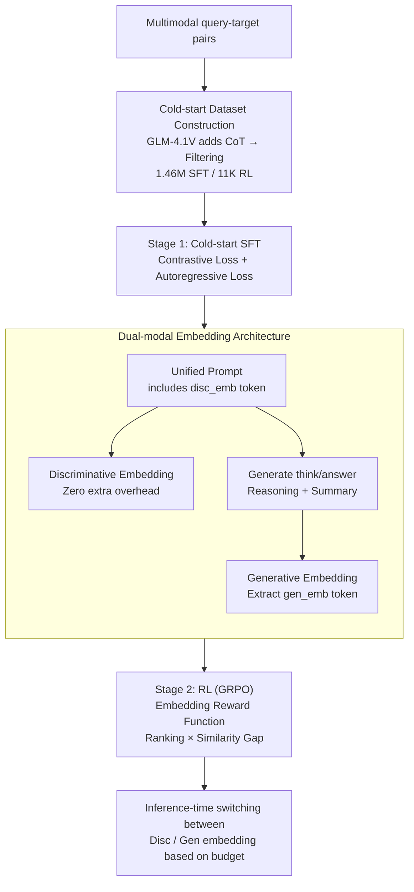

# UME-R1: Exploring Reasoning-Driven Generative Multimodal Embeddings

**Conference**: ICLR 2026  
**arXiv**: [2511.00405](https://arxiv.org/abs/2511.00405)  
**Code**: [GitHub](https://github.com/XMUDeepLIT/UME-R1)  
**Area**: Reinforcement Learning  
**Keywords**: multimodal embeddings, reasoning-driven generation, reinforcement-learning, MLLM, inference-time scaling

## TL;DR

The authors propose UME-R1, the first exploration of a reasoning-driven generative multimodal embedding paradigm. Through two-stage training (cold-start SFT + Reinforcement Learning), the model is trained to reason before generating representations. It significantly outperforms traditional discriminative embedding models across 78 tasks in the MMEB-V2 benchmark.

## Background & Motivation

**Background**: Embedding models based on Multimodal Large Language Models (MLLMs), such as VLM2Vec and MM-Embed, have achieved significant progress in multimodal embedding tasks, greatly surpassing traditional dual-encoder vision-language models like CLIP. Concurrently, Large Reasoning Models (LRMs) represented by DeepSeek-R1 have made breakthroughs in complex reasoning tasks.

**Limitations of Prior Work**: Existing MLLM multimodal embedding models are essentially discriminative—they directly encode input and extract the hidden state of the last token as the embedding without generating any new tokens. This prevents them from benefiting from the reasoning-driven generative paradigm. While some works (e.g., CAFe) incorporate a next-token prediction loss during training to preserve generative capabilities, they remain discriminative during inference.

**Key Challenge**: A natural gap exists between reasoning capability and embedding quality. Embedding tasks lack standard answer verification mechanisms like those in mathematics, which makes it difficult to apply reinforcement learning directly to optimize embedding models.

**Goal**: How to enable multimodal embedding models to operate under a generative paradigm, allowing them to reason before generating higher-quality embeddings? How to successfully apply RL to embedding tasks that lack standard answers?

**Key Insight**: Unify embedding tasks into a generative paradigm where the model first generates a reasoning process and summary, then produces embeddings based on this context. RL optimization is achieved by designing a combined reward of ranking and similarity gap.

**Core Idea**: Allow the embedding model to "think" and reason before producing a representation, and continuously optimize reasoning quality through RL to achieve inference-time scaling for embedding tasks.

## Method

### Overall Architecture

UME-R1 unifies multimodal embeddings into a generative paradigm: the same MLLM can either produce discriminative embeddings directly like traditional models or generate a reasoning process and summary before producing richer generative embeddings. To equip the model with this capability, the authors first supplement embedding data (which possesses matching labels but lacks reasoning chains) with Chain-of-Thought (CoT), followed by two-stage training. Stage 1 consists of cold-start Supervised Fine-Tuning (SFT) to teach the model to "reason before representing" while producing both discriminative and generative embeddings. Stage 2 utilizes Reinforcement Learning (RL) via GRPO, employing a verifiable reward specifically designed for embeddings to refine reasoning quality and generative embedding performance. After training, users can switch between "direct discriminative embedding" and "reasoning-based generative embedding" modes based on their latency budget during inference.

### Key Designs

**1. Cold-start Dataset Construction: Supplementing million-level query-target pairs with CoT**

Embedding data typically contains only matching labels without reasoning chains, leaving the model with no way to learn "reasoning before representation." The authors utilized GLM-4.1V-Thinking to generate reasoning processes for the query and target sides of 1.76M pairs. After filtering samples with excessive repeated tokens, reasoning paths exceeding 8192 tokens, or those not following the `<think>...</think><answer>` format, 1.46M pairs were retained for SFT. Additionally, 11K pairs were balanced and sampled from image/video/document modalities for RL (prioritizing samples not in the SFT set to avoid over-simplicity). This step provides the model with a "thinking" starting point for the subsequent RL stage.

**2. Dual-modal Embedding Architecture: A single template for both discriminative and generative representations**

Traditional MLLM embedding models only take the hidden state of the last token, failing to utilize generated reasoning information. UME-R1 embeds two special tokens in a unified prompt: the `<disc_emb>` token following the input provides the discriminative embedding with zero extra overhead; subsequently, the model generates `<think>...</think><answer>` for reasoning and summarization, followed by a `<gen_emb>` token to extract the generative embedding. Both embeddings are read from the hidden state of their respective tokens at the final layer. This design allows discriminative embeddings to serve as a fast baseline while generative embeddings supplement deep semantics through reasoning context. Oracle experiments choosing the best of the two per sample showed an improvement of 3–4 points over either alone, proving the dual-track design successfully expands the representation ceiling.

**3. Embedding Reward Function: Converting embedding tasks without standard answers into verifiable RL signals**

Unlike math problems with unique answers, embedding tasks lack absolute correctness, making RLVR difficult to score. UME-R1 designs the reward for each sampled response $o_i$ as the product of a ranking score and a similarity gap:

$$R_{emb}(o_i) = \underbrace{\frac{|\mathcal{S}^+ \cap \mathrm{top}_G(\mathcal{S}^+ \cup \mathcal{S}^-)|}{G}}_{\text{Ranking}} \times \underbrace{\big(\mathrm{avg}(\mathcal{S}^+) - \mathrm{avg}(\mathcal{S}^-)\big)}_{\text{Similarity Gap}}$$

Where $\mathcal{S}^+$ and $\mathcal{S}^-$ represent sets of similarity scores for the response against positive and negative targets, respectively. The ranking term measures the proportion of positive samples falling into the top-$G$ of the candidate set, while the similarity gap measures the difference between average positive and negative similarities. Multiplication is used instead of a single threshold because thresholds (e.g., 1 point if >0.5) can make samples too easy or too hard, resulting in zero gradients when everything is correct or incorrect. The ranking score ensures there is room for optimization as long as the positive sample isn't first, while the similarity gap continues to push positive and negative samples apart even for saturated simple samples.

### Loss & Training

The SFT stage target is the sum of three losses: the discriminative contrastive loss $\mathcal{L}_{dctr}$ (standard InfoNCE) on `<disc_emb>`, the generative contrastive loss $\mathcal{L}_{gctr}$ on `<gen_emb>` with reasoning trajectories, and the autoregressive cross-entropy loss $\mathcal{L}_{ce}$ on reasoning and summary tokens. The RL stage employs GRPO optimization with rewards comprising format rewards (ensuring strict adherence to `<think>...</think><answer>`) and the aforementioned embedding reward. Training hyperparameters include group size $G=8$, $\epsilon=0.2$, $\beta=0.04$, batch size 256, and a learning rate of 1e-6.

## Key Experimental Results

### Main Results

| Model | Image | Video | VisDoc | All |
|------|-------|-------|--------|-----|
| VLM2Vec-V2 (2B) | 64.9 | 34.9 | 65.4 | 58.0 |
| CAFe (7B) | 67.6 | 42.4 | 63.9 | 60.6 |
| DUME (2B) | 62.5 | 33.2 | 52.8 | 52.7 |
| **UME-R1 (2B)** | **66.6** | **42.2** | **63.9** | **60.1** |
| UME-R1 Oracle (2B) | +4.3 | — | — | — |
| UME-R1 Oracle (7B) | +3.6 | — | — | — |

With only 2/3 of the data used by VLM2Vec-V2, UME-R1 achieves an overall improvement of 2.1 points.

### Ablation Study

| Component | Image | Video | VisDoc |
|------|-------|-------|--------|
| DUME (Disc only) | 62.5 | 33.2 | 52.8 |
| + Gen-Embedding (SFT) | 66.6 (+4.1) | 42.2 (+9.0) | 63.9 (+11.1) |
| + RL | Further Improved | — | — |
| Oracle (Best of Disc+Gen) | +4.3 (2B) / +3.6 (7B) | — | — |

### Key Findings

1. **Generative embeddings significantly outperform discriminative ones**: With identical data, UME-R1 improved by 4.1/9.0/11.1 points in image/video/document modalities, respectively.
2. **High complementarity between embeddings**: The Oracle ceiling far exceeds either mode alone, indicating they can be switched based on demand.
3. **RL effectively improves generative embeddings**: Proves that RLVR can be extended to embedding tasks lacking standard answers.
4. **Inference-time scalability**: Repeated sampling improves pass@k coverage, suggesting that inference-time scaling holds potential for embedding tasks.

## Highlights & Insights

- **Paradigm Innovation**: Introduces the reasoning-driven generative paradigm to multimodal embeddings for the first time, breaking the tradition that embedding models must be discriminative.
- **RL Breakthrough for Embeddings**: The intelligently designed Ranking $\times$ Similarity Gap reward solves the zero-gradient problem in RL training for embedding tasks without standard answers.
- **Flexibility**: The model outputs both discriminative and generative embeddings, allowing users to choose based on requirements.
- **Inference-time Scaling**: Pass@k results imply that embedding tasks also possess potential for inference-time scaling, a forward-looking discovery.
- **Data Efficiency**: Achieved better performance using only 2/3 of the data compared to VLM2Vec-V2.

## Limitations & Future Work

1. **Reasoning Overhead**: Generative embeddings require generating reasoning and summaries first, significantly increasing inference latency, making them unsuitable for latency-sensitive scenarios.
2. **CoT Labeling Dependency**: SFT data relies on GLM-4.1V-Thinking to generate CoT; labeling quality is limited by the teacher model's capability.
3. **Large Oracle Gap**: The 3-4 point gap between Oracle and single-mode embeddings suggests room for improvement in mode selection strategies.
4. **Evaluation Focus**: Results are primarily on MMEB-V2; validation on more downstream tasks (e.g., search engines, RAG systems) is required.
5. **Small RL Dataset**: Only 11K RL training pairs were used; increasing RL data may yield higher gains.

## Related Work & Insights

- **Relation to VLM2Vec / VLM2Vec-V2**: Uses the same discriminative embedding framework as a baseline, extending it with generative capabilities.
- **Connection to DeepSeek-R1**: Learns from the reasoning-driven generative paradigm but extends the application from QA to embeddings.
- **Inspiration for RAG**: Reasoning-driven embeddings may bring significant improvements to complex retrieval tasks requiring query intent understanding.
- **Inspiration for Inference-time Scaling**: Pass@k results indicate the potential for scaling inference time in embedding tasks.

## Rating

- **Novelty**: ⭐⭐⭐⭐⭐ — Opens a new direction by introducing reasoning-driven generation to embedding tasks.
- **Experimental Thoroughness**: ⭐⭐⭐⭐ — 78 tasks across three modalities with thorough ablation, but lacks latency analysis and real-world application validation.
- **Writing Quality**: ⭐⭐⭐⭐ — Clear motivation and complete method description, though some notation is dense.
- **Value**: ⭐⭐⭐⭐⭐ — Establishes a new paradigm for embedding models; the RL reward design and scaling discoveries offer broad inspiration.

<!-- RELATED:START -->

## Related Papers

- [\[AAAI 2026\] MMhops-R1: Multimodal Multi-hop Reasoning](../../AAAI2026/reinforcement_learning/mmhops-r1_multimodal_multi-hop_reasoning.md)
- [\[ICLR 2026\] RM-R1: Reward Modeling as Reasoning](rm-r1_reward_modeling_as_reasoning.md)
- [\[ICLR 2026\] R1-Reward: Training Multimodal Reward Model Through Stable Reinforcement Learning](r1-reward_training_multimodal_reward_model_through_stable_reinforcement_learning.md)
- [\[ICLR 2026\] MARS-Sep: Multimodal-Aligned Reinforced Sound Separation](mars-sep_multimodal-aligned_reinforced_sound_separation.md)
- [\[ICLR 2026\] Multimodal LLM-assisted Evolutionary Search for Programmatic Control Policies](multimodal_llm-assisted_evolutionary_search_for_programmatic_control_policies.md)

<!-- RELATED:END -->
