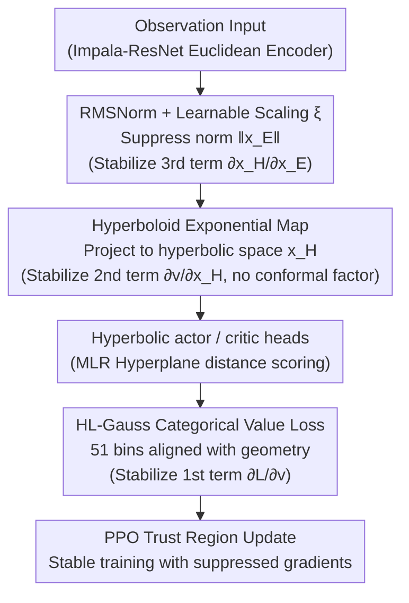

# Understanding and Improving Hyperbolic Deep Reinforcement Learning

**Conference**: ICLR 2026  
**arXiv**: [2512.14202](https://arxiv.org/abs/2512.14202)  
**Code**: [GitHub](https://github.com/Probabilistic-and-Interactive-ML/hyper-rl)  
**Area**: Reinforcement Learning  
**Keywords**: hyperbolic geometry, PPO, gradient analysis, RMSNorm, categorical value loss

## TL;DR
Through closed-form gradient analysis, this work reveals the root causes of PPO trust region failure in hyperbolic deep RL: conformal factor explosion and large-norm embeddings. A four-component solution, Hyper++ (RMSNorm + learnable scaling + HL-Gauss + Hyperboloid), is proposed, comprehensively outperforming previous baselines across 16 ProcGen environments and Atari-5.

## Background & Motivation

**Background**: Sequential decision-making processes naturally generate hierarchical data—each state branches into exponentially many subsequent states, forming a tree-like structure. The volume of Euclidean space grows only polynomially ($V_d(r) \propto r^d$), causing a fundamental geometric mismatch with the exponential growth of hierarchical structures. Hyperbolic space, characterized by exponential volume growth, has achieved success in classification, metric learning, and image-text alignment.

**Limitations of Prior Work**: Hyperbolic deep RL faces severe optimization difficulties. While Cetin et al. (2023) first introduced hyperbolic geometry to RL, training remains unstable, relying on SpectralNorm + S-RYM ($\mathbf{x}_E \mapsto \mathbf{x}_E / \sqrt{d}$) for mitigation, which restricts the expressive power of the entire encoder.

**Key Challenge**: The fundamental conflict between the geometric advantages of hyperbolic space (low-distortion hierarchical embeddings) and training stability (conformal factor explosion and ill-conditioned gradients).

**Goal**: 1) Formally analyze the sources of gradient pathology in hyperbolic PPO; 2) Design a hyperbolic RL agent that ensures both stability and expressivity.

**Key Insight**: Starting from closed-form gradient derivations of two hyperbolic models (Poincaré Ball and Hyperboloid), the sources of instability are located, followed by the design of corresponding components.

**Core Idea**: Large-norm embeddings are the root cause of hyperbolic PPO collapse. This can be resolved by using RMSNorm to constrain norms, adopting the Hyperboloid model to avoid conformal factors, and applying categorical loss to align with the geometry.

## Method

### Overall Architecture

This paper addresses the long-standing problem where hyperbolic deep RL is "geometrically superior for hierarchical data yet unstable to train." Instead of stacking empirical stabilization tricks, the authors decompose hyperbolic PPO gradients using the chain rule. Equation (3) expresses the gradient of the value function with respect to the encoder embedding as a product of three terms, $\frac{\partial L}{\partial v} \cdot \frac{\partial v}{\partial \mathbf{x}_H} \cdot \frac{\partial \mathbf{x}_H}{\partial \mathbf{x}_E}$. Each term is analyzed for potential explosion, and **one specific component is designed for each term** to suppress it.

Hyper++ utilizes a hybrid Euclidean-hyperbolic architecture (Impala-ResNet backbone): a shared Euclidean encoder at the bottom with hyperbolic actor/critic heads on top. Modifications are concentrated on the forward chain "last layer of Euclidean encoder → hyperbolic layer → value loss." Data sequentially passes through RMSNorm + learnable scaling (to suppress embedding norms) → Hyperboloid exponential map (to project into hyperbolic space) → Hyperbolic MLR actor/critic heads (hyperplane distance scoring) → HL-Gauss categorical value loss. The three key designs suppress the third, second, and first terms of the chain rule, respectively.

### Key Designs

**1. RMSNorm + Learnable Scaling: Constraining Euclidean embedding norms while recovering hyperbolic capacity**

The rightmost term of the chain rule, $\frac{\partial \mathbf{x}_H}{\partial \mathbf{x}_E}$, originates from the hyperbolic exponential map. When the Euclidean embedding norm $\|\mathbf{x}_E\|$ is too large, it amplifies gradients to the point of explosion. Prior work (Cetin et al.) used SpectralNorm to constrain the norm, but Lemma 4.1 indicates it must be applied to **all layers** of the encoder to effectively bound the output norm, which locks the Lipschitz constant and expressivity of the entire encoder. Instead, RMSNorm is applied only to the pre-activation output of the last linear layer with $1/\sqrt{d}$ scaling. Proposition 4.2 proves that if the subsequent activation is 1-Lipschitz (e.g., ReLU/TanH), $\|\hat{\mathbf{x}}\|_2 < 1$ holds, bounding the conformal factor below $\lambda < 2\cosh^2(\sqrt{c})$ while maintaining the degrees of freedom in previous layers.

However, this constraint shrinks the usable radius of the Poincaré Ball (to 0.76 when $c=1$), causing embeddings to cluster near the origin and reducing usable volume. A learnable scalar $\xi_\theta$ is introduced to rescale the embeddings:

$$\hat{\mathbf{x}}_E^{\text{rescale}} = \rho_{\max} \cdot \sigma(\xi_\theta) \cdot \hat{\mathbf{x}}_E, \quad \rho_{\max} = \operatorname{atanh}(\alpha)/\sqrt{c},\ \alpha=0.95$$

$\sigma(\cdot)$ limits the scale within a safe upper bound $\rho_{\max}$, allowing the network to learn the required radius. Since hyperbolic volume grows exponentially with radius ($\propto r^d$), increasing the radius from 0.76 to 0.95 yields a $(0.95/0.76)^{32} \approx 1200\times$ volume gain at $d=32$. Normalization provides stability, while scaling provide capacity; both are essential.

**2. Hyperboloid Model: Opting for a hyperbolic model without conformal factors**

The instability in the middle term $\frac{\partial v}{\partial \mathbf{x}_H}$ stems from the hyperbolic model itself. In the Poincaré Ball, the Multinomial Logistic Regression (MLR) output gradient is proportional to $(1-c\|\mathbf{x}_H\|^2)^{-2}$. If embeddings approach the ball boundary, this term explodes—the "conformal factor explosion" observed in failing hyperbolic PPO runs. The authors switch to the Hyperboloid model, where the value output formula $v^{\text{HB}}$ does not contain $(1-c\|\mathbf{x}\|^2)^{-1}$ terms, making it naturally robust to large-norm embeddings. Corollary 4.3 uses the isometry between the Poincaré Ball and the Hyperboloid to transfer the norm constraints from design 1, ensuring the time component $x_0^{\max}$ remains bounded.

**3. HL-Gauss Categorical Value Loss: Aligning classification with "distance scoring" geometry**

The instability in the leftmost term $\frac{\partial L}{\partial v}$ arises from a mismatch between the loss function and the geometry. Euclidean linear layers naturally fit MSE regression, but hyperbolic MLR layers output scores based on "distance to hyperplanes," which is classification-oriented. Using MSE to fit continuous returns is geometrically misaligned, leading to noisy critic gradients under non-stationary actor-critic targets. The authors adopt HL-Gauss, discretizing continuous returns into 51 bins to treat value learning as a classification task. This aligns the target form with the hyperplane distance outputs. This synergy is unique to hyperbolic geometry: ablations show that Euclidean + HL-Gauss is actually inferior to Euclidean + MSE, proving categorical loss is effective specifically when paired with hyperbolic geometry.

### Loss & Training

The PPO clipped surrogate objective remains unchanged. The critic utilizes HL-Gauss loss (51 bins, range $[-10, 10]$). TanH is used instead of ReLU as the final activation to satisfy the 1-Lipschitz condition required by Proposition 4.2. The same RMSNorm + scaling regularization is applied to the Hyperboloid training following Corollary 4.3.

## Key Experimental Results

### Main Results — ProcGen (PPO, 16 environments, 25M steps, 6 seeds)

| Metric | Hyper++ | Hyper+S-RYM | Euclidean | Hyper(Unregularized) |
|------|---------|-------------|-----------|-------------|
| Test IQM ↑ | **0.41** | 0.27 | 0.26 | 0.19 |
| Train IQM ↑ | **0.55** | 0.46 | 0.45 | 0.37 |
| Forward Pass | 14.7ms | 19.3ms | 14ms | — |
| NameThisGame Duration | 35h25m | 58h21m | 17h52m | — |

### Ablation Study (ProcGen Test IQM, 6 seeds + bootstrap CI)

| Config | Test IQM | Description |
|------|---------|------|
| Hyper++ (Full) | **0.40** | Baseline |
| −RMSNorm | 0.00 | Training failed, norm explosion |
| −Scaling | 0.33 | Insufficient usable volume |
| +MSE (replacing HL-Gauss) | 0.33 | Geometric mismatch |
| +C51 | 0.27 | Distributional loss inferior to HL-Gauss |
| +Poincaré (replacing Hyperboloid) | 0.34 | Slight conformal factor impact |
| +SN Full / +SN Penult. | 0.00 / 0.00 | SpectralNorm failed in both cases |
| Euclidean + full regularization | 0.35 | Competitive but inferior to Hyperbolic |

### Key Findings
- Hyper++ is equally effective on PPG (a stronger baseline): PPG IQM 0.52 vs Hyper+S-RYM 0.34 vs Euclidean 0.47.
- Atari-5 (DDQN, 10M steps): Hyper++ is optimal across all 5 games in terms of IQM/median/mean/optimality gap.
- Euclidean + HL-Gauss performs worse than Euclidean + MSE → categorical loss requires hyperbolic geometry to be effective.
- Every ablation perform worse than the full Hyper++, demonstrating synergy between components.

## Highlights & Insights
- **Gradient-Driven Design**: Rather than empirical trials, the work derives closed-form expressions for $\partial v / \partial \mathbf{x}_H$ and $\partial \mathbf{x}_H / \partial \mathbf{x}_E$, identifies $(1-c\|\mathbf{x}\|^2)^{-2}$ as the culprit, and targets it with RMSNorm.
- **Unified Theoretical Result**: Proposition 4.2 simultaneously ensures bounded embedding norms, bounded conformal factors, and gradient stability.
- **Clear Component Roles**: Categorical loss stabilizes $\partial L / \partial v$, Hyperboloid stabilizes $\partial v / \partial \mathbf{x}_H$, and RMSNorm+scaling stabilizes $\partial \mathbf{x}_H / \partial \mathbf{x}_E$—addressing every term in the chain rule of Equation (3).
- **Performance-Efficiency Win**: Achieves a 52% return improvement while reducing forward pass time by ~30% (by removing SpectralNorm power iterations).

## Limitations & Future Work
- Focuses on optimization perspective without analyzing the specific hierarchical structures learned by hyperbolic representations.
- Does not investigate which environments are best suited for hyperbolic representation (i.e., which MDP state spaces are more "tree-like").
- Interaction between geometric choices (curvature $c$, dimension $d$) and different RL algorithm designs remains unexplored.
- On ProcGen Phoenix, Hyper++ experiences plasticity loss, performing similarly to baselines.

## Related Work & Insights
- **vs Cetin et al. (2023) Hyper+S-RYM**: Eliminates the stability-expressivity trade-off of SpectralNorm, improving test IQM from 0.27 → 0.41.
- **vs Farebrother et al. (2024) HL-Gauss**: While they found HL-Gauss inconsistent in Euclidean RL, this work reveals its unique synergy with hyperbolic geometry.
- **vs Mishne et al. (2023) Hyperbolic Numerical Stability**: While they analyzed general hyperbolic network stability, this work extends analysis to actor-critic training in RL.

## Rating
- Novelty: ⭐⭐⭐⭐ Gradient-analysis driven fix for hyperbolic RL, tightly coupling theory and practice.
- Experimental Thoroughness: ⭐⭐⭐⭐⭐ 16 ProcGen environments + Atari-5 + PPO/PPG/DDQN algorithms + extensive ablations.
- Writing Quality: ⭐⭐⭐⭐⭐ Rigorous theoretical derivation with clear correspondence between equations, components, and experiments.
- Value: ⭐⭐⭐⭐ Provides the first reliable practical recipe for hyperbolic deep RL.

<!-- RELATED:START -->

## Related Papers

- [\[ICLR 2026\] CUDA-L1: Improving CUDA Optimization via Contrastive Reinforcement Learning](cuda-l1_improving_cuda_optimization_via_contrastive_reinforcement_learning.md)
- [\[ICLR 2026\] Self-Improving Skill Learning for Robust Skill-based Meta-Reinforcement Learning](self-improving_skill_learning_for_robust_skill-based_meta-reinforcement_learning.md)
- [\[ICLR 2026\] Mastering Sparse CUDA Generation through Pretrained Models and Deep Reinforcement Learning](mastering_sparse_cuda_generation_through_pretrained_models_and_deep_reinforcemen.md)
- [\[ICLR 2026\] Robust Deep Reinforcement Learning against Adversarial Behavior Manipulation](robust_deep_reinforcement_learning_against_adversarial_behavior_manipulation.md)
- [\[ICLR 2026\] XQC: Well-Conditioned Optimization Accelerates Deep Reinforcement Learning](xqc_well-conditioned_optimization_accelerates_deep_reinforcement_learning.md)

<!-- RELATED:END -->
## Related Papers

- [\[ICLR 2026\] CUDA-L1: Improving CUDA Optimization via Contrastive Reinforcement Learning](cuda-l1_improving_cuda_optimization_via_contrastive_reinforcement_learning.md)
- [\[ICLR 2026\] Self-Improving Skill Learning for Robust Skill-based Meta-Reinforcement Learning](self-improving_skill_learning_for_robust_skill-based_meta-reinforcement_learning.md)
- [\[ICLR 2026\] Mastering Sparse CUDA Generation through Pretrained Models and Deep Reinforcement Learning](mastering_sparse_cuda_generation_through_pretrained_models_and_deep_reinforcemen.md)
- [\[ICLR 2026\] Robust Deep Reinforcement Learning against Adversarial Behavior Manipulation](robust_deep_reinforcement_learning_against_adversarial_behavior_manipulation.md)
- [\[ICLR 2026\] XQC: Well-Conditioned Optimization Accelerates Deep Reinforcement Learning](xqc_well-conditioned_optimization_accelerates_deep_reinforcement_learning.md)

<!-- RELATED:END -->
