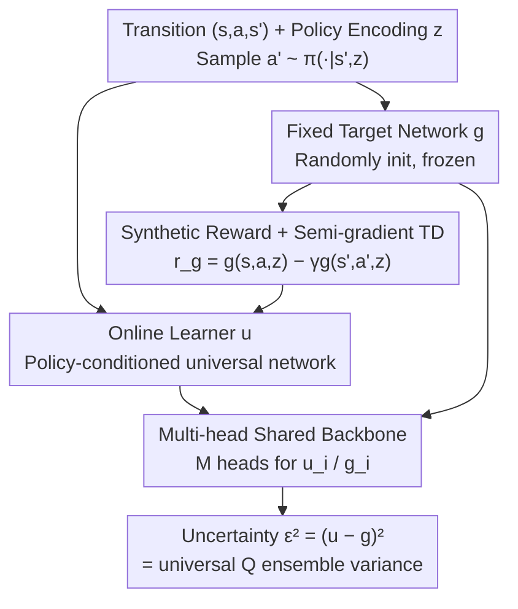

# Universal Value-Function Uncertainties

**Conference**: ICLR 2026  
**OpenReview**: [https://openreview.net/forum?id=NeAzH9u2jh](https://openreview.net/forum?id=NeAzH9u2jh)  
**Code**: https://github.com/anyboby/universal-value-function-uncertainties  
**Area**: Reinforcement Learning  
**Keywords**: Epistemic uncertainty, value function, Random Network Distillation (RND), Neural Tangent Kernel (NTK), Offline RL  

## TL;DR
This paper proposes UVU (Universal Value-Function Uncertainties), which measures the epistemic uncertainty of a value function using the prediction error between an online network and a fixed random target network. The key innovation is that the online network does not directly regress the target output (which would yield "myopic" RND-style uncertainty); instead, it performs TD learning using synthetic rewards generated by the target network. This allows the prediction error to automatically accumulate "uncertainty over future trajectories." Theoretically, in the infinite-width limit, this error is strictly equal to the variance of a universal Q-function ensemble. Experimentally, it achieves the performance of large ensembles with a single model in offline multi-task rejection scenarios while significantly reducing computational cost.

## Background & Motivation
**Background**: In reinforcement learning, epistemic uncertainty (the "unknown" resulting from insufficient data) of the value function $Q^\pi(s,a)$ is central to efficient exploration, safe decision-making, and offline RL. The most reliable current practice is **Deep Ensembles**: training multiple independently initialized Q-networks and using the variance between them $\sigma_q^2(s,a)=\mathbb{V}_{\theta_0}[Q(s,a,\theta_t)]$ as the uncertainty, which empirically correlates highly with true estimation error.

**Limitations of Prior Work**: Ensembles require training $K$ networks, causing compute and memory to scale linearly with $K$, making them difficult to scale for large models. Single-model methods (RND, pseudo-counts, intrinsic curiosity) are computationally friendly but measure **myopic uncertainty**—identifying whether the current state/action has been "seen" without considering the unknown encountered downstream along a policy. Transforming myopic uncertainty into value uncertainty requires additional "trajectory propagation" mechanisms (e.g., Bellman-style recursive bounds on Bayesian posteriors), which are often heuristic, lack rigorous theory, and tend to underestimate bounds under function approximation.

**Key Challenge**: Reliable value uncertainty (ensembles) is expensive, while cheap single-model methods (RND) only provide myopic uncertainty, require extra propagation, and have weak theoretical foundations. **The goal is to achieve the low cost of a single model while directly obtaining policy-dependent, long-term value uncertainty with solid theoretical guarantees**—a combination not previously satisfied.

**Key Insight**: The authors observe that the RND mechanism (an online network approximating a fixed random network) is elegant, but its failure lies in using **direct regression**, making the error reflect only single-point data coverage. By changing the training objective from "regressing $g$'s output" to "TD learning with synthetic rewards derived from $g$," the online network must encounter sufficient data along the trajectory to recover $g$. Consequently, future data gaps manifest as prediction errors.

**Core Idea**: Use a target network $g$ to generate a synthetic reward $r_g$ (such that $g$ is exactly the value function for this reward) and let an online network $u$ recover $g$ via TD learning. The resulting discrepancy $(u-g)^2$ constitutes the policy-dependent value uncertainty.

## Method

### Overall Architecture
UVU operates with two neural networks of identical structure: a **fixed, randomly initialized target network** $g(s,a,z;\psi_0)$ (weights $\psi_0$ frozen throughout training) and an **online learner** $u(s,a,z;\vartheta_t)$. Both receive state $s$, action $a$, and a **policy encoding $z$** (specifying which policy $\pi(\cdot|s,z)$ is currently being evaluated, similar to goal/task encodings in UVFA).

The pipeline is: given a transition $(s,a,s')$ and policy encoding $z$, sample the next action $a'$ according to $\pi(\cdot|s',z)$. Use the fixed $g$ to calculate the **synthetic reward** $r_g^z(s,a,s',a') = g(s,a,z;\psi_0) - \gamma\, g(s',a',z;\psi_0)$. The online network $u$ fits this reward via **semi-gradient TD learning**. Finally, at any query point $(s,a,z)$, the squared difference $\epsilon^2=(u-g)^2$ serves as the value uncertainty for that policy. Intuitively: $g$ is by construction the solution to $r_g$. If data sufficiently covers the dynamics induced by $\pi$, $u$ recovers $g$ precisely (zero error); if the policy deviates from data (trajectory "truncated"), TD updates cannot uniquely determine $g$, and $u$ remains near initialization, creating a gap representing uncertainty.

### Key Designs

**1. Synthetic Reward + Semi-gradient TD: Converting "Myopic Error" to "Value Uncertainty"**

This is the fundamental departure from RND. RND minimizes a regression loss $\frac12(u(X)-g(X))^2$, reflecting only whether a point is in the training set. UVU defines $g$ to generate a synthetic reward:
$$r_g^z(s,a,s',a') = g(s,a,z;\psi_0) - \gamma\, g(s',a',z;\psi_0),$$
and the online network $u$ minimizes the semi-gradient TD loss:
$$\mathcal{L}(\vartheta_t)=\frac{1}{2N_D}\sum_i\Big(\gamma\,[u(s'_i,a'_i,z_i;\vartheta_t)]_{sg}+r_g^z(s_i,a_i,s'_i,a'_i)-u(s_i,a_i,z_i;\vartheta_t)\Big)^2,$$
where $[\cdot]_{sg}$ is the stop-gradient. By substituting $r_g$ back into the Bellman equation, $g$ itself is the zero-loss solution. "Recovering $g$" thus becomes a value learning problem—$u$ must bootstrap rewards along the trajectory. When $\pi(\cdot|s,z)$ selects an action not present in the data, the trajectory is effectively truncated, and the TD update fails to recover $g$. This failure captures long-term data gaps as policy-dependent uncertainty.

**2. Policy-Conditioned Universal Uncertainty Network: One Model for Any Policy**

Value uncertainty depends on the policy because the trajectory determines which unknowns are encountered. Borrowing from UVFA (Universal Value Function Approximator), UVU feeds the policy encoding $z$ as an additional input to $u$ and $g$, i.e., $u,g:\mathcal{S}\times\mathcal{A}\times\mathcal{Z}\to\mathbb{R}$. This allows the model to output $\epsilon(s,a,z)^2$ for **any policy encoded by $z$**. Experiments on Chain MDPs show that the uncertainty surface accurately reflects various policies (e.g., higher uncertainty for policies likely to choose unexplored actions), aligning closely with 128-head ensembles.

**3. Multi-head Shared Backbone: Distributional Equivalence to Ensembles**

To ensure stable variance estimation at low cost, UVU implements $u$ and $g$ with a **shared backbone and $M$ independent output heads** $u_i, g_i$. Uncertainty is the mean squared error across heads $\frac12\bar\epsilon^2=\frac{1}{2M}\sum_{i=1}^M\epsilon_i^2$. Theoretically (Corollary 2), this single-model estimator is distributionally identical to the **sample variance** of $M+1$ independently trained universal Q-functions. Furthermore, in the infinite-width limit using NTK theory, it is proven (Theorem 1):
$$\mathbb{E}_{\vartheta_0,\psi_0}\!\Big[\tfrac12\epsilon(x,\vartheta_\infty,\psi_0)^2\Big]=\mathbb{V}_{\theta_0}\big[Q(x,\theta_\infty)\big],$$
meaning the expected error of UVU is exactly equal to the ensemble variance of universal Q-functions.

### Loss & Training
The online network $u$ is trained solely via the semi-gradient TD loss using frozen $g$. Theoretical analysis under the NTK framework (infinite width + gradient flow) provides the closed-form convergence solution:
$$f(x,\theta_\infty)=f(x,\theta_0)-\Theta_{xX}(\Theta_{XX}-\gamma\Theta_{X'X})^{-1}\big(f(X,\theta_0)-(\gamma f(X',\theta_0)+r)\big),$$
where $\Theta$ is the NTK.

## Key Experimental Results

### Main Results
The environment is a multi-task GoToDoor variant of Minigrid: agents navigate to a door color defined by $z$ using data from a "expert but systematically failing" policy. The protocol is **Task Rejection**: agents can reject tasks at the start; performance is measured by the return on non-rejected tasks. Success requires identifying "data/policy mismatch" via uncertainty.

| Grid Size | DQN | BDQNP(3) | BDQNP(15) | BDQNP(35) | DQN-RND | DQN-RND-P | UVU (Ours) |
|--------|------|----------|-----------|-----------|---------|-----------|-----------|
| 5 | 5.50 | 8.69 | 10.50 | 10.58 | 3.94 | 10.41 | **10.54** |
| 6 | 4.93 | 7.66 | 9.39 | 9.57 | 1.99 | 9.28 | **9.54** |
| 7 | 4.58 | 6.61 | 8.49 | 8.75 | 2.66 | 8.12 | **8.73** |
| 8 | 4.06 | 5.91 | 7.68 | 7.92 | 2.53 | 7.40 | **8.03** |
| 9 | 3.66 | 5.04 | 6.69 | 7.03 | 2.39 | 6.39 | **7.29** |
| 10 | 3.39 | 4.64 | 6.09 | 6.53 | 2.25 | 5.64 | **6.72** |

UVU, a **single model**, matches or exceeds the performance of a large ensemble (BDQNP(35)) while maintaining a computational cost close to a single DQN. Standard RND (myopic) performs worse than random rejection, confirming that myopic signals are insufficient for this task.

### Ablation Study

| Configuration | Key Observation |
|------|---------|
| Width 64→2048 | Performance scales similarly to DQN/BDQNP; finite width is sufficient for valid uncertainty. |
| UVU vs BDQNP(1-35) | Single-model UVU ≈ high-head ensembles, validating Corollary 2. |
| Runtime | UVU cost ≈ single model; ensembles scale linearly with size. |

### Key Findings
- **TD Learning (Design 1) is essential**: Direct regression (DQN-RND) fails the protocol, while TD learning with synthetic rewards elevates the model to ensemble levels.
- **Finite width does not break the theory**: UVU scales smoothly with width, indicating that NTK insights transfer to practical networks.
- **Robustness in hard tasks**: UVU's advantage over ensembles increases as grid size (and data gap severity) grows.

## Highlights & Insights
- **"Self-generated Rewards" is an elegant mechanism**: By using $g$ as both target and reward source, "failure to recover $g$" becomes equivalent to "insufficient data for value learning."
- **Rigorous theoretical grounding**: Unlike heuristic single-model methods, UVU provides an exact proof of equivalence to ensemble variance in the NTK limit.
- **Transferable design pattern**: The synthetic reward + TD approach can be applied to online exploration (intrinsic rewards) or safe RL (action rejection).

## Limitations & Future Work
- **NTK Assumptions**: The theory relies on infinite width and gradient flow; while finite-width results are robust, the gap requires further closing.
- **Representation Learning**: NTK analysis does not cover feature learning. Combining UVU with self-predictive auxiliary losses is a promising direction.
- **Policy Generation**: UVU evaluates given policies but does not generate them. Integration with unsupervised RL for policy discovery is a logical next step.
- **Evaluation Domain**: Testing is limited to grid-world environments; performance in continuous control or pixel-based domains remains to be verified.

## Related Work & Insights
- **vs RND**: Both use prediction error, but RND is limited to myopic, single-point signals. UVU targets trajectory-aware value uncertainty via TD learning without needing a separate value model.
- **vs Deep Ensembles / BDQNP**: UVU achieves the reliability of 35-head ensembles at single-model costs.
- **vs Uncertainty Propagation**: Methods that recursively propagate myopic uncertainty often suffer from loose bounds; UVU provides an end-to-end single-model solution with closed-form theoretical support.

## Rating
- Novelty: ⭐⭐⭐⭐⭐ Transforming RND via TD learning into policy-conditioned value uncertainty is a novel and elegant approach.
- Experimental Thoroughness: ⭐⭐⭐⭐ Strong protocols and baselines, though focused on grid environments.
- Writing Quality: ⭐⭐⭐⭐⭐ Excellent progression from intuition to rigorous NTK derivations.
- Value: ⭐⭐⭐⭐⭐ Provides a theoretically grounded, efficient alternative to ensembles for exploration and offline RL.

<!-- RELATED:START -->

## Related Papers

- [\[ICLR 2026\] Replicable Reinforcement Learning with Linear Function Approximation](replicable_reinforcement_learning_with_linear_function_approximation.md)
- [\[ICLR 2026\] Value Flows](value_flows.md)
- [\[ICLR 2026\] transitive rl value learning via divide and conquer](transitive_rl_value_learning_via_divide_and_conquer.md)
- [\[ICLR 2026\] Relative Value Learning](relative_value_learning.md)
- [\[ICLR 2026\] Is Pure Exploitation Sufficient in Exogenous MDPs with Linear Function Approximation?](is_pure_exploitation_sufficient_in_exogenous_mdps_with_linear_function_approxima.md)

<!-- RELATED:END -->
