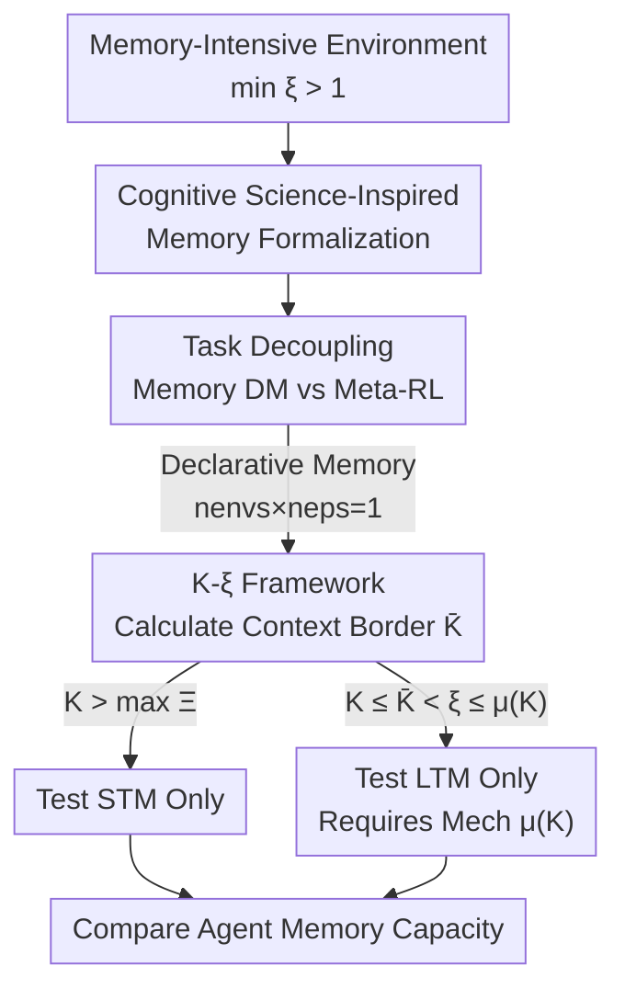

# Deconstructing Memory in Reinforcement Learning Agents: A Taxonomy and Evaluation Methodology

**Conference**: ICLR 2026  
**OpenReview**: [https://openreview.net/forum?id=lJKdOYFF5W](https://openreview.net/forum?id=lJKdOYFF5W)  
**Code**: None  
**Area**: Reinforcement Learning  
**Keywords**: Agent Memory, Long-term/Short-term Memory, POMDP, Evaluation Methodology, Relational Horizon  

## TL;DR
This paper does not propose a new model but provides a formal definition and evaluation methodology for the overused term "memory" in reinforcement learning. By using the relational horizon $\xi$ and the agent's context length $K$ to strictly distinguish between short-term memory (STM) and long-term memory (LTM), it introduces an actionable experimental configuration algorithm. It empirically demonstrates that failing to follow this methodology leads to severely distorted evaluation conclusions.

## Background & Motivation
**Background**: In Partially Observable Markov Decision Process (POMDP) tasks, agents must rely on "memory" to process interaction histories. Extensive work attributes memory capabilities to architectural features such as recurrent networks or attention, with a continuous emergence of benchmarks and "memory-augmented agents."

**Limitations of Prior Work**: The term "memory" lacks a unified definition in RL literature. It has been defined variously as the ability to process dependencies within a fixed context (e.g., Transformer context window), the ability to utilize information outside the context, or even the ability to adapt to new environments (Meta-RL). These disparate meanings lead to vague or misleading assertions, such as "an agent possesses long-term memory."

**Key Challenge**: The direct consequence of the lack of definition is uncontrolled evaluation. An agent might "appear" to possess LTM simply because the task configuration allows shortcuts or because events happen to fall within a short-term context. Without isolating memory effects, empirical evaluations often conflate different memory mechanisms and fail to detect the true limits of architectures, hindering fair and reproducible comparisons.

**Goal**: To formalize the concept of memory in RL by breaking it down into two measurable sub-problems: (1) borrowing concepts like "short-term/long-term" and "declarative/procedural" from cognitive science and providing precise definitions within an RL framework; (2) designing experiments to isolate and evaluate these memory types.

**Key Insight**: Memory is viewed as an intrinsic property of a memory-augmented agent, where memory classification is tied directly to the agent's internal mechanisms and the temporal structure of the task. The key observation is that memory is relative: the same event may be "short-term" for an agent with context length $K$ but "long-term" for another with a shorter context. Thus, both the agent parameter $K$ and the environment parameter $\xi$ must be characterized simultaneously.

**Core Idea**: Use a single computable criterion—whether the relational horizon $\xi$ exceeds the context length $K$—to define STM and LTM, and provide an experimental configuration algorithm that ensures only the target memory type is tested.

## Method

### Overall Architecture
The output of this paper is a "taxonomy + evaluation" methodology rather than a network architecture. The logic progresses in four steps: formalizing memory concepts from cognitive science; decoupling POMDP tasks requiring memory into Memory DM (decision-making memory within a single environment episode) and Meta-RL (skill transfer across tasks); defining the boundaries of STM and LTM within the Memory DM framework using the relationship between relational horizon $\xi$ and context length $K$; and finally, implementing this definition into an experimental configuration algorithm (Algorithm 1) to demonstrate the misjudgments caused by its violation.

The diagram below illustrates the evaluation workflow of Algorithm 1—how to step-by-step configure experiments to "test only STM" or "test only LTM" given a memory-intensive environment.

### Key Designs

**1. Formalizing Memory Types: Turning Vague Concepts into Decidable Definitions**

Addressing the pain point of missing definitions, the authors translate several concepts from neuroscience—short-term/long-term, declarative/procedural—into measurable RL criteria. Declarative memory refers to the agent transferring knowledge (e.g., object locations, facts) within a single environment and episode, while procedural memory refers to reusing skills (policies) across multiple environments or episodes. The criteria are defined based on the number of training environments $n_{envs}$ and episodes per environment $n_{eps}$:

$$\text{Declarative Memory} \iff n_{envs} \times n_{eps} = 1, \qquad \text{Procedural Memory} \iff n_{envs} \times n_{eps} > 1.$$

This transforms a semantic issue based on intuition into a mechanical determination based solely on task configuration.

**2. Decoupling Memory DM and Meta-RL: Distinguishing Behavioral Roles**

Many works evaluate "long-term memory" in MDP-based Meta-RL settings without isolating "decision-making from past information" from "cross-task adaptation." The authors define the agent context length $K$ as the maximum steps of history triplets $(o, a, r)$ processed at time $t$. Memory DM is a class of POMDP where the policy $\pi^*(a_t \mid o_t, h_{0:t-1})$ makes decisions within a single environment based on current observations and history, corresponding to declarative memory. Meta-RL involves learning to learn or memorizing common structures across tasks to adapt quickly, corresponding to procedural memory. Meta-RL tasks are further split into "green" (internal loop requires memory, treated as Memory DM) and "blue" (internal loop is an MDP, memory only required in the external loop). This paper focuses on Memory DM because STM/LTM discussions are meaningful only when decision-making memory is decoupled from skill transfer.

**3. K-ξ Framework and Context Memory Border: Defining STM vs. LTM with a Single Number**

This is the core operational design. The authors introduce the relational horizon $\xi = t_r - t_e - \Delta t + 1$, representing the minimum time delay between an event $\alpha^{\Delta t}_{t_e}$ that supports a decision and the moment it is recalled $\beta_{t_r}$. This leads to a clean criterion: when $\xi \le K$, the event falls within the context (STM); when $\xi > K$, it falls outside (LTM). An environment is a memory-intensive environment $\tilde{M}_P$ if and only if $\min_n \xi_n > 1$ for all event-recall pairs.

Based on this, the context memory border is defined as $\bar K = \min_n \Xi - 1$. When $K \le \bar K$, no relational horizon falls within the agent's history, thus the environment only verifies LTM. The complete partition is: $K \in [1, \bar K]$ tests only LTM; $K \in (\bar K, \max_n \Xi)$ tests both (LTM cannot be cleanly estimated); $K \in [\max_n \Xi, \infty)$ tests only STM. To solve LTM, an agent requires a memory mechanism $\mu(K) = K_{eff} \ge K$ (e.g., RNN hidden state recurrence) to expand the effective context $K_{eff}$, such that $\tilde{M}_P: \bar K \le K < \xi \le K_{eff} = \mu(K)$.

**4. Algorithm 1 Evaluation Protocol: Exposing Pitfalls of Naive Evaluation**

The authors standardize the configuration process into Algorithm 1: ① Estimate the number of event-recall pairs $n$; ② Calculate $\xi_i$ for each pair and find $\bar K = \min_n \Xi - 1$; ③ Set $K > \bar K$ for STM or $\bar K \le K \le K_{eff} = \mu(K)$ for LTM; ④ Analyze results. This protocol reveals that if $\xi$ relative to $K$ is not controlled (e.g., using tasks with variable $\xi$), STM effects may mask LTM deficiencies, making an agent without LTM "appear" proficient.

### Example: Testing Memory on Passive T-Maze
In Passive T-Maze, the agent sees a cue at the start and must turn correctly at a junction after an episode length $T = L+1$. Per Algorithm 1: ① $n=1$, so it can test both; ② $\Delta t = 0$, so $\xi = T$ and $\bar K = T-1$; ③ Adjusting $T$ or $K$ allows for isolated testing. While $K = \bar K$ is sufficient, choosing a smaller $K$ more clearly exposes the memory mechanism's role.

## Key Experimental Results

The authors evaluate DTQN, DQN-GPT-2, and SAC-GPT-2 (attention memory) online, and DT and BC-LSTM (attention vs. recurrent) offline. Tasks include Passive T-Maze, Minigrid-Memory, POPGym-Autoencode, and POPGym-RepeatPrevious.

### Main Results: Memory is Relative ($K$-$\xi$ Framework)

| Configuration | Phenomena | Conclusion |
|--------|------|------|
| $\xi \le K$ (STM) | DTQN / DQN-GPT-2 perform well | Event is in context; solvable by STM |
| $\xi > K$ (LTM) | Performance drops sharply | Long-range dependence requires explicit memory mechanisms |
| Same Agent, Different Tasks | Same agent exhibits both STM and LTM | Memory is not an isolated attribute but determined by $K$ and $\xi$ |

### Relational Horizons of Common Tasks (Table 2, Excerpt)

| Task | $\Xi$ | $\xi$ | LTM when $K <$ |
|------|-------|-------|----------------|
| Passive T-Maze | $\{L+1\}$ | $L+1$ | $L+1$ |
| Minigrid-Memory (Fixed) | $\{L+1\}$ | $L+1$ | $L+1$ |
| Minigrid-Memory (Variable) | $[7, L+1]$ | $7$ | $7$ |
| Memory Maze 15×15 | $[45, 4000]$ | $45$ | $45$ |
| POPGym-Autoencode | $[2, 104]$ | $2$ | $2$ |
| POPGym-RepeatPrevious | $\{5\}$ | $5$ | $5$ |

### Ablation Study

| Configuration | Key Phenomena | Explanation |
|------|---------|------|
| SAC-GPT-2, Minigrid-Memory, Variable $L$ | Success rates high for both STM/LTM | Mixed horizons mask memory flaws |
| SAC-GPT-2, Minigrid-Memory, Fixed $L=21, K=14$ | LTM fails | Fixed $\xi > K$ exposes true LTM limits |
| DT, T-Maze Validation Length $>90$ | Fails | Fixed attention window = STM, cannot extrapolate |
| BC-LSTM, T-Maze Long Sequences | Generalizes well | Recurrent hidden state = true LTM |
| Training Length 300 / 600 / 900 | DT stays 100%, BC-LSTM drops to 0.87 | Long training lengths may hide the advantage of LTM by appearing as STM |

### Key Findings
- **Relativity of memory is the core conclusion**: High performance when $\xi \le K$ vs. failure when $\xi > K$ proves that memory depends on both temporal distance and agent design.
- **Mixed horizons are deceptive**: In tasks with variable $\xi$, STM effects overshadow LTM defects. Only fixing $\xi > K$ reveals the real limits.
- **Architectural differences are exposed**: DT's fixed window is essentially STM, failing as soon as $L$ exceeds context. BC-LSTM's recurrent state is true LTM, allowing extrapolation.

## Highlights & Insights
- **Unified terminology via computable metrics**: Comparing $\xi$ with $K$ turns "short/long-term" from adjectives into criteria.
- **Impactful insight on relativity**: An agent can exhibit STM or LTM depending on the configuration, suggesting previous "LTM" claims often lacked necessary context.
- **Transferable diagnostic protocol**: Algorithm 1 is model-agnostic and helps benchmark designers fix $\xi$ to avoid confounding effects.
- **Reducing LTM verification to mechanism $\mu(K)$**: LTM capability is precisely the mechanism that establishes correlations outside the context window.

## Limitations & Future Work
- **Coverage of declarative memory only**: The paper focuses on Memory DM; procedural memory and Meta-RL external loops lack corresponding empirical protocols.
- **Dependency on calculable $\xi$**: Relational horizons require explicit event-recall structures; in real-world tasks with fuzzy event boundaries, estimating $\bar K$ is difficult.
- **Focus on evaluation over performance**: The contribution is architectural rigor rather than state-of-the-art performance.
- **Classic baselines**: Evaluation focuses on DTQN/GPT-2/DT/LSTM, excluding recent external storage or State Space Models (SSMs).

## Related Work & Insights
- **vs. Ni et al. (2023)**: They distinguish memory from credit assignment; this paper treats both as "establishing temporal dependence" and provides measurable criteria.
- **vs. Yue et al. (2024)**: They use dependency pairs $(p, q)$ for imitation learning; this paper provides a broader taxonomy and theoretical treatment for RL.
- **vs. Benchmarks (POPGym, etc.)**: Previous benchmarks suffer from inconsistent terminology. This paper doesn't create new environments but provides $\Xi$, $\xi$, and $\bar K$ for existing ones.

## Rating
- Novelty: ⭐⭐⭐⭐ Formalizes overused concepts into decidable criteria.
- Experimental Thoroughness: ⭐⭐⭐⭐ Validates methodology across diverse architectures, though procedural memory is not empirically covered.
- Writing Quality: ⭐⭐⭐⭐ Logical progression with clear algorithms, though notation-heavy.
- Value: ⭐⭐⭐⭐⭐ Provides unified terminology and self-check protocols for the memory-augmented RL field.

<!-- RELATED:START -->

## Related Papers

- [\[ICLR 2026\] PAMDP: Interact to Persona Alignment via a Partially Observable Markov Decision Process](pamdp_interact_to_persona_alignment_via_a_partially_observable_markov_decision_p.md)
- [\[ICLR 2026\] Geometry of Uncertainty: Learning Metric Spaces for Multimodal State Estimation in RL](geometry_of_uncertainty_learning_metric_spaces_for_multimodal_state_estimation_i.md)
- [\[ICLR 2026\] Information-based Value Iteration Networks for Decision Making Under Uncertainty](information-based_value_iteration_networks_for_decision_making_under_uncertainty.md)
- [\[ICLR 2026\] Solving General-Utility Markov Decision Processes in the Single-Trial Regime with Online Planning](solving_general-utility_markov_decision_processes_in_the_single-trial_regime_wit.md)
- [\[ICLR 2026\] Guided Policy Optimization under Partial Observability](guided_policy_optimization_under_partial_observability.md)

<!-- RELATED:END -->
