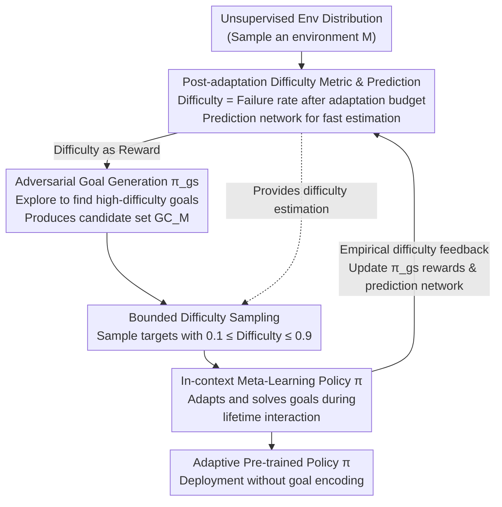

# Unsupervised Learning of Efficient Exploration: Pre-training Adaptive Policies via Self-Imposed Goals

## Information
- **Conference**: ICLR 2026
- **arXiv**: [2601.19810](https://arxiv.org/abs/2601.19810)
- **Code**: Open Sourced
- **Area**: Reinforcement Learning / Unsupervised Pre-training / Meta-Learning
- **Keywords**: Unsupervised RL, Automatic Curriculum Learning, Meta-Learning, Goal Generation, Exploration Strategy

## TL;DR
The ULEE method is proposed to meta-learn pre-trained policies with high exploration efficiency and fast adaptation through adversarial goal generation and curriculum learning based on post-adaptation difficulty in unsupervised environments.

## Background & Motivation

### Core Problem
While large-scale pre-training has achieved success in vision and language, reinforcement learning (RL) remains dominated by training from scratch. How can general-purpose RL foundation policies be pre-trained without external rewards to possess transferable exploration and adaptation capabilities?

### Limitations of Prior Work
1. **Intrinsic Reward Methods** (e.g., DIAYN): Limited skill diversity, performance often plateaus or declines as training progresses.
2. **Goal-Conditioned Policies**: Perform poorly when goals are unknown or cannot be encoded.
3. **Fixed Goal Space Assumptions**: Most curriculum learning methods assume identical goal spaces during training and evaluation.
4. **Immediate Performance-based Difficulty**: Fails to consider adaptation budgets, making them unsuitable for scenarios requiring multiple rounds of adaptation.

### Key Motivation
Humans develop capabilities by autonomously setting and pursuing goals. This paper focuses on: **how goals are generated**, **how they are selected**, and **how to learn from them**. In scenarios with broad and unknown downstream distributions, zero-shot solutions are impossible; thus, optimizing multi-round exploration and adaptation efficiency is necessary.

## Method

### Overall Architecture

ULEE aims to pre-train a generalist policy $\pi$ that explores rapidly and adapts based on interaction history across reward-free environments without downstream task information. The agent self-imposes and learns to solve goals via an **automatic curriculum**: an adversarial search policy identifies goals the current $\pi$ fails to achieve, which are then filtered for "middle-ground" difficulty. "Difficulty" is not based on immediate success but on whether $\pi$ can solve the goal after an adaptation budget—this **post-adaptation difficulty** is used as a reward for adversarial search, a criterion for sampling, and a label for a prediction network.

### Key Designs

**1. Post-adaptation Difficulty Metric and Prediction Network**

Previous curriculum learning (e.g., GoalGAN) uses immediate success rates to judge difficulty. However, ULEE's deployment involves giving the agent an adaptation budget. Difficulty is defined as the failure rate after the budget is exhausted:

$$d(g; \pi, M) = 1 - \mathbb{E}_{\rho_M, P_M, \pi}\left[\frac{1}{K}\sum_{j=H-K+1}^{H}\mathbf{1}\{\exists t: f(s_{t+1}^{(j)})=g\}\right]$$

A lifetime consists of $H$ episodes, but success is only counted for the final $K$ episodes, leaving $H-K$ episodes for exploration and adaptation. This aligns with few-shot adaptation capabilities. To avoid the high cost of computing $d(g;\pi,M)$ via real environment interaction, a difficulty predictor $\hat{d}_\phi$ is trained via supervised regression: $\mathcal{L}_{DP}(\phi) = \frac{1}{|B_g|}\sum_{(g,\xi,\tilde{d})\in B_g}(\hat{d}_\phi(g,\xi) - \tilde{d}(g))^2$.

**2. Adversarial Goal Generation**

ULEE trains a goal-searching policy $\pi_{gs}$ where the reward is the difficulty of the reached state's corresponding goal: $r_t^{gs} = d(f(s_t); \pi, M)$. It maximizes $\mathcal{J}_{gs}(\pi_{gs}) = \mathbb{E}_{M,\pi_{gs}}\left[\sum_{t=0}^{T-1}\gamma^{t} r_t^{gs}\right]$. This incentivizes $\pi_{gs}$ to find goals that $\pi$ cannot yet solve even after adaptation. $\pi_{gs}$ populates a candidate set $GC_M$, ensuring the curriculum remains at the boundary of the current capabilities of $\pi$.

**3. Bounded Difficulty Sampling**

To avoid learning signals from trivial or impossible goals, ULEE samples goals within a medium difficulty range: $g_M \sim \text{Unif}(S)$, where $S = \{g \in GC_M : LB \le d(g;\pi,M) \le UB\}$ ($LB=0.1, UB=0.9$). This focuses gradients on goals that are "just out of reach."

**4. In-context Meta-Learning Policy**

The pre-trained policy $\pi$ uses black-box meta-learning, taking the entire interaction history (observations, actions, rewards) as input and outputting actions to adapt within a lifetime. The objective is to maximize cumulative discounted returns across $H$ episodes:

$$\mathcal{J}(\pi) = \mathbb{E}_{M \sim \mu^{\text{unsup}}, g \sim p(g|M)}\left[\mathbb{E}_{\rho_M, P_M, \pi}\left[\sum_{j=1}^{H}\sum_{t=0}^{T-1}\gamma^{(j-1)T+t} r_t^{(j)}\right]\right]$$

A Transformer-XL backbone processes the long-range history, and PPO optimizes the policy. Crucially, $\pi$ is **not goal-conditioned**, allowing it to adapt to unknown or out-of-distribution tasks during deployment based solely on context history.

## Key Experimental Results

### Background
- **Environment**: XLand-MiniGrid, a JAX-based procedurally generated partially observable grid environment.
- **Benchmarks**: 4Rooms-Trivial, 4Rooms-Small, 6Rooms-Small.
- **Baselines**: DIAYN, PPO (from scratch), RND (online exploration), RL² (meta-learning).

### Main Results

| Metric | ULEE | DIAYN | Random |
|------|------|-------|--------|
| 20-episode Exploration Coverage | **Highest (2x+)** | Medium | Low |
| Few-shot Adaptation (30 episodes) | **3× Gain** | Incremental | - |
| Fine-tuning (1B steps) | **Consistent Lead** | Short-term advantage | - |
| Meta-RL Initialization | **Universal Gain** | - | Baseline |

### Ablation Study

| Variant | Goal Search | Sampling Strategy | Relative Performance |
|------|----------|----------|----------|
| ULEE (adversarial + bounded) | Adversarial | Bounded Difficulty | **Optimal** |
| ULEE (random + bounded) | Random | Bounded Difficulty | Sub-optimal |
| ULEE (adversarial + uniform) | Adversarial | Uniform | Slightly lower |
| ULEE (SED) | Adversarial | Instant Difficulty | Degrades as difficulty increases |

### Key Findings
1. Adversarial goal search combined with bounded difficulty sampling yields the best results.
2. Difficulty metrics based on post-adaptation performance show greater advantages in harder environments.
3. Target mapping $f_{\text{counts}}$ provides a better inductive bias than $f_{\text{grid}}$.
4. Performance continues to improve even when the pre-training budget is increased to 5 billion steps.
5. ULEE generalizes across different grid sizes and room structures in MiniGrid.

## Highlights & Insights
1. **Post-adaptation Difficulty Metric**: A conceptual innovation extending curriculum learning to meta-learning scenarios by considering the adaptation budget.
2. **Unconditional Policy Pre-training**: Avoids dependence on goal-conditioning, allowing for wider deployment.
3. **Multi-level Evaluation**: Covers zero-shot exploration, few-shot adaptation, long-term fine-tuning, and meta-RL initialization.
4. **Systematic Ablation**: Clearly demonstrates the individual contributions of each component.

## Limitations & Future Work
1. Currently validated only in 2D grid worlds; scalability to high-dimensional continuous control is unknown.
2. The choice of goal mapping $f$ still requires manual design; automatic discovery of goal spaces remains an open problem.
3. Adversarial training introduces an additional 25% computational overhead.
4. In the most difficult out-of-distribution tasks, 60% of tasks still fail to yield rewards.

## Related Work & Insights
- **Unsupervised RL**: Intrinsic reward methods like DIAYN and RND.
- **Automatic Curriculum Learning**: GoalGAN, AMIGo, etc., but without post-adaptation metrics.
- **Unsupervised Meta-Learning**: First explored by Gupta et al. (2018); ULEE introduces an adversarial curriculum.
- **Ada (DeepMind)**: Large-scale meta-learning in procedurally generated environments, but uses an external task distribution rather than self-generated goals.

## Rating
- **Novelty**: ⭐⭐⭐⭐ — The combination of post-adaptation difficulty and unconditional meta-learning is innovative.
- **Experimental Thoroughness**: ⭐⭐⭐⭐ — Multi-dimensional evaluation, though environmental complexity is limited.
- **Writing Quality**: ⭐⭐⭐⭐ — Method and experiments are clearly organized.
- **Value**: ⭐⭐⭐ — Practical breakthroughs require expansion to more complex environments.

<!-- RELATED:START -->

## Related Papers

- [\[ICLR 2026\] Sample-efficient and Scalable Exploration in Continuous-Time RL](sample-efficient_and_scalable_exploration_in_continuous-time_rl.md)
- [\[ICLR 2026\] SPELL: Self-Play Reinforcement Learning for Evolving Long-Context Language Models](spell_self-play_reinforcement_learning_for_evolving_long-context_language_models.md)
- [\[ICLR 2026\] SPIRAL: Self-Play on Zero-Sum Games Incentivizes Reasoning via Multi-Agent Multi-Turn Reinforcement Learning](spiral_self-play_on_zero-sum_games_incentivizes_reasoning_via_multi-agent_multi-.md)
- [\[ICLR 2026\] Solving Parameter-Robust Avoid Problems with Unknown Feasibility using Reinforcement Learning](solving_parameter-robust_avoid_problems_with_unknown_feasibility_using_reinforce.md)
- [\[ICLR 2026\] Shop-R1: Rewarding LLMs to Simulate Human Behavior in Online Shopping via Reinforcement Learning](shop-r1_rewarding_llms_to_simulate_human_behavior_in_online_shopping_via_reinfor.md)

<!-- RELATED:END -->
