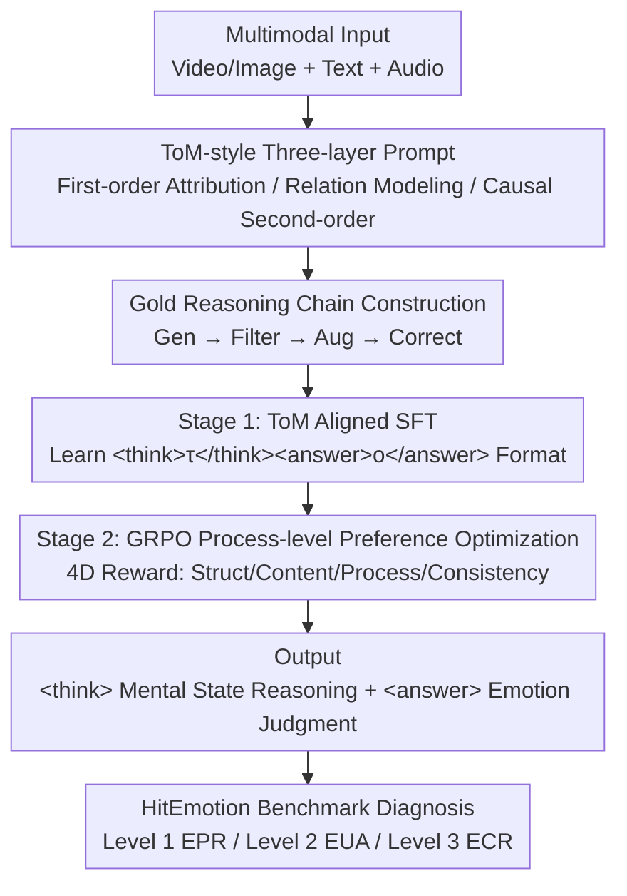

# Unveiling the Cognitive Compass: Theory-of-Mind-Guided Multimodal Emotion Reasoning

## Paper Information
- **Conference**: ICLR 2026
- **arXiv**: [2602.00971](https://arxiv.org/abs/2602.00971)
- **Code**: [https://HitEmotion.github.io/](https://HitEmotion.github.io/)
- **Area**: Multimodal Affective Computing / Theory of Mind / Reinforcement Learning / Large Models
- **Keywords**: Theory of Mind, Emotion Reasoning, MLLM, Hierarchical Benchmark, GRPO, Reasoning Chain Optimization

## TL;DR
The authors construct HitEmotion, a hierarchical multimodal emotion understanding benchmark based on Theory of Mind (ToM), and propose the TMPO framework to enhance MLLM emotion reasoning capabilities by using intermediate mental states as process-level supervision.

## Background & Motivation

### Core Problem
Despite the excellent performance of Multimodal Large Language Models (MLLMs) on various tasks, they still exhibit significant deficiencies in deep emotional understanding. The core reasons include:

**Lack of a Unified Cognitive Framework**: Existing benchmarks only provide coarse-grained scores and cannot locate the breakpoints in models' reasoning abilities.

**Unfaithful Reasoning Chains**: CoT reasoning often appears coherent but is essentially template matching, lacking true tracking of mental states.

**Emotional Hallucinations**: Models produce distorted emotional attributions when faced with conflicting cross-modal cues.

### Limitations of Prior Work
- Benchmarks like EQ-Bench and EmoBench only cover the text modality.
- Although EmoBench-M and EmotionHallucer are multimodal, their task designs are scattered and not organized by cognitive depth.
- No benchmark provides simultaneous evaluation of reasoning chains and rationales.

## Method

### Overall Architecture

This paper accomplishes two main objectives: first, it quantifies "where the model fails in which layer of emotional reasoning" using HitEmotion, a benchmark organized by cognitive depth; second, it utilizes the TMPO (ToM-guided reasoning chain Preference Optimization) training framework to treat intermediate mental states of ToM as supervisable and rewardable process signals to bridge the gaps in deep emotional reasoning of MLLMs.

The TMPO training pipeline begins with "how to write down mental states": first, it constrains the model using ToM-style prompts aligned with three cognitive layers, writing the reasoning process into `<think>` and the final emotional judgment into `<answer>`. Since existing datasets lack ready-made "gold reasoning chains," the paper uses a four-step pipeline (Generation → Filtering → Augmentation → Correction) to mass-produce annotation chains that track mental states. After obtaining this data, ToM-aligned Supervised Fine-Tuning (SFT) is performed to teach the model the structured reasoning format. Subsequently, GRPO is used for process-level preference optimization to ensure the reasoning chain is not only formatted correctly but also faithful and reliable. The trained model is finally subjected to diagnostic evaluation on the three-layer HitEmotion benchmark.

### Key Designs

**1. HitEmotion Benchmark: Segmenting emotional tasks into three layers by cognitive depth to locate reasoning breakpoints.**

Existing benchmarks only give a coarse global score, failing to answer whether a model failed at the perception layer or collapsed at the causal attribution layer. HitEmotion organizes 24 tasks and 20,114 instances (covering video and images) into three layers based on cognitive depth. Level 1 is Emotion Perception and Recognition (EPR), requiring mapping multimodal signals to predefined categories (e.g., facial expression recognition). Level 2 is Emotion Understanding and Analysis (EUA), necessitating context awareness and relational reasoning (e.g., humor understanding, sarcasm detection). Level 3 is Emotion Cognition and Reasoning (ECR), requiring causal reasoning and second-order mentalizing (e.g., emotion provocation reasoning, ironing understanding). Thus, if a model drops significantly in Level 3 while performing normally in Level 1, its deficiency in high-order cognition rather than low-order perception can be precisely identified. It is also the only benchmark in Table 1 providing both reasoning chain (Rea-chain) and rationale annotations.

**2. ToM-style Three-layer Prompting + Gold Reasoning Chain Construction: Formulating "how to reason mental states" into learnable annotations.**

To enable models to track mental states, samples showing "what a correct reasoning process looks like" are needed, but existing datasets lack reasoning chains. The paper uses ToM-style prompts $\mathcal{P}$ mapped to the three levels to constrain output formats: Level 1 performs first-order mental state attribution; Level 2 performs relational and contextual mental modeling; Level 3 performs causal attribution and second-order reasoning. Tasks are formalized as a mapping $(T,A,V)\rightarrow(\tau,o)$, deriving reasoning chain $\tau$ and answer $o$ from text $T$, audio $A$, and video $V$. Since gold $\tau$ is absent, a four-step pipeline (LLM Generation → Filtering → Augmentation → Correction) is used to produce high-quality chains. Notably, these ToM prompts significantly boost closed-source model performance on high-level tasks even without training, acting as a "scaffold" for reasoning.

**3. Stage 1 ToM Aligned SFT: Teaching the model the structured reasoning format.**

MLLM CoT often appears coherent but acts as template matching without separating reasoning from conclusions. The SFT stage uses structured templates for decoupling: intermediate reasoning is wrapped in `<think></think>`, and the final answer in `<answer></answer>`. The target string is $y=\texttt{<think>}\tau\texttt{</think>}\texttt{<answer>}o\texttt{</answer>}$. Training minimizes the negative log-likelihood:

$$\mathcal{L}_{\text{SFT}}(\theta) = -\mathbb{E}_{((\mathcal{P},T,A,V), y)} [\log \pi_\theta(y | \mathcal{P}, T, A, V)]$$

where $\pi_\theta$ is the MLLM policy. This step grants the model initial structured reasoning capabilities, though faithfulness is not yet guaranteed.

**4. Stage 2 GRPO Process-level Preference Optimization: Turning mental states into rewards rather than just checking final correctness.**

SFT only mimics format. Stage 2 samples $N$ outputs $\{y_1,\dots,y_N\}$ for each input and uses a four-dimensional reward:

$$R(y) = \mu_1 R_{\text{structure}} + \mu_2 R_{\text{content}} + \mu_3 R_{\text{process}} + \mu_4 R_{\text{consistency}}$$

$R_{\text{structure}}$ checks step order, $R_{\text{content}}$ checks answer correctness, $R_{\text{process}}$ rewards the use of domain-specific mental state language, and $R_{\text{consistency}}$ penalizes logical and factual inconsistencies. Crucially, $R_{\text{process}}$ and $R_{\text{consistency}}$ allow intermediate mental states to enter the gradient directly. Optimization uses GRPO for policy improvement with KL constraints:

$$\max_{\pi_\theta} \mathbb{E}_{y_i \sim \pi_{\text{old}}} \left[ \frac{\pi_\theta(y_i)}{\pi_{\text{old}}(y_i)} A_i \right] - \beta D_{KL}(\pi_\theta \| \pi_{\text{ref}})$$

where $A_i$ is the relative advantage based on group rewards $R(y_i)$. This step transitions reasoning from "general emergence" to "domain-specific acquisition."

## Main Results

### Baseline Model Evaluation (EPR Level 1)

| Model | FESD | ISA | MESA | MER | MSA | OSA | SIA |
|------|------|-----|------|-----|-----|-----|-----|
| VideoLLaMA3-7B | 61.78 | 46.85 | 21.60 | 52.18 | 64.62 | 67.89 | 35.20 |
| LLaVA-One-Vision-7B | 63.44 | 49.19 | 17.05 | 39.50 | 65.40 | 63.00 | 27.00 |

### Key Findings

1. **Inconsistent performance of SOTA models on high-level cognitive tasks**: Even the strongest closed-source models exhibit significant deficiencies at the ECR layer.
2. **ToM reasoning chains as a prompting strategy significantly improve performance**: Validates the effectiveness of ToM as a "scaffolding" for reasoning.
3. **TMPO optimization brings consistent improvements**: Surpasses baselines across all tasks, generating reasoning chains with significantly better faithfulness and consistency.
4. **Transition from "General Emergence" to "Domain Acquisition"**: TMPO transforms reasoning from a general property into a specialized cognitive skill.

## Highlights & Insights
1. **First evaluation framework to unify psychological theory with MLLM reasoning processes and rationale generation.**
2. **Exquisite design of ToM prompting mechanism**: Three cognitive levels correspond to three different depths of reasoning templates.
3. **Innovative combination of GRPO and process-level rewards**: Intermediate mental states serve as both supervision signals and reward sources.
4. **Scalability**: Comprehensive benchmark with 24 datasets and 20K+ instances.

## Limitations & Future Work
1. Gold reasoning chains depend on LLM generation, which may introduce inherent LLM biases.
2. Based on the reconstruction of existing datasets, the quality of original annotations varies.
3. Higher computational cost for GRPO training.
4. Primarily evaluated in single-turn QA scenarios; emotional reasoning in multi-turn interactions is not fully explored.

## Related Work & Insights
- **Multimodal Affective Computing**: Evolution of fusion strategies (SALV, PAD) from early/late to intermediate interaction schemes.
- **Emotional Intelligence Evaluation**: Evolution from EQ-Bench to EmoBench-M and EmotionHallucer.
- **ToM Reasoning**: Investigations from ToMBench to MMToM-QA revealing ToM deficiencies in MLLMs.
- **Reasoning Optimization**: Success of DeepSeek-R1's GRPO method in textual reasoning.

## Rating
- **Novelty**: ⭐⭐⭐⭐ — Deep integration of ToM cognitive frameworks with MLLM evaluation/training.
- **Experimental Thoroughness**: ⭐⭐⭐⭐⭐ — Comprehensive evaluation across 24 datasets.
- **Writing Quality**: ⭐⭐⭐⭐ — Clear problem definition and well-motivated methods.
- **Value**: ⭐⭐⭐⭐ — Provides evaluation toolkits and optimization methodologies.

<!-- RELATED:START -->

## Related Papers

- [\[ICLR 2026\] RuleReasoner: Reinforced Rule-based Reasoning via Domain-aware Dynamic Sampling](rulereasoner_reinforced_rule-based_reasoning_via_domain-aware_dynamic_sampling.md)
- [\[ICLR 2026\] SPIRAL: Self-Play on Zero-Sum Games Incentivizes Reasoning via Multi-Agent Multi-Turn Reinforcement Learning](spiral_self-play_on_zero-sum_games_incentivizes_reasoning_via_multi-agent_multi-.md)
- [\[ICLR 2026\] Sample-efficient and Scalable Exploration in Continuous-Time RL](sample-efficient_and_scalable_exploration_in_continuous-time_rl.md)
- [\[ICLR 2026\] Shop-R1: Rewarding LLMs to Simulate Human Behavior in Online Shopping via Reinforcement Learning](shop-r1_rewarding_llms_to_simulate_human_behavior_in_online_shopping_via_reinfor.md)
- [\[ICLR 2026\] Virne: A Comprehensive Benchmark for RL-based Network Resource Allocation in NFV](virne_a_comprehensive_benchmark_for_rl-based_network_resource_allocation_in_nfv.md)

<!-- RELATED:END -->
