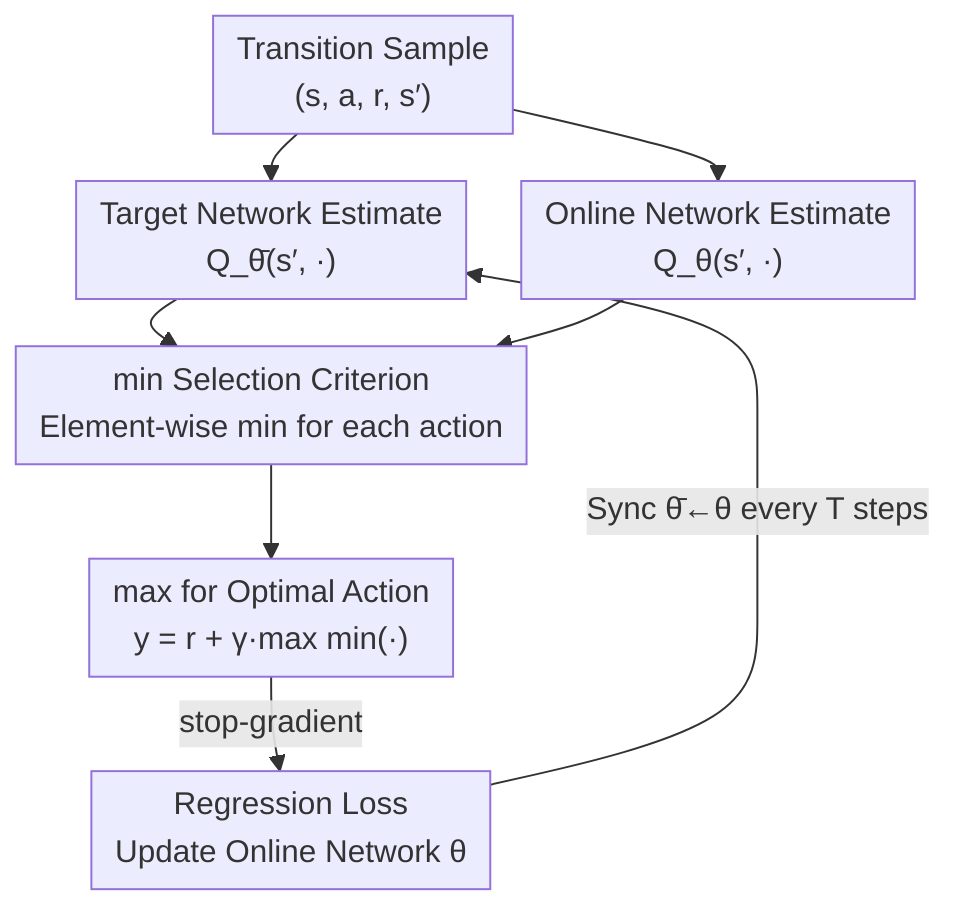

# Use the Online Network If You Can: Towards Fast and Stable Reinforcement Learning

**Conference**: ICLR 2026  
**OpenReview**: [https://openreview.net/forum?id=rFLuaG9Yq6](https://openreview.net/forum?id=rFLuaG9Yq6)  
**Code**: https://github.com/AhmedMagdyHendawy/MINTO  
**Area**: Reinforcement Learning / Value Function Estimation / Offline RL  
**Keywords**: Target Networks, Online Networks, Overestimation Bias, Bellman Update, Bootstrapping Target

## TL;DR
This paper proposes MINTO, which modifies the TD bootstrapping target from "using only the target network" to "taking the minimum of the estimates from the target and online networks." By leveraging fresh online estimates to accelerate learning while suppressing overestimation bias via the min operator, MINTO can be integrated into algorithms like DQN, IQN, CQL, and SAC with nearly zero cost, leading to universal performance improvements.

## Background & Motivation

**Background**: The standard approach for value function estimation in deep RL is to introduce a "target network"—atemporal copy $Q_{\bar\theta}$ of the online network used to compute the regression target $y = r + \gamma \max_{a'} Q_{\bar\theta}(s', a')$. The parameters $\bar\theta$ are synchronized with $\theta$ only every $T$ steps. This is a key technique used by DQN to mitigate the "deadly triad" (function approximation + off-policy data + bootstrapping).

**Limitations of Prior Work**: While target networks provide stability, they represent a compromise. By making the target a "slow-moving" goal, the online network is forced to chase outdated estimates, which artificially slows down learning. Conversely, using the online network $Q_\theta$ directly as the bootstrapping target allows for faster learning using the latest estimates but is notorious for causing training instability.

**Key Challenge**: There exists a trade-off between stability (target network) and learning speed (online network). Crucially, direct bootstrapping with the online network amplifies the inherent **overestimation bias** in value functions—the $\max$ operation on noisy bootstrapping estimates causes $Q$-values to monotonically inflate during training, eventually leading to divergence.

**Goal**: To identify a suitable selection criterion that incorporates fresh estimates from the online network without sacrificing the stability provided by the target network.

**Key Insight**: The authors observe that prior work fluctuates between "removing the target network to use only the online network" and "re-adding the target network," indicating that both have value and should not be mutually exclusive. This suggests that both networks should **work side-by-side** to jointly compute the regression target. The critical problem is the criterion used to combine them.

**Core Idea**: Take the **minimum** of the next-state estimates from the target and online networks as the bootstrapping target. When the online estimate is high (likely overestimation), it reverts to the target network for stability; when the online estimate is low, it adopts the fresh information to accelerate learning.

## Method

### Overall Architecture

MINTO (MINimum between Target and Online) is a one-line modification to the TD bootstrapping target calculation. While the standard DQN target is $y = r + \gamma \max_{a'} Q_{\bar\theta}(s',a')$, MINTO takes the **minimum** between the target and online network estimates for **each candidate action** before applying the $\max$ operator:

$$y = r + \gamma \max_{a'\in A} \min\big(Q_{\bar\theta}(s',a'),\, Q_\theta(s',a')\big).$$

The model is then trained using the same regression loss as DQN, with a stop-gradient applied to the target to prevent gradients from flowing through $Q_\theta$ back into the target:

$$L(\theta) = \tfrac{1}{2}\big(\lceil y\rceil - Q_\theta(s,a)\big)^2.$$

The workflow can be summarized as "dual-source estimation → action-wise minimum → select optimal action → regression." It can be seamlessly integrated into any TD-based algorithm. The implementation cost is merely one additional forward pass of the online network for the next state, which is negligible in frameworks like JAX.

### Key Designs

**1. min(Target, Online) Bootstrapping: Safely incorporating fresh estimates**

The core issue is that while the online network provides the latest estimates to speed up learning, it is prone to systematic inflation under the $\max$ operator, causing the target to diverge. MINTO's mechanism uses $\min(Q_{\bar\theta}(s',a'), Q_\theta(s',a'))$ at the action level. When the online estimate is **higher** than the target estimate—the scenario where overestimation is most likely—it automatically reverts to the more conservative and stable target network. When the online estimate is **lower**, the fresher value is adopted. This effectively filters for "credible new information" while blocking "dangerous optimism." Unlike methods that change the max operator or add regularization, MINTO simply changes the selection operator, mitigating both the moving target problem and overestimation bias without extra hyperparameters.

**2. Why min instead of max/mean/random: Establishing the criterion through controlled experiments**

A natural question is why the minimum is preferred over other combination methods. The authors compared several candidate operators across 15 Atari games (Fig. 1). "Online Only" performed poorly due to chasing a rapidly changing target; "Max" was the worst, as it exacerbated overestimation bias to the point where target values spiraled out of control; "Mean" and "Random" (selecting either with 50% probability) both degenerated into performance similar to "Target Only" (standard DQN) without additional gains. Only "Min" significantly outperformed the baseline. These experiments indicate that min is the appropriate combination criterion (Q1) and that its advantage stems from "incorporating online estimates in a stable manner while suppressing their induced overestimations" (Q2). In other words, the effectiveness of min is strictly aligned with the direction of overestimation bias.

**3. Plug-and-play + Convergence Guarantees: Universal application and theoretical stability**

Since MINTO only modifies the Bellman target calculation, it can be embedded into various off-policy algorithms at minimal cost. In DQN and IQN (distributional RL), the target is directly replaced. In CQL (offline RL), the regression target is modified while maintaining CQL's penalty on OOD actions. It is also compatible with actor-critic frameworks like SAC (using SimbaV1/V2 architectures). Writing the MINTO operator as $G_{\text{MINTO}}(Q_s)=\max_{a}\min_{j\in T} Q_{sa}(j)$ (where $T$ is a set of historical time indices), the authors prove it satisfies the non-expansion condition for Generalized Q-learning (Lan et al., 2020), ensuring $Q$-value convergence to the optimal $Q^*$ in tabular settings (Corollary 1). This differentiates MINTO from Maxmin Q-learning, which requires an **ensemble** of Q-networks and extra memory/computation, whereas MINTO only uses the existing online and target networks.

### Mechanism

Using IQN training on Breakout as an example, the authors tracked the frequency with which the online network was selected by the min operator (Fig. 4, right). In the **very early stages** of training, the online and target networks are nearly identical, and online estimates are noisy/high, so the min operator almost always reverts to the target network (selection rate near 0%), ensuring stability. As training progresses and online parameters diverge from the synced target parameters, the online network more frequently provides lower (more credible) estimates, and the selection rate rises steadily. In the late stages, the online network is adopted approximately **45%** of the time. This selection rate, averaged between target network sync intervals where divergence is highest, demonstrates that MINTO dynamically and adaptively switches between "stability" and "speed."

## Key Experimental Results

### Main Results

MINTO was evaluated across online/offline, discrete/continuous, and value-based/actor-critic dimensions. The IQM-aggregated AUC metric (reflecting both learning speed and asymptotic performance) was used across 5 seeds.

| Setting / Baseline | Architecture | Metric | MINTO Gain vs. Baseline |
|------|------|------|------|
| Online·Discrete / DQN | CNN | AUC | ≈ +17% |
| Online·Discrete / DQN | IMPALA+LN | AUC | ≈ +22% |
| Distributional / IQN | CNN | AUC | ≈ +7% |
| Distributional / IQN | IMPALA+LN | AUC | ≈ +10% |
| Offline / CQL | CNN | AUC | ≈ +125% |
| Offline / CQL | IMPALA+LN | AUC | ≈ +20% |
| Online·Continuous / SimbaV1·V2 (SAC) | — | IQM Norm. Return | Significant sample efficiency gain on MuJoCo/HBench; flat/slight drop on DMC-Hard |

### Ablation Study

| Configuration | Key Observation | Explanation |
|------|---------|------|
| Min (Ours) | Highest AUC | Min criterion incorporates online estimates stably. |
| Max | Worst | Selects high estimates, leading to uncontrolled overestimation. |
| Mean | ≈ Target Only | Averaging yields no extra benefit. |
| Random | ≈ Target Only | Random selection reduces to standard DQN behavior. |
| Online Only | Poor | Chases rapidly changing targets; unstable training. |
| Target Only | = DQN | Baseline performance. |

Compared to similar baselines (15 Atari games, CNN, online): MINTO consistently outperformed methods specifically designed to handle overestimation such as Double DQN, FR-DQN, and ScDQN, as well as Maxmin DQN ($N{=}2$ ensemble). Furthermore, while ScDQN and FR-DQN introduce extra hyperparameters, MINTO has **zero new hyperparameters**. In the offline setting, MINTO completely outperformed single-estimator baselines ($N{=}1$). The only exception was Maxmin CQL ($N{=}2$), which outperformed MINTO due to its extreme conservatism in offline scenarios; however, integrating MINTO into Maxmin CQL yielded further performance gains.

### Key Findings
- **The advantage of the min operator is strictly aligned with the direction of overestimation bias**: The symmetric result where Max is the worst and Min is the best provides strong evidence for MINTO's mechanism—the gain comes from "clipping online estimates in the correct direction," not just the update rule.
- **Offline RL shows the largest gain (+125% with CNN)**: Original CQL ignores fresh online estimates. MINTO fills this gap, and the min operator effectively suppresses overestimation of OOD actions prevalent in offline scenarios.
- **Online selection frequency rises to ~45%**: This confirms that MINTO actively utilizes the online network rather than just being a nominal dual-network system that reverts to DQN.
- **Stronger architectures lead to different gain sources**: On IMPALA+LN, DQN/IQN gains were larger, whereas on DMC-Hard (continuous control), performance slightly decreased, suggesting interactions between MINTO and normalization or exploration intensity.

## Highlights & Insights
- **One formula, zero hyperparameters, negligible overhead**: The core change is simply adding a $\min$ before the $\max$. The ability to improve performance across value-based, actor-critic, online, and offline settings with such a minimalist design is highly valuable.
- **Turning trade-offs into adaptive selection**: Instead of picking a fixed coefficient between "stable" and "fast," the min operator automatically determines the path per-sample. It is stable early and fast later; the trade-off is resolved by the mechanism itself.
- **Dual identity of min**: It simultaneously addresses the "moving target" problem (by reverting to the stable target network) and the "overestimation bias" (by clipping inflated online estimates). Solving two long-standing problems with one operator is a transferable insight for any bootstrapping scenario involving biased estimates.
- **Honest comparative design**: By using the Max/Mean/Random/Online/Target control group, the authors theoretically and empirically justify "why min," moving beyond just reporting SOTA numbers.

## Limitations & Future Work
- The authors admit that pure min might be too conservative in **low-noise environments**, leading to slight underestimation. It may also interact unpredictably with exploration (potentially explaining the slight drop in DMC-Hard).
- Convergence proof only holds for the **tabular setting**; convergence under function approximation remains an open question (a common issue in RL theory).
- Gains vary significantly across settings (IQN +7% vs. CQL +125%). There is no a priori criterion for when it will yield massive gains versus marginal improvements.
- Future work: The authors suggest **adaptive operator selection**—switching dynamically between min, online, and target based on uncertainty or learning dynamics—and extending the validation to multi-task and multi-agent RL.

## Related Work & Insights
- **vs. Clipped Double Q-Learning (CDQ) / Maxmin Q-learning**: These methods take the min across **multiple independent critics** to suppress overestimation, requiring extra networks. MINTO takes the min between the **existing target and online networks**, requiring no new networks and aiming to safely introduce fresh estimates rather than just reducing bias.
- **vs. FR-DQN / ScDQN (Hybrid methods)**: These methods bootstrap entirely with the online network and then use the target network for regularization (FR-DQN) or combine them for action selection (ScDQN). Both require extra hyperparameters. MINTO uses a parameter-free min criterion to modulate the online estimate's contribution, which is simpler and empirically superior.
- **vs. Online Only / Target-free routes (e.g., MellowMax, CrossQ)**: These works attempt to remove target networks entirely, but subsequent studies often find that re-adding them is better. MINTO retains the target network and works in synergy with it rather than against it, making it orthogonal to these approaches.

## Rating
- Novelty: ⭐⭐⭐⭐ Minimalist idea, but provides a fresh perspective on network synergy and unifies two major bootstrapping problems into one operator.
- Experimental Thoroughness: ⭐⭐⭐⭐⭐ Covers online/offline, discrete/continuous, and various architectures/baselines with solid control experiments.
- Writing Quality: ⭐⭐⭐⭐⭐ Clear progression from motivation to mechanism to experiment. The Q1/Q2 design effectively explains the logic.
- Value: ⭐⭐⭐⭐⭐ Zero hyperparameters, negligible overhead, and plug-and-play efficacy make it highly practical.

<!-- RELATED:START -->

## Related Papers

- [\[ICML 2026\] You Can Learn Tokenization End-to-End with Reinforcement Learning](../../ICML2026/reinforcement_learning/you_can_learn_tokenization_end-to-end_with_reinforcement_learning.md)
- [\[ICLR 2026\] ComputerRL: Scaling End-to-End Online Reinforcement Learning for Computer Use Agents](computerrl_scaling_end-to-end_online_reinforcement_learning_for_computer_use_age.md)
- [\[ICLR 2026\] ReTool: Reinforcement Learning for Strategic Tool Use in LLMs](retool_reinforcement_learning_for_strategic_tool_use_in_llms.md)
- [\[ICLR 2026\] EXPO: Stable Reinforcement Learning with Expressive Policies](expo_stable_reinforcement_learning_with_expressive_policies.md)
- [\[ICLR 2026\] Principled Fast and Meta Knowledge Learners for Continual Reinforcement Learning](principled_fast_and_meta_knowledge_learners_for_continual_reinforcement_learning.md)

<!-- RELATED:END -->
