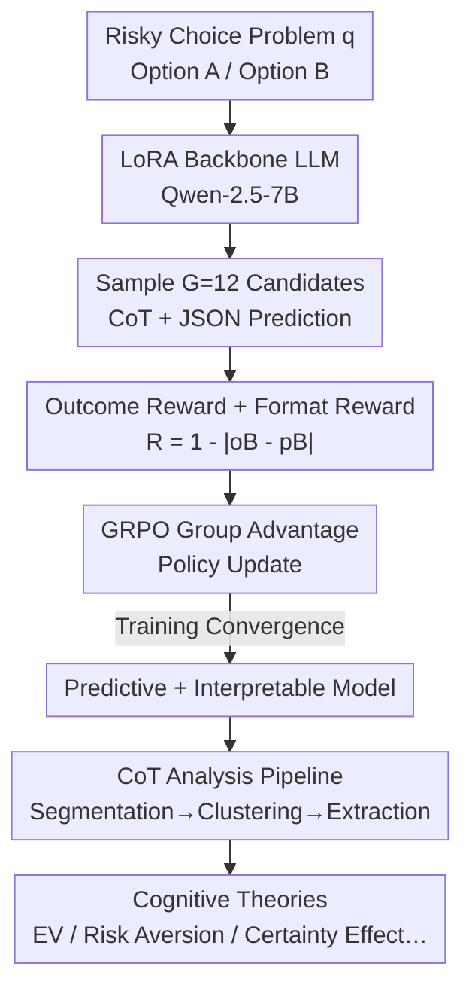

# Using Reinforcement Learning to Train Large Language Models to Explain Human Decisions

**Conference**: ICLR 2026  
**OpenReview**: [https://openreview.net/forum?id=coJPBEZ9Te](https://openreview.net/forum?id=coJPBEZ9Te)  
**Area**: Reinforcement Learning / Cognitive Modeling  
**Keywords**: Reinforcement Learning, GRPO, Cognitive Model, Chain-of-Thought, Risky Decision Making

## TL;DR
The authors post-train an LLM using outcome-based reinforcement learning (GRPO) to predict human risky decision proportions while explicitly generating reasoning as a Chain-of-Thought (CoT). these CoT sequences serve as "interpretable cognitive theories" of human decision-making, achieving predictive accuracy comparable to Supervised Fine-Tuning (SFT) while providing natural language explanations unattainable through SFT.

## Background & Motivation
**Background**: Cognitive modeling aims to both **predict** human behavior and **explain** the underlying cognitive mechanisms. Recently, using neural networks (and even directly fine-tuning LLMs, such as the Centaur model) to fit large-scale behavioral data has led to predictive accuracies that surpass domain-specific cognitive models in the literature.

**Limitations of Prior Work**: These models exhibit strong prediction but weak explanation. They function as black boxes—it is known that the model predicts 71% of people will choose a certain option, but the "why" remains unknown, failing to provide readable theories regarding human psychological processes. SFT models like Centaur directly learn to output a number without any intermediate reasoning for cognitive scientists to examine.

**Key Challenge**: Accurate prediction $\neq$ understanding cognition. To deepen the theoretical understanding of the human mind, matching behavioral data is insufficient; there must be inspectable and interpretable intermediate mechanisms.

**Goal**: To enable an LLM to serve as both a "predictor + explainer"—accurately predicting the proportion of group risky choices while articulating its reasoning (i.e., cognitive mechanisms) in natural language.

**Key Insight**: Reasoning-capable LLMs generate a Chain-of-Thought (CoT) before providing a final answer. The authors' key hypothesis is to treat this CoT as a **"verbalized account" of latent cognitive mechanisms**. If training can make the CoT both improve prediction and be substantive, cognitive scientists can directly read these CoT sequences to derive theories of human decision-making.

**Core Idea**: Replace SFT with "reinforcement learning from verifiable rewards" (RLVR). By linking human choice proportions directly to the RL reward function, the LLM is forced to spontaneously generate **useful** reasoning chains. The CoT is not a byproduct but a cognitive theory selected by reward signals to explain the data.

## Method

### Overall Architecture
The authors compare three post-training strategies on the largest human risky choice dataset, choices13k (13,102 training / 1,462 test problems). The backbone is Qwen-2.5-7B-Instruct using LoRA (rank=alpha=32, ~80.74M trainable parameters, 1.05%): (i) standard SFT; (ii) Centaur-style SFT (computing loss only on human data tokens); (iii) GRPO-based RL. The first two directly learn to output JSON numerical predictions without intermediate reasoning; only the RL model is trained to "write a CoT followed by a JSON prediction," with each candidate response rewarded based on its predictive accuracy. After training, a CoT analysis pipeline (segmenting thoughts → sentence embeddings → clustering → extracting cognitive mechanisms) is used to translate the "learned reasoning" into a "cognitive theory of human risky decision-making."

The RL pipeline is as follows:

### Key Designs

**1. Using Human Choice Proportions as RL Reward to Elicit Useful CoT via GRPO**

The limitation of SFT is that the model simply memorizes numbers without interpretable reasoning. This work adopts GRPO post-training: for a problem $q$, the model samples $G=12$ candidates $o_1,\dots,o_G$ (max 1024 tokens, including CoT + JSON), and scores them with an **outcome-based** reward: the reward equals "1 minus the absolute error between the predicted probability of option B and the actual human proportion,"

$$R(q,o) = \begin{cases} 1 - |o_B - p_B| & \text{if } o \text{ is valid} \\ 0 & \text{otherwise}\end{cases}$$

where $o_B$ is the predicted probability and $p_B$ is the true human proportion. Validity requires $0\le o_A,o_B\le 1$ and $o_A+o_B=1$. Additionally, a **format reward** (max 0.5) is given: 0.25 for outputting exactly one JSON block, and 0.25 for placing the prediction after the reasoning tokens. The advantage function follows the "GRPO Done Right" formulation, subtracting the group mean **without dividing by the standard deviation**: $A_i = R(q,o_i) - \text{mean}(\{R(q,o_1),\dots,R(q,o_G)\})$, and updates are performed using a token-level clipped PPO surrogate loss (asymmetric clipping $\epsilon_{low}=0.2, \epsilon_{high}=0.28$, KL penalty $\beta=10^{-4}$).

The fundamental difference from Centaur-style SFT is that while Centaur operates within the "next-token prediction" framework on **subword representations** of numbers, RL calculates rewards based on the **numerical values themselves**. This "reward-weighted policy optimization" is believed to offer better downstream generalization and is the reason meaningful CoT emerges without explicit reasoning labels.

**2. Treating CoT as Cognitive Theory: Segmentation, Clustering, and Extraction**

Generating CoT is insufficient; it must be proven to be **interpretable and useful to cognitive science**. RL CoT is typically itemized. The authors used regex to segment CoT into "thought" units, embedded them using SBERT (all-MiniLM-L6-v2), reduced dimensions with t-SNE, and clustered them into 9 groups via k-means. Results show RL reasoning categorizes into five strategies: precise Expected Value (EV) calculation, coarse EV comparison, psychological biases, risk preferences/volatility, and final prediction based on EV delta.

Furthermore, GPT-4o summarized CoT themes to track "cognitive mechanism" frequency: **EV calculation** and **risk aversion** were the most frequent (29%–36% of thoughts), with emergent concepts like loss aversion, certainty effect, probability weighting, and framing effects. This insight suggests that models prioritize "rational-leaning" mechanisms (EV + risk aversion) over the heuristics and biases often highlighted in literature.

**3. Data & Model control: Verifying CoT as Data-Driven and Backbone-Dependent**

Two control experiments verify that CoT is shaped by data rather than hallucinations. **Data Control**: Replacing human proportions with synthetic proportions from an "EV-maximizer model." The RL model quickly adapted its CoT to "calculate and compare EV," while risk aversion largely disappeared. This proves RL **adaptively aligns reasoning strategies to the data structure**. **Model Control**: Using a weaker Gemma-2-2B-Instruct, RL performed **significantly worse** than SFT/Centaur and failed to learn EV calculation. This demonstrates that CoT quality is heavily dependent on the backbone LLM's capabilities.

### Loss & Training
RL uses the GRPO Done Right objective (token-level clipped PPO surrogate loss + KL penalty) for 3 epochs, learning rate $3\times10^{-6}$, cosine scheduler, and group size $G=12$. SFT/Centaur baselines were trained for 6 epochs, learning rate $10^{-5}$, using AdamW and gradient accumulation 8. All methods share the same LoRA configuration and 90/10 split. Evaluated using vLLM, temperature=0.7, top-p=0.95, top-k=50. RL models are allowed up to 1024 tokens; SFT/Centaur are restricted to 30 tokens.

## Key Experimental Results

### Main Results
The predictive accuracy of the three post-training methods on the test set showed **no statistically significant differences**—RL achieved interpretable CoT without sacrificing performance.

| Method | Test MSE | Std. Error | Produces Interpretable CoT |
|------|-----------|--------|-------------------|
| SFT | .0144 | .0006 | No |
| Centaur-style SFT | .0155 | .0006 | No |
| RL (GRPO) | .0148 | .0006 | **Yes** |

Significance tests: SFT vs Centaur ($t(2923)=-1.31, p=0.19$), SFT vs RL ($t(2923)=-0.58, p=0.56$), RL vs Centaur ($t(2923)=0.78, p=0.43$). For reference: Peterson et al. (2021) achieved MSE .0113 with a Mixture of Theories neural network, while neural-augmented Prospect Theory achieved .0204. RL models show faster error reduction relative to training samples (peak at ~2.6 epochs vs ~5.86 for SFT), though compute costs are significantly higher due to sampling.

### Ablation Study

| Configuration | Key Observation | Description |
|------|---------|------|
| RL + Human Data (Main) | CoT dominated by EV calculation and risk aversion (29%–36%) | Emergence of loss aversion, certainty effect, etc. |
| RL + Synthetic EV Data | CoT quickly focused on EV calculation and comparison | Reasoning adaptive to data; risk aversion vanished. |
| RL + Weak Backbone (Gemma-2B) | RL significantly worse than SFT/Centaur; failed EV calc | CoT quality depends on backbone capability. |
| RL Format Reward | Hit 0.5 ceiling quickly; CoT length stabilized at 500–650 tokens | Formatting learned rapidly; length grew then plateaued. |

### Key Findings
- **Interpretability is a "free lunch"**: RL achieves SFT-level accuracy while providing CoT explanations—a layer SFT lacks.
- **CoT is data-driven and intervenable**: Reasoning changes with synthetic data, proving CoT reflects training signals rather than random generation.
- **Strong backbone dependency**: RL fails on weak models (Gemma-2B), suggesting RL "elicits" existing psychological representations rather than inventing them.
- **Theoretical Implications**: The dominance of "EV + risk aversion" suggests that rationalist explanations might be undervalued in some human decision-making contexts.

## Highlights & Insights
- **Reward as a Theory Filter**: Treating human proportions as a reward allows RL to select and surface the most explanatory psychological theories from the backbone's latent space—a clever reinterpretation of RLVR for cognitive modeling.
- **Quantifiable CoT Pipeline**: The thought segmentation + SBERT + clustering + LLM summarization pipeline transforms "piles of text" into statistical cognitive distributions, a method transferable to any CoT-based research.
- **Robust Control Experiments**: Use of synthetic data and model scaling provides clear causal evidence for the source of CoT content and the boundary conditions of the method.
- **Transferability**: This "outcome-reward RL for interpretable CoT" paradigm can be extended beyond risky choice to memory, learning, and problem-solving.

## Limitations & Future Work
- **Elicitation Hypothesis Ceiling**: RL post-training can only "elicit" theories already present in the backbone; it is unlikely to discover entirely new mechanisms (e.g., reinventing Prospect Theory if not already in the pre-training data).
- **Computational Cost**: Sampling 12 candidates per sample during RL is much more expensive than SFT.
- **Dependency on Capacity**: Failure on small models limits the applicability of RL in resource-constrained cognitive modeling.
- **RLHF/RLAIF Alternatives**: Using experts or stronger LLMs as judges (RLAIF) might provide denser rewards, but this is constrained by expert resources.
- **Generalization Gap**: How to combine SFT and RL for robust yet interpretable models remains an open question.

## Related Work & Insights
- **vs. Centaur-style SFT (Binz et al., 2025)**: Centaur uses masked SFT to adapt LLMs to cognitive tasks, achieving high accuracy but no explanation. This work uses RL on the values themselves to maintain accuracy while generating CoT.
- **vs. Automatic Discovery (Castro et al., 2025; Rmus et al., 2025)**: Previous work used LLMs to generate symbolic programs via in-context learning. This work fine-tunes the LLM to elicit natural language CoT.
- **vs. Predict-then-explain**: Traditionally, researchers perform post-hoc attribution on black-box models. This work optimizes prediction and explanation simultaneously, allowing the LLM to explore hypotheses that best fit the data.

## Rating
- Novelty: ⭐⭐⭐⭐⭐ First application of RLVR for simultaneous "prediction + explanation" in cognitive modeling, reframing CoT as a testable theory.
- Experimental Thoroughness: ⭐⭐⭐⭐ Solid comparisons and controls, though limited to a single domain (risky choice).
- Writing Quality: ⭐⭐⭐⭐⭐ Clear progression of motivation, methods, and logic.
- Value: ⭐⭐⭐⭐⭐ Provides a new paradigm for using RL to elicit readable theories from LLMs for cognitive science.

<!-- RELATED:START -->

## Related Papers

- [\[ICLR 2026\] On Predictability of Reinforcement Learning Dynamics for Large Language Models](on_predictability_of_reinforcement_learning_dynamics_for_large_language_models.md)
- [\[ICLR 2026\] Revolutionizing Reinforcement Learning Framework for Diffusion Large Language Models](revolutionizing_reinforcement_learning_framework_for_diffusion_large_language_mo.md)
- [\[ICLR 2026\] Post-training Large Language Models for Diverse High-Quality Responses](post-training_large_language_models_for_diverse_high-quality_responses.md)
- [\[ICLR 2026\] TROLL: Trust Regions improve Reinforcement Learning for Large Language Models](troll_trust_regions_improve_reinforcement_learning_for_large_language_models.md)
- [\[ICLR 2026\] Robust Multi-Objective Controlled Decoding of Large Language Models](robust_multi-objective_controlled_decoding_of_large_language_models.md)

<!-- RELATED:END -->
